# ARCHITECTURE — `speccheck` 1.2.0

This document describes the system as built, module by module and data flow by data flow. It is
a companion to `README.md` (how to use it), `SPEC.md` (what it must do), and
`SPEC_BUILD_REPORT.md` (the evidence that it does). Spec IDs are cited inline so that every
design element can be traced back to the clause that demanded it.

## 1. The one idea

`speccheck` answers a single question: *for every ID a specification declares, what evidence
exists that the implementation realizes it?* Everything in the design follows from one boundary
drawn in §0 of the spec:

> **The model may only ever make the news worse.** Every status is computed deterministically
> from evidence the operator can `grep`; the judge may downgrade a status with cited evidence,
> never upgrade one.

That boundary splits the program into two halves that never share state:

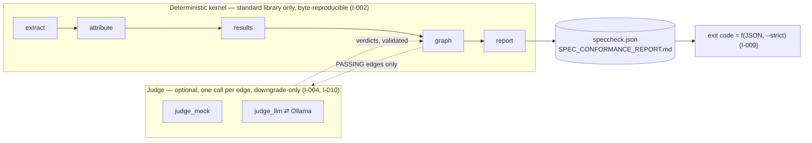

The kernel produces every status, count, and metric. The judge, when enabled, sees one
`(test case, ID)` edge at a time, and its only effect on the world is C-05 step 5:
`PASSING → WEAKLY_PASSING`. Disabling it changes nothing else (I-004; property-tested by T-28).

## 2. Package layout and dependency direction

```text
src/speccheck/
  __init__.py       __version__ = "1.2.0"          (K-10: pyproject reads it back)
  __main__.py       python -m speccheck
  cli.py            §5 surface; wiring; exit codes; logging; --self-check      436 lines
  extract.py        C-01 grammar, SPEC.md declarations, tree walk, citations   256
  attribute.py      C-03 test-case delimitation (ast) and attribution          107
  results.py        C-04 JUnit parsing and the classname/join_name join        120
  graph.py          C-05 status algorithm, edge selection, C-07 metrics        206
  judge.py          C-06 types, validation, concurrency/budget runner          152
  judge_mock.py     R-22 deterministic provider                                 32
  judge_llm.py      C-06/C-09 provider (OpenAI-compatible; Ollama)             149
  judge_prompt.md   C-10 instruction text (package data, hashed into reports)
  report.py         C-07 JSON, C-08 Markdown, §5.1 line, §5.4 rule, §3.1 writer 346
  _selfcheck/       byte-identical copy of fixtures/target/ (package data)
```

Imports flow strictly downward; no module imports `cli`, and nothing in the kernel imports a
judge provider or an HTTP client:

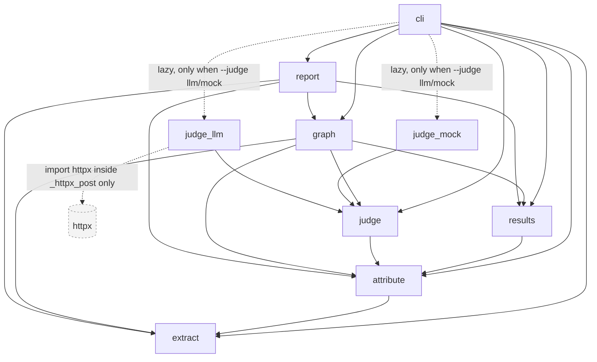

Two consequences of that graph are load-bearing:

- **I-006 (network boundary)** is a property of the import layout, not of a runtime check:
  `httpx` is imported inside `judge_llm._httpx_post`, which only runs when `--judge llm` sends a
  request. `--judge none|mock` never loads an HTTP client; `--self-check` additionally installs a
  guard that makes `socket.socket.__init__` raise, and T-43 asserts the guard never fires.
- **`graph → judge`** is an import of *types only* (`JudgedVerdict`). The kernel knows the shape
  of a verdict so it can apply step 5; it has no idea how one is produced.

## 3. The executable flow (spec §3.2)

The spec draws the system once, in §3.2, as inputs feeding actors that hand artifacts to one
another. This is that drawing, redrawn with the module that plays each actor:

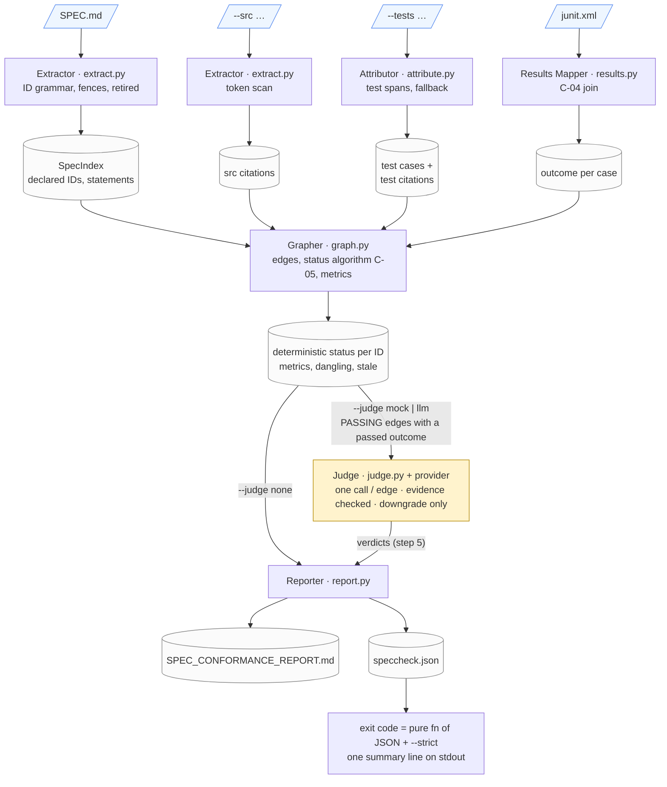

Reading it left to right:

1. **Four inputs, three of them optional.** Only `SPEC.md` is required. Without `--src`/`--tests`
   every ID is `UNCITED`; without `junit.xml` no ID can be better than `UNVERIFIED`. Each input
   is read once, by exactly one actor, and never written (I-001).
2. **Two extractions that never meet.** The spec is parsed for *declarations* (what IDs exist,
   with statement text and retired flag); the code trees are scanned for *citations* (where each
   ID token occurs). The same regex recognizes the token in both, but the spec is never scanned
   for citations and the code is never parsed for declarations — a `~~R-07~~` in a comment is a
   plain citation of `R-07` (E-20).
3. **Attribution gives test citations an owner.** A source citation is a `(file, line)`; a test
   citation additionally names the enclosing test case (or the file-level case). That owner is
   what the JUnit join and the judge both key on, which is why `TestCase` is a hashable value
   object (§4).
4. **The Grapher is where everything converges** — and the last point at which anything is
   *decided* without a model. It joins declarations to citations to outcomes, computes every
   status with C-05 steps 1–4, classifies undeclared and retired citations as dangling and
   stale, and computes the metrics. Everything on the `DET` artifact is reproducible from the
   report's own evidence table plus `grep` and the results file (R-24).
5. **The judge is a side branch, not a stage.** With `--judge none` the deterministic result
   goes straight to the Reporter. Otherwise the Grapher hands over only the `(test case, ID)`
   edges of `PASSING` IDs whose test passed; the judge answers one question per edge, the
   kernel validates every answer, and step 5 may turn `PASSING` into `WEAKLY_PASSING`. Nothing
   flows back into the earlier artifacts: citations, outcomes, and counts are already fixed.
6. **Two reports, one truth.** The Reporter renders the JSON and derives the Markdown from it;
   the exit code and the summary line are computed from the JSON alone (I-009), so an operator
   holding only `speccheck.json` and the `--strict` flag can recompute what the process exited
   with.

The next diagram is the same flow seen as an ordered sequence of stages, with the exit paths
the spec assigns to each.

## 3.1 The pipeline, stage by stage

`cli.execute()` runs the §3.1 stages in order. Each stage is a pure function of the previous
stage's output; there is no cache, no persistent state, and no partial output mode.

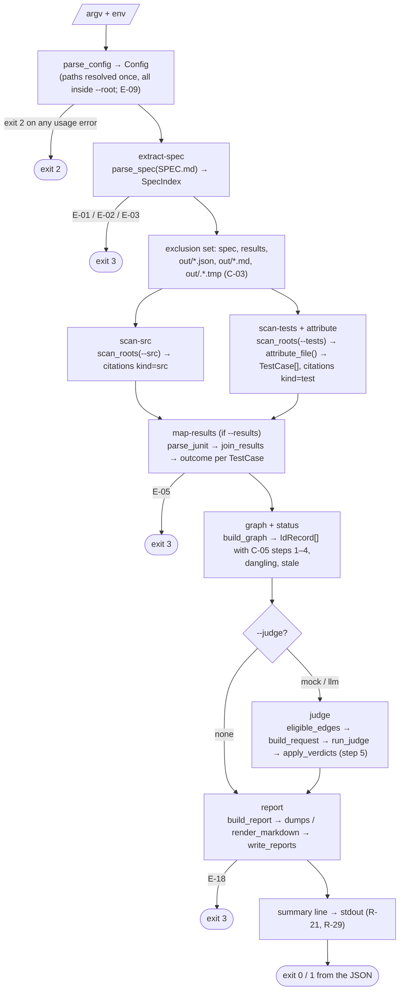

Stage timings and counts are logged at `INFO` (`stage=<name> … ms=<n>`), never file contents,
statements, or prompts (I-007). Exit codes are total: usage → `2`, input contract → `3`, any
uncaught exception → `3` with a one-line message (traceback only at `DEBUG`), and everything
else is the report's own `exit_code`.

## 4. Data model

The data model is the spec's §4 contracts, as frozen dataclasses. Nothing is mutable except the
`IdRecord`/`TestEdge` pair that the status algorithm and step 5 fill in.

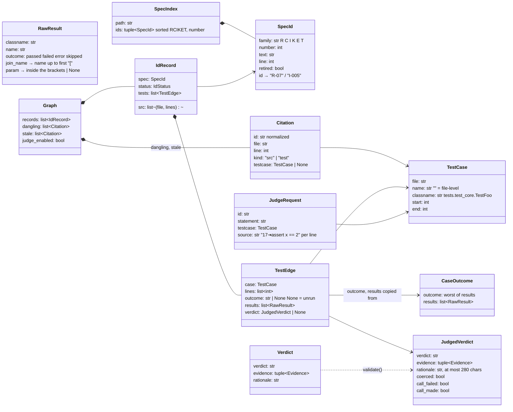

Three representational choices matter downstream:

- **IDs are normalized once, at the token boundary** (`extract.normalize_id`): `R-7`, `R-07`,
  `R-007` become `R-07`; `I-5` becomes `I-005`. Every later structure keys on the normalized
  string, so I-011 (injective within a family, never across families) holds by construction.
- **Test cases are hashable value objects.** `TestCase` is frozen, so it serves as the dictionary
  key that joins three independent producers — the attributor (which cases exist), the results
  mapper (which case a JUnit `<testcase>` landed on), and the judge runner (which edge a verdict
  belongs to) — without any ID-assignment step. The judge runner returns
  `dict[(TestCase, id) → JudgedVerdict]`, which is why output order never depends on completion
  order (K-06).
- **File-level cases are real cases with `name == ""`.** A citation outside any delimited span
  (module docstring, helper, fixture, an unparseable `.py`, any non-Python file) belongs to that
  case. They are excluded from the results join, so they can never carry an outcome and can
  only ever contribute `UNVERIFIED` (E-13) — the JSON writes `""`, the Markdown renders `(file)`.

## 5. Extraction: the spec side (`extract.py`)

`parse_spec` is a single pass over `SPEC.md` lines with a fence tracker (C-01, Q-008): a fence
opens on a line whose first non-space characters are ` ``` ` or `~~~` and closes only on a
line that is the *same* three-character marker followed by nothing but whitespace — so an info
string never closes, tildes never close backticks, and an unclosed fence runs to end of file
(E-04, T-05). Outside fences, two declaration forms are recognized:

| Form | Rule | Example |
| --- | --- | --- |
| table row | first non-space char `\|`; cells split on unescaped `\|` outside backtick spans; the **entire** trimmed first cell is `**ID**`, `~~**ID**~~`, or `**~~ID~~**`; statement = second cell | `\| **R-07** \| statement \|` |
| heading | `#`-run, then the ID token (optionally `~~`-wrapped) as the **first** token; statement = the rest | `### C-03 statement` |

A bold ID anywhere else is not a declaration (E-31); separator rows never are. A second
declaration of the same `(family, number)` raises `SpecError` — E-02 if both have the same
retired flag, E-03 otherwise — naming both lines; there is no "first wins" (Q-006). Zero
in-scope IDs is E-01. All three surface as exit `3` with no report written.

## 6. Extraction: the code side (`extract.scan_roots`)

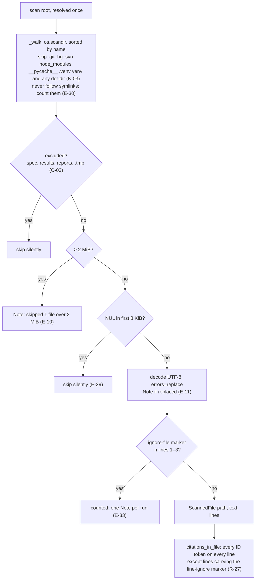

Citation is literal and total: comments, strings, and code count alike (D-03), and fences are
*not* excluded in source files. Exclusion by resolved path happens before size/binary filtering
and is silent, which is what lets `--src .` with `--out` inside the tree stay byte-deterministic
across runs (E-23, E-34, T-36). The walker sorts directory entries and the final file list, so
citation order — and therefore every downstream list — is independent of filesystem order.

## 7. Attribution (`attribute.py`)

For `.py` files under a `--tests` root, `ast.parse` yields the test cases of C-03:

- every module-level `def test_*` / `async def test_*`;
- every `test*` method (underscore optional, F-102) that is a *direct* member of a top-level
  class recognized by name (`Test*`) or by base (`*TestCase` as a `Name` or `Attribute`).

A span runs from the first decorator line to `end_lineno` (B-03 in the build report). Methods of
unrecognized or nested classes are not cases; their lines fall to the file-level case and the
file gets one `undelimited tests in …` Note (E-28). A `SyntaxError` (or the other exceptions
`ast.parse` can raise on hostile input) makes the whole file file-level with a
`parse fallback:` Note (E-12). Any other file type is one file-level case whose `classname` is
derived exactly as for Python — path with `/`→`.` and the final extension dropped (F-108) — so
that a JUnit result for a Go or TypeScript file can still join it by suffix.

The attributor never sees the spec: it does not know which IDs are declared. Dangling and stale
classification happens in the graph, from the `SpecIndex`.

## 8. Results mapping (`results.py`)

`parse_junit` accepts a `<testsuites>` or `<testsuite>` root (namespaces tolerated), treats every
`<testcase>` below it as one result, and derives the outcome from its children in the fixed
priority `failure > error > skipped > passed`. A missing `name` is E-05.

The join (C-04, F-006, F-101, F-105) is two-keyed:

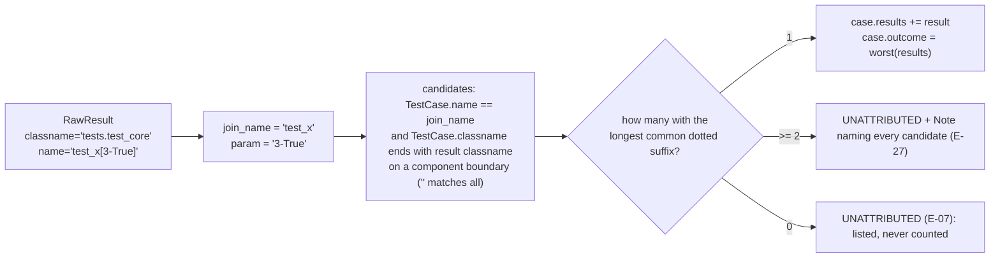

Everything from the first `[` is stripped for the join, so parametrized variants and duplicates
land on one case whose single `outcome` is the worst of them (E-06, E-24). Unattributed results
are reported, sorted, and change no status.

## 9. The status algorithm (`graph.py`)

`deterministic_status` is C-05 steps 1–4 verbatim; `apply_verdicts` is step 5 and is the only
function in the program that reads a verdict.

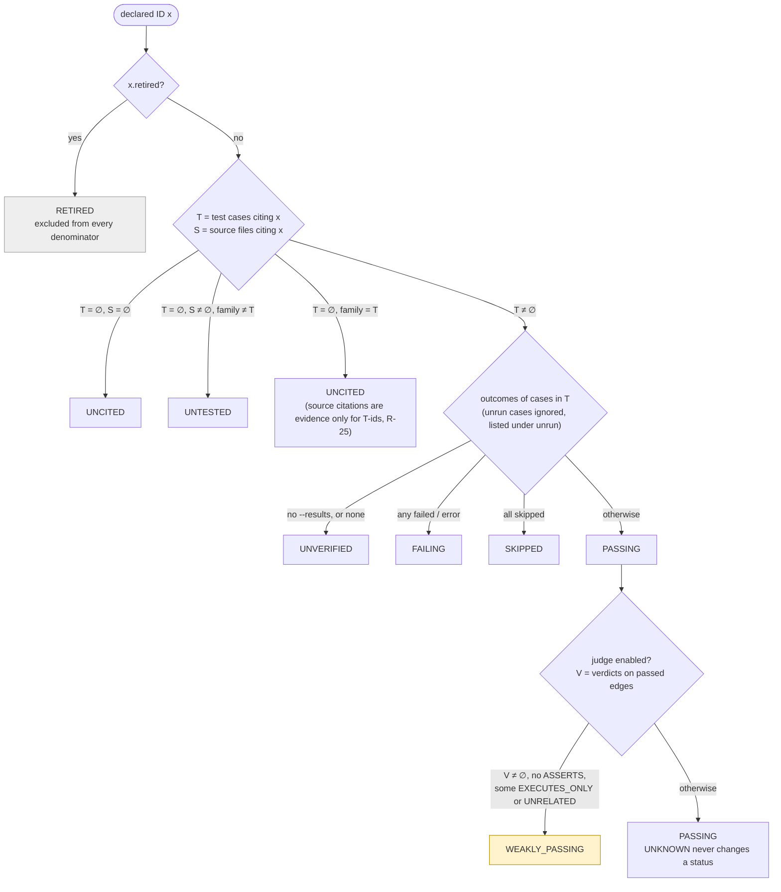

`eligible_edges` selects exactly the edges the judge may see: `PASSING` after step 4 **and** the
test outcome is `passed` (I-010; T-31 counts calls with a stub). The graph also classifies every
citation whose ID is undeclared as *dangling* and every citation of a retired ID as *stale*;
retired IDs keep empty `src`/`tests` so the same evidence is not listed twice (B-05).

Metrics (`compute_metrics`) use `decimal` throughout: each ratio is
`Decimal(n) / Decimal(d)` under a 28-digit context, quantized to four places with
`ROUND_HALF_EVEN`, or `None` when `d == 0` (I-008, Q-009). The seven in-scope statuses and the
six families are always present as keys, zero or not (F-016).

## 10. The judge (`judge.py`, `judge_mock.py`, `judge_llm.py`)

### 10.1 Contract and validation

A provider implements one method, `judge(JudgeRequest) → Verdict`, and may raise. The kernel
never trusts what comes back:

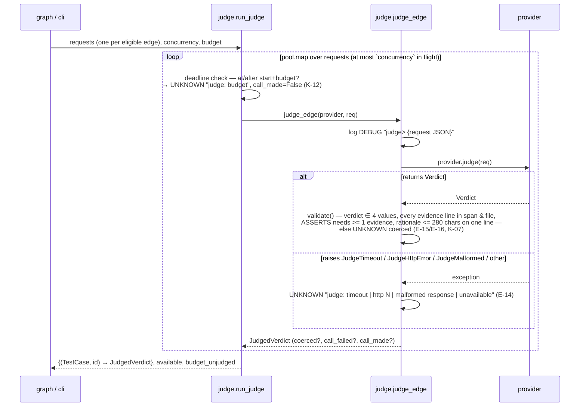

`available` (C-07 `judge_available`) is `true` unless every call that was actually made failed
at the transport level; a malformed 200 counts as a call that succeeded (B-07); zero calls is
vacuously available (E-36). The budget deadline is set by the first worker to issue a request
and checked by every worker *before* it issues, so in-flight requests always complete and their
verdicts count (Q-010; T-61).

### 10.2 The mock provider

`MockJudge` reads the line-numbered `source` in the request, flags every line matching
`^\s*assert\b`, containing `.assert`, or containing `pytest.raises(`, and returns `ASSERTS` with
those lines as evidence or `EXECUTES_ONLY` with none (R-22). It has no configuration and no I/O,
which is what makes `--judge mock` byte-deterministic and usable in `--self-check`.

### 10.3 The LLM provider and Ollama

`LlmJudge` implements C-06's wire format against any OpenAI-compatible `chat/completions`
endpoint. The reference deployment is a local **Ollama** server, which serves that shape at
`http://localhost:11434/v1/chat/completions`:

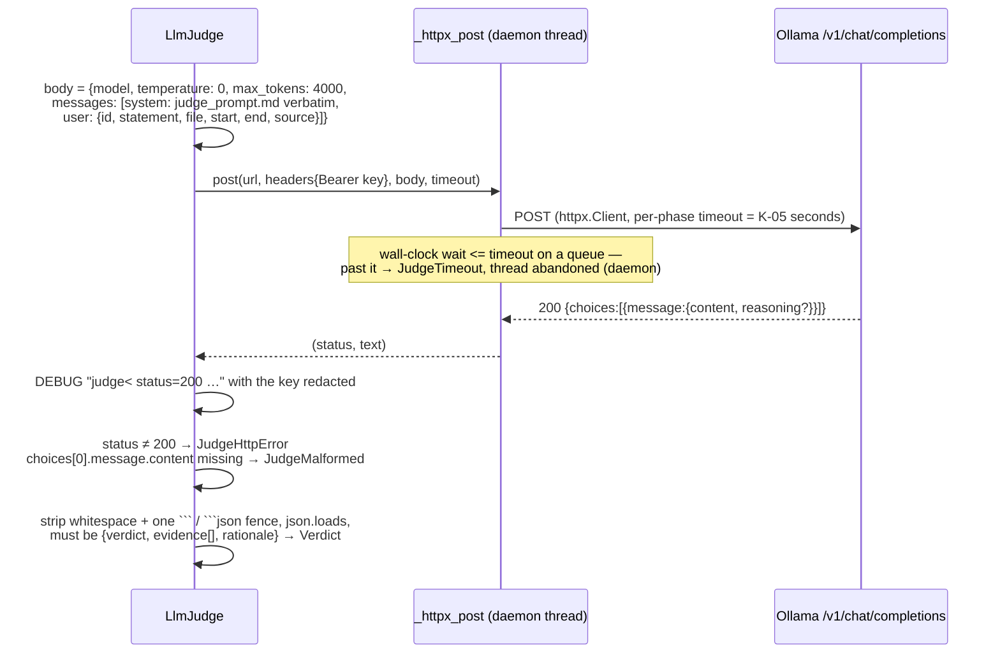

Design points:

- **Exactly one request per edge, no retries** (K-06). Concurrency comes from the runner's thread
  pool (`--judge-concurrency`), not from the provider.
- **K-05 is a single wall-clock deadline**, not httpx's per-phase timeouts alone: the request runs
  on a daemon thread and the caller waits at most `SPECCHECK_JUDGE_TIMEOUT` seconds for the full
  body. The per-phase timeouts are set as well so the abandoned thread also ends.
- **The transport is injectable** (`LlmJudge(config, post=…)`), which is how T-33 records the
  exact bytes and counts concurrency, and how the CLI-level tests (T-59, T-61) stub failures,
  UNKNOWN shares, and slow calls by monkeypatching `judge_llm._httpx_post`.
- **Configuration is environment-only** (C-09): URL, model, key, optional timeout. A missing
  variable is a usage error naming the variable; the key's text is replaced by `***` in the one
  place a raw response is logged (DEBUG), and never appears anywhere else (R-23, I-007).
- **The instruction text is data, not code.** `judge_prompt.md` is package data, read through
  `importlib.resources`, sent verbatim as the system message, and its SHA-256 lands in the report
  as `judge_prompt_sha256` (R-26). T-54 asserts the file equals the C-10 block in `SPEC.md`.
- **Thinking models** (Ollama returns their reasoning in `message.reasoning`) exhausted the
  v1.1 pin of `max_tokens: 400` before emitting the verdict; v1.2 pins 4000 (D-07, README
  *Thinking models and `max_tokens`*). The provider does not special-case this: an empty or
  truncated `content` is a malformed response, full stop.

## 11. Reporting and the write protocol (`report.py`)

`build_report` assembles the C-07 object in key order (Python dicts preserve insertion order;
`judge_prompt_sha256` is inserted only for `llm`), computes `strict_judge_failure` (R-28,
`unavailable` taking precedence over `unknown_rate`, Q-004) and then `exit_code` from the
document itself. The Markdown is rendered *from the JSON object*, so the two can never disagree,
and the §1 verdict line in the Markdown is the same `summary_line()` the CLI prints.

Ratios are Decimals but `json.dumps` cannot emit them with a fixed number of places, so a tiny
sentinel type (`_Num`) is serialized through `default=` as `"\x00NUM:0.9000\x00"` and rewritten
to the bare number after dumping. The result is a JSON text that is byte-determined without
reference to binary floating point (Q-009): `0.9000`, never `0.9`.

The writer is the only code in the program that creates or deletes files (I-001):

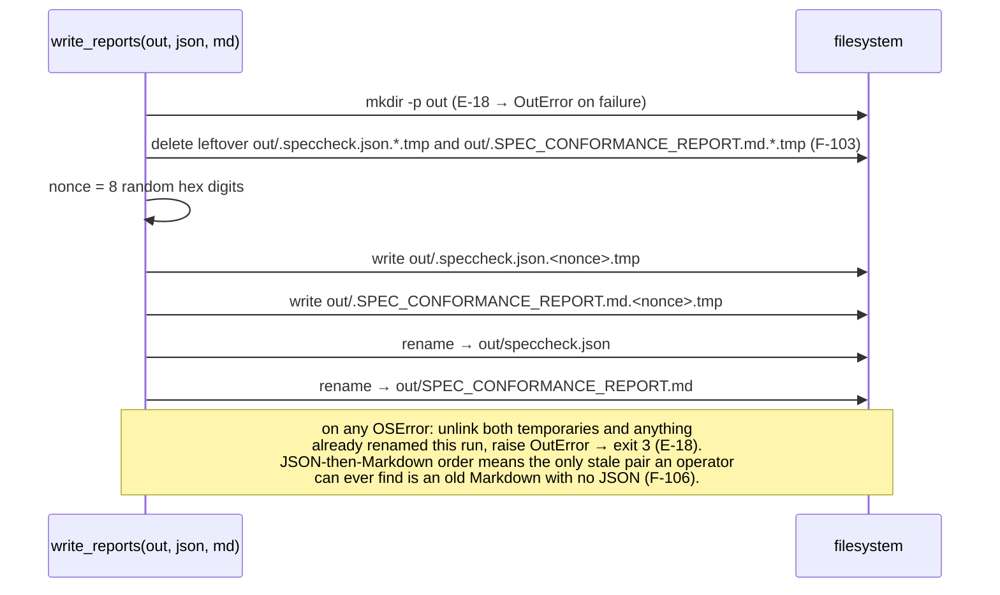

`_replace` and `_make_nonce` are module-level so T-45 can inject a failure between the two
renames and observe the nonce.

## 12. The CLI (`cli.py`)

`cli.py` owns everything the spec calls a *surface*:

- **Parsing** — an `argparse` parser whose `error()` raises `UsageError` instead of exiting, so
  every usage problem funnels through one `except` that logs at `ERROR` and returns `2`.
  Manual validation covers what argparse cannot express with the spec's exact messages:
  `--judge` values, `--verbose` levels, `--max-unknown` as a Decimal in `[0, 1]`, integer ranges,
  the `path outside --root:` rule (E-09) after a single `resolve()` per path.
- **`Config`** — a frozen record of resolved paths and validated options; `Action` says whether
  argv asked for a check or a self-check. T-43 records the `Config` the self-check builds.
- **Wiring** — `execute()` is the §3 pipeline above; providers are constructed by
  `_make_provider`, which is the seam T-31 uses to count judge calls.
- **Diagnostics** — one `logging.StreamHandler` on stderr, logger `speccheck`, format
  `%(levelname)s %(message)s`, level `ERROR` unless `--verbose`; handlers are reset on every
  `main()` call so the in-process test runner never accumulates them. Notes are logged at `INFO`;
  nothing is logged at `WARNING` (F-014).
- **The summary line** — written as UTF-8 bytes to `stdout.buffer` when one exists, so the
  ASCII line is identical under a C locale or a `cp1252` stdout (R-29; T-44 runs both).
- **`--self-check`** — copies `_selfcheck/` to a fresh temp dir, installs the socket guard,
  `chdir`s there, runs `run_check([...pinned argv...])` **in the same process** with stdout
  captured, compares the two outputs with the packaged goldens byte-for-byte, removes the
  directory, prints `self-check: ok` (or the first mismatch), and exits `0`/`1`. The inner run is
  expected to exit `1` — the fixture has planted defects — and that code is deliberately not the
  self-check's result (F-107, Q-003).

## 13. Determinism, checked three ways

I-002 says identical inputs give byte-identical reports on any OS. The design achieves it by
never letting anything volatile into the data:

| Source of variation | Where it is removed |
| --- | --- |
| filesystem order | `_walk` sorts entries; `scan_roots` sorts files; every list in the report is sorted by a stated key (C-07) |
| absolute paths | `to_posix_relative` against `--root`, `/` separators (R-20) |
| dictionary / set iteration | citations are grouped in dicts but emitted sorted; verdicts are keyed by `(TestCase, id)` |
| floating point | `decimal` with fixed quantization; JSON numbers via the `_Num` sentinel |
| judge completion order | `pool.map` preserves request order; results are keyed, not appended |
| the temp-file nonce | never written into either report |
| time, host, version | not emitted at all — only `schema_version` |

It is then verified three ways: T-36 (same fixture, different absolute paths, `--src .`, planted
temporaries → identical bytes), the checked-in goldens in `fixtures/target/golden/` (T-46), and
`--self-check` from the installed package.

## 14. The fixture and the self-check, as one artifact

`fixtures/target/` is a 16-ID calculator project engineered so that every status and every
defect class has exactly one live example — one `UNCITED` R, one `UNTESTED` C, one `UNVERIFIED`
E, one `FAILING` T, one `SKIPPED` K, one assertion-free test (→ `WEAKLY_PASSING` under the mock
judge), one dangling citation, one stale citation, one unattributed result, one file-level
citation, plus a parametrized test so `results[]`/`param` are exercised. Its goldens were
produced by the tool and hand-verified (T-24 recomputes the metrics; T-37 recomputes every
status from the evidence table and the JUnit file).

`src/speccheck/_selfcheck/` is a byte-identical copy, kept in sync by `tools/sync_selfcheck.py`
and guarded by T-60, and shipped in the wheel via hatch `artifacts` (so that root-level
`.gitignore` patterns for `junit.xml`/`speccheck.json` cannot silently exclude it — a defect the
installed-wheel check caught during the build). `golden/judge_labels.json` rides along as the
hand labels for the T-49 evaluation.

## 15. Test architecture

The suite (`tests/`, 70 tests) mirrors the spec's §9 groups one file per group. Each test
function's docstring starts with the `T-nn` it realizes and ends with the R/C/I/K/E ids it
proves — that is what makes self-application (T-48) report every one of the 161 IDs as
`PASSING`, and it is why the literal ignore-marker strings are confined to `tests/data/markers/`
(F-109: a marker in a test module would make the checker ignore the test's own citation, which
happened once during the build and was caught by self-application).

Two helpers in `conftest.py` carry most of the weight: `run_cli(argv, cwd, env)` runs
`cli.main` in-process with `stdout`/`stderr` replaced by byte buffers, so exit codes, the summary
line's bytes, and stderr silence are all observable without a subprocess; and `project({...})`
materializes a throwaway project from a file mapping in an isolated directory per call. The
judge tests use stub providers and a recording HTTP stub with a concurrency counter; nothing in
the gating suite touches the network.

### 15.1 Tools (`tools/`)

Three scripts sit beside the suite. None is collected by pytest; all three import `speccheck`
directly and drive it in-process through `cli.run_check(argv, env, stdout)` — the same entry the
self-check uses — so they exercise the real pipeline without a subprocess or a shell.

| Script | Serves | What it does |
| --- | --- | --- |
| `bench.py` | K-08 / T-51 (recorded, not CI-gated) | Copies the golden fixture to a temp dir and times `check --judge mock --strict` five times; then generates a 10,000-file tree (5,000 source modules in 50 packages, 5,000 test modules in 50 groups, 100 declared IDs across all six families, a matching `junit.xml`) and times it five times. Prints the medians, the machine description, and PASS/FAIL against the 2 s / 60 s bounds. The generator is deterministic, so the benchmark input is reproducible. |
| `eval_judge.py` | T-49 (opt-in, needs Ollama) | Runs `check --judge llm` three independent times on a fresh copy of the fixture, then scores every judged edge against `fixtures/target/golden/judge_labels.json`: accuracy over non-`UNKNOWN` verdicts and `unknown_rate` over all judged edges, per run, no pooling. Prints model, date, `judge_prompt_sha256`, and PASS only if *every* run reaches $\geq$ 0.90 / $\leq$ 0.10. Defaults target `http://localhost:11434/v1/chat/completions` with key `ollama`; `--verbose` prints each edge's verdict, label, and rationale, which is how the D-07 failure mode was diagnosed. |
| `sync_selfcheck.py` | F-107 / T-60 | Copies `fixtures/target/` into `src/speccheck/_selfcheck/` (ignoring caches and dot-files such as editor swap files); `--check` reports any drift and exits 1. Run it after editing the fixture or regenerating the goldens; T-60 fails the suite if the two trees differ. |

A fourth, deliberately absent, tool: nothing regenerates the goldens automatically. They are
produced by running the checker on the fixture and copying the two reports into `golden/` by
hand, so that a change to the goldens is always a deliberate, reviewable diff.

## 16. Things deliberately not built

Per the spec's non-goals and O-2/O-3: no semantic analysis of code, no test execution, no
spec-quality review, no remediation, no multi-spec runs, no daemon/watch/IDE/web surface, and no
language adapters beyond Python (other languages get file-level attribution, which the join
still supports by suffix). The decisions the spec's own §12 leaves open (D-01..D-14) are inherited
unchanged; the build's findings against them are in `SPEC_BUILD_REPORT.md`, and the one it
resolved — D-07's `max_tokens` — became SPEC v1.2.
