# ARCHITECTURE — `speccheck` 1.18.0

This document describes the system as built, module by module and data flow by data flow. It is a
companion to `README.md` (how to use it), `SPEC.md` (what it must do), and
`SPEC_BUILD_REPORT.md` (the evidence that it does). Spec IDs are cited inline so that every design
element can be traced back to the clause that demanded it.

It describes the build of `SPEC.md` **v1.18**, and the increments that got there:

| Version | What it added | Modules it touched |
| --- | --- | --- |
| v1.6 | the Swift adapter (R-31, D-17/D-18) | `swift.py` (new), `attribute.py`, `results.py`, `judge_mock.py` |
| v1.7/v1.8 | a heading-declared ID's statement is its title plus its section body (R-33) | `extract.py`, `report.py`, `judge_llm.py` |
| v1.9 | clause-grounded verdicts (R-34, K-15, E-48) | `judge.py`, `judge_llm.py`, `judge_prompt.md` |
| v1.10/v1.11 | recorded tests (R-35, E-50/E-51) and the fixture's long-body contract | `extract.py`, `graph.py`, `report.py` |
| v1.13 | spec-internal edges (C-12) and the `impact` subcommand (C-13, R-36/R-37) | `extract.py`, `impact.py` (new), `report.py`, `cli.py` |
| v1.14 | DECLARED vs INCIDENTAL citations (R-39, C-14–C-16) | `attribute.py`, `graph.py`, `report.py`, `judge.py` |
| v1.15 | the Jev pre-triage pass (K-16, C-17, I-015) | `jev.py` (new), `judge.py`, `cli.py` |
| v1.16 | the judge request's `related` neighbourhood (R-38, D-28/D-28b) | `judge_llm.py`, `judge.py`, `jev.py` |
| v1.17 | the `explain` subcommand and the C-18 trace (R-40, I-016) | `explain.py` (new), `cli.py` |
| v1.18 | the CLI documents its own parameters and environment (R-41, C-19, I-017) | `cli.py` |

## 1. The one idea

`speccheck` answers a single question: *for every ID a specification declares, what evidence exists
that the implementation realizes it?* Everything in the design follows from one boundary drawn in
§0 of the spec:

> **The model may only ever make the news worse.** Every status is computed deterministically from
> evidence the operator can `grep`; the judge may downgrade a status with cited evidence, never
> upgrade one.

That boundary splits the program into halves that never share state — and since v1.15 there is a
third, weaker model-backed part, on the same side of the line as the judge:

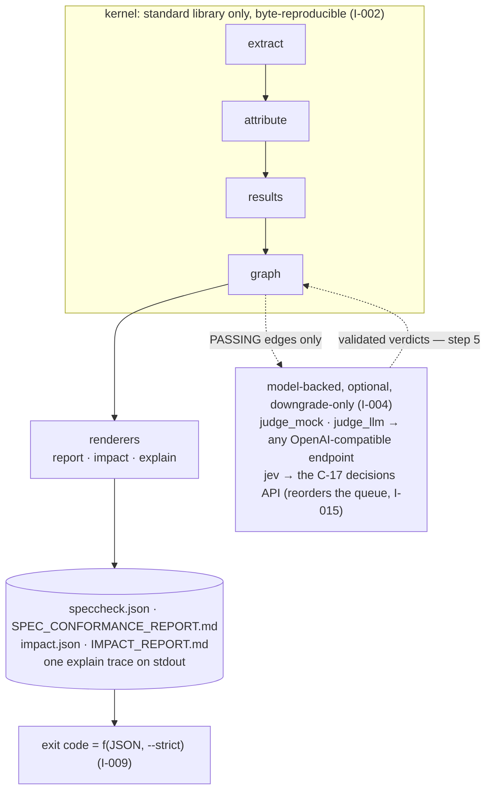

The kernel produces every status, count, and metric. The judge, when enabled, sees one
`(test case, ID)` edge at a time, and its only effect on the world is C-05 step 5:
`PASSING → WEAKLY_PASSING` (I-004; property-tested by T-28). The triage pass sees every eligible
edge *before* the judge does and its answers are used for exactly one thing — the order in which
the judge is asked (K-16) — and are then discarded (I-015). And since v1.17 the kernel's own facts
are rendered a third way: `explain` composes the `IdRecord`/edge/verdict facts and `impact`'s walk
into one id's trace, adding no fact of its own (R-40, I-016).

## 2. Package layout and dependency direction

```text
src/speccheck/
  __init__.py         __version__ = "1.18.0"      (K-10: pyproject reads it back)          3 lines
  __main__.py         python -m speccheck                                                    7
  cli.py              §5 surface: parsing, help (C-19), wiring, exit codes, logging,
                      --progress, E-41, --self-check, the three subcommands                1229
  extract.py          C-01 grammar, declarations, retirement, the recorded marker,
                      K-14 cap, C-01 (c) decisions, C-12 edges, the tree walk, citations    672
  attribute.py        C-03 test-case delimitation (ast) and attribution, C-14 declared      212
  swift.py            R-31 the Swift adapter: @Test / XCTest spans, brace fallback, MODULE  230
  results.py          C-04 JUnit parsing and the classname/join_name join                    157
  graph.py            C-05 status algorithm, edge selection, C-07 metrics                    272
  judge.py            C-06 types, validation (K-15 clause grounding), the run runner,
                      C-11 ProgressLine, K-12 budget                                           445
  judge_mock.py       R-22 deterministic provider                                             59
  judge_llm.py        C-06/C-09 provider and the R-38 `related` neighbourhood builder        270
  jev.py              C-17 triage provider and the K-16 ordering pass                        290
  impact.py           C-13 changed set, walk, reverify                                       239
  explain.py          C-18 the one-id trace renderer, pure                                   118
  report.py           C-07 JSON, C-08 Markdown, C-13 impact reports, §5.1 line, §5.4 rule,
                      §3.1 writer                                                            639
  judge_prompt.md     C-10 instruction text (package data, hashed into reports)
  _selfcheck/         byte-identical copy of fixtures/target/ (package data)
```

Imports flow strictly downward; no module imports `cli`, and nothing in the kernel imports a
provider or an HTTP client:

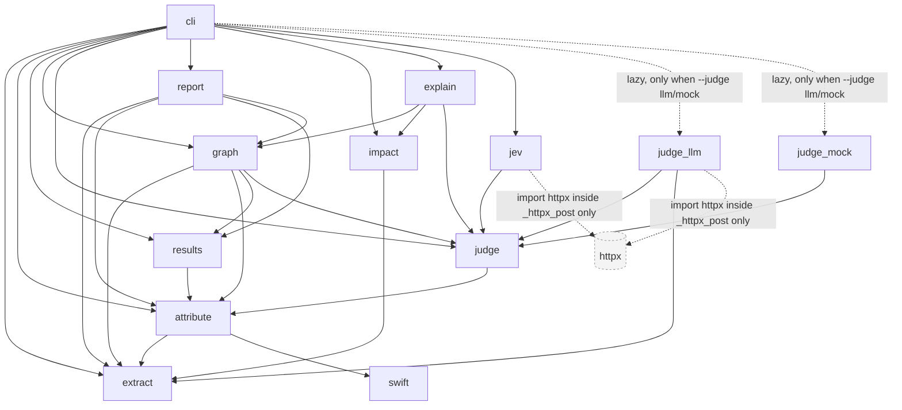

Three consequences of that graph are load-bearing:

- **I-006 (network boundary)** is a property of the import layout, not of a runtime check: `httpx`
  is imported inside `judge_llm._httpx_post` and `jev._httpx_post`, which only run when `--judge llm`
  issues a request. `--judge none|mock` never loads an HTTP client; `--self-check` additionally
  installs a guard that makes `socket.socket.__init__` raise, and T-43 asserts the guard never
  fires.
- **`graph → judge`** is an import of *types only* (`JudgedVerdict`). The kernel knows the shape of
  a verdict so it can apply step 5; it has no idea how one is produced. `explain → judge` is the
  same kind of import, for rendering a verdict (C-18).
- **`explain` and `impact` are consumers, not stages.** Neither writes a report the other can read
  (`explain` writes nothing at all, D-33), and neither can change a status: they are pure functions
  of what the kernel already computed (I-016, I-013).

## 3. The executable flow (spec §3.2)

The spec draws the system once, in §3.2, as inputs feeding actors that hand artifacts to one
another. This is that drawing, redrawn with the module that plays each actor, and with the triage
pass (v1.15) and the two composition surfaces (v1.13, v1.17) in place:

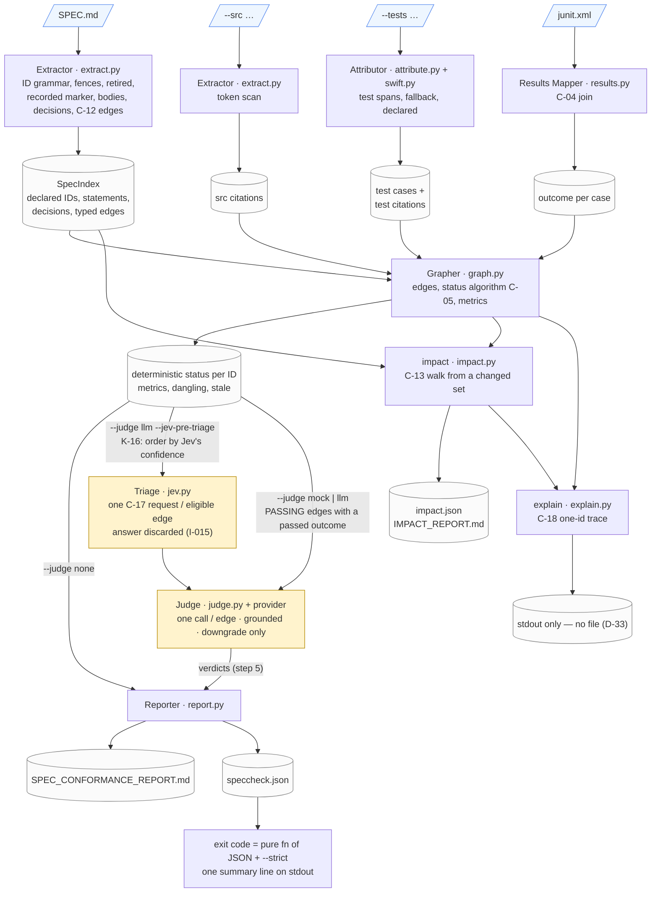

Reading it left to right:

1. **Four inputs, three of them optional.** Only `SPEC.md` is required. Without `--src`/`--tests`
   every ID is `UNCITED`; without `junit.xml` no ID can be better than `UNVERIFIED`. Each input is
   read once, by exactly one actor, and never written (I-001).
2. **Two extractions that never meet.** The spec is parsed for *declarations* (what IDs exist, with
   statement text, retired and recorded flags) and for the *edges* its own statements name (C-12);
   the code trees are scanned for *citations* (where each ID token occurs). The same regex
   recognizes the token in both, but the spec is never scanned for citations and the code is never
   parsed for declarations — a `~~R-07~~` in a comment is a plain citation of `R-07` (E-20).
3. **Attribution gives test citations an owner and a classification.** A source citation is a
   `(file, line)`; a test citation additionally names the enclosing test case (or the file-level
   case) and carries `declared` — whether its line is inside the case's own docstring or is a
   whole-line comment (C-14, E-56). That owner is what the JUnit join and the judge both key on,
   which is why `TestCase` is a hashable value object (§4).
4. **The Grapher is where everything converges** — and the last point at which anything is
   *decided* without a model. It joins declarations to citations to outcomes, computes every status
   with C-05 steps 1–4, classifies undeclared and retired citations as dangling and stale, and
   computes the metrics. Everything on the `DET` artifact is reproducible from the report's own
   evidence table plus `grep` and the results file (R-24).
5. **The triage pass is a rehearsal, not a verdict.** With `--jev-pre-triage` under `--judge llm`,
   every judge-eligible edge is first sent to the C-17 endpoint, whose per-edge top-choice
   probability orders the judge's queue (ascending; a failed edge first, E-59). Its answer is read
   for that order and nothing else: it is never validated as a verdict, never recorded, never a
   metric (I-015). Under `--judge none`/`mock` the flag is inert and no C-17 variable is read
   (K-16).
6. **The judge is a side branch, not a stage.** With `--judge none` the deterministic result goes
   straight to the Reporter. Otherwise the Grapher hands over only the `(test case, ID)` edges of
   `PASSING`, non-recorded IDs whose test passed; the judge answers one question per edge, the
   kernel validates every answer (including the clause grounding of K-15), and step 5 may turn
   `PASSING` into `WEAKLY_PASSING`. Nothing flows back into the earlier artifacts: citations,
   outcomes, and counts are already fixed.
7. **Three renderers, one truth.** `check` renders the JSON and derives the Markdown from it;
   `impact` renders its own pair from the walk; `explain` renders one id's trace to stdout and
   writes nothing. The `check` exit code and summary line are computed from the JSON alone (I-009),
   so an operator holding only `speccheck.json` and the `--strict` flag can recompute what the
   process exited with.

The next diagram is the same flow seen as an ordered sequence of stages, with the exit paths the
spec assigns to each.

## 3.1 The pipeline, stage by stage

`cli._run_stages()` runs the §3.1 stages in order; `check` and `explain` share it (v1.17: the trace
cannot disagree with the report about a status, I-016), and `impact` runs its own shorter path over
the same `SpecIndex`. Each stage is a pure function of the previous stage's output; there is no
cache, no persistent state, and no partial output mode.

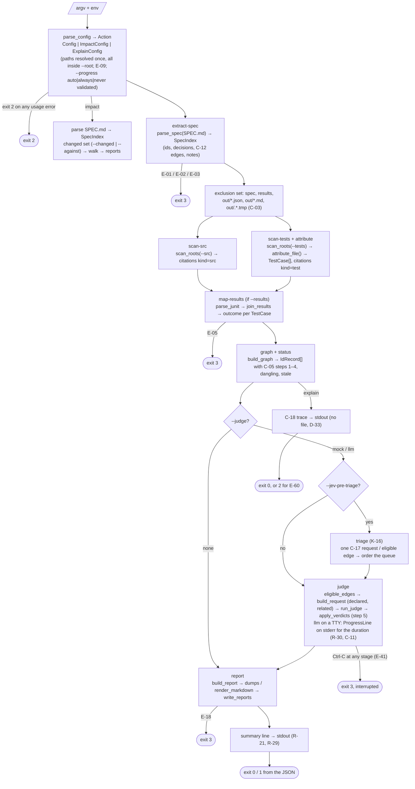

Stage timings and counts are logged at `INFO` (`stage=<name> … ms=<n>`), never file contents,
statements, or prompts (I-007). Exit codes are total: usage → `2`, input contract → `3`, any
uncaught exception → `3` with a one-line message (traceback only at `DEBUG`), a `KeyboardInterrupt`
→ `3` with the message `interrupted` after the same cleanup (E-41), and everything else is the
report's own `exit_code` — except `impact` and `explain`, which never exit `1`: nothing they render
is pass/fail (§5.4).

## 4. Data model

The data model is the spec's §4 contracts, as frozen dataclasses. Nothing is mutable except the
`IdRecord`/`TestEdge` pair that the status algorithm and step 5 fill in.

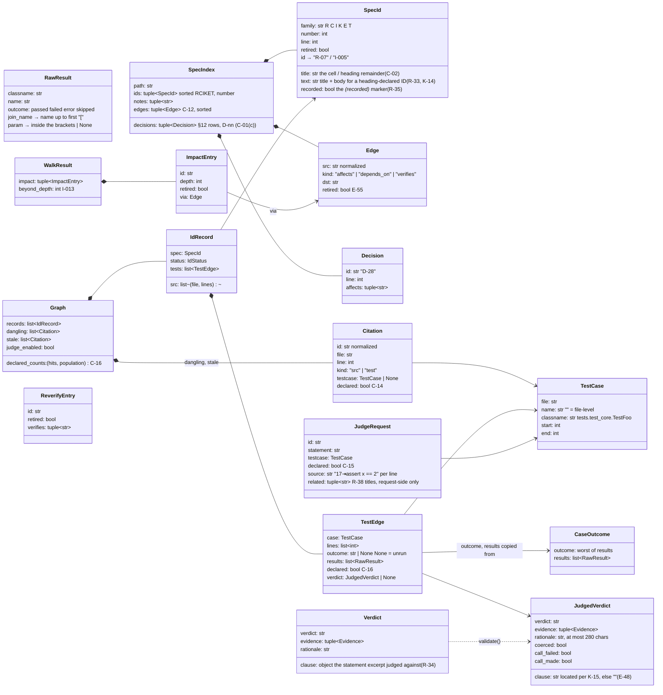

Five representational choices matter downstream:

- **IDs are normalized once, at the token boundary** (`extract.normalize_id`): `R-7`, `R-07`,
  `R-007` become `R-07`; `I-5` becomes `I-005`. Every later structure keys on the normalized string,
  so I-011 (injective within a family, never across families) holds by construction.
- **Test cases are hashable value objects.** `TestCase` is frozen, so it serves as the dictionary
  key that joins three independent producers — the attributor (which cases exist), the results
  mapper (which case a JUnit `<testcase>` landed on), and the judge runner (which edge a verdict
  belongs to) — without any ID-assignment step. The judge runner returns
  `dict[(TestCase, id) → JudgedVerdict]`, which is why output order never depends on completion
  order (K-06).
- **File-level cases are real cases with `name == ""`.** A citation outside any delimited span
  (module docstring, helper, fixture, an unparseable `.py`, any non-Python file) belongs to that
  case. They are excluded from the results join, so they can never carry an outcome and can only
  ever contribute `UNVERIFIED` (E-13) — the JSON writes `""`, the Markdown renders `(file)`, and a
  file-level citation is always `declared: false` (E-56).
- **Edges are declaration facts, not citations.** An `Edge` records only that one statement names
  another id (C-12). It is never a status input, never a citation, never a metric — it feeds
  `impact`'s walk (C-13) and the judge's `related` neighbourhood (R-38) and nothing else. D ids are
  never citation targets and never appear in `ids` (D-25).
- **`related` is built once and carried on the request.** `judge_llm.related_titles` computes the
  C-12 `depends_on` neighbourhood of the judged edge — both directions, in-scope R/C/I/K/E ids
  only, the statement's own references first, capped at eight 160-character titles, a retired
  neighbour tagged `(retired)` (E-57) — and `JudgeRequest.related` carries it to both consumers
  (the LLM user message and the C-17 triage `state`, D-28b). It is request-side only: it appears in
  no report, no metric and no `schema_version` (T-83).

## 5. Extraction: the spec side (`extract.py`)

`parse_spec` is a single pass over `SPEC.md` lines with a fence tracker (C-01, Q-008): a fence opens
on a line whose first non-space characters are ` ``` ` or `~~~` and closes only on a line that is
the *same* three-character marker followed by nothing but whitespace — so an info string never
closes, tildes never close backticks, and an unclosed fence runs to end of file (E-04, T-05).
Outside fences, two declaration forms are recognized:

| Form | Rule | Example |
| --- | --- | --- |
| table row | first non-space char `\|`; cells split on unescaped `\|` outside backtick spans; the **entire** trimmed first cell is `**ID**`, `~~**ID**~~`, or `**~~ID~~**`, optionally followed by whitespace-separated decoration (R-32, E-44); statement = second cell | `\| **R-07** \| statement \|` |
| heading | `#`-run, then the ID token (optionally `~~`-wrapped) as the **first** token; statement = the title plus the whole section body to the next heading of the same or a higher level (R-33), fenced blocks included, capped per K-14 | `### C-03 statement` |

A bold ID anywhere else is not a declaration (E-31); separator rows never are. A second declaration
of the same `(family, number)` raises `SpecError` — E-02 if both have the same retired flag, E-03
otherwise — naming both lines; there is no "first wins" (Q-006). Zero in-scope IDs is E-01. All
three surface as exit `3` with no report written.

Three further things are read from the same pass:

- **The `*(recorded)*` marker** (R-35, C-01): a T id whose row carries the literal marker is
  RECORDED — it still needs a citing test with a passed outcome, but none of its edges is ever sent
  to the judge, so C-05 step 5 never applies to it. On a non-T id the marker is ignored with a Note
  (E-50).
- **The decision table** (C-01 (c), v1.13): the §12 table's rows are `D-nn` declarations, with the
  *Affects* column found by header name, not by position; each id token in that cell becomes an
  `affects` edge (C-12). A decision row outside the table, or a bold `**D-nn**` row inside it,
  declares nothing (T-79).
- **The typed edges** (C-12, R-36): every id token in every declared statement becomes an edge —
  `depends_on` between two R/C/I/K/E ids, `verifies` between a T id and an R/C/I/K/E id (recorded in
  the direction of the T id), `depends_on` between two T ids. An edge to an undeclared id is a Note,
  not an error; an edge to a retired id is recorded with `retired: true` (E-55). The whole array is
  sorted in C-12 order, which is what makes `impact` deterministic (I-002) and `related` stable.

`SPEC.md` itself is decoded with `errors="replace"` and a Note when any byte was replaced (E-11), and
its K-14 truncation marker rides into the statement text as ordinary content (E-46).

## 6. Extraction: the code side (`extract.scan_roots`)

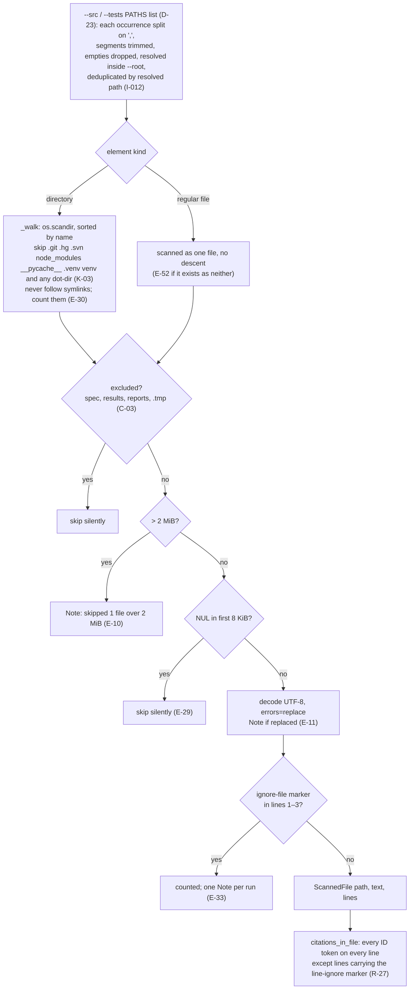

Citation is literal and total: comments, strings, and code count alike (D-03), and fences are *not*
excluded in source files. Exclusion by resolved path happens before size/binary filtering and is
silent, which is what lets `--src .` with `--out` inside the tree stay byte-deterministic across runs
(E-23, E-34, T-36). The walker sorts directory entries and the final file list, and the PATHS list is
deduplicated by resolved path, so citation order — and therefore every downstream list — is
independent of filesystem order and of how the paths were named (I-002, I-012, T-78).

## 7. Attribution (`attribute.py`, `swift.py`)

For `.py` files under a `--tests` root, `ast.parse` yields the test cases of C-03:

- every module-level `def test_*` / `async def test_*`;
- every `test*` method (underscore optional, F-102) that is a *direct* member of a top-level class
  recognized by name (`Test*`) or by base (`*TestCase` as a `Name` or `Attribute`).

A span runs from the first decorator line to `end_lineno` (B-03 in the build report). Methods of
unrecognized or nested classes are not cases; their lines fall to the file-level case and the file
gets one `undelimited tests in …` Note (E-28). A `SyntaxError` (or the other exceptions `ast.parse`
can raise on hostile input) makes the whole file file-level with a `parse fallback:` Note (E-12).

**Swift files** (R-31, v1.6) are delimited by `swift.py` without a toolchain (D-17): a Swift Testing
`@Test` function or an XCTest `test*` method opens a span at its attribute/doc-comment block and
closes by counting braces, with comments and string literals excluded from the count, and a brace
fallback when the shape is unusual (E-42, E-43). The classname's `MODULE` component is the first
path component of the file under its `--tests` root — or, for a file named directly as a PATHS
element, its parent directory's last component (D-18, D-23). A `///` or `/** … */` doc-comment line
is DECLARED exactly as a Python docstring is.

**Every citation gets a `declared` flag** (C-14, v1.14): true when the citation's own line lies
inside the citing case's docstring or is a whole-line comment (`#` in Python; the Swift adapter's
existing doc-comment recognition), false otherwise — including a trailing comment on a code line, a
string literal, every `"src"`-kind citation and every file-level one (E-56). The fact is computed
under every judge mode, needs no results file and no network (I-014), and has three consumers:
`tests[].declared` and `declared_ratio` in the JSON (C-16), the judge's request (C-15), and the
`explain` trace.

Any other file type is one file-level case whose `classname` is derived exactly as for Python — path
with `/`→`.` and the final extension dropped (F-108) — so that a JUnit result for a Go or TypeScript
file can still join it by suffix.

The attributor never sees the spec: it does not know which IDs are declared. Dangling and stale
classification happens in the graph, from the `SpecIndex`.

## 8. Results mapping (`results.py`)

`parse_junit` accepts a `<testsuites>` or `<testsuite>` root (namespaces tolerated), treats every
`<testcase>` below it as one result, and derives the outcome from its children in the fixed priority
`failure > error > skipped > passed`. A missing `name` is E-05.

The join (C-04, F-006, F-101, F-105) is two-keyed:

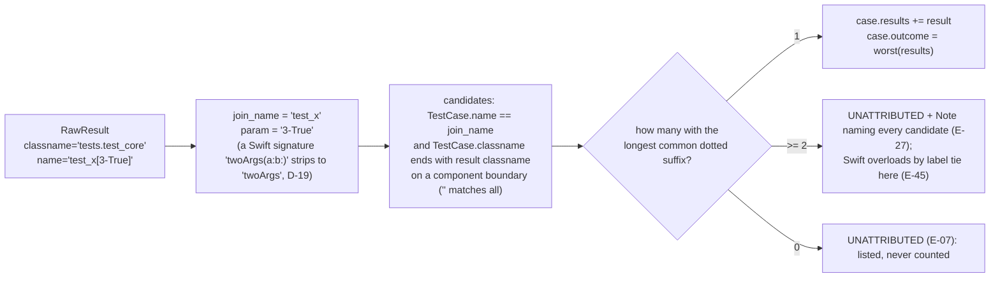

Everything from the first `[` is stripped for the join, so parametrized variants and duplicates land
on one case whose single `outcome` is the worst of them (E-06, E-24). Unattributed results are
reported, sorted, and change no status.

## 9. The status algorithm (`graph.py`)

`deterministic_status` is C-05 steps 1–4 verbatim; `apply_verdicts` is step 5 and is the only
function in the program that reads a verdict.

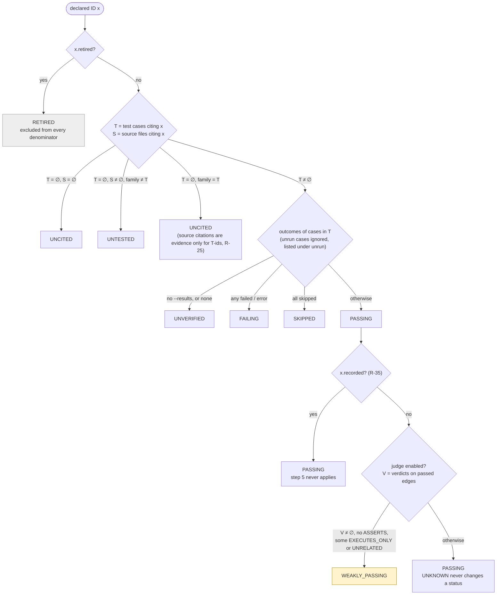

`eligible_edges` selects exactly the edges the judge may see: `PASSING` after step 4, **not** a
recorded id, and the test outcome is `passed` (I-010, R-35; T-31 counts calls with a stub). The graph
also classifies every citation whose ID is undeclared as *dangling* and every citation of a retired
ID as *stale*; retired IDs keep empty `src`/`tests` so the same evidence is not listed twice (B-05).

Metrics (`compute_metrics`) use `decimal` throughout: each ratio is `Decimal(n) / Decimal(d)` under
a 28-digit context, quantized to four places with `ROUND_HALF_EVEN`, or `None` when `d == 0` (I-008,
Q-009). The seven in-scope statuses and the six families are always present as keys, zero or not
(F-016). `conformance` is `passing / in_scope`; `judge_strength` is the share of judged edges the
judge did not downgrade; `unknown_rate` is the share of judged edges that came back `UNKNOWN`;
`declared_ratio` is the share of in-scope R/C/I/K/E citations inside attributed non-file-level cases
that are DECLARED (C-16) — each recomputable from the report's own evidence (T-37).

## 10. The judge (`judge.py`, `judge_mock.py`, `judge_llm.py`) and the triage pass (`jev.py`)

### 10.1 Contract and validation

A provider implements one method, `judge(JudgeRequest) → Verdict`, and may raise. The kernel never
trusts what comes back:

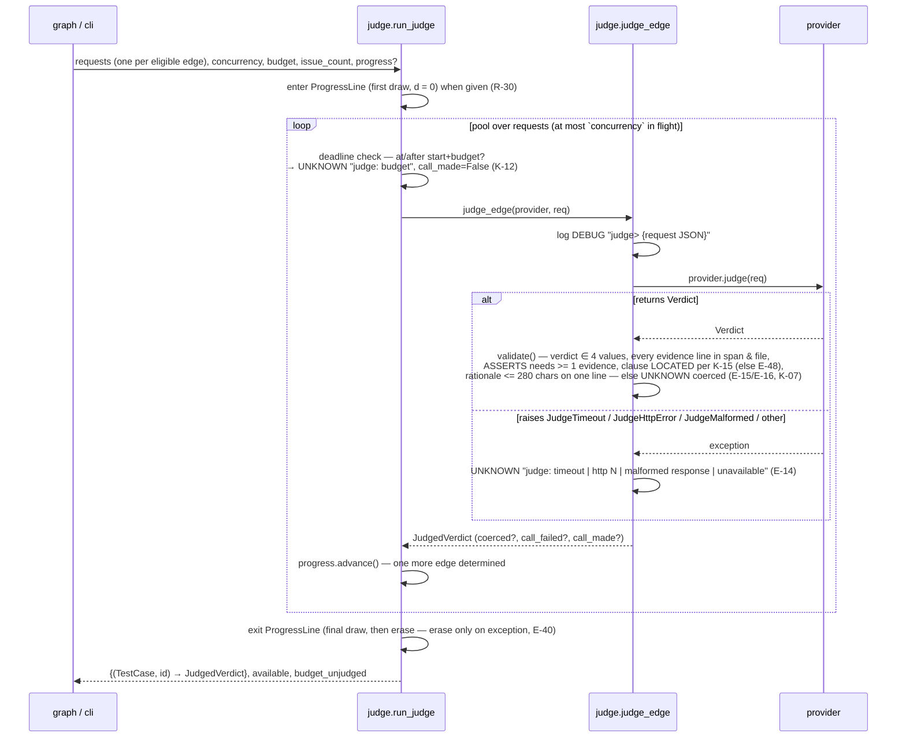

`available` (C-07 `judge_available`) is `true` unless every call that was actually made failed at the
transport level; a malformed 200 counts as a call that succeeded (B-07); zero calls is vacuously
available (E-36). The budget deadline is set by the first worker to issue a request and checked by
every worker *before* it issues, so in-flight requests always complete and their verdicts count
(Q-010; T-61). K-12's `N%` form is the same bookkeeping with a count instead of a clock: exactly
$\lceil N/100 \times E \rceil$ of the $E$ eligible edges are issued, in K-16's order, and the rest
take the same disposition as a deadline miss (`UNKNOWN`, `judge: budget`, `coerced`).

The request object carries everything the judge may consider: `id`, `statement` (C-10: the full text,
body included, R-33), `declared` (C-15), `related` (R-38), and the line-numbered `source`. The reply
object is unchanged since v1.9: `{verdict, clause, evidence[], rationale}`.

### 10.1a The progress indicator (R-30, C-11, K-13)

With `--judge llm` the judge stage is the only slow part of a run, so `run_judge` accepts a
`ProgressLine` (created in `cli.py` when `--progress` resolves to on: `auto` means stderr is a TTY
and verbosity is not `DEBUG`). It is a context manager around the whole stage: the first draw
(`0/n`, `0:00 elapsed`, `?:??`) happens on entry, before the first request; every worker calls
`advance()` once its verdict is determined; a daemon thread coalesces those into at most one draw
per 100 ms and adds a 1 s tick so `elapsed` and the ETA keep moving; `__exit__` draws the final state
(unless an exception is propagating) and then erases. Each draw is one write of `\r` + line +
padding to the widest line so far — no terminal escapes, so a shrinking ETA leaves no residue on any
console that honours a carriage return — and the erase is `\r` + spaces + `\r`. The line is written
to the raw stderr stream, never through the logger, and `cli.py` defers the judge stage's INFO lines
(mode, URL, model, stage summary) until after `run_judge` returns, so the logger is silent while the
line is displayed. Under K-12's `N%` form the unissued edges are advanced before the stage starts, so
the bar's total is the eligible set (K-13).

### 10.2 The mock provider

`MockJudge` reads the line-numbered `source` in the request, flags every line matching
`^\s*assert\b`, containing `.assert`, or containing `pytest.raises(` — plus, since v1.6, Swift's
`#expect(`, `#require(`, `XCTAssert`, `XCTFail(` and `Issue.record(` (R-31) — and returns `ASSERTS`
with those lines as evidence or `EXECUTES_ONLY` with none (R-22). It has no configuration and no
I/O, which is what makes `--judge mock` byte-deterministic and usable in `--self-check`. It reads no
statement semantics, so it ignores `declared` and `related` entirely.

### 10.3 The LLM provider: Ollama, OpenRouter, or any OpenAI-compatible endpoint

`LlmJudge` implements C-06's wire format against any OpenAI-compatible `chat/completions` endpoint.
The reference deployment is a local **Ollama** server, which serves that shape at
`http://localhost:11434/v1/chat/completions`:

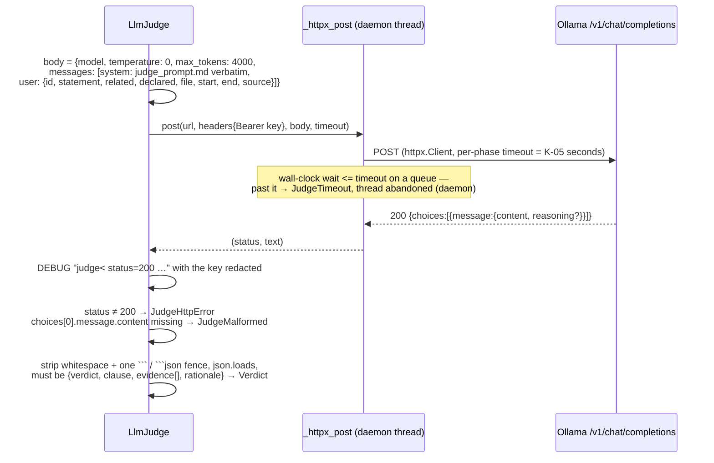

Design points:

- **Exactly one request per edge, no retries** (K-06). Concurrency comes from the runner's thread
  pool (`--judge-concurrency`), not from the provider.
- **K-05 is a single wall-clock deadline**, not httpx's per-phase timeouts alone: the request runs on
  a daemon thread and the caller waits at most `SPECCHECK_JUDGE_TIMEOUT` seconds for the full body.
  The per-phase timeouts are set as well so the abandoned thread also ends.
- **The transport is injectable** (`LlmJudge(config, post=…)`), which is how T-33 records the exact
  bytes and counts concurrency, and how the CLI-level tests (T-59, T-61) stub failures, UNKNOWN
  shares, and slow calls by monkeypatching `judge_llm._httpx_post`.
- **Configuration is environment-only** (C-09): URL, model, key, optional timeout — all three of the
  first required, with no default endpoint. A missing variable is a usage error naming the variable;
  the key's text is replaced by `***` in the one place a raw response is logged (DEBUG), and never
  appears anywhere else (R-23, I-007). The `--help` epilog states all of this (R-41, C-19).
- **The instruction text is data, not code.** `judge_prompt.md` is package data, read through
  `importlib.resources`, sent verbatim as the system message, and its SHA-256 lands in the report as
  `judge_prompt_sha256` (R-26). T-54 asserts the file equals the C-10 block in `SPEC.md`; the current
  text (v1.18) carries the any-clause rule (v1.7), the clause-first question (v1.9), the `declared`
  skepticism rule (v1.14) and the `related` rule (v1.16).
- **The endpoint is a URL, nothing more.** The provider has no vendor branches: the same code talked
  to local Ollama for the recorded T-49 runs, to OpenRouter for every Phase B gate in this
  repository's history (`openai/gpt-4o-mini` through v1.15, `google/gemini-3.8-flash` from v1.16),
  and would talk to Anthropic's OpenAI-compatible endpoint the same way. Only the three
  `SPECCHECK_JUDGE_*` variables change.
- **Thinking models** (Ollama returns their reasoning in `message.reasoning`) exhausted the v1.1 pin
  of `max_tokens: 400` before emitting the verdict; v1.2 pins 4000 (D-07). The provider does not
  special-case this: an empty or truncated `content` is a malformed response, full stop.
- **The `related` neighbourhood is built here, not in the judge** (R-38, D-28): `related_titles`
  walks the `SpecIndex`'s edges, so the same list feeds the LLM user message and the C-17 triage
  `state` and the two cannot drift (T-83).

### 10.4 The triage pass (`jev.py`, v1.15)

`--jev-pre-triage` (K-16) spends a much cheaper model on the question *which edges need the real
judge?* before any real-judge request is issued:

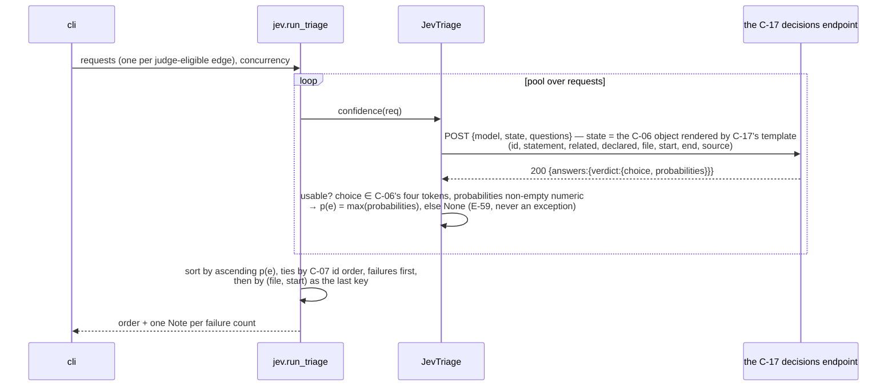

Its four variables are read only when the pass runs (`--jev-pre-triage` under `--judge llm`), so the
flag needs no credential under `--judge none`/`mock` (K-16, I-006). The answer is discarded once the
order exists: it never becomes a `Verdict`, never reaches `speccheck.json` or the Markdown report,
never touches `judge_available` or `unknown_rate` (I-015, E-59). With `--judge-budget N%` the same
order decides which edges are issued at all, which is the whole point of the pass: a truncated run
spends itself on the edges the triage is least sure about rather than on declaration order. When the
budget is unlimited and the pass therefore buys nothing, one Note says so (D-30).

## 11. Reporting and the write protocol (`report.py`, `impact.py`, `explain.py`)

`build_report` assembles the C-07 object in key order (`schema_version` `"1.5"` since v1.14;
`judge_prompt_sha256` is inserted only for `llm`), computes `strict_judge_failure` (R-28,
`unavailable` taking precedence over `unknown_rate`, Q-004) and then `exit_code` from the document
itself. The Markdown is rendered *from the JSON object*, so the two can never disagree, and the §1
verdict line in the Markdown is the same `summary_line()` the CLI prints. The JSON carries
`ids` (with `title`, `recorded`, `statement`, `status`, `src`, `tests`, `unrun`), `decisions` and
`edges` (v1.13, C-12), `dangling`, `stale`, `unattributed_results`, `notes`, `metrics` and
`exit_code`. The per-edge `declared` flag and the `declared_ratio` metric arrived in v1.14 (C-16);
`title` in v1.7, `clause` in v1.9 and `recorded` in v1.10. `schema_version` is `"1.5"` and has not
moved since v1.14 — v1.15 through v1.18 are all request-side or documentation changes.

Ratios are Decimals but `json.dumps` cannot emit them with a fixed number of places, so a tiny
sentinel type (`_Num`) is serialized through `default=` as `"\x00NUM:0.9000\x00"` and rewritten to
the bare number after dumping. The result is a JSON text that is byte-determined without reference
to binary floating point (Q-009): `0.9000`, never `0.9`.

`impact.py` builds the C-13 pair from the same `SpecIndex`: `resolve_changed_ids` (or
`diff_changed_set` against `--against`), `walk` — breadth-first over reverse `depends_on` from an
obligation and forward `affects` from a decision, each id at its shortest depth with the edge that
first reached it (I-013) — `reverify_set`, and the optional citation/test-case lists from `--src`/
`--tests`. `render_impact_markdown` and the C-13 summary line come from the same report object.

`explain.py` renders the C-18 trace for one id: six sections in a fixed order, the C-05 reason that
set the status, the statement, the source citations, one line per citing case with its outcome and
verdict (and the verdict's `clause`/`rationale` when a judge recorded one), and the `impact
(<depth>):` section built from the same `walk`/`reverify_set`. It is a pure function of those facts —
no clock, no filesystem, no environment — and the run writes nothing at all (D-33, I-016).

The writer is the only code in the program that creates or deletes files (I-001):


`write_impact_reports` follows the identical protocol for `impact.json`/`IMPACT_REPORT.md`, and the
two subcommands never touch each other's files (I-001). `explain` has no writer to follow it: it
prints to stdout (C-18, D-33). `_replace` and `_make_nonce` are module-level so T-45 can inject a
failure between the two renames and observe the nonce.

## 12. The CLI (`cli.py`)

`cli.py` owns everything the spec calls a *surface*: three subcommands (`check` v0.1, `impact`
v1.13, `explain` v1.17) plus `--self-check`.

- **Parsing** — an `argparse` parser whose `error()` raises `UsageError` instead of exiting, so every
  usage problem funnels through one `except` that logs at `ERROR` and returns `2`. Manual validation
  covers what argparse cannot express with the spec's exact messages: `--judge` values, `--verbose`
  levels, `--progress` modes, `--max-unknown` as a Decimal in `[0, 1]`, integer ranges, the
  `path outside --root:` rule (E-09) after a single `resolve()` per path, `--changed`/`--against`
  exclusivity (E-54), the `N%`-requires-`--jev-pre-triage` rule (E-58), and the PATHS element that is
  neither file nor directory (E-52).
- **Help is a contract** (v1.18, R-41, C-19): every argument definition of the four parsers carries
  an entry naming purpose, accepted values as literal tokens, the default and the preconditions, with
  metavars from §5.1's vocabulary; each screen ends with the `environment:` block (the eight
  `SPECCHECK_*` names, their read conditions and requiredness, plus `COLUMNS`) and the exit-code
  epilog. The enumerated clauses are built from the same constants the validators check
  (`JUDGE_MODES`, `VERBOSE_LEVELS`, `PROGRESS_MODES`), so help and usage error cannot disagree
  (T-95); the block is bound to the code's own `SPECCHECK_*` literals by T-98; the rendered bytes are
  pinned at `COLUMNS=80` by T-97. `--help` reads no file, no variable and no socket (I-017).
- **Configs** — a frozen `Config` for `check` (resolved paths, validated options, the judge/Jev
  env configs), and `ImpactConfig` / `ExplainConfig` beside it; `Action` says which one argv asked
  for. `explain`'s subparser defines neither `--out` nor `--strict`, so both are rejected by
  omission (E-54's pattern) and its config reuses `_build_check_config` with the two absent.
- **Wiring** — `_run_stages()` is the §3 pipeline above, shared by `execute()` (`check`) and
  `execute_explain()` (`explain`), which is what keeps the trace's status equal to the report's
  (I-016). `execute_impact()` runs the shorter path. Providers are constructed by `_make_provider`
  and `_make_triage_provider`, which are the seams T-31/T-89 use to count calls.
  `_progress_enabled()` decides whether the judge stage gets a `ProgressLine` (R-30, E-39): LLM judge
  only, never at `DEBUG`, `auto` means `sys.stderr.isatty()`, `always` overrides only the TTY test.
  Because the indicator owns stderr while displayed, the judge stage's own INFO lines — mode, URL and
  model, the stage summary — are logged only after `run_judge` returns (K-13, F-201).
- **Diagnostics** — one `logging.StreamHandler` on stderr, logger `speccheck`, format
  `%(levelname)s %(message)s`, level `ERROR` unless `--verbose`; handlers are reset on every `main()`
  call so the in-process test runner never accumulates them. Notes are logged at `INFO`; nothing is
  logged at `WARNING` (F-014). The progress indicator bypasses the logger entirely: it is written to
  the raw `sys.stderr` stream and erased before anything else is logged.
- **Interrupts** — `main()` catches `KeyboardInterrupt` explicitly (it is a `BaseException`, so the
  generic `except Exception` would let it escape with Python's exit 130): it logs
  `ERROR interrupted`, a traceback only at `DEBUG`, and returns `3` — keeping K-01's closed set of
  exit codes (E-41, D-16). Cleanup happens where the state lives: `write_reports` removes its
  temporaries and any already-renamed report on any `BaseException`, and `ProgressLine.__exit__`
  erases the line, so an interrupt leaves neither a half-written report nor a half-drawn bar. Two
  details make the interrupt *prompt* (v1.5, E-41): `run_judge` never blocks on an untimed future
  wait — it polls `concurrent.futures.wait(..., timeout=0.25)`, because an untimed lock wait is not
  SIGINT-interruptible on macOS CPython, so a bare `pool.map()` only noticed Ctrl-C once a request
  happened to finish — and `LlmJudge` runs the transport in a daemon thread and waits on it in 0.25 s
  polls that also watch an `abort` event. On interrupt `run_judge` sets the event, cancels queued
  futures, and joins the pool, which returns within one poll; the abandoned HTTP requests die with
  the daemon threads. Measured: one SIGINT against a stub server holding requests for 15 s ends the
  run in 0.2 s (it was 15 s).
- **The summary line** — written as UTF-8 bytes to `stdout.buffer` when one exists, so the ASCII line
  is identical under a C locale or a `cp1252` stdout (R-29; T-44 runs both). `explain` writes its
  trace through the same byte path, for the same reason.
- **Exit codes** — `check` and `impact` as §5.4 says; `explain` returns `0` once the trace is written
  (nothing it renders is pass/fail), `2` for E-60's undeclared id, `3` for an input-contract
  violation.
- **`--self-check`** — copies `_selfcheck/` to a fresh temp dir, installs the socket guard,
  `chdir`s there, runs `run_check([...pinned argv...])` **in the same process** with stdout captured,
  compares the two outputs with the packaged goldens byte-for-byte, removes the directory, prints
  `self-check: ok` (or the first mismatch), and exits `0`/`1`. The inner run is expected to exit `1`
  — the fixture has planted defects — and that code is deliberately not the self-check's result
  (F-107, Q-003).

## 13. Determinism, checked four ways

I-002 says identical inputs give byte-identical reports on any OS. The design achieves it by never
letting anything volatile into the data:

| Source of variation | Where it is removed |
| --- | --- |
| filesystem order | `_walk` sorts entries; `scan_roots` sorts files; every list in the report is sorted by a stated key (C-07) |
| absolute paths | `to_posix_relative` against `--root`, `/` separators (R-20) — including in the `explain` trace |
| dictionary / set iteration | citations are grouped in dicts but emitted sorted; verdicts are keyed by `(TestCase, id)`; the walk's queue is sorted by (depth, id) |
| floating point | `decimal` with fixed quantization; JSON numbers via the `_Num` sentinel |
| judge completion order | the runner preserves request order; results are keyed, not appended |
| triage completion order | `run_triage` sorts the whole set after the pass, by (p(e), id) (K-16) |
| the temp-file nonce | never written into either report |
| the progress indicator | stderr only, drawn on a TTY (or `--progress always`) and erased; nothing about it reaches stdout or either report (T-62 compares against a `--progress never` run) |
| terminal width | affects `--help` wrapping only (I-017), which is why T-97's goldens pin `COLUMNS=80` |
| time, host, version | not emitted at all — only `schema_version` |

It is then verified four ways: T-36 (same fixture, different absolute paths, `--src .`, planted
temporaries → identical bytes), T-92 (the `explain` trace, twice, and against the golden JSON's
status), the checked-in goldens under `fixtures/target/golden/` (T-46, T-80, T-97 for the help
screens), and `--self-check` from the installed package.

## 14. The fixture and the self-check, as one artifact

`fixtures/target/` is a small calculator project — 20 in-scope ids and 2 retired — engineered so that
every status and every defect class has exactly one live example: one `UNCITED` R, one `UNTESTED` C,
one `UNVERIFIED` E, one `FAILING` T, one `SKIPPED` K, one assertion-free test (→ `WEAKLY_PASSING`
under the mock judge), one dangling citation, one stale citation, one unattributed result, one
file-level citation, plus a parametrized test so `results[]`/`param` are exercised. Since v1.13 it
also carries a §12 decision table (three rows: two declared targets, one undeclared, one retired —
T-79/T-80), and since v1.16 the eight adjacent/generic pairs of T-76/T-84: each adjacent case cites
an id, runs its code and asserts only a neighbour's fact, so a judge without `related` cannot tell it
apart from a test that proves the id.

Its five goldens were produced by the tool and hand-verified: `golden/speccheck.json` and
`golden/SPEC_CONFORMANCE_REPORT.md` (T-46 byte-compares both), `golden/impact.json` and
`golden/IMPACT_REPORT.md` (T-80), and `golden/judge_labels.json` — 40 hand labels for the judged
edges, the T-49/T-84 oracle (T-24 recomputes the metrics; T-37 recomputes every status from the
evidence table and the JUnit file).

`src/speccheck/_selfcheck/` is a byte-identical copy, kept in sync by `tools/sync_selfcheck.py` and
guarded by T-60, and shipped in the wheel via hatch `artifacts` (so that root-level `.gitignore`
patterns for `junit.xml`/`speccheck.json` cannot silently exclude it — a defect the installed-wheel
check caught during the build).

## 15. Test architecture

The suite (`tests/`, 127 test functions, 136 collected cases — `T-47`'s repair table expands into
nine) mirrors the spec's §9 groups one file per group:

| File | §9 group | Functions |
| --- | --- | --- |
| `test_01_extraction.py` | 9.1 spec-side extraction (T-01..T-07, T-55, T-70) | 11 |
| `test_02_attribution.py` | 9.2 attribution, Swift, declared (T-08..T-14, T-56, T-57, T-65..T-67, T-85) | 14 |
| `test_03_results.py` | 9.3 the JUnit join (T-15..T-19, T-52, T-58, T-68) | 8 |
| `test_04_status.py` | 9.4 the status algorithm and metrics (T-20..T-25, T-53) | 8 |
| `test_05_judge.py` | 9.5 the judge contract (T-26..T-33, T-54, T-69, T-83, T-89) | 17 |
| `test_06_reports.py` | 9.6 the reports and the writer (T-34..T-38) | 6 |
| `test_07_cli.py` | 9.7 CLI, exit codes, diagnostics, boundary (T-39..T-45, T-50, T-59..T-61, T-78, T-90) | 21 |
| `test_08_golden.py` | 9.8 the golden fixture end to end (T-46, T-47, T-71, T-76, T-86, T-88) | 7 |
| `test_09_self_application.py` | 9.9/9.10/9.11 the recorded rows and the prose guards (T-48, T-49, T-51, T-84, T-87, T-91, T-94) | 10 |
| `test_10_edges.py` | 9.12 the decision-table grammar and C-12 edges (T-79) | 9 |
| `test_11_impact.py` | 9.12 the `impact` CLI, changed set, walk, reverify (T-80, T-81) | 9 |
| `test_12_explain.py` | 9.13 the `explain` trace (T-92, T-93, E-61) | 3 |
| `test_13_help.py` | 9.14 the help contract (T-95..T-98) | 4 |

Each test function's docstring starts with the `T-nn` it realizes and ends with the R/C/I/K/E ids it
proves — that is what makes self-application (T-48) report every one of the 252 ids as `PASSING`,
and it is why the literal ignore-marker strings are confined to `tests/data/markers/` (F-109: a
marker in a test module would make the checker ignore the test's own citation, which happened once
during the build and was caught by self-application).

Two helpers in `conftest.py` carry most of the weight: `run_cli(argv, cwd, env, tty=False)` runs
`cli.main` in-process with `stdout`/`stderr` replaced by byte buffers, so exit codes, the summary
line's bytes, and stderr silence are all observable without a subprocess (`tty=True` swaps in a
`TtyWrapper` whose `isatty()` is true, which is how T-63 exercises `--progress auto`; the
`\r`-separated capture is what T-62 parses for the C-11 draws and erase); and `project({...})`
materializes a throwaway project from a file mapping in an isolated directory per call. The judge
tests use stub providers and a recording HTTP stub with a concurrency counter; nothing in the gating
suite touches the network.

Three tests cite no ID and are **uncited by design** — they guard artifacts the spec does not
describe, so no row owns them: `test_prose_artifacts_claim_the_shipped_version` (the README's
introduction, this report's title and `SPEC.md`'s status line must agree with `__version__`, F-3),
`test_article_quotes_and_numbers_match_the_tree` (the article's quoted spec rows must be verbatim in
`SPEC.md`, and its quoted numbers must match the tree, F-4), and
`test_obligation_census_script_and_labels_are_well_formed` (the census tooling and its ten seed
labels, whose own proposal is `docs/proposals/PROPOSAL_obligation_census.md`). Being uncited, they
add no conformance edge — which is also why the article guard builds the row ids from parts rather
than writing them: citation is literal (F-013), and naming `R-11`/`E-16` there would have put two
meaningless edges into the judge's eligible set.

The LLM judge itself has touched the suite in two ways, both intended: the v1.4 Phase B gate
(`gpt-4o-mini` via OpenRouter) judged five tests as proving their IDs only by implication (R-20,
K-02, K-03, K-08, E-29), and each was strengthened to assert the behavior outright; and the v1.16
build's first Phase B run flagged one id `WEAKLY_PASSING` whose only judged edge was a presence check
(F-2), which was fixed in the test rather than by relaxing the gate.

### 15.1 Tools (`tools/`)

The scripts beside the suite are not collected by pytest; all import `speccheck` directly and drive
it in-process through `cli.run_check(argv, env, stdout)` — the same entry the self-check uses — so
they exercise the real pipeline without a subprocess or a shell.

| Script | Serves | What it does |
| --- | --- | --- |
| `bench.py` | K-08 / T-51 (recorded) | Copies the golden fixture to a temp dir and times `check --judge mock --strict` five times; then generates a 10,000-file tree (5,000 source modules in 50 packages, 5,000 test modules in 50 groups, 100 declared IDs across all six families, a matching `junit.xml`) and times it five times. Prints the medians, the machine description, and PASS/FAIL against the 2 s / 60 s bounds. |
| `eval_judge.py` | T-49 (opt-in, needs a judge endpoint) | Runs `check --judge llm` three independent times on a fresh copy of the fixture, then scores every judged edge against `golden/judge_labels.json`: accuracy over non-`UNKNOWN` verdicts and `unknown_rate` over all judged edges, per run, no pooling. Prints model, date, `judge_prompt_sha256`, and PASS only if *every* run reaches $\geq$ 0.90 / $\leq$ 0.10. |
| `adjacent_eval.py` | T-84 (recorded) | Runs the fixture's eight adjacent edges under two C-10 texts — the shipped one and the pre-v1.16 text recovered from git by digest — three times each, and prints per-run downgrade counts, so "the model downgrades these anyway" can be told apart from "`related` moved it". |
| `sync_selfcheck.py` | F-107 / T-60 | Copies `fixtures/target/` into `src/speccheck/_selfcheck/` (ignoring caches and dot-files); `--check` reports any drift and exits 1. Run it after editing the fixture or regenerating the goldens. |
| `impact_backtest.py` | T-82 (recorded, needs `git`) | Scores `impact --against` on two ranges of this repository's own history against the ids whose citations the build ranges touched; prints recall and precision per depth cutoff. |
| `census.py`, `census_jev_tasks.py`, `census_prompt.md`, `census_labels.json` | the obligation census (`docs/proposals/PROPOSAL_obligation_census.md`) | Classify every live R/C/I/K/E id of a spec by the shape of its obligation (`expr`, `struct`, `behavior`, `prose`) and the checker that could verify it; `--ratify` folds a hand-edited census back in; the labels file is the ten-subject seed set the classifier is scored against. |
| `judge_crosscheck_tasks.py`, `jev_client.py`, `judge_crosscheck_report.py` | `JUDGE_CROSSCHECK_REPORT.md` | Build one C-17 `state` per judged edge from a `speccheck.json`, send them to Jev, and join the answers back to the recorded verdicts — the tooling behind the cross-model conflict numbers the v1.14–v1.16 proposals cite. |
| `format_task.py`, `test_format_task.py` | the census/cross-check workflow | Render one census task record as Markdown. |

One thing is still deliberately absent: nothing regenerates the report goldens automatically. They
are produced by running the checker on the fixture and copying the reports into `golden/` by hand, so
that a change to them is always a deliberate, reviewable diff (the v1.16 increment regenerated them
four times that way, and the diffs were read each time).

## 16. Things deliberately not built

Per the spec's non-goals and O-2/O-3: no semantic analysis of code, no test execution, no
spec-quality review, no remediation, no multi-spec runs, no daemon/watch/IDE/web surface. Language
adapters exist for Python (`ast`) and Swift (v1.6, R-31); Go and JS/TS remain O-2, and other files
get file-level attribution, which the join still supports by suffix.

The decisions the spec's §12 records (D-01..D-42) are the design's own forks; the ones later
increments confirmed are cited throughout this document, and the ones still marked `confirm` are
listed in `SPEC.md` §12 with the branch the build took. Three absences are worth naming because they
were considered and rejected rather than forgotten:

- **No machine-readable interface schema.** `--help` is prose (v1.18), checked against the validators
  by T-95/T-98; there is no `--help-json`, because the tokens a caller needs are exactly the ones the
  usage errors already name, and a second rendering is a second thing to keep equal (D-40).
- **No environment preflight.** No `--check-env`/`--doctor`: the help *describes* the environment, it
  does not inspect it, so a missing or malformed variable is still discovered at parse time, naming
  the variable (E-21).
- **No report-as-input.** `explain` recomputes from the same inputs `check` uses rather than reading a
  previous `speccheck.json` (D-35); the checker never reads its own outputs, and the spec, the results
  file and its own reports are excluded from every scan (C-03, F-002).
- **No `--exclude` for scan roots** — self-application therefore cites the packaged fixture copy under
  `src/speccheck/_selfcheck/` as source evidence, which inflates R-01's evidence list but never a
  status.
