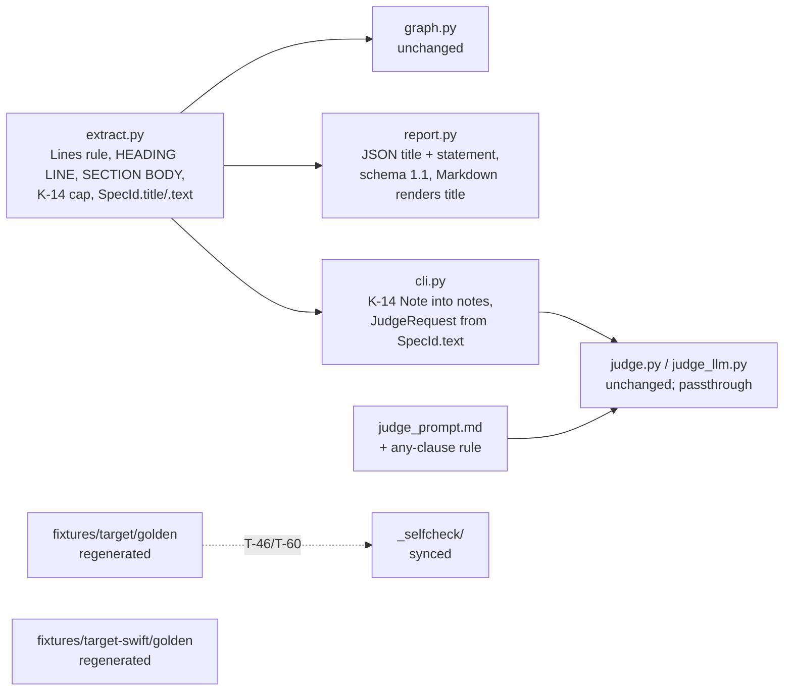

# Implementation plan — `speccheck` v1.8 delta (implementing `SPEC.md` v1.8 over the shipped 1.6.0)

> - **Target:** the `speccheck` CLI and package at 1.8.0, satisfying `SPEC.md` v1.8 (sha256 `d153bde1cafba8e2e726a4bd8b95938fca6ae7d093f7343ce36715eec1af770a`), regenerated golden fixtures, and the packaged self-check.
> - **Size expectation:** the spec states none; this plan budgets **+90–150 production code lines** (5 edited files, 0 new) plus +180–260 test lines (3 edited test files) and the two regenerated goldens + `_selfcheck/` copy. Anchor: the 1.6.0 tree measures 2,172 production code lines across 12 files and 3,078 test code lines across 11 files (`cloc --include-lang=Python`, `_selfcheck/` excluded), and the v1.6 increment — a whole Swift adapter — was +~400 production lines; this delta is one parser rule, one dataclass field, one JSON key and one prompt bullet.
> - **Method:** red-green-refactor over T-72 → T-73 → T-74 (§9 order is the dependency order here); apparatus (the new goldens' expected values, the T-72 fixture spec) before the code it measures; `SPEC.md` never edited by this build — any drift found is a `F-nnn` for `spec-writing`.

---

## 1. Verdict

Three waves, each a commit: **W1** the Extractor (line model, `title`, SECTION BODY, K-14) proven by T-72 alone; **W2** everything downstream that consumes `SpecId` — JSON `title` and `schema_version` `"1.1"`, the C-10 prompt file, the T-34 key order, the two goldens and the `_selfcheck/` copy, the T-48 count, the version bump — proven by the full suite, `--self-check`, and speccheck Phase A on this tree; **W3** the proof: Phase B with a real judge, three fresh T-49 runs (D-08), the README's "built" wording, `SPEC_BUILD_REPORT.md` §0c. The decisions that carry the plan: (1) the statement is computed *once* in `extract.py` and every consumer reads `SpecId.text` — no consumer re-derives a body; (2) the goldens are regenerated by the tool *after* T-72 is green and then hand-checked against the values T-73 states (`C-01` statement, `C-02 == title`), so the golden is a regression guard and T-73's property clauses are the oracle; (3) the Markdown renderer switches to `title` in the same commit as the JSON key, so the "Markdown byte-identical" claim is testable within W2. It refuses to touch `graph.py`, `results.py`, `attribute.py`, `swift.py`, `judge_mock.py` — the spec says they are unchanged, and a diff there is a defect. Landing: ~2,270 production lines. The shortcut that would fit in less is skipping the K-14 cap ("no known spec exceeds it") — that drops K-14 and E-46, and the plan does not take it.

## 2. What the evidence says (this is not a greenfield guess)

| Build | Prod code LOC / files | Shape | State |
|---|---|---|---|
| 1.6.0 (`bd209cf`, this tree) | 2,172 / 12 (+3,078 test / 11) | single package, stdlib kernel, `httpx` behind `[llm]`; goldens `fixtures/target/`, `fixtures/target-swift/`; `_selfcheck/` byte-copy | on `SPEC.md` v1.8: `pytest` 79 passed, **2 failed** — T-54 (`judge_prompt.md` ≠ new C-10 text) and T-48 (`declared == 183`, now 190). Both failures are the spec moving, not the code breaking. |
| v1.6 increment (`66afb57`) | +~400 / +1 file (`swift.py`) | same shape | shipped in one commit, no plan (deviation recorded in the build report §0b) |

Measured facts that shape the order:

- `extract.py::iter_declarations` yields `(fam, num, statement, retired, lineno)`; `parse_spec` splits with `text.split("\n")` — the F-301 line model is one rule away (strip `\r`, define BLANK). `SpecId` has no `title`.
- `report.py` emits `"statement": rec.spec.text` (JSON, `build_report`) and `rec["statement"]` in the Markdown per-ID row — the Markdown must switch to `title`. `SCHEMA_VERSION = "1.0"`. `tests/test_06_reports.py::ID_KEYS` pins the key order and asserts `"schema_version": "1.0"` literally.
- `cli.py:341` builds the judge request from `rec.spec.text` — C-06 passthrough already holds once `text` carries the body; T-74 is a test, not a code change.
- Notes are a `list[str]` assembled in `cli.py` (`notes.extend(...)` per stage) — the K-14 Note has a home.
- `fixtures/target/SPEC.md` has `### C-01` with a one-line body and `### C-02` with an empty body; the Swift fixture likewise (`C-01` body, `C-02` empty). T-73's two named values come from there.
- `tools/sync_selfcheck.py` copies `fixtures/target/` into `_selfcheck/`; T-60 guards the copy.
- Judge endpoints: Ollama is up locally with `qwen3:8b`, `gemma4:latest`; an OpenRouter key is exported in this shell (`switch_to_openrouter.sh`). Phase B and the three T-49 runs (D-08) have a reachable judge either way.

Systemic failure modes the evidence exposes: **(a)** a golden regenerated before the parser is proven locks in a wrong body byte for byte (the v1.4 review's F-206 was this shape: an example emitted by the code and pasted into the spec); **(b)** a test that pins a literal (`"1.0"`, `183`) rather than a rule turns a spec bump into a red suite with no defect behind it — T-48's count belongs in one constant with a comment, not scattered.

## 3. Shape

*Figure: the v1.8 delta — R-33, C-01, C-02, C-06, C-07, C-08, C-10, K-14 — over the 1.6.0 module graph; dotted edge is the T-60 byte-copy.*

- **Literal filenames.** §11 names `extract.py` (R-33, K-14, E-46, E-47), `report.py` (`title`), `judge_llm.py` (passthrough), `speccheck/judge_prompt.md` (C-10). Those are the files; no new module.
- **One computation.** `SpecId.text` is the statement, computed in `iter_declarations` with the cap applied there; `title` is computed beside it. `report.py`, `cli.py`, `judge.py` read the fields and never re-split the spec.
- **Layer direction unchanged:** extract → graph → judge → report → cli. W1 touches only the bottom layer; W2 only consumers.
- **Visual oracle:** none — no rendered surface (C-08 is a Markdown file compared byte for byte; T-73's property clauses are its oracle).

## 4. Order (waves; each ends at a gate, not at a file count)

1. **W1 Extractor** — C-01 Lines rule (split on `\n`, strip trailing `\r`, BLANK), HEADING LINE (≤ 3 spaces, `#` run + whitespace-or-EOL, closing `#` run stripped, declaring line is a HEADING LINE), SECTION BODY (to the next heading of level ≤ own, fences included, blank edges dropped), `SpecId.title`, `SpecId.text` = title / title+`\n`+body / body-alone, K-14 cap with marker line and the Note returned to the caller, E-46, E-47. Apparatus first: the T-72 fixture spec text and its expected `text`/`title` strings are written into the test before the parser changes. Gate: `uv run python -m pytest tests/test_01_extraction.py -q` — expected: all pass including `test_heading_section_bodies_title_cap_and_line_model` (T-72); `uv run ruff check src tests && uv run ruff format --check src tests` — expected: clean. Discharges R-33 (extract half), C-01, C-02, K-14, E-46, E-47, T-72.
   *Why first: every downstream value (JSON, goldens, judge payload) is a function of `SpecId.text`; regenerating a golden before this gate would freeze whatever the parser did at the time (§2 failure a).*
2. **W2 Consumers, goldens, version** — `report.py`: `"title"` key before `"statement"`, `SCHEMA_VERSION = "1.1"`, Markdown Statement cell from `title`; `cli.py`: K-14 Notes appended; `judge_prompt.md`: the C-10 any-clause bullet (SHA changes); T-34's `ID_KEYS` and `"1.0"` literal updated to the rule; T-73 (property clauses + the two named values) written before regeneration, then both goldens regenerated by running the tool, `tools/sync_selfcheck.py`, T-48's declared count 183 → 190 in one named constant; T-74 (recorded HTTP stub: `statement` for a heading-declared id equals `SpecId.text` byte for byte; `judge_prompt_sha256` equals the new file's hash); `__version__ = "1.8.0"`. Gate: `uv run python -m pytest tests -q --junitxml=junit.xml` — expected: 84 passed (81 + T-72, T-73, T-74), 0 failed, 0 skipped; `uv run speccheck --self-check` — expected `self-check: ok`; `uv run speccheck check --spec SPEC.md --src src --tests tests --results junit.xml --judge mock --strict --out build/speccheck` — expected `speccheck: CONFORMING - 190/190 passing (100.0%), …; 0 dangling, 0 stale; judge=mock`, exit 0; `uv run speccheck --version` — expected `speccheck 1.8.0`. Discharges R-33 (report/judge half), C-06, C-07, C-08, C-10, T-73, T-74, T-34/T-46/T-48/T-54/T-60/T-71 (re-green).
3. **W3 Prove it** — Phase B on this tree with the judge chosen in §7 (`--judge llm --strict --out build/speccheck-llm`, expected `CONFORMING … 0 weak … judge=llm`, exit 0); three fresh T-49 runs via `tools/eval_judge.py --runs 3` (D-08; expected each run ≥ 0.90 accuracy, `unknown_rate` ≤ 0.10, recorded with the new `judge_prompt_sha256`); README: the "code is at 1.6.0 / next build" wording becomes built reality, schema row `"1.1"`, layout `1.8.0`; `SPEC_BUILD_REPORT.md` §0c with both summary lines, the golden diff T-73 delegates to it, the §11 rows for R-33/K-14/E-46/E-47/T-72..T-74 filled from `speccheck.json`; the §3.2 artifact cross-check. Gate: both speccheck summary lines exit 0 and are pasted verbatim; `docs` commit.

## 5. LOC budget (production source, excludes fixtures and `_selfcheck/`)

| Slice | Files | LOC |
|---|---|---|
| Extractor: Lines rule, HEADING LINE, body scan, cap, `title` (W1) | `extract.py` | +60–95 |
| Reporter: `title` key, schema, Markdown cell (W2) | `report.py` | +4–8 |
| CLI: K-14 Notes (W2) | `cli.py` | +3–6 |
| Prompt: one bullet (W2) | `judge_prompt.md` | +3 |
| Version (W2) | `__init__.py` | 1 |
| **Total** | **5 edited, 0 new** | **+71–113 (≈ +90–150 with docstrings/comments)** |
| Tests (separate; not "the program") | `test_01_extraction.py`, `test_06_reports.py` or `test_08_golden.py`, `test_05_judge.py`, `test_09_self_application.py` | +180–260 |
| Goldens / self-check copy | `fixtures/*/golden/*`, `src/speccheck/_selfcheck/**` | regenerated, not written |

Anchors: the existing `iter_declarations` is 45 lines and handles rows + headings + fences; the body scan is a second pass over the same line list with the fence state already computed (a heading→next-heading index map), so 60–95 is the honest range. The v1.6 Swift adapter (+~400) is the upper comparable and this is a fraction of it. The budget is an estimate, not a floor — a smaller landing loses nothing unless §11 says so; if the extractor slice approaches 95, split the cap into its own function rather than dropping the Note.

## 6. Rules that make the observed failures impossible

| Prior failure | Structural rule |
|---|---|
| A golden frozen from unproven code (F-206's shape; §2 a) | Goldens are regenerated only after W1's gate is green, and T-73 asserts the two spec-named values (`C-01` statement, `C-02 == title`) and the Statement-cell property independently of the golden bytes. The golden proves stability; T-73's clauses prove correctness. |
| Literals pinned in tests turn a spec bump into red with no defect (T-48's `183`, T-34's `"1.0"`; §2 b) | T-48's count lives in one named constant `DECLARED_IDS_V1_8 = 190` with the spec version in its name; T-34 asserts `schema_version == report.SCHEMA_VERSION` and the key order from one list — both updated in W2 with a comment naming the spec row. |
| A consumer re-deriving the statement (two notions of "statement" — the alternative D-20 rejected) | `title` and `text` are fields of `SpecId`; `grep -n 'split("\\n")' src/speccheck/report.py src/speccheck/cli.py src/speccheck/judge*.py` must stay empty for spec text. Checked in W2's review. |
| CRLF divergence across checkouts (F-301) | The Lines rule is applied once, in `parse_spec`, before `iter_declarations` sees a line; T-72's CRLF sub-case compares the whole `SpecIndex`, not one field. |
| Files the spec says are unchanged drift anyway | W1/W2 commits are reviewed with `git diff --stat`; a hunk in `graph.py`, `results.py`, `attribute.py`, `swift.py`, `judge_mock.py` is a defect to explain or revert. |
| Stale judge evidence presented as current (F-303) | W3 records the new `judge_prompt_sha256` next to every Phase B / T-49 line; a run under the old hash is not cited. |

**Live verification (the last wave).** No window, no screen. The surface that can only be verified by running the product is the *judge payload*: W3 runs `--judge llm --verbose DEBUG --progress never` on one heading-declared edge and inspects the `judge>` line to confirm the body (with its code block and indentation) is what left the process — T-74's stub proves the client; this proves the wire. Prerequisites: a reachable endpoint (Ollama up; OpenRouter key exported — both checked in §2). Stand-in if neither is reachable: none needed today; if it becomes so, Phase B is recorded "not run: <reason>" and the verdict is `PASS WITH NOTES`, never a silent PASS.

## 7. One fork, then action

**Which judge runs Phase B and the three T-49 re-runs (D-08).** Recommended: **OpenRouter `openai/gpt-4o-mini` at `--judge-concurrency 32`** — it is the model whose v1.6 self-application is already on record (332 edges, 0 `UNKNOWN`), so the v1.8 numbers are comparable, and the whole of Phase B plus three T-49 runs is a minute or two and a few cents. Alternative: **local Ollama `qwen3:8b`** — free and offline, but a thinking model that took ~20 minutes per self-application run in v1.2 and whose T-49 figures are from a different prompt; choosing it costs an hour of wall-clock and makes the before/after comparison a model change as well as a prompt change. Both branches leave W1, W2, the budgets and the rules unchanged; only W3's `SPECCHECK_JUDGE_*` values differ.

**Next concrete action:** W1-01 — write `tests/test_01_extraction.py::test_heading_section_bodies_title_cap_and_line_model` (T-72) with the fixture spec text from `DETAILED_IMPLEMENTATION_PLAN_W1.md` §4, run `uv run python -m pytest tests/test_01_extraction.py -q -k section_bodies`; done looks like `1 failed` with `AttributeError: 'SpecId' object has no attribute 'title'`.
