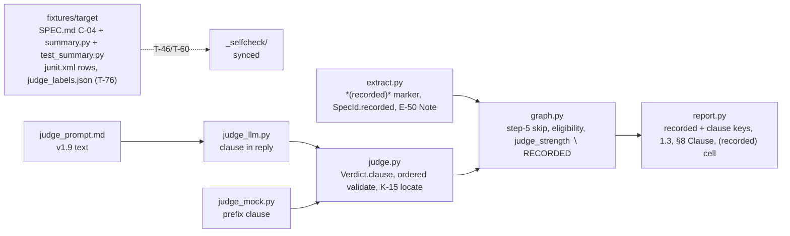

# Implementation plan — `speccheck` v1.11 delta (implementing `SPEC.md` v1.11 over the shipped 1.8.0)

> - **Target:** the `speccheck` CLI and package at 1.11.0, satisfying `SPEC.md` v1.11 (sha256 `5bcb75a265fefd4fa9834d2b2601bb8e8fe45b8f7448613e90ac160e2d2d11cb`), both golden fixtures regenerated at `schema_version "1.3"`, the packaged self-check, and a T-49 label set of ≥ 20 edges.
> - **Size expectation:** the spec states none; this plan budgets **+150–230 production code lines** across 7 edited files (0 new modules) plus +250–350 test lines, plus one new fixture module and test file (~60 + ~70 lines, apparatus, not "the program"). Anchor: 1.8.0 measures 2,290 production code lines / 12 files; the v1.8 delta was +~120 for one parser rule and one key. This delta is three increments: a `clause` field with an eight-rule validator (v1.9), a one-bit marker threaded through extract → graph → report (v1.10), and precision fixes (v1.11).
> - **Method:** red-green-refactor over T-76 → T-77 (extract half) → T-75 → T-77 (graph/report half); apparatus (the fixture's long-body contract and its labels) before the kernel that will be measured against it; `SPEC.md` never edited by this build.

---

## 1. Verdict

Three waves, each a commit. **W1 Apparatus + extractor**: the golden fixture gains its heading-declared contract `C-04` (fenced dataclass + six numbered rules, ≥ 2,048 bytes), a `summary.py` that satisfies it, six labeled tests, JUnit rows and `judge_labels.json` entries (T-76); `extract.py` gains the `*(recorded)*` marker for both declaration forms with the E-50 Note (T-77 extract half). Nothing downstream changes yet, so the wave's gate is `test_01` + the T-76 fixture test; the goldens go stale here and are regenerated in W2 — recorded, not hidden, as in the v1.8 build. **W2 Kernel + reports + goldens**: `Verdict.clause`, the ordered eight-rule validator and K-15 matcher, the mock's prefix clause, the LLM reply parser, `recorded` through `graph.py` (step-5 skip, eligibility, `judge_strength` population) and `report.py` (`recorded` and `clause` keys, `"1.3"`, §8 Clause column, `(recorded)` ID cell), the C-10 prompt file, goldens + `_selfcheck/`, T-48's count 200, version 1.11.0. **W3 Prove**: Phase B with both models measured today, three T-49 runs each over the 20-label set (D-08), README, build report §0d. The decision that carries the plan: `clause` is validated in exactly one function in `judge.py`, in the spec's numbered order, and every rule returns through the same `_unknown` path so the recorded rationale is a pure function of the reply. It refuses to touch `attribute.py`, `results.py`, `swift.py`. Landing: ~2,480 production lines. The shortcut that would fit in less is skipping the ordered validator and bolting the clause check onto the existing `validate` — that loses F-402's precedence guarantee, and the plan does not take it.

## 2. What the evidence says (this is not a greenfield guess)

| Build | Prod code LOC / files | Shape | State |
|---|---|---|---|
| 1.8.0 (`2635298`, this tree) | 2,290 / 12 (+3,300 test / 11) | single package, stdlib kernel, `httpx` behind `[llm]` | on `SPEC.md` v1.11: `pytest` 82 passed, **2 failed** — T-54 (prompt file ≠ C-10) and T-48 (`declared == 190`, now 200). The spec moved. |
| v1.8 delta (`2a25569`, `ef20ef0`) | +~120 / 5 edited | same | three waves; W1's gate expectation missed four golden-dependent failures — this plan expects them |

Measured facts that shape the order:

- `judge.py::validate` is 12 lines with three checks and no order guarantee; `Verdict(verdict, evidence, rationale)` is constructed in four places (mock, LLM parser, two test helpers) — the spec's field order `verdict, clause, evidence, rationale` changes every one of them, so the dataclass change and its call sites land in one work item.
- `graph.py::eligible_edges` and `apply_verdicts` both test `rec.status == "PASSING"`; both need `and not rec.spec.recorded`. `compute_metrics` computes `judge_strength` from `by_status["PASSING"]` — F-405 needs `PASSING ∖ RECORDED`.
- `report.py` §8 has columns `ID, Test, Verdict, Evidence, Rationale`; the spec puts Clause between Verdict and Rationale — it goes after Verdict.
- The fixture's `junit.xml` is hand-shaped (it carries the `test_gone` unattributed row and the planted failure/skip); new rows are appended in pytest's shape after the new tests are proven to pass in a scratch copy.
- `judge_labels.json` has 9 entries covering every judged edge (guarded by `test_llm_eval_labels_cover_every_judged_edge`); the new contract's tests add 11 edges (4 × {C-04, T-nn} + 1 executes-only C-04 + unrelated {C-04, R-01}) → 20.
- Judge endpoints: OpenRouter key exported; gemini needs `--judge-concurrency 8` (HTTP 429 at 32, measured 2026-09-18).

Systemic failure modes the evidence exposes: **(a)** goldens frozen before the parser/validator is proven (v1.4's F-206; guarded again here by regenerating only after W2's unit gate is green and reading the diff); **(b)** pinned literals in tests that turn a spec bump into red (T-48's count — one constant; the schema literal — `report.SCHEMA_VERSION`, never a string in a test).

## 3. Shape

*Figure: the v1.11 delta over the 1.8.0 module graph — R-34, R-35, C-06, C-07, C-08, C-10, K-15, E-48..E-51; dotted edge is the T-60 byte-copy.*

- **Literal filenames.** §11 names `extract.py`, `graph.py`, `judge.py`, `judge_llm.py`, `judge_mock.py`, `report.py`, `speccheck/judge_prompt.md`. No new module.
- **One validator.** `judge.validate(raw, req)` is the only place a clause is checked; rules in the spec's numbered order; `judge.locate_clause(clause, statement) -> str | None` is the K-15 matcher, pure, tested alone.
- **Layer direction unchanged:** extract → graph → judge → report → cli.
- **Visual oracle:** none (no rendered surface).

## 4. Order (waves; each ends at a gate, not at a file count)

1. **W1 Apparatus + extractor** — fixture `C-04` contract, `summary.py`, `test_summary.py`, JUnit rows, labels (T-76); `extract.py` marker + `SpecId.recorded` + E-50 Note (T-77 extract half). Gate: `uv run python -m pytest tests/test_01_extraction.py tests/test_08_golden.py -q -k "recorded or long_body"` — expected: pass; `ruff` clean; full suite — expected: the baseline 2 plus the golden-byte tests (T-36, T-43, T-46) red on `C-04`'s new rows, nothing else. Discharges C-01 marker, C-02, E-50, T-76, T-77 (half).
2. **W2 Kernel + reports + goldens** — `judge.py` (`Verdict.clause`, `locate_clause`, ordered `validate`), `judge_llm.py`, `judge_mock.py`, `graph.py`, `report.py`, `cli.py` (nothing new: E-50 Notes already flow via `index.notes`), `judge_prompt.md`, T-75, T-77 (rest), T-34/T-54/T-74 pins, goldens regenerated and diffed, `_selfcheck/` synced, T-48 `DECLARED_IDS = 200`, `__version__ = "1.11.0"`. Gate: `uv run python -m pytest tests -q --junitxml=junit.xml` — expected `87 passed` (84 + T-75, T-76, T-77); `uv run speccheck --self-check` → `self-check: ok`; Phase A → `CONFORMING - 200/200 …; judge=mock`, exit 0; `--version` → `speccheck 1.11.0`; no hunk in `attribute.py`, `results.py`, `swift.py`. Discharges R-34, R-35, C-05, C-06, C-07, C-08, C-10, I-005, I-010, K-15, E-37, E-48, E-49, E-51, T-75, T-77.
3. **W3 Prove** — Phase B `gpt-4o-mini` @32 and `gemini-3.8-flash` @8 on this tree; expected: both `CONFORMING 200/200` (T-48/T-49/T-51 now recorded, so the honest judge's downgrade is gone), `unknown_rate` reported for each (E-48 may raise gemini's); three T-49 runs per model over the 20-label set; the live wire pass at DEBUG showing `clause` in the reply; README "built" wording; `SPEC_BUILD_REPORT.md` §0d with the ledger, both summary lines per model, the golden diff, §5 rows; `docs` commit.

## 5. LOC budget (production source, excludes fixtures and `_selfcheck/`)

| Slice | Files | LOC |
|---|---|---|
| Extractor: marker (both forms), `recorded`, E-50 Note (W1) | `extract.py` | +25–40 |
| Judge: `clause`, `locate_clause`, ordered validator (W2) | `judge.py` | +45–65 |
| Providers: reply `clause`, prefix clause (W2) | `judge_llm.py`, `judge_mock.py` | +10–16 |
| Graph: skip, eligibility, `judge_strength` population (W2) | `graph.py` | +10–18 |
| Reporter: two keys, schema, §8 column, ID cell (W2) | `report.py` | +14–22 |
| Prompt (W2) | `judge_prompt.md` | rewritten block |
| Version | `__init__.py` | 1 |
| **Total** | **7 edited, 0 new** | **+105–162 (≈ +150–230 with docstrings/comments)** |
| Tests (separate) | `test_01`, `test_05`, `test_06`, `test_08`, `test_09` | +250–350 |
| Fixture apparatus (separate) | `fixtures/target/{SPEC.md, src/calc/summary.py, tests/test_summary.py, junit.xml, golden/judge_labels.json}` | ~130 + regenerated goldens |

Anchors: 1.8.0's `validate` (12 lines) grows to an eight-rule ordered function (~40); the v1.8 extractor slice was +95 for a larger grammar change than the marker. The budget is an estimate, not a floor.

## 6. Rules that make the observed failures impossible

| Prior failure | Structural rule |
|---|---|
| Golden frozen from unproven code | Goldens regenerated only after W2's unit gate is green; the diff is read and must contain only: `schema_version`, `recorded` per id, `clause` per verdict, the §8 Clause column, and `C-04`'s new rows. |
| Literals in tests (T-48 `190`, schema strings) | `DECLARED_IDS = 200` in one constant; tests compare `schema_version` to `report.SCHEMA_VERSION`; no `"1.x"` string in the test tree except the constant's definition. |
| Validation order left to the implementer (F-402) | `validate` is a single function whose body is the spec's numbered list in order, each rule an early `return _unknown(...)`; T-75's combined case pins rule 5 over rules 6–7. |
| Consumers re-deriving state | `recorded` is read from `rec.spec.recorded` only; `grep -n "recorded" src/speccheck/*.py` shows it computed in `extract.py` once. |
| W1 gate surprise (v1.8) | This plan states the golden-dependent failures W1 will cause (T-36, T-43, T-46) and their W2 closure. |
| Stale judge evidence (F-303) | Every Phase B / T-49 line in the report names the new `judge_prompt_sha256`. |

**Live verification (the last wave).** No window. The wire is the surface: one `--judge llm --verbose DEBUG` edge of the fixture's `C-04` — the `judge<` line must show a `clause` that is a verbatim excerpt of the body, and the recorded verdict must carry it. Prerequisites: OpenRouter key exported (checked). Stand-in if unreachable: none needed today; Phase B recorded "not run: <reason>" and verdict `PASS WITH NOTES`.

## 7. One fork, then action

**None left for the requester.** D-21 and D-22 were confirmed in the spec; the judge models for W3 were settled by the requester in the v1.8 build (OpenRouter `gpt-4o-mini`) and by the D-08 row (both models measured). The plan proceeds.

**Next concrete action:** W1-01 — write `tests/test_08_golden.py::test_fixture_long_body_contract_and_labels` (T-76), run it: done looks like `AssertionError` on "no heading-declared contract with a body ≥ 2048 bytes in fixtures/target/SPEC.md".
