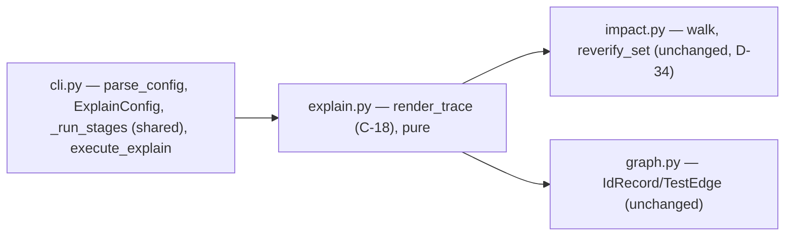

# Implementation plan — speccheck v1.17 delta (`speccheck explain <ID>`)

> - **Target:** the `speccheck` kernel at `SPEC.md` v1.17 (the fold of
>   `PROPOSAL_v1.17_explain_id.md`): a third subcommand that runs `check`'s stages and renders one
>   id's evidence trail as a stdout trace (R-40, C-18, I-016, E-60, E-61; T-92..T-94).
> - **Size expectation:** a **delta plan** on the working v1.16 implementation (3,690 production
>   code lines across 14 modules, 126 tests, 245 declared ids, mock gate 237/245 with the eight new
>   ids `UNCITED`). This plan budgets **~180–260 production lines** across 2 modules (one new, one
>   refactored), **~150–220 test lines** in the outer suite, and no fixture/golden change at all.
> - **Method:** red-green-refactor over the §9.13 test group; the pipeline is factored once so
>   `check` and `explain` cannot drift; `SPEC.md` is not edited except by a recorded `fix(spec):`
>   if Phase 3 finds it stale.

---

## 1. Verdict

Two code waves and a proof wave. **W1 is the whole surface**: `explain.py` (the C-18 renderer,
pure over the facts the pipeline already holds) plus `cli.py`'s `explain` subparser, `ExplainConfig`
and one refactor — `execute`'s stage sequence becomes `_run_stages(config)`, called by both
`execute` and `execute_explain`, so the trace cannot disagree with the report about a status
(I-016) and the two subcommands cannot drift on scan exclusions, the judge contract or the triage
pass. **W2 records T-94**: the live-LLM arm of the trace (and the `not judged` form under
`--judge none`), run for real with the model the requester named. **W3 proves it**: README,
`SPEC_BUILD_REPORT.md` §0i, the §11 walk, `DECLARED_IDS` 245, and both gates.

Two decisions carry the plan: (1) the renderer is a pure function of `(IdRecord, SpecIndex, walk
result, config)` — it reads no file, no clock, no locale, and writes nothing but stdout (C-18,
I-001, D-33), which is what makes T-92's byte-stability assertion meaningful rather than a
tautology over a re-run; (2) the C-18 trace's `impact` section reuses `impact.walk` and
`impact.reverify_set` unchanged (D-34) — no second walk mechanism exists to drift from C-13's.

It refuses to add a durable artifact (D-33), to touch `speccheck.json`, the Markdown report, any
golden or `schema_version`, and to define `--out`/`--strict` on the new subparser (they are
rejected by omission, E-54's pattern).

## 2. What the evidence says (this is not a greenfield guess)

Measured on the starting tree (`git status` clean at `287064a`, 2026-09-20):

| Fact | Value | How measured |
| --- | --- | --- |
| Production code lines / modules | 3,690 / 14 | non-blank, non-comment lines under `src/speccheck/*.py` |
| Declared ids / retired / decisions | 245 / 0 / 36 | `parse_spec` on the folded `SPEC.md` |
| Mock gate on the folded spec | `CONFORMING 237/245`, 0 dangling, 0 stale | `check --judge mock` over this tree |
| The v1.17 ids not yet realised | R-40, C-18, I-016, E-60, E-61, T-92, T-93, T-94 (`UNCITED`) | same run |
| Suite | 126 tests, 1 failure expected (`test_09`'s `DECLARED_IDS` 237) | `pytest tests -q` |
| Reusable apparatus | `impact.walk`, `impact.reverify_set`, `impact.mark_retired`; `graph.IdRecord`/`TestEdge`; `judge.JudgedVerdict`; `report.py`'s em-dash/`(file)` conventions; `fixtures/target` (R-01 `PASSING` with a source and a test citation, R-04 retired, C-02 cited in `src/` only, R-09 undeclared) | reading the modules and the fixture |
| Environment | `SPECCHECK_JUDGE_*` present; `google/gemini-3.8-flash` is the requester's Phase B model | `switch_to_openrouter.sh` |

**Systemic failure modes this delta must not repeat** (each was observed in an earlier increment):

| Failure | Structural rule that makes it impossible here |
| --- | --- |
| Two surfaces disagreeing about one fact because each computes it (the v1.15 `state` template was hand-copied; the v1.16 request field was nearly built twice) | `explain` renders the very `IdRecord`/`TestEdge`/`JudgedVerdict` objects `execute` builds — one pipeline function, two renderers — and T-92 asserts the trace's status equals the golden JSON's |
| A renderer that quietly writes a file (breaking I-001 and the two-file-per-subcommand discipline) | `execute_explain` has no `--out` and no write call at all; T-92 asserts a fresh `--out` directory stays empty |
| A trace whose bytes depend on the environment (absolute paths, locale, a timestamp) | every path in the trace is `--root`-relative (`to_posix_relative`), the renderer takes no clock, and T-92 runs the same command twice and compares bytes |

## 3. Shape

- **Literal filenames** (§11's *where realized* column): R-40 → `cli.py`, `explain.py`; C-18 →
  `explain.py`; I-016 → `cli.py`, `explain.py`; E-60 → `cli.py`; E-61 → `cli.py`, `explain.py`;
  T-92..T-94 → `tests/test_12_explain.py` (+ `SPEC_BUILD_REPORT.md` for T-94's record).
- **Layer direction:** `cli.py` → `explain.py` → {`impact.py`, `graph.py`, `judge.py`,
  `extract.py`}. `explain.py` imports no `report.py` (it renders its own surface, not C-08's) and
  no `judge_llm.py`/`jev.py` (it consumes verdicts, never produces them).
- **Headless/purity rule:** `render_trace(...)` is a pure function of its arguments; no clock, no
  filesystem, no environment, no network. Determinism is then a property of the inputs, which is
  what I-002/I-016 ask of the surface.
- **No visual oracle:** the deliverable is a text surface, so the observed pass is the trace itself
  printed and read (T-92/T-93/T-94), not a screenshot.

## 4. Order (waves; each ends at a gate, not at a file count)

1. **W1 `explain` end to end** — `explain.py` (`render_trace`, the six C-18 sections), `cli.py`
   (`ExplainConfig`, `Action("explain", …)`, the subparser, `_run_stages` factored out of
   `execute`, `execute_explain`, E-60's id validation), `tests/test_12_explain.py` (T-92, T-93).
   Gate: `pytest tests/test_12_explain.py -q`, then the whole suite + `ruff` + `--self-check`
   (the refactor must leave every golden byte-identical), T-92/T-93.
2. **W2 the recorded T-94** — the live-LLM arm (`explain <id> --judge llm` on the fixture with the
   requester's model) and the `not judged` form under `--judge none`, recorded in
   `SPEC_BUILD_REPORT.md` §0i with the model, date and `judge_prompt_sha256`, plus the presence
   check in `tests/test_09_self_application.py`. Gate: `pytest tests/test_09_self_application.py -q`.
3. **W3 prove it** — `DECLARED_IDS` 245, README, `SPEC_BUILD_REPORT.md` §0i/§5/§6, the root
   reports, Phase A (`--judge mock --strict`) and Phase B (`--judge llm --strict`,
   `google/gemini-3.8-flash`). Gate: the full Phase 1 exit gate, both phases, exit 0.

## 5. LOC budget (production source)

| Slice | Files | LOC |
| --- | --- | --- |
| `render_trace` + the section helpers (W1) | `explain.py` (new) | 110–160 |
| Subparser, config, `_run_stages` refactor, `execute_explain` (W1) | `cli.py` | 70–100 |
| **Total production** | **2** | **180–260** |
| Outer-suite tests (separate) | `tests/test_12_explain.py`, `tests/test_09_self_application.py` | 150–220 |

Anchors: `report.py`'s Markdown renderer is 537 code lines for two full reports (C-07/C-08) — a
one-id trace with six sections is a quarter of that; `impact.py`'s walk/reverify/mark_retired block
is ~70 lines and is reused, not re-written; the v1.15 delta's whole provider module was 230 lines.
**The smallest complete build of this delta is the ~180-line branch** (a renderer plus the wiring);
anything above it is the C-18 section helpers and the `--depth` handling, and the report names it.

## 6. Rules that make the observed failures impossible

| Prior failure | Structural rule |
| --- | --- |
| A shared fact computed twice and drifting (the v1.15 C-17 `state`, the v1.16 `related` field) | one `_run_stages` for both subcommands; the renderer is pure and reads only its arguments; T-92 compares the trace's status against `golden/speccheck.json` |
| A new surface writing a file (the v1.13 `impact` pair had to be taught §3.1's temp-and-rename discipline) | `explain` has no write path and no `--out`; T-92 asserts the `--out` directory it is given stays empty |
| A golden regenerated to match a regression (the v1.16 fixture goldens had to be re-derived by hand twice) | no golden changes in this delta at all: `explain` writes no artifact, and the `check`/`impact` goldens are byte-compared by the existing tests through the refactor |

**Live verification (W2/W3).** The surface is the CLI's own stdout, driven against a real provider
for T-94 and against the golden fixture for T-92/T-93. Prerequisites: a reachable
`SPECCHECK_JUDGE_URL` with `google/gemini-3.8-flash` and a key (present). Stand-in when the
provider is unreachable: the mock judge for Phase A only — T-94 and Phase B then stay *verification
pending* and the verdict says so.

## 7. One fork, then action

**T-94's live-LLM arm: run it for real, or record it pending?** Recommendation, taken: **run it** —
the requester named the model, the credentials are present, and the trace's `clause:`/`rationale:`
lines are the only part of C-18 that a stub cannot honestly produce. The alternative (record
"pending: no reachable judge") would leave the one section of the contract that renders a live
verdict unexercised. The run is re-runnable, so the choice is reversible, and it is recorded with
its model, date and `judge_prompt_sha256` like every other recorded row in this project.

Both branches leave the wave order, the budgets and the rules unchanged.

**Next concrete action:** W1-01 — write `tests/test_12_explain.py::test_t92_explain_golden_trace_is_stable`
first, run it, and watch it fail on `No module named 'speccheck.explain'`.
