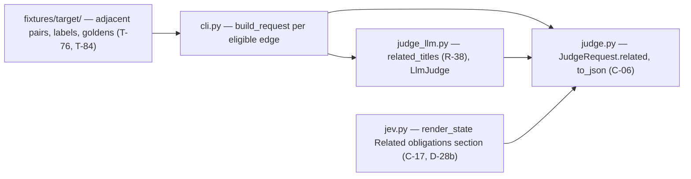

# Implementation plan — speccheck v1.16 delta (the obligation-aware judge)

> - **Target:** the `speccheck` kernel at `SPEC.md` v1.16 (sha256
>   `0e1e7c415e25b1ef609abed14c094b11be31189a1afa221034b624e85bbb2b16`, 260,251 bytes), which
>   folds `PROPOSAL_v1.14_obligation_aware_judge.md`: Part A (the golden fixture's adjacent
>   subset, T-76/T-84) and Part B (`related` on the C-06 request and the C-17 triage `state`,
>   R-38/C-06/C-10/C-17/K-16/E-57).
> - **Size expectation:** a **delta plan** on the working v1.15 implementation (3,600 production
>   code lines across 14 modules, 5,036 test code lines, 237 declared ids, mock gate CONFORMING
>   at 233/237). This plan budgets **~110–160 production lines** across 4 modules, **~120–200
>   test lines** in the outer suite, and **~90 fixture lines + 16 junit entries + 16 labels**
>   inside `fixtures/target/`.
> - **Method:** red-green-refactor over the §9 test groups; the fixture apparatus (Part A) lands
>   before the feature it measures (Part B); `SPEC.md` is not edited except by a recorded
>   `fix(spec):` if Phase 3 finds it stale.

---

## 1. Verdict

Three waves. **Part A first**: the adjacent subset is the oracle T-84 and T-49 measure Part B
against, and the mock-judge goldens it regenerates are unaffected by a request-side field, so the
apparatus can land and be gated before a line of `related` code exists. **Part B second**: one
pure builder (`judge_llm.related_titles`) feeding one field on `JudgeRequest` (C-06) and one
section of C-17's `state` template; the two consumers (`judge_llm.LlmJudge`, `jev.render_state`)
are the only places that read it. **W3 proves it**: the recorded T-84 measurement (both prompt
texts, the model the requester named), T-49's three runs, the README, and both `speccheck` gates.

Two decisions carry the plan: (1) the neighbourhood is computed once, in `judge_llm.py`, and
carried on the request object — the spec's §11 row for R-38 names that module, and computing it
twice (once for the judge, once for the triage `state`) is how the two wire formats drift; (2)
the fixture grows by 8 adjacent/generic **pairs** rather than 8 lone adjacent tests, so every
adjacent edge has a same-calls partner that differs only in what is asserted — without the
partner, a judge that downgrades everything scores the same as one that downgrades correctly.

It refuses to renumber or retire any id, to bump `schema_version` (R-38 is request-side, D-28),
and to touch the mock judge (R-16/R-22: it reads no statement semantics).

## 2. What the evidence says (this is not a greenfield guess)

Measured on the starting tree (`git status` clean at `f9d8d6c`, 2026-09-20):

| Fact | Value | How measured |
| --- | --- | --- |
| Production code lines / modules | 3,600 / 14 | non-blank, non-comment lines under `src/speccheck/*.py` |
| Test code lines | 5,036 | same rule over `tests/*.py`; 124 tests collected |
| Declared ids / retired | 237 / 0 | `check --judge mock` on this tree |
| Mock gate | `CONFORMING 233/237`, 0 dangling, 0 stale, exit 0 (exit 1 under `--strict`) | `check --spec SPEC.md --src src --tests tests --results junit.xml --judge mock` |
| The v1.16 ids not yet realised | R-38, E-57, T-83, T-84 (`UNCITED`) | same run, `metrics.by_status` |
| Fixture | 19 in-scope ids, 23 labeled edges (18 ASSERTS / 3 UNRELATED / 2 EXECUTES_ONLY), 18 junit results | `fixtures/target/golden/judge_labels.json`, `junit.xml` |
| Fixture cross-references today | 4 `depends_on` edges (C-04→K-02, T-03→R-02/K-02, D rows) | `golden/speccheck.json` `edges` |
| Judge prompt | v1.16 C-10 text shipped, sha256 `dbac713c9a63185c590c4a2eb0ed2f52dc11f3cb414bea6495cf617152433f8f` | `judge_prompt.md` vs the C-10 block |
| Environment | `SPECCHECK_JUDGE_{URL,MODEL,KEY,TIMEOUT}` present; OpenRouter reachable; `google/gemini-3.8-flash` is the requester's Phase B model | `switch_to_openrouter.sh`, `SPEC_REVIEW_REPORT.md` §D-08 |

**Systemic failure modes this delta must not repeat** (each was observed in an earlier
increment):

| Failure | Structural rule that makes it impossible here |
| --- | --- |
| A pinned number in one artifact silently drifting from the artifact it describes (the v1.15 fixture count "19 in scope" is asserted in three places; the v1.14 build broke `declared_ratio`'s 18/19 twice) | every count Part A moves is enumerated in the wave doc's §8 and re-derived by running the suite, not by editing numbers until it is green |
| The two wire formats (C-06 request, C-17 `state`) diverging on a shared field (the v1.15 `state` template was copied into `jev.py` by hand) | the neighbourhood is built once (`judge_llm.related_titles`), stored once (`JudgeRequest.related`), and both consumers read that one value; T-83 asserts the same list in the user message and in the triage `state` |
| A fixture that cannot see the failure the change exists to catch (T-49's 23 labels had one adjacent edge, so Part B would be unmeasurable) | Part A lands first and T-76's floor is asserted (≥37 entries, ≥8 adjacent `UNRELATED`) before Part B exists |

## 3. Shape

- **Literal filenames** (§11's *where realized* column): R-38 → `judge_llm.py`, `jev.py`,
  `speccheck/judge_prompt.md`; C-06 → `judge.py`, `judge_mock.py`; C-17/K-16 → `jev.py`,
  `cli.py`; E-57 → `judge_llm.py`, `jev.py`; T-83 → `tests/test_05_judge.py`; T-84 →
  `tests/test_09_self_application.py` + `SPEC_BUILD_REPORT.md`.
- **Layer direction:** `cli.py` → `judge_llm.py` / `jev.py` → `judge.py` → `extract.py`. No
  module reads the spec graph twice; `report.py` and `graph.py` never see `related` (T-83: it is
  absent from `speccheck.json` and from the Markdown report).
- **Headless rule:** the builder is pure — `related_titles(ident, index)` takes the parsed spec
  and returns a tuple; no clock, no filesystem, no network, no ambient state. T-83 can therefore
  assert the cap, the order and the truncation without a provider.
- **Determinism:** the neighbourhood is a function of the spec text alone, so two runs on one
  spec produce byte-identical requests (I-002); the fixture goldens are regenerated, never
  hand-edited.

## 4. Order (waves; each ends at a gate, not at a file count)

1. **W1 Fixture apparatus: the adjacent pairs (Part A)** — `fixtures/target/SPEC.md` gains the
   cross-references and E-03; `tests/` gains 8 adjacent + 8 genuine tests; `junit.xml` gains
   their 16 results; `golden/judge_labels.json` grows to ≥37 with ≥8 adjacent `UNRELATED`; the
   four fixture goldens are regenerated and `src/speccheck/_selfcheck/` re-synced; the outer
   suite's fixture-pinned numbers are re-derived. Gate: `pytest tests -q --junitxml=junit.xml`,
   `ruff check src tests`, `speccheck --self-check`, T-76/T-46/T-47/T-73/T-86/T-88.
2. **W2 Part B: `related` on the request and the triage `state`** — `judge.py` (`JudgeRequest.related`,
   `to_json`), `judge_llm.py` (`related_titles`), `jev.py` (the `Related obligations:` section),
   `cli.py` (wiring). Gate: `pytest tests/test_05_judge.py tests/test_07_cli.py -q`,
   `ruff check src tests`, T-83/T-74/T-33/T-89.
   *Why here:* the request field is inert for every existing report, so the whole suite must stay
   green through it; the fixture it will be measured on already exists and is gated.
3. **W3 Prove it: the recorded measurements, the docs, and both gates** — the T-84 measurement
   (both prompt texts, `google/gemini-3.8-flash`), T-49's three runs, `DECLARED_IDS` 237, the
   README, `SPEC_BUILD_REPORT.md`, the root `speccheck.json`/`SPEC_CONFORMANCE_REPORT.md`, and
   the Phase A + Phase B gates. Gate: the full Phase 1 exit gate, both phases, exit 0.

## 5. LOC budget (production source)

| Slice | Files | LOC |
| --- | --- | --- |
| `related_titles` + the request field (W2) | `judge_llm.py`, `judge.py` | 45–70 |
| The triage `state` section + wiring (W2) | `jev.py`, `cli.py` | 15–30 |
| **Total production** | **4** | **60–100** |
| Outer-suite tests (separate) | `tests/test_05_judge.py`, `tests/test_08_golden.py`, `tests/test_09_self_application.py` | 120–200 |
| Fixture (data, not production) | `fixtures/target/{SPEC.md,tests/*.py,junit.xml,golden/*}` | 90–140 |

Anchors: `jev.render_state` is 8 lines for a 3-part template — the `related` section is one more
part (~6 lines); `graph.py`'s `ratio` shows the project's style for a pure function of the parsed
spec (~15 lines with its docstring); the v1.15 delta's whole provider module was 230 code lines,
so 60–100 for two pure functions and a field is the right order. **The smallest complete build of
this delta is the 60-line branch** (one builder, one field, one template line, one wiring line);
anything above it is docstrings and the ordering/cap logic R-38 pins, and the report names it.

## 6. Rules that make the observed failures impossible

| Prior failure | Structural rule |
| --- | --- |
| The fixture's in-scope count (`19`) and `declared_ratio` (`18/19`) are asserted in four places, and Part A moves both | W1's §8 enumerates every pinned count; the wave re-runs the suite and re-derives each from `golden/speccheck.json`, never by editing until green |
| A recorded row (T-84/T-49) certified by a presence check alone | the measurement is run for real and pasted verbatim (model, date, `judge_prompt_sha256`, per-run figures) into `SPEC_BUILD_REPORT.md`; the presence check asserts the artifact's shape only |
| Phase B "not run" quietly passing as conforming | Phase B is run on the fixture (T-49, three runs) and on this repository (the gate) with the requester's model; if the provider is unreachable the verdict is `VERIFICATION PENDING`, not PASS |

**Live verification (W3).** The surface is the CLI's own judge stage, driven against a real
provider: `tools/eval_judge.py` for T-49's three runs and the T-84 measurement script for the two
prompt texts. Prerequisites, named now: a reachable `SPECCHECK_JUDGE_URL` with
`google/gemini-3.8-flash` and a key (present, `switch_to_openrouter.sh`), network egress, and
~20 minutes of wall-clock at `--judge-concurrency 8`. Stand-in when the provider is unreachable:
the mock judge for Phase A only — T-49/T-84/Phase B then stay *verification pending* and the
verdict says so. No self-generated golden is used as the oracle for T-84: the labels are hand
written and the comparison baseline is the pre-v1.16 prompt text.

## 7. One fork, then action

**T-84's protocol: measure both prompt texts, or the shipped text alone?** Recommendation, taken:
**both** — three runs with the shipped v1.16 text and three with the pre-v1.16 text (recovered
from `git show HEAD~1:src/speccheck/judge_prompt.md`, sha256 `f6b124bd…`), over the same eight
adjacent edges, same model, same day. T-84's row is the proposal's falsifiable claim (the
difference), and the pre-v1.16 arm is what makes the difference measurable; the alternative —
the shipped text alone — is half the calls and cannot distinguish "the neighbourhood moved the
judge" from "this model downgrades adjacent edges anyway", which is the exact no-op T-84 exists
to detect. Cost of the alternative: a recorded row that cannot be falsified.

Both branches leave the wave order, the budgets and the rules unchanged.

**Next concrete action:** W1-01 — add the fixture cross-references and E-03 to
`fixtures/target/SPEC.md`, then the first adjacent/generic pair, and run
`pytest tests/test_08_golden.py -q` to watch T-76's label floor fail before the labels exist.
