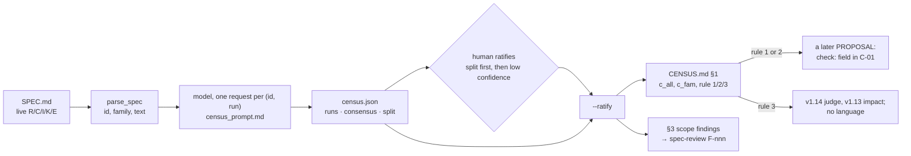

# Proposal — the obligation census: measure what fraction of a spec a machine could check before building a language to check it

> - **Status:** proposal, 2026-09-19; **no `SPEC.md` version** — this is a tool under `tools/` and a decision gate, not a change to the checker. Its outcome is the evidence for (or against) a later proposal that would add a checkable-expression field to the `SPEC.md` grammar.
> - **Applies to:** `SPEC.md` v1.12 as the first subject (125 live R/C/I/K/E ids); `docs/research/SPEC.md` v0.2 (44) as the second. `tools/eval_judge.py` as the pattern (opt-in, three runs, an OpenAI-compatible endpoint, the `SPECCHECK_JUDGE_*` variables).
> - **Notation:** unprefixed ids are speccheck's own; `mcpi:K-01` is the Monte Carlo π spec's.
> - **Evidence:** the transcript `docs/research/ontological_spec_database.md` §5, §8 (the six-level evidence ladder), §17 and §22 (the expression language it defers), read against the two specs; the ten seed labels in §2 below, drafted by hand from v1.12 rows.

## 1. The problem

The transcript's case for a semantic model rests on Levels 2–3 of its ladder — behavioral and invariant obligations
checked *"without an LLM at all"* — and its worked example is `mcpi:I-002`: `is_hit = x*x + y*y <= 1.0`, an
expression an analyzer can find in an AST. It then defers the expression language to a separate document (§22). But
the language is the whole cost of Levels 2–3, and nobody has counted how many obligations it would buy. The one
example is the best case in that spec; speccheck's own R-01 — *"extract every declared spec ID together with its
family and statement text, per the grammar in C-01"* — is the ordinary case, and it does not reduce to an expression
that a test or an AST walk can be matched against. If most obligations are like R-01, the language checks a minority
and the judge and the tests stay the semantic layer; if most are like `mcpi:I-002`, the language is the next
version of speccheck. That is a number, and it decides a build of several thousand lines.

The number is cheap to get and expensive to get wrong by hand: 169 obligations across two specs, each read once
against four definitions, is an afternoon for a person and an hour for a model — and a model's reading of a spec is
exactly the thing that needs ratifying (transcript §34). So the tool drafts, a human ratifies, and a pinned heuristic
turns the ratified table into a recommendation nobody has to argue about afterwards.

## 2. The change

**Part A — the census script, `tools/census.py`.** Opt-in, outside the kernel, same shape as `tools/eval_judge.py`.

```text
uv run python tools/census.py --spec SPEC.md [--runs 3] [--out build/census] [--model M] [--url U]
uv run python tools/census.py --spec SPEC.md --ratify build/census/census.json     # after a human edits it
```

1. *Subjects.* `extract.parse_spec` → every live id in R/C/I/K/E (T ids are methods, not obligations; retired ids
   are out of scope). Each subject is `{id, family, statement}` with `statement = SpecId.text` — title plus section
   body, K-14-capped, exactly what the judge sees (R-33).
2. *One question per subject, `--runs` times*, over the same endpoint and variables as the judge (C-09), one request
   per (subject, run), no retries. The instruction text, `tools/census_prompt.md`, asks for one JSON object:

   ```json
   {"form": "expr|struct|behavior|prose",
    "checker": "ast|schema|test|llm",
    "expression": "<the check, in the spec's own notation, or \"\">",
    "scope": {"stated": true, "text": "<the conditions under which it applies, verbatim or \"\">"},
    "quantities": ["<named quantity>", "..."],
    "confidence": 0.0,
    "rationale": "<one sentence>"}
   ```

   with the four forms defined by what would verify them, not by how they read:

   | `form` | Definition | Two v1.12 rows that fit it |
   | --- | --- | --- |
   | `expr` | reduces to one closed boolean or arithmetic proposition over named quantities the implementation exposes; a checker could evaluate it from values alone | K-14 (`len(utf8(statement)) <= 16384`, keep-title rule), I-008 (every ratio in `[0, 1]` or `null`) |
   | `struct` | asserts that a named thing exists with a named shape — a key, a field, a file, a symbol, a column | C-07 (`schema_version` key, key order), R-26 (`judge_prompt_sha256` recorded) |
   | `behavior` | a stimulus and an observable response that only running the system can show | E-52 (a bad PATHS element → exit `2` with that message), R-05 (join `<testcase>` to attributed cases) |
   | `prose` | intent, scope, or a quality no single observation settles | R-01's *"per the grammar in C-01"* half, §0's boundaries |

   `checker` is the cheapest mechanism that could verify the form: `ast` (a pattern in source), `schema` (a
   structural check of an output), `test` (execute and observe), `llm` (judgment). `expr` ⇒ `ast` or `test`;
   `struct` ⇒ `schema` or `ast`; `behavior` ⇒ `test`; `prose` ⇒ `llm`. A reply outside that mapping, or outside the
   enums, or non-JSON after the judge's fence-stripping rule, is recorded as `form: "UNKNOWN"` for that run —
   never coerced to a valid answer (the judge's E-15 discipline).
3. *Consensus.* A subject's `form` is **unanimous** when every non-UNKNOWN run agrees and at least two runs are
   non-UNKNOWN; otherwise **split**. The same for `checker`. `scope.stated` is unanimous by majority. A split
   subject counts as `prose` in every ratio below until a human ratifies it — the conservative direction, because
   an overcounted `expr` is what would justify a build the spec does not need.
4. *Outputs.* `build/census/census.json` — per subject: the statement's SHA-256, every run's reply, the consensus,
   `split`, and an empty `ratified: {}` for the human — and `CENSUS.md`: §1 Summary (the table of §Part C below and
   the recommendation), §2 Ratification queue (split subjects first, then `confidence < 0.7`, each with its
   statement and the runs' rationales side by side), §3 Scope findings, §4 The full table (id, form, checker,
   expression, scope, confidence, split), C-07 order. Model, date, and the prompt's SHA-256 in the header, as T-49
   records them.
5. *Ratification.* A human edits `ratified` on any subject (`{"form": "expr", "checker": "ast", "scope_stated":
   false}`); `--ratify` recomputes §1 and §3 from ratified values where present and consensus elsewhere, and prints
   the ratified fraction. Nothing is overwritten: the runs stay as evidence of what the model said.

**Part B — the script's own accuracy check, `tools/census_labels.json`.** The census is a model reading a spec, so
it gets what the judge got in v1.9: a hand-labeled subset and a bar. Ten seed labels, drafted here from v1.12 rows
and to be ratified with the rest:

| id | `form` | `checker` | `scope.stated` | Why |
| --- | --- | --- | --- | --- |
| K-14 | `expr` | `test` | yes | a byte bound, a truncation rule, a marker line — all closed over the statement's bytes |
| K-15 | `expr` | `ast` | yes | whitespace-collapsed substring, 12 ≤ len ≤ 280; `judge.py:143` is the expression |
| I-008 | `expr` | `test` | yes | every ratio in `[0, 1]` or `null`; no raise on zero denominator |
| I-011 | `expr` | `test` | yes | normalization injective within a family |
| C-07 | `struct` | `schema` | yes | a pinned JSON object: keys, order, `schema_version` |
| R-26 | `struct` | `ast` | yes | exactly the C-10 text; the SHA-256 recorded |
| E-52 | `behavior` | `test` | yes | a PATHS element that is neither file nor directory → exit `2`, that message, no reports |
| R-05 | `behavior` | `test` | yes (`--results` given) | JUnit read, `<testcase>` joined, outcome recorded per C-04 |
| I-002 | `behavior` | `test` | yes (`--judge none`/`mock`) | byte-identical output for identical inputs — observable only by running twice |
| R-01 | `prose` | `llm` | no | *"every declared spec ID … per the grammar in C-01"*: the obligation is the grammar, which lives in C-01; on its own the row is intent |

The bar, recorded not gating, like T-49: over the labeled subset (≥ 20 once ratified, ≥ 4 per form), unanimous
`form` agrees with the label at ≥ 0.75, and no labeled `prose` is read as `expr` (the error that matters). A script
that misses the bar produces a table nobody should ratify from, and the run says so at the top of `CENSUS.md`.

**Part C — the recommendation heuristic**, pinned in the script and printed with its inputs so the decision is
reproducible from the JSON alone. With *N* the live obligations of a family and *checkable* the count whose
(ratified, else unanimous) `form` is `expr` or `struct`:

```text
c_all    = checkable(all) / N(all)
c_fam    = checkable(F) / N(F)           for F in R, C, I, K, E

1. c_all >= 0.50                         -> EXPRESSION FIELD, ALL FAMILIES
                                            a `check:` block under the id becomes part of the C-01 grammar; the
                                            `expression` column of §4 is the corpus the language is designed from
2. else if any F has c_fam >= 0.75
        and N(F) >= 5                    -> EXPRESSION FIELD, FAMILIES {F...} ONLY
                                            (expected: K, whose rows are already `metric op threshold`; the field is
                                            optional elsewhere)
3. else                                  -> NO EXPRESSION LANGUAGE
                                            the judge and the tests remain the semantic layer; invest in
                                            PROPOSAL_v1.14 (obligation-aware judge) and PROPOSAL_v1.13 (impact)

always:
  scope findings   = subjects with scope.stated == false and scope.text != ""
                     -> one candidate F-nnn each for spec-review: a condition the reader had to infer
  ratification queue = split subjects, then confidence < 0.7
  ratified fraction  < 0.50 -> the recommendation is printed as PROVISIONAL
```

The thresholds are the proposal's claim, not the script's: 0.50 because below it a language leaves the majority to
the judge and the tests, which then must exist anyway; 0.75 per family because a family the language cannot cover
three-quarters of is not a family the grammar should require it for; *N* ≥ 5 so `mcpi`'s six K rows can decide for
K but four `struct` C rows cannot decide for C. Change them in the row, not in the code.



*Figure 1 — the census as a decision gate. Nothing on the left changes the checker; the only outputs that outlive
the run are the recommendation, the scope findings, and — under rules 1 or 2 — the `expression` column as the corpus
a language would be designed from.*

## 3. What it costs

- **Tokens.** 169 subjects × 3 runs × roughly 1.5 k tokens (the long C bodies dominate; K-14 caps each at 16 kB) —
  under a million tokens per model; cents to a few dollars. Wall-clock under ten minutes at the judge's concurrency.
- **A person.** Ratifying the split and low-confidence rows: an hour for two specs if the model is stable, an
  afternoon if it is not — and if it is not, that is the first finding, and Part B reports it.
- **Code.** ~250 lines in `tools/`, a prompt file, a labels file. No change to `src/`, `SPEC.md`, the goldens, or
  the gate. Nothing here runs in CI.
- **Two things the census does not measure.** Whether an `expr` row's expression is *correct* — that is what
  ratification and, later, the language's own tests are for — and whether an `ast` checker could actually find it in
  a given codebase, which depends on the code, not the spec.

## 4. Alternatives considered

| Alternative | Why not |
| --- | --- |
| Design the expression language first, then see what it covers (the transcript's order) | The language is the expensive step; the census is the cheap one that says whether to take it. Designing it from ten hand-picked examples selects for `expr`. |
| Hand-classify without a model | Feasible for 169 rows, once; not repeatable on the next spec, and it produces no evidence about how *stable* the classification is, which the split count gives for free. |
| One run instead of three | T-49's lesson: one run of a model over a spec looks confident and is not; the split rows are where the human's hour should go, and one run cannot find them. |
| Classify T ids too | A T is a method, not an obligation; its "form" is the form of what it verifies. The census does report, per obligation, which T ids verify it (from v1.13's `verifies` edges when present, else the T parentheticals), so an `expr` with no `test` verifier is visible — but that is a traceability finding, not a census class. |
| Put the census in the kernel as a `speccheck census` subcommand | It calls a model on every id and returns an opinion; the kernel's rule is that the model can only ever downgrade (I-004) and the deterministic path never consults it. This is measurement of the *spec*, which `spec-review` owns; a tool beside `eval_judge.py` is the right shelf. |
| Five forms (split `expr` into `arith` and `bool`) or more checkers | The decision has three branches; the classes should be exactly what distinguishes them. Finer classes come from the `expression` column afterwards, if rule 1 or 2 fires. |

## 5. Decision for the requester (`confirm`)

**Run the census on both specs with three runs of one model, ratify, and let rule 1/2/3 decide** (recommended) —
versus **skip it and build the expression field for family K only** (the likely rule-2 outcome for speccheck's spec,
taken on the reading in §1 rather than on the count). The second is a defensible bet on this spec; it is not a
method, and the next spec would bet again.

## 6. What the proposal does not do

It does not add anything to `SPEC.md`, the checker, or the gate, and it produces no conformance result: `expr` is a
statement about what *could* check an obligation, not a check. It does not settle the language's design — under
rules 1 or 2 that is a proposal of its own, written from the `expression` column. It does not classify the
transcript's Levels 4–5 (performance, probabilistic) separately: a latency bound is `expr` with a `test` checker,
which is the answer the census should give, and whether the test is statistical is the T row's business. And it
does not claim its four classes are an ontology; they are the three-way decision in Part C, with `prose` as the
class for everything the decision cannot use.
