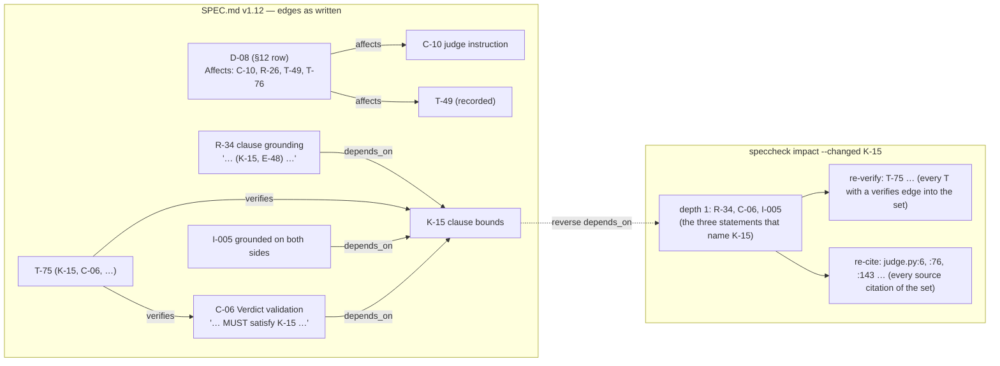

# Proposal — v1.13: `speccheck impact` — change-impact analysis from the edges the spec already carries

> - **Status:** proposal, 2026-09-19; for `spec-writing` to turn into `SPEC.md` v1.13 rows after the requester settles D-24 and D-25 below
> - **Applies to:** `SPEC.md` v1.12 — C-01 (declaration grammar: a new declaration-only family), C-02 (`SpecId`), C-07 (JSON: two new arrays, `schema_version` bump), §5 (a second subcommand), I-001/I-002 (extended to the new report files), §11, §12 (the *Affects* column becomes normative input)
> - **Notation:** unprefixed ids (C-01, K-15, D-08) are speccheck's own. Ids of the Monte Carlo π spec in `docs/research/SPEC.md` are written `mcpi:I-006` — a foreign id, in inline code so the PDF cross-reference pass does not link it.
> - **Evidence:** a measurement on 2026-09-19 with `extract.parse_spec` and `ID_RE` (the v1.12 extractor, unmodified) over `SPEC.md` v1.12 and `docs/research/SPEC.md` v0.2; figures in §1. The idea is the transcript `docs/research/ontological_spec_database.md` §13–§14 and §31–§32 (change propagation, `Decision.affects`), taken here without the ontology.

## 1. The problem

A `SPEC.md` id is never renumbered and is retired by strike-through rather than deleted, so an id is a stable name
for one obligation across versions. What the method has no answer for is the question that follows every edit to
one: *what else must be re-read, re-cited, and re-run?* Today that is a reading job — `spec-writing` reads the
document, `spec-plan` reads it again, and the build report's evidence for an untouched id is whatever the last run
said. The v1.9 → v1.11 cycle changed C-06, C-07, C-08, C-10 and added R-34/R-35; which of the 78 tests those changes
invalidated was decided by the person writing the wave plan.

The transcript proposes a knowledge graph with `depends_on` and `affects` edges so that a change to `mcpi:D-08` propagates
to `mcpi:I-006`, `mcpi:C-01`, `mcpi:T-01`, `mcpi:T-14` and marks their evidence stale. The graph it wants to build **is already written down in
the prose**, in three places the extractor can read with the regex it has:

| Edge | Where it is in the document | v1.12 `SPEC.md` (203 live ids) | `mcpi` v0.2 (62 live ids) |
| --- | --- | ---: | ---: |
| obligation → obligation (`depends_on`) | an R/C/I/K/E statement names another R/C/I/K/E id — *"per the grammar in **C-01**"*, *"exits `2` per **E-09**"* | 186 edges from 89 ids | 10 edges from 8 ids |
| test → obligation (`verifies`) | a T row's parenthetical *(R-03, R-04, C-03, …)*, and an obligation naming the T that proves it | 240 | 30 |
| decision → anything (`affects`) | the §12 *Affects* column: `\| D-03 \| … \| C-01, R-03, R-04, R-27 \| …` | 110 edges from 23 decisions | 29 edges from 9 decisions |

134 of the 203 live ids in speccheck's own spec name at least one other id in their statement; 434 id tokens in all.
Every one of these edges is a sentence somebody wrote on purpose, and nothing reads them.

One measurement in the same run is the shape of the design. Following `depends_on` **transitively** from any one id
in speccheck's spec reaches most of the spec: from K-15 (a 12/280-character substring rule) the dependents number 3
at depth 1, 8 at depth 2, then 18, 9, 6, 3 — 47 of 125 obligations, and 49 of 78 tests to "re-run". 77 of the 125
obligations sit in a core from which the closure reaches at least 40. The direct set is the signal (K-15: R-34, C-06,
I-005; C-01: 10 ids; D-08's *Affects*: 4 ids); the closure is the whole document. The `mcpi` spec, written
without the heavy cross-referencing, is the opposite: median reach 0, no chain longer than one hop, and the *Affects*
column carries almost all of its edges. So the tool must report by depth, default to the direct set, and let the
backtest in Part C say which depth is worth reading.

## 2. The change

Three parts. A puts the edges in the JSON every run already writes; B is the subcommand that walks them; C is the
utility that scores B against the repository's own history, which is where the "did it work" question is answered.



*Figure 1 — the three edge kinds, drawn from v1.12 rows as they stand, and what `impact --changed K-15` reports from
them. `affects` is the only edge that needs a new declaration rule (the D row); the other two are the id tokens the
extractor already finds in statement text. Every edge shown is in v1.12 as written: R-34, C-06 and I-005 are the three
statements that name K-15, and D-08's *Affects* cell reads `C-10, R-26, T-49, T-76`. `verifies` is direction-normalized — a T naming an obligation and an
obligation naming its T are the same edge.*

**Part A — edges and decisions in `speccheck.json` (C-01, C-02, C-07, C-12 new).** Every `check` run records them;
nothing else in the run changes, so every golden row is byte-identical apart from the two new arrays.

1. *Edge extraction.* For every live id X, every id token Y in `X.text` (C-02: title plus section body for a
   heading-declared id, so tokens inside fenced blocks count — a pinned struct that says `# R-33` is naming R-33)
   with Y ≠ X and Y declared:
   - X and Y both in R/C/I/K/E → `(X, depends_on, Y)`;
   - exactly one of X, Y in family T → `(T, verifies, obligation)`, whichever side the token was on;
   - both in T → `(X, depends_on, Y)` (T-78 *"cross-references T-13"*).
   Y undeclared → one Note `edge to undeclared id: X -> Y` (the statement-side twin of a dangling citation; not an
   error, because a spec may legitimately mention an id it has not yet declared). Y retired → the edge is kept with
   `"retired": true`, so a change to a retired id still names what once depended on it.
2. *Decision rows.* A new declaration-only family **D**, recognised by a table grammar rather than the bold-cell rule:
   the first Markdown table (fence-aware, as C-01 already is) whose header row has a cell equal to `Affects` after
   trimming and case-folding fixes the column index; every following row of that table whose trimmed first cell
   matches `^D-[0-9]{1,3}$` declares `D-nn` (normalized to two digits, I-011 applies), and every id token in its
   *Affects* cell yields `(D-nn, affects, Y)`. Tokens that are not ids (`§10`, `s5.2`, `non-goal "no test execution"`)
   are ignored. A duplicate D-nn is E-01's error. D ids are **never** scanned for in source or tests, never appear in
   `ids`, and count in no C-07 metric — they are edges' sources, not obligations (D-25).
3. *JSON.* C-07 gains, after `ids`: `"decisions": [{"id", "line", "affects": [ids]}]` and
   `"edges": [{"src", "kind", "dst", "retired"}]`, each sorted by `(family rank, number)` of `src`, then `kind`
   (`affects`, `depends_on`, `verifies`), then `dst`; `schema_version` → `"1.4"`. The Markdown report is unchanged —
   an edge is not a conformance fact and §3's table must stay what T-73 pinned.

**Part B — the `impact` subcommand (§5, C-13 new).**

```text
speccheck impact --spec SPEC.md (--changed IDS | --against OLD_SPEC.md)
                 [--src PATHS]... [--tests PATHS]... [--root DIR] [--out DIR] [--depth N] [--verbose [LEVEL]]
```

- *The changed set.* `--changed` is a comma-separated list of ids, D ids allowed, each normalized (I-011); an
  undeclared id is usage exit `2` with `--changed: undeclared id: X` (E-53). `--against` names a second spec file
  (resolved like `--spec`; parsed by C-01, so its E-01/E-02/E-03 errors are reported with the file named): the
  changed set is every id whose whitespace-collapsed `text` differs between the two, every id declared in exactly one
  of them, every id whose `retired` flag differs, and every D row whose *Affects* set differs. Both flags, or neither,
  is usage `2` (E-54). An empty changed set under `--against` is not an error: the report says so and the impact set
  is empty.
- *The walk.* Depth 0 is the changed set. From a D id, follow `affects`; from an obligation, follow `depends_on`
  **in reverse** (its dependents) — never forward: what X depends on is not invalidated by X changing. Each id is
  recorded once, at its shortest depth, with the one edge that first reached it (`via`), ties broken by the edge
  sort order of Part A. `--depth N` stops after depth N; default **1**, per §1; `0` means unbounded. T ids are
  reached only through `verifies` (from any id in the set, at any depth) and are listed separately as the re-verify
  set, never walked further.
- *With `--src`/`--tests`* (same PATHS grammar and defaults as `check`, C-03, D-23): every citation of an id in the
  impact set, and of a T in the re-verify set, is listed as `file:line` — the re-cite list — and every test case
  citing one is listed with its `file`, `name`, `classname`, so an agent or a `pytest -k` expression can run exactly
  those. Without them, the report is spec-only. No `--results`: nothing here is a verdict.
- *Outputs.* `impact.json` and `IMPACT_REPORT.md` under `--out`, written with the temp-and-rename discipline of I-001
  (whose wording extends to "the report files the subcommand writes"). Sections: §1 Changed (id, line, how it was
  found: `--changed` / statement differs / declared in one / retired flag / affects differs); §2 Impact (one row per
  id: id, depth, `via` as `src -kind-> dst`; sorted by depth, then C-07 order); §3 Re-verify (T ids with the
  obligation each verifies; then cited test cases); §4 Re-cite (source citations); §5 Notes (edges to undeclared
  ids, depth cap reached — *"12 further ids at depth 2..5 not shown; `--depth 0` to list them"*). Exit `0` when the
  reports were written, `2` usage, `3` spec error — the same codes `check` uses for the same conditions; no gate and
  no `--strict`, since nothing here is pass/fail.
- *Determinism.* I-002 extends to `impact`: same bytes in, byte-identical reports out, on any OS. No environment,
  no clock, no git.

**Part C — the backtest, `tools/impact_backtest.py`.** The check that the tool works is a comparison between what
`impact` *predicts* for a spec change and what the repository *actually touched* to build it — and this repository
has two clean instances of that on `main`:

| Spec change | Spec commits (`--spec-from..--spec-to`) | Build commits (`--build`) |
| --- | --- | --- |
| v1.6 → v1.8 (heading bodies, R-33, K-14) | `d170433^`..`c0a770a` | `2a25569`..`2635298` |
| v1.8 → v1.11 (clause grounding, recorded ids: R-34, R-35, K-15, E-48, E-49) | `2635298`..`c1e3d87` | `330dd4e`..`dfea1a6` |

The utility, opt-in and outside the kernel like `tools/eval_judge.py` and `tools/bench.py`:

1. `git show <spec-from>:SPEC.md` and `git show <spec-to>:SPEC.md` into a scratch directory; run
   `speccheck impact --spec <to> --against <from> --depth 0 --src src --tests tests` against a checkout of
   `<build-end>` (a `git worktree add` in the scratch directory, removed on exit). That gives the predicted set with
   a depth for every id.
2. `git diff <build-start>^..<build-end> -U0 -- src tests` gives the touched hunks. An id is **actually affected**
   when, in the `<build-end>` tree, one of its citations (from the same `speccheck.json` edges: `src` and `tests`
   lists of C-07) lies inside a touched hunk, or a test case citing it was added, removed, or has a touched line in
   its span. Ids in the changed set itself are excluded from both sides — they are the input, not the prediction.
3. Print and write `build/impact_backtest/<spec-to>.md`: per depth cutoff *d* ∈ {1, 2, 3, ∞}, the predicted set
   size, **recall** (actually affected ∩ predicted ≤ *d* / actually affected) and **precision** (the same numerator
   over predicted ≤ *d*); then two lists — *misses* (actually affected, never predicted: the edges the prose does
   not carry, each with the touched citation that proves it) and, for the recommended depth, *excess* (predicted,
   untouched). Recall is the number that matters — a miss is an obligation the build had to change and the spec
   gave no reason to look at — and the depth with the best recall at precision above one half becomes the `--depth`
   default in the v1.13 rows, replacing the provisional 1 above.

Whether the backtest belongs in the kernel is D-24; the recommendation is that it does not. It depends on `git`, on
history being present, and on a build range a human names — three things `check` and `impact` deliberately do
without (I-001, I-002, §3's stateless pipeline). It is a *measurement of the tool*, like T-49's evaluation, and the
same pattern applies: the kernel exposes a pure function of files (`--against`), and the utility does the plumbing.

Proposed rows, drafted for `spec-writing`:

| Family | Draft |
| --- | --- |
| R-36 | The checker MUST extract, from every declared id's statement, the ids it names, and record them as typed edges — `depends_on` between obligations, `verifies` between a T id and an obligation — together with the decision rows of the spec and the ids each names as `affects`, in `speccheck.json` (C-12, C-07); an edge to an undeclared id is a Note, not an error. Source: §1. |
| R-37 | The checker MUST provide an `impact` subcommand that, given a set of changed ids or a prior version of the spec, reports every id reached from the changed set by `affects` and by reverse `depends_on` edges, at its shortest depth with the edge that reached it, the T ids that verify any id in that set, and — when source and test roots are given — every citation of those ids (C-13); the reports are deterministic (I-002) and written under I-001's discipline. |
| C-01 | (c) a **decision row**: in the first fence-aware table whose header has a cell `affects` (trimmed, case-folded), a row whose trimmed first cell matches `^D-[0-9]{1,3}$`; declares family D, which is never a citation target and never in `ids`. Duplicate → E-01. |
| C-02 | `SpecId.family` may be `"D"` only for the decision index; `SpecIndex` gains `decisions: tuple[Decision, ...]` with `id`, `line`, `affects: tuple[str, ...]` (normalized, sorted, deduplicated). |
| C-07 | After `ids`: `"decisions"` and `"edges"` as in Part A.3; `schema_version` `"1.4"`. `metrics` unchanged. |
| C-12 | Edge grammar: the token, direction, and kind rules of Part A.1, the sort order, the `retired` flag, the Note text `edge to undeclared id: X -> Y`. |
| C-13 | `impact.json` (`schema_version` `"1.0"`: `spec`, `against`, `changed[]`, `depth`, `impact[]{id, depth, via{src,kind,dst}}`, `reverify[]{id, verifies[]}`, `recite[]{id, file, lines[]}`, `test_cases[]`, `notes[]`) and the `IMPACT_REPORT.md` sections of Part B, pinned to the byte like C-08. |
| I-013 | **Direct set is exact.** Every id at depth 1 in an `impact` report is the target of an `affects` edge from a changed D id or the source of a `depends_on` edge whose target is a changed obligation, and every such id is at depth ≤ 1; the depth-limited report is a prefix, by depth, of the unbounded one. |
| E-53 | `--changed` names an undeclared id → exit `2`, `--changed: undeclared id: X`, no reports. |
| E-54 | Both or neither of `--changed`/`--against` → exit `2`; `--against` file unreadable or failing C-01 → exit `3` with the file named, as `--spec` does. |
| E-55 | A statement cites a retired id → the edge is recorded with `retired: true`; `impact` walks it like any other and marks the row *(retired)*. |
| T-79 | Edge extraction on the golden fixture: the expected `edges` and `decisions` arrays byte-for-byte (T-46 regenerated), a statement citing an undeclared id yields the Note and no edge, a T citing a T is `depends_on`, an obligation citing its T is the same `verifies` edge as the T citing it, a §12 table with a reordered header still finds *Affects*, a `D-nn` row outside that table declares nothing. |
| T-80 | `impact --changed K-15` on the golden fixture (a K cited by an E and an R, a D whose *Affects* names them): depth-1 set, `via` edges, re-verify set and — with `--src`/`--tests` — the re-cite list exactly as pinned; `--depth 0` extends it and the depth-1 rows are unchanged (I-013); byte-identical on repeat (I-002). |
| T-81 | `--against`: a copy of the fixture spec with one statement reworded, one id retired, one new id, and one D row's *Affects* extended yields exactly those four in §1 with the stated reasons; an identical copy yields an empty changed set, exit `0`; E-53/E-54 as pinned. |
| T-82 *(recorded)* | The backtest of Part C on the two ranges of the table above, run at the v1.13 build: recall and precision per depth cutoff recorded in `SPEC_BUILD_REPORT.md` with the chosen `--depth` default and the miss list; recall at the chosen depth ≥ 0.80 on both ranges, or the misses are explained one by one as edges the prose does not and should not carry. |
| D-24 | Backtest placement: `tools/impact_backtest.py` (git, history, a human-named build range; recommended) versus a kernel `--since REF` that shells out to git (one command, but the kernel gains a subprocess, a clock-free but history-dependent input, and a failure mode per git state). |
| D-25 | Decision ids: a separate `decisions` array, absent from `ids` and from every metric (recommended: I-003 and every golden §3 row are untouched, and a D is not an obligation) versus a seventh family in `ids` with a status of its own (uniform, but every denominator, T-46 golden and §3 table changes, and `UNCITED` is meaningless for a D). |

## 3. What it costs

- **A schema bump** (`1.3` → `1.4`), both goldens regenerated (two new arrays each; no existing row changes),
  `_selfcheck/` synced. The Markdown report is untouched.
- **Extractor:** the D-row grammar is one table scan (~40 lines); edge extraction is one pass over `SpecId.text` with
  the existing regex (~30 lines); the walk and two report writers ~150 lines; the backtest ~200 lines outside the
  kernel. The spec grows by two contracts, two requirements, one invariant, three edge cases, four tests.
- **Run time:** the edge pass touches text the extractor already holds; `impact` without roots runs in milliseconds;
  with roots it is one C-03 scan, the same cost as `check` minus the results file.
- **A normative promotion.** §12's *Affects* column is prose today; after v1.13 an *Affects* cell that omits an id is a
  spec defect the backtest can find (a miss whose `via` should have been `affects`). `spec-writing` §12 guidance gains
  one sentence; `spec-review` gains one check (every id an *Affects* cell names is declared).
- **Nothing gates.** `impact` cannot fail a build; `check`'s exit codes and statuses are unchanged (I-004, I-009).

## 4. Alternatives considered

| Alternative | Why not |
| --- | --- |
| A YAML/graph "knowledge graph" beside `SPEC.md` (the transcript's §36) | A second source of truth to keep in sync; the edges it would hold are the ones §1 counts in the prose already. If the backtest shows the prose cannot carry them (recall stays low after *Affects* is fixed), that is the evidence for structured fields *in* `SPEC.md`, not beside it. |
| Forward `depends_on` as well (what X depends on) | Not invalidated by X changing; doubles the set and makes the closure saturate at depth 1 instead of 3. Available to a reader in §2's `via` column when the reverse edge lands. |
| Unbounded depth by default | §1: from 77 of 125 ids the closure is the document. The direct set is the finding; deeper is a flag. Part C decides the default with data rather than by feel. |
| §11 rows as a fourth edge source | A §11 row's T column restates the T rows' parentheticals (`verifies` already), and its component cell is prose (`extract.py (declaration scan)`) that no rule can resolve to a file. Left as a `spec-review` consistency check: §11's T list equals the `verifies` edges. |
| Marking evidence `STALE` in `check` after an impact run | Requires state between runs, which §3 forbids; and `check` already has a stale notion (citations of retired ids). `impact` names what to re-run; the next `check` reports what happened. |
| `--changed` only, no `--against` | Makes the backtest impossible without a human listing the changed ids per range, and the diff of two parsed specs is thirty lines. |

## 5. Decisions for the requester (D-24, D-25, both `confirm`)

**D-24 — the backtest lives in `tools/`, the kernel stays git-free** (recommended, §2 Part C) versus a kernel
`--since REF`. **D-25 — decisions are a separate array, not a family in `ids`** (recommended) versus a seventh
family with a status. Parts A and B are the same under every branch; only D-24 changes what is spec and what is tool.

## 6. What the change does not do

It adds no semantics: an edge says that one statement names another id, not why, and `impact` cannot tell a
dependency on C-01's grammar from a passing mention. It does not decide what a change *means* for the dependents —
that stays with whoever reads §2 of the report — and it does not mark anything stale, failed, or non-conformant. It
does not touch the judge, the statuses, or the gate. It leaves `SPEC.md` the only source of truth: the JSON arrays are
derived and disposable, like everything else in `speccheck.json`. And it makes no claim about specs that do not
cross-reference: on the `mcpi` spec almost every edge comes from §12, so there the report is the *Affects* column read
back — useful, but nothing the author did not already write.
