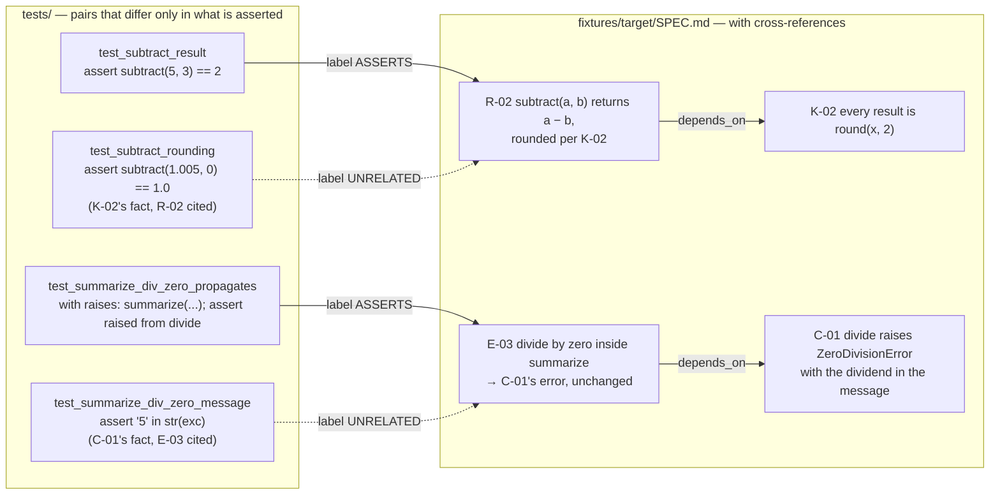

# Proposal — v1.14: tell the judge which obligation it is judging — the related ids on the request, and a fixture that can catch an off-topic `ASSERTS`

> - **Status:** proposal, 2026-09-19; for `spec-writing` to turn into `SPEC.md` v1.15 rows after the requester settles D-28 below. **Requires v1.13 Part A** (C-12: the `depends_on` edges) — if v1.13 is not adopted, C-12's edge extraction is the one part this proposal needs carried over. Renumbered 2026-09-20: this proposal's own D-26 and E-56 collided with the real, confirmed D-26 and E-56 that `PROPOSAL_v1.15_declared_vs_incidental_citations.md` landed in `SPEC.md` v1.14 first — exactly the case that proposal's front matter flagged ("renumber whichever lands second"). This proposal's decision is now D-28 and its edge case E-57; R-38, reserved for it, is unaffected.
> - **Applies to:** `SPEC.md` v1.14 — C-06 (request body), C-10 (instruction text), T-49/T-76 (golden fixture and labels), D-08; `judge_mock.py` unchanged in behaviour.
> - **Notation:** unprefixed ids are speccheck's own; `mcpi:I-002` is the Monte Carlo π spec's.
> - **Evidence:** the v1.9 proposal's §1 (the gist failure and its per-model numbers); the v1.13 measurement (134 of 203 live ids name another id in their statement; 186 `depends_on` edges); the transcript `docs/research/ontological_spec_database.md` §8 (Level 6, *"implementation actually realizes the intended behavior"*) and §9 (an obligation carries its subject, condition, scope, and evidence, not only its text).

## 1. The problem

The judge answers one question per edge: *does any assertion in this test check any clause of this statement?*
(C-10). Since v1.9 the answer is grounded on both sides — evidence lines inside the test, a clause quoted from the
statement (K-15) — so a verdict cannot point outside either. What it still cannot see is the **neighbourhood** of
the statement: which other ids the statement leans on, and therefore which assertions are *somebody else's*.

That matters because speccheck's specs are written in the style §1 of v1.13 measured — 134 of 203 live ids name
another id, and the naming is the obligation: R-01 is *"per the grammar in C-01"*, E-52 is *"exits `2` per E-09"*,
R-34's clause rule is *"(K-15, E-48)"*. A test that cites R-01 and asserts three facts about C-01's grammar is doing
R-01's work only if it also asserts that the extractor *applies* it; a test that cites E-52 and asserts E-09's
message is asserting the wrong edge case. Today both are `ASSERTS` — the assertion is real, the clause is locatable
(*"per the grammar in C-01"* is twelve characters and then some), and the judge has no way to know that the
expected value it matched belongs to a neighbour. The v1.9 data has the mirror case on record: `mdv:E-19` (reload
while text is selected — the test never selects text) was a real gap the stricter model found; the generous one
credited an assertion about reloading. With the neighbour named, *"is this assertion about E-19 or about the reload
contract E-19 refers to?"* is a question the prompt can ask.

The fixture cannot see this either. T-76's twenty-one labeled edges contain two `UNRELATED` — a version-string
test citing K-02, and a test of `add` citing C-04 — and both are unrelated by construction: nothing in K-02 or C-04
names the id whose fact they assert. No labeled edge is the adjacent case: a test asserting a true fact about an id
the statement *names* — and C-04's body names K-02 three times, so the adjacent test (`round(sum, 2)` asserted on
`subtract`, C-04 cited) is one line away from a fixture that already exists. So the failure is invisible to T-49 exactly as the long-body failure was before v1.9 Part A.

## 2. The change

Two parts, in v1.9's shape: the fixture first, so the failure is measurable; then the request.

**Part A — adjacent tests in the golden fixture (T-76, T-49).** `fixtures/target/SPEC.md` gains explicit
cross-references where its rows are silent today (R-02 *"… rounded per K-02"*; C-04 rule 2 already names K-02; E-02
*"… the empty list of C-02"*; a new E-03 *"`divide` by zero inside `summarize` → C-01's error, unchanged"*), so that
the fixture has at least six `depends_on` edges under C-12. `tests/` gains **eight adjacent tests**: each cites id
X, exercises X's code, and asserts *only* a fact about an id Y that X's statement names — `round(x, 2)` while citing
R-02; C-01's `ZeroDivisionError` message while citing E-03; C-02's non-mutation while citing E-02 — and
`judge_labels.json` labels every one `UNRELATED`. Each is paired with a genuine test of X (labeled `ASSERTS`) that
uses the same calls and one more assertion, so the two differ only in what is asserted. The labeled set grows from
21 to at least 37, of which at least eight are adjacent.



*Figure 1 — two of the eight adjacent pairs Part A adds. Each dotted edge is a test whose assertion is true and
whose clause is locatable, and which nonetheless proves nothing about the id it cites. A judge without the
neighbourhood grades all four `ASSERTS`; with it, the question *"is this assertion about R-02 or about K-02?"* has
an answer the prompt can require.*

**Part B — the neighbourhood on the request (C-06, C-10).** The user message of the judge request (C-06) gains one
field:

```text
related - the ids this statement names and the ids whose statements name it (C-12 depends_on edges, both
          directions, R/C/I/K/E only), each as {"id", "title"}: the C-02 title, whitespace-collapsed, tail-truncated
          to 160 characters; C-07 order; at most 8, the statement's own references first (D-28); [] when none.
```

and C-10 gains one rule and one definition:

> *related* — other obligations of the same specification that this statement refers to, or that refer to it. They
> are context, not the statement: **`clause` must be quoted from `statement`, never from a related title**, and an
> assertion whose expected value or condition corresponds to a related id's obligation and to no clause of this
> statement is not evidence for this id — answer `UNRELATED` if the test exercises nothing of this statement,
> `EXECUTES_ONLY` if it runs this statement's behaviour and asserts only the related fact.

Nothing else moves. The reply object is unchanged (`{verdict, clause, evidence, rationale}`), so C-07 and the
Markdown report are byte-identical for the same verdicts and `schema_version` stays at v1.13's `"1.4"`. K-15 already
forbids a clause drawn from outside the statement, so the *"never from a related title"* rule is enforced by the
kernel, not trusted to the model — a verdict that quotes a neighbour's title is `UNKNOWN`, `judge: unlocated clause`
(E-48), today. The mock judge ignores `related` (R-16, R-22: it reads no statement semantics). I-004 (downgrade
only), I-010 (one call per eligible edge), K-06 (one request, no retry) are untouched; input grows by roughly 50–300
tokens per edge.

Proposed rows, drafted for `spec-writing`:

| Family | Draft |
| --- | --- |
| R-38 | For every judged edge the checker MUST send the judge, with the statement, the titles of the obligations the statement names and of those that name it (C-12 `depends_on`, both directions), so that the judge can distinguish an assertion about this obligation from an assertion about a neighbour it refers to; the instruction text MUST define that an assertion corresponding only to a related obligation is not evidence for this one (C-10). Source: §1. |
| C-06 | The user-message JSON object gains `related` after `statement`: `[{"id", "title"}]` per Part B — C-07 order, the statement's own references before its dependents, at most 8, titles whitespace-collapsed and tail-truncated to 160 characters with `…`; `[]` when the id has no `depends_on` edge. The request is otherwise unchanged; K-09 formatting applies. |
| C-10 | The definition of `related` and the rule of Part B, inserted after the field list and before *Rules*; the question sentence unchanged. New `judge_prompt_sha256`. |
| T-83 | Request construction: an id naming three ids and named by seven yields eight `related` entries, its own three first, then dependents in C-07 order, the ninth dropped; a 200-character title is cut to 160 with `…`; an id with no edges sends `[]`; a T id is never in `related`; the mock judge's verdicts on the golden fixture are byte-identical to v1.13's (R-16). |
| T-84 *(recorded)* | **The adjacent subset.** Over the eight adjacent edges of Part A, in each of three runs, at least six are `UNRELATED` or `EXECUTES_ONLY` with the v1.14 text; **the same figure with the v1.13 text** (`related` omitted, prior prompt) is recorded beside it from the same three runs of the same model on the same day — the proposal's claim is the difference, and a model that already downgrades six of eight without `related` makes Part B a no-op for that model, which the row should say. |
| T-76 | The fixture's cross-references and the eight adjacent pairs of Part A; `judge_labels.json` ≥ 37 entries, ≥ 8 labeled `UNRELATED` on adjacent edges; T-46 goldens regenerated (new tests, new edges; statuses of existing ids unchanged). |
| T-49 | Unchanged bar (≥ 0.90 accuracy, ≤ 0.10 unknown, each of three runs) over the enlarged set; the recorded figures name the v1.14 `judge_prompt_sha256`. Note the bar now tolerates three misses on 37 edges, and all eight adjacent edges wrong would still pass T-49 — that is why T-84 exists. |
| D-08 | Re-run with the models of the v1.9 row; the row records T-49 and T-84 for each, so the *related* rule's effect per model is on file. |
| E-57 | `related` construction when C-12 records an edge to a retired id: the retired id is included with its title and `(retired)` appended, since a test asserting the retired behaviour is the case worth flagging. |

## 3. What it costs

- **Input tokens.** Up to eight titles per edge, ≤ 160 characters each — 50–300 tokens; on the mdv tree's 440 edges
  under 150 k tokens, cents. Output unchanged.
- **A new prompt hash**, three fresh T-49 runs, six T-84 runs (three per prompt text) per model in the D-08 row,
  goldens regenerated for the fixture's new tests, `_selfcheck/` synced. No schema bump.
- **`unknown_rate` may rise slightly** if a model quotes a related title as `clause`; K-15 turns that into `UNKNOWN`,
  which is the right failure and the one R-28 already gates.
- **A dependency on v1.13 Part A.** The `related` list is C-12's edges read back; without them it is `[]` and
  v1.14 is the fixture and a prompt paragraph the model cannot act on.
- **Part A alone** changes no behaviour and is worth doing even if Part B is rejected: it is the only way T-49 can see
  an off-topic `ASSERTS`.

## 4. Alternatives considered

| Alternative | Why not |
| --- | --- |
| Send the related ids' full statements, not titles | C-06's body can be 16 kB (K-14) and a C names eight ids; the request would carry the spec. Titles are one line each and the point is *which* neighbour, not its body — the judge is not asked to judge the neighbour. |
| Send only the statement's own references (not its dependents) | An id's dependents are what a test *might* be asserting instead — E-52's "per E-09" points one way, but a test citing E-09 that asserts E-52's message is the same error in the other direction. Both, capped, is the recommendation; the cap and order are D-28. |
| Ask the judge for a second field, `about`, naming the id the assertion actually checks | A useful diagnostic, but a new reply field means a schema bump and a new coercion rule for every provider; the verdict already carries the answer (`UNRELATED`) and the rationale can name the neighbour. Revisit if T-84's rationales turn out not to. |
| Wait for the census (PROPOSAL_obligation_census) and send `scope` and `check` too | Those fields do not exist until the census says they should, and this change is independent of them: the neighbourhood is in every spec today. If rule 1 or 2 fires, `scope` and `check` join `related` on the request in a later version, with the same fixture pattern. |
| Change the C-05 rule so `UNRELATED` on every edge makes an id `UNTESTED` | Out of scope and a different proposal: C-05 step 5 says a `PASSING` id with only downgraded edges is `WEAKLY_PASSING`, and that is the correct, gate-visible outcome for an id whose only tests are adjacent. |

## 5. Decision for the requester (D-28, `confirm`)

**`related` carries both directions, the statement's own references first, capped at eight** (recommended: it is
the neighbourhood a reader of §11 would consult, and eight titles is a paragraph) — versus **own references only,
uncapped** (smaller requests on heavily-depended-on ids like C-01 and C-07, which have dozens of dependents; misses
the reverse case above). Part A stands in both branches.

## 6. What the change does not do

It does not make the judge deterministic, and it does not change what a verdict can do: `ASSERTS` still requires an
assertion and a located clause, and a downgrade still makes an id `WEAKLY_PASSING` only when every passed edge is
downgraded (C-05). It does not send the judge any semantics beyond titles — no scope, no expression, no metric —
because the spec has no such fields yet; the obligation census is the proposal that decides whether it should. It
does not ask the judge whether the *implementation* realizes the obligation (the transcript's Level 6 in full):
that question needs the source under test, not the test, and is a different tool. And it leaves T-49's bar alone
on purpose — T-84 is the row that measures this change, and it is recorded, not gating, until three runs on two
models say the difference is real.

## 7. Interaction with `--jev-pre-triage` (added by v1.15 / `PROPOSAL_v1.16_jev_pre_triage.md`; appended 2026-09-20)

This proposal predates v1.15. Nothing in it conflicts with the pending proposal — the spec deliberately routed Jev's ids around this proposal's `D-28`, `E-57`, `R-38` (`SPEC.md` §12 holds them; v1.15 took `D-29..D-32` / `E-58..E-59` *around* them, and left C-06/C-10 alone). But v1.15 introduced one coupling §1–§6 did not have to weigh, because at the time the judge had a single call per edge.

**The coupling.** K-16 builds each triage task from *the C-06 request object itself*: C-17's `state` is "built from the C-06 request object for this edge — `{id, statement, declared, file, start, end, source}`" (`SPEC` §C-16/§C-17, today lines 648/1150/1310). When Part B lands `related` after `statement` (C-06's row in §2), that field is *inside* the object Jev already consumes, so it rides into the triage render automatically. Triage and the real judge read the same request object; the triage answer is then discarded (I-015). Four consequences — one decision, three notes:

1. **§3's per-edge cost is now a per-edge pair.** §3 reads "50–300 tokens per edge" — one pass. Under `--jev-pre-triage`, Jev issues one C-17 request per judge-eligible edge (K-16) *and* the real judge its own call (I-010), so `related` is sent on up to two passes: on the mdv 440-edge tree that is ~300 k tokens of judge-stage input instead of ~150 k. Still cents, now twice — restated in §3's first bullet on landing.

2. **D-28b (extension of D-28, `confirm`) — is `related` in the triage `state`?** `D-33..D-36` are `PROPOSAL_v1.17`'s and `D-29..D-32` are Jev's, so this is numbered under D-28 and takes a fresh top-level number only when the proposal lands.
   - **Include `related` (recommended).** Triage ranks edges by Jev's confidence in the *real* C-06 verdict; a triage `state` missing a field the real judge is given makes Jev a strictly weaker proxy for "least-sure-about", and the cost is only the extra tokens — already cents in §1 of `PROPOSAL_v1.16`. This is also the default under K-16's current wording (`state` *is* the C-06 object).
   - **Strip `related` from the triage `state` only** (rank the bare `{id, statement, declared, …}`; the real judge still gets it): a defensible token saving, but only on evidence that triage ranking is insensitive to the neighbourhood. Until a T-89 run shows that, include.
   Either branch leaves Part B (D-28, the real judge) unchanged; the decision is triage-side only.

3. **T-89 is the witness for D-28b.** T-89 currently pins the stub "carrying `state` equal to C-17's template … none carrying `clause` or `evidence`" over `{id, statement, declared, file, start, end, source}`. On landing: *include* → add `related` to that expectation (in C-06 order, after `statement`), keeping the "no `clause` / no `evidence`" assertion (those stay judge-side only); *strip* → assert `related` is *absent* from the triage `state`. T-89 thus tests whichever D-28b is taken.

4. **T-84 must be run with unlimited issue.** T-84's fixed eight-edge adjacent sample assumes all eight are judged; under a tight `--judge-budget N%`, K-12's truncation (K-16) issues only `⌈N/100 × 8⌉` of the eight, so "six of eight downgraded" would be measured over a set the truncation already decided, not the sample the proposal claims. Add "measured with no `--judge-budget` (or `0`/unlimited)" to T-84's precondition on landing.

**Staleness on landing (this proposal predates v1.14 *and* v1.15).** The body still reads "turn into `SPEC.md` v1.15 rows" (§Status) and "`schema_version` stays at v1.13's `1.4`" (§2, Part B). As of v1.15 the next landing is **spec v1.16** and the current schema is **"1.5"** (bumped by v1.14's declared/incidental change, *not* by Jev). Neither `related` nor its triage extension bumps the schema: both are judge-request-side (C-06) and C-10 instruction fields, not `speccheck.json` report fields — exactly as Jev's K-16 left the schema at "1.5". So on landing the only edits are "rows → v1.16" and "1.4 → 1.5"; "no schema bump" stands.

*Net:* §7 is a composition addendum — one decision to confirm (D-28b, recommend *include*), two test notes (T-89, T-84), one cost restatement (§3), and two staleness bumps (spec v1.16, schema "1.5"). It changes no part of §1–§6 and adds no requirement; it records that, when this lands on top of v1.15, `related` also flows into Jev's triage, and corrects the two numbers the intervening versions moved.
