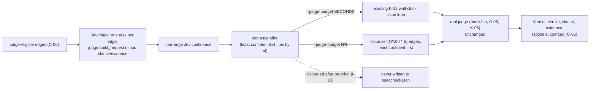

# Proposal — v1.16: `--jev-pre-triage` — spend a truncated judge budget on the edges Jev is least sure about

> - **Status:** proposal, 2026-09-20; for `spec-writing` to turn into `SPEC.md` v1.16 rows after
>   the requester settles D-29..D-32 below. `PROPOSAL_v1.14_obligation_aware_judge.md` is still
>   pending and has already claimed v1.15 (its own Status line, renumbered 2026-09-20); this
>   proposal is numbered past it, v1.16, per the house "number past whichever is higher" rule.
> - **Applies to:** `SPEC.md` v1.14 — K-12 (amended: `--judge-budget` grows a percentage form),
>   a new K-row (`--jev-pre-triage`), a new C-row (the Jev provider's own env-var contract,
>   mirroring C-09's shape), a new I-row (Jev stays advisory), two new E-rows, three new T-rows.
>   Independent of `PROPOSAL_v1.14_obligation_aware_judge.md`: that proposal changes what C-06's
>   request body tells the judge about a statement's neighboring obligations; this proposal
>   changes nothing about the request body — only which edges get issued to the real judge, and
>   in what order. Neither needs the other; both could land, in either order.
> - **Notation:** unprefixed ids are speccheck's own.
> - **Evidence:** a real `check --judge llm --strict` self-check run against this repository's
>   own `SPEC.md` v1.14 with `openai/gpt-4o-mini` (`build/speccheck-llm-gpt-40-mini-stict/`,
>   2026-09-20), cross-checked edge-by-edge against Jev (`typesafe/jev-1.13`) the same way
>   `JUDGE_CROSSCHECK_REPORT.md` already does, this run's own artifacts at
>   `build/census/crosscheck-v1.14/{crosscheck_tasks,crosscheck_results,crosscheck_report}`.
>   656 judge-eligible edges, 582 the real judge committed to (excludes recorded `UNKNOWN`).
>   Figures in §1.

## 1. The problem

`--judge-budget SECONDS` (K-12) already exists and already truncates a `--judge llm` run: past
the deadline, every edge not yet *issued* becomes `UNKNOWN` with rationale `"judge: budget"`,
`coerced: true` (T-61). But which edges get issued before the deadline is an accident of
iteration order (declaration order, today) — it has nothing to do with which edges actually
needed the real judge's opinion. A truncated run today spends its budget on whatever happens to
come first, not on what's hard.

Two things from this session's own measurement, both real and reproducible from the artifacts
above:

**Jev's confidence is a well-calibrated triage signal.** Bucketing all 582 committed edges by
Jev's own top-choice probability and checking agreement against the real judge's recorded
verdict:

| Jev top-probability | Agreement with real judge |
| --- | --- |
| ≥ 0.95 (n=295) | 279/295 = 94.58% |
| 0.80–0.95 (n=79) | 62/79 = 78.48% |
| 0.60–0.80 (n=97) | 53/97 = 54.64% |
| < 0.60 (n=111) | 53/111 = 47.75% |

Monotonic, four buckets, a ~47-point spread top to bottom — this is real signal, not noise. And
it isn't free-riding on a trivial class imbalance: read per-class against the same 582 edges, Jev
recovers 101/167 (60.5%) of the truly `UNRELATED` edges, where `--judge mock` — the only other
triage-free signal already in the kernel — recovers 0/167, because mock is a bare
assertion-token regex that answered `ASSERTS` on all 656 edges of this repository's own
`build/speccheck/speccheck.json` run and structurally cannot ever say `UNRELATED`.

**A meaningful fraction of a budgeted run could be spent on the edges that need it.** At
confidence ≥ 0.95, Jev already covers 338/656 (51.5%) of all judge-eligible edges (or 270/656,
41.2%, at ≥ 0.99) — headroom a fixed-percentage budget could route straight to the "safe" pool
instead of losing it to declaration order:

| Jev confidence threshold | edges at/above it | % of 656 |
| --- | --- | --- |
| ≥ 0.99 | 270 | 41.2% |
| ≥ 0.95 | 338 | 51.5% |
| ≥ 0.90 | 379 | 57.8% |
| ≥ 0.80 | 430 | 65.5% |
| ≥ 0.70 | 485 | 73.9% |

Separately, and not independently verified here (this is the requester's own operational
observation, stated as motivation, not a measured figure in this proposal): a Jev call
(OpenRouter's typed decisions API) costs a small fraction of a real `--judge llm` call against a
model like gemini. `--judge-budget`'s only form today is a wall-clock second count, which gives
no way to plan a *fixed fraction* of a run's real-judge spend in advance — the same `SECONDS`
value covers a different edge count on a slow network than a fast one.

## 2. The change

*Figure: `--jev-pre-triage` reorders which edges reach the unchanged real-judge pipeline; Jev's
own answer is read once, for ordering, and then discarded (I-15).*

**Part A — `--jev-pre-triage` (ordering only, works with today's `SECONDS` form too).** A new
boolean flag, ignored unless `--judge llm`. Before any real-judge request is issued, the kernel
builds one Jev task per judge-eligible edge — reusing `judge.build_request`'s own
statement/line-numbered-source shape (C-06), `clause`/`evidence` omitted, exactly the request
`tools/judge_crosscheck_tasks.py` already builds — and sends it to Jev at
`--judge-concurrency`. Edges are then handed to the existing, completely unchanged real-judge
issue loop (K-05, K-12, C-06) in ascending order of Jev's top-choice probability, ties broken by
ascending id (C-07's ordering convention). A Jev failure on one edge (timeout, non-2xx, or a
reply that doesn't parse as one of C-06's four verdict tokens) does not fail the run: that edge
is treated as least confident (ordered first) and counted in one Note. Jev's verdict,
probabilities, and rationale are read only to compute the order and are discarded immediately
after — never validated against C-06, never written to `speccheck.json`, never the source of a
`Verdict` (I-15) — the same boundary `JUDGE_CROSSCHECK_REPORT.md` §1 already drew for the
offline crosscheck tool, now load-bearing inline. Because it reuses `judge.build_request`
unmodified, the Jev request already carries `declared` (C-15/C-16) for free.

Under `--judge-budget 0` (the default, unlimited), every edge still gets judged eventually, so
Part A changes nothing about the final report — only the order edges are issued in, which is
otherwise only visible in the K-08 progress indicator (D-30 governs whether this combination is
flagged).

**Part B — `--judge-budget N%` (requires Part A).** `--judge-budget` grows a second grammar:
`N%`, integer `0..100`, usable only with `--jev-pre-triage` (else a usage error, exit `2`,
before any request of either kind is issued — E-58). Exactly `ceil(N/100 × E)` of the `E`
judge-eligible edges — the least-confident-first ones Part A ordered — are issued to the real
judge; the rest receive today's exact K-12 disposition (`UNKNOWN`, `"judge: budget"`,
`coerced: true`, one Note). `0%` is legal: a pure Jev-triage dry run, zero real-judge calls.
`100%` is legal and produces the same outcome as `0` (unlimited), by a different code path (an
explicit count instead of a deadline that never arrives).

Proposed rows, drafted for `spec-writing`:

| Family | Draft |
| --- | --- |
| K-12 (amended) | `--judge-budget SECONDS` or `--judge-budget N%` (default `0` = unlimited; `SECONDS` integer `0..86400`; `N%` integer `0..100`, requires `--jev-pre-triage`, else a usage error, exit `2`, E-58). `SECONDS` form (unchanged): bounds the wall-clock spent in the judge stage, measured from the first request issued; the deadline is `start + budget`; a request is *started* when it is issued; no request is issued at or after the deadline; requests in flight at the deadline are allowed to complete (each still bounded by K-05) and their verdicts count. `N%` form: exactly `ceil(N/100 × E)` of the `E` judge-eligible edges are issued, in the new K-row's Jev-ascending-confidence order; the rest are not issued at all, regardless of wall-clock time elapsed. Either form: every edge not issued receives `UNKNOWN` with rationale `judge: budget` and `coerced: true`, and one Note records how many (F-110, Q-010). |
| K-16 | `--jev-pre-triage` (boolean, default off; ignored unless `--judge llm`). Before any real-judge request is issued, build one Jev task per judge-eligible edge via `judge.build_request` (C-06 shape, `clause`/`evidence` omitted) and send it to the C-17 provider at `--judge-concurrency`; order edges ascending by Jev's top-choice probability (ties by ascending id, C-07) before the unchanged real-judge issue loop (K-05, K-12, C-06) begins. A per-edge Jev failure orders that edge first and is counted in one Note (E-59) rather than failing the run. Jev's answer is discarded after ordering (I-15). Under `--judge-budget 0`, ordering has no effect on report content. |
| C-17 | Jev provider configuration, mirroring C-09's shape: `SPECCHECK_JEV_URL` (optional, default OpenRouter's decisions endpoint), `SPECCHECK_JEV_MODEL` (optional, default `~typesafe/jev-latest` — OpenRouter's floating alias, not the pinned `typesafe/jev-1.13` this proposal's own evidence was measured against), `SPECCHECK_JEV_API_KEY` (required with `--jev-pre-triage`; missing is a usage error, exit `2`, never appears in output at any verbosity), `SPECCHECK_JEV_TIMEOUT` (optional, seconds, default 30, integer `1..300`, else exit `2`). Read only when `--jev-pre-triage` is given. |
| I-15 | **Jev stays advisory.** For every edge, regardless of `--jev-pre-triage` or `--judge-budget`'s form, the recorded `Verdict` (`verdict`, `clause`, `evidence`, `rationale`, `coerced`) is produced only by the configured `--judge` provider (`mock` or the C-09 `llm` provider) or an existing C-06 coercion rule. Jev's response is read only to compute K-16's ordering; it is never validated against C-06, never written to `speccheck.json`, and never the source of a `Verdict`. |
| E-58 | `--judge-budget N%` given without `--jev-pre-triage` → usage error, exit `2`, before any request (real or Jev) is issued. |
| E-59 | A Jev request fails (timeout, non-2xx, or an unparseable reply) during `--jev-pre-triage` → that edge is ordered first (K-16); one Note records how many edges this happened to; the run is not aborted and no edge's final `Verdict` is affected beyond its position in the issue order. |
| T-89 | With `--judge-budget 30%` `--jev-pre-triage`, a stub Jev provider returning fixed confidences for 10 edges and a stub real judge, exactly `ceil(0.30 × 10) = 3` edges — the 3 the stub ranks least confident — are issued to the real judge; the other 7 are `UNKNOWN` with rationale `judge: budget`, `coerced: true`; the Note reports 7. With `--judge-budget 100%` all 10 are issued; with `--judge-budget 0%` none are (real-judge call count 0). (K-16, K-12, D-32) |
| T-90 | `--judge-budget 30%` without `--jev-pre-triage` exits `2` with a message naming both flags, before any request of either kind is issued; no API key value (real or Jev) appears in the message. (E-58, K-12) |
| T-91 *(recorded)* | The §1 calibration measurement (Jev top-choice confidence, bucketed, against a real `--judge llm` run's committed verdicts) is re-run against this repository's own current `SPEC.md`/`src`/`tests` for whichever model is configured as the real judge, and the bucket figures are recorded in `SPEC_BUILD_REPORT.md`. Passes (non-gating, like T-49/T-87) when the buckets are monotonically non-increasing; a failure is a lead to re-examine D-30 and D-32, not a build break. (K-16) |

## 3. What it costs

- **Zero cost to any run that doesn't pass `--jev-pre-triage`** — the flag defaults off, K-12's
  `SECONDS` form is unchanged, and nothing about `mock`/`none`/plain `llm` runs changes.
- **No `speccheck.json` schema change, no `schema_version` bump.** I-15 keeps Jev's answer out
  of the report entirely, so this is cheaper on that axis than v1.14's `declared` work.
- **A new required credential** (`SPECCHECK_JEV_API_KEY`, C-17) and a new outbound dependency
  (OpenRouter's decisions API) whenever the flag is used — on top of whatever `--judge llm`
  already requires via C-09.
- **Extra latency**: a full triage pass over every eligible edge before the real judge starts.
  This session's own 656-edge run against this repository (concurrency 8, no `--out`, just the
  three-script pipeline) completed in well under 20 seconds wall-clock — not a formal benchmark,
  but the actual scale this proposal is evidenced against.
- **Dollar cost**: not independently measured in this proposal — the requester's own stated
  reason for wanting this ("a couple of cents for Jev vs a couple of dollars for gemini per
  run"), taken as motivation, not as a verified figure.
- **The default model floats.** `~typesafe/jev-latest` (C-17) means the model actually answering
  triage requests can change under a user who never touched their config — an improving Jev is
  free, but it also means the §1 calibration figures (measured against the pinned
  `typesafe/jev-1.13`) are not a permanent guarantee about what `~typesafe/jev-latest` will do
  next month. T-91 records the bucket figures on every run specifically so drift shows up as
  data, not silence; `SPECCHECK_JEV_MODEL` can still be pinned explicitly by anyone who wants the
  measured behavior held fixed.
- **What is NOT guaranteed**: the calibration curve in §1 is one measurement, one real-judge
  model (`gpt-4o-mini`), one codebase (this repository). It is not shown to hold for a different
  real judge (gemini, deepseek) or a different spec's edge population. T-91 is exactly the
  `*(recorded)*` measurement that watches this over time rather than asserting it permanently;
  if it stops being monotonic for a given judge model, that is evidence against using
  `--jev-pre-triage` with that model, not a spec violation.
- **Part A is worth doing even if Part B is rejected** — it's a strict improvement to how an
  existing `--judge-budget SECONDS` run spends a truncated deadline, with no new grammar and no
  new usage-error surface. Part B (the `%` form) is the one that needs D-29..D-32 settled.

## 4. Alternatives considered

| Alternative | Why not |
| --- | --- |
| Jev's confident answer becomes the final verdict for that edge (skip the real judge entirely) | Measured and rejected: even at Jev's own ≥ 0.95 confidence bucket, 5.4% still disagree with the real judge (§1). Accepting that silently is exactly the ungrounded-gist-grading failure clause-grounding (R-34/K-15/I-005) was built to remove, just moved earlier in the pipeline — and it would need a new, weaker verdict shape to be legal at all, since C-06 requires `clause`/`evidence` that Jev's typed vocabulary cannot produce. |
| Order by `--judge mock`'s agreement instead of Jev's | Measured and rejected: mock answered `ASSERTS` on all 656 of this repository's own edges (`build/speccheck/speccheck.json`), so it has 0% recall on `UNRELATED`/`EXECUTES_ONLY` (§1) — there is no discriminative signal to sort by; mock never disagrees with itself. |
| A fixed sample (random or hash-based) instead of Jev-ranked, for the `%` form | No worse than today's declaration-order truncation, but throws away the ~47-point agreement spread across Jev's confidence buckets (§1) for no benefit — it recovers the "plannable fixed spend" property of Part B alone, without Part A's ordering value. |
| Auto-derive an equivalent `SECONDS` value from a target percentage (estimate avg seconds/edge × N%) | Doesn't fix the actual complaint: the edge *count* covered by a given `SECONDS` value is still nondeterministic across runs with different network/provider latency, which is the reason a count-based form was wanted in the first place. |
| Extend `PROPOSAL_v1.14_obligation_aware_judge.md` instead of writing a new mechanism | That proposal's C-12 `depends_on` edges carry no confidence or agreement signal on the exact edges this proposal targets — it tells the judge about a statement's *neighbors*, not how likely a given edge is to be judged correctly. Empty field for this purpose; genuinely orthogonal. |

## 5. Decisions for the requester (D-29, D-30, D-31, D-32, all `confirm`)

| ID | Statement |
| -- | --------- |
| **D-29** | New dedicated env vars (`SPECCHECK_JEV_*`, C-17) (recommended: matches C-09's existing kernel convention, and lets the Jev credential be rotated or scoped independently of any other OpenRouter use) versus reusing `OPENROUTER_API_KEY` as `tools/jev_client.py` already does (one fewer variable to set, but couples the kernel's own config to a `tools/`-script naming choice and can't be scoped separately). |
| **D-30** | `--jev-pre-triage` with `--judge-budget 0` (unlimited) emits an informational Note (e.g. `"jev-pre-triage had no effect: --judge-budget is unlimited"`) (recommended: this combination pays Jev's latency/dollar cost for zero effect on the report, per §3 — a Note costs nothing and catches a likely mistake, consistent with this project's existing Notes-not-errors style) versus silently proceeding with no complaint. |
| **D-31** | A per-edge Jev failure during triage orders that edge first and records a Note (E-59) (recommended: this session's own `deepseek-v4.1-flash` self-check run hit 110/656 (16.8%) real-provider coercions — 65 timeouts, 42 malformed responses — so treating "Jev couldn't answer" as "assume it needs the real judge" is the safe default for a triage signal that WILL sometimes fail) versus aborting the whole run on the first Jev failure (simpler, but fragile against exactly the kind of provider flakiness this project has already measured in a sibling judge model). |
| **D-32** | `N%` rounds up (`ceil`, matching the requester's own framing) (recommended: guarantees at least one edge gets real judgment for any nonzero percentage — floor would silently zero out the real judge at low percentages on a small edge count, e.g. 1% of 50 floors to 0) versus floor or round-to-nearest. |

## 6. What the change does not do

- It does not make Jev a judge provider. I-15 is the hard boundary: no `Verdict` is ever sourced
  from Jev, no `speccheck.json` field carries its answer, and `--strict`'s grounding requirements
  (R-34, K-15, I-005) are completely unchanged for every edge that *is* issued to the real judge.
- It does not reduce real-judge cost on an unbudgeted run (`--judge-budget 0`) — every edge still
  gets judged; Part A only changes the order, and D-30 is about flagging that this combination
  buys nothing.
- It does not implement the skip-the-real-judge-entirely mode (§4's first row) — deliberately
  out of scope; it would need a new, weaker verdict shape and its own spec change, not a triage
  reorder.
- It does not verify the calibration curve generalizes beyond the one real-judge model and one
  codebase measured in §1 — T-91 is how that gets watched, not a claim that it will hold
  everywhere.
- It does not add a separate `--jev-concurrency` knob — Part A reuses `--judge-concurrency` for
  the Jev pass too, on the assumption the two providers' ideal concurrency don't differ enough to
  matter; left for a follow-up if that assumption breaks in practice.
