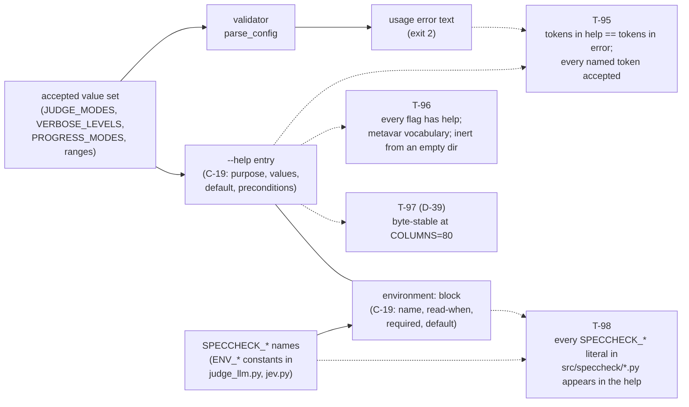

# Proposal — v1.18: the CLI documents its own parameters and environment (`--help` completeness, and help↔source equality contracts)

> - **Status:** proposal, 2026-09-20; for `spec-writing` to turn into `SPEC.md` v1.18 rows after
>   the requester settles D-37, D-38, D-39, D-40, D-41 and D-42 below. v1.18 assumes
>   `PROPOSAL_v1.17_explain_id.md` lands first (it reserved R-40, C-18, I-16, E-60, E-61,
>   T-92..T-94 and D-33..D-36); if this one lands first it *is* v1.17 and `explain_id` becomes
>   v1.18 — renumber whichever lands second. Note also that `SPEC.md` v1.16 is itself uncommitted
>   in the working tree (`git status`: `M SPEC.md`; `speccheck --version` still reports `1.15.0`),
>   so this proposal's base is the working-tree v1.16, not `HEAD`.
> - **Applies to:** `SPEC.md` v1.16 (working tree) — §5.1 (the CLI synopsis and the flag table,
>   21 rows: 19 flags + 2 subcommand rows), §5.4 (exit codes), §5.3 (diagnostics), the C-09 and
>   C-17 environment blocks, and `src/speccheck/cli.py` `build_parser()` (23 argument definitions
>   across the top-level parser and the two subparsers). New rows: R-41, C-19, I-17, T-95, T-96,
>   T-97, T-98. Independent of `PROPOSAL_v1.17_explain_id.md` — neither needs the other, both can
>   land in either order — but they interact: T-96 introspects the parser, so whichever lands
>   second must give its own new flags help text, and `explain`'s flags fall under R-41 the moment
>   they exist.
> - **Notation:** unprefixed ids are speccheck's own. No foreign ids appear in this proposal.
> - **Evidence:** a live introspection of the shipped parser and a live rendering of the shipped
>   help screens — `speccheck check`: **14 flags, 0 with help text**; `speccheck impact`: **9
>   flags, 0 with help text**; top-level: 4 actions, 2 with help (`--self-check`, and the
>   argparse-generated `--version`); `grep -c "choices=" src/speccheck/cli.py` = **0**; the
>   rendered `check --help` is **755 bytes** of names and metavars. Plus six live usage errors
>   (exit `2`, each naming its values), three more naming an environment variable (**8
>   `SPECCHECK_*` variables are read by the kernel — 4 judge (C-09) and 4 Jev (C-17) — and `--help`
>   names none of them**), and one live run proving the README's grammar stale:
>   `impact --spec SPEC.md --changed R-01 --src src/speccheck/cli.py --tests tests/test_07_cli.py
>   --out build/pd` → exit `0`, `1 changed, 2 impacted (depth 1), 17 to re-verify, 0 citations,
>   5 test cases` — a *file* where README lines 199, 203, 213, 214, 277 and 285 say `DIR`.

## 1. The problem

The information exists everywhere except the one surface an operator or an agent reaches for
first. SPEC §5.1's table documents all 19 flags with their values, defaults and exit codes; C-09
and C-17 document the environment variables; README's two tables carry 15 and 4 rows and its
three `export` blocks carry the variables; the kernel's own validators know every accepted value
and say so in their error messages. `--help` says nothing at all — neither about a flag nor about
a variable.

Measured, not inferred — `build_parser()`'s 23 argument definitions, introspected:

```text
speccheck check: 14 flags, 0 with help text
   no help: --spec SPEC   --src SRC   --tests TESTS   --results RESULTS   --root ROOT
             --out OUT    --judge JUDGE   --strict STRICT   --max-unknown MAX_UNKNOWN
             --judge-concurrency JUDGE_CONCURRENCY   --judge-budget JUDGE_BUDGET
             --jev-pre-triage JEV_PRE_TRIAGE   --progress PROGRESS   --verbose LEVEL
speccheck impact: 9 flags, 0 with help text
   no help: --spec SPEC   --changed CHANGED   --against AGAINST   --src SRC   --tests TESTS
             --root ROOT   --out OUT   --depth DEPTH   --verbose LEVEL
speccheck (top): 4 flags, 2 with help text
   no help: --verbose LEVEL, COMMAND
```

What a reader actually gets (verbatim, exit `0`, 755 bytes on stdout, nothing on stderr):

```text
options:
  -h, --help            show this help message and exit
  --spec SPEC
  --src SRC
  ...
  --judge-budget JUDGE_BUDGET
  --jev-pre-triage
  --progress PROGRESS
  --verbose [LEVEL]
```

Three things are missing at once, and they are the three an agent needs in order to *construct* an
invocation rather than discover one by failure:

1. **Values.** `--judge none|mock|llm`, `--progress auto|always|never`, `--verbose INFO|DEBUG`,
   `--max-unknown` a decimal in `[0, 1]`, `--judge-concurrency 1..32`, `--judge-budget
   SECONDS|N%`, `--depth 0..999`. None of these is printed. `choices=` occurs **0 times** in
   `cli.py`, so argparse has nothing to render even for the three flags whose accepted set is
   already a module constant (`JUDGE_MODES`, `VERBOSE_LEVELS`, `PROGRESS_MODES`) — the same
   constants the validators use.
2. **Defaults and preconditions.** `--max-unknown` defaults to `0.2`, `--judge-concurrency` to
   `4`, `--progress` to `auto`, `--depth` to `1`; `--src`/`--tests` default to `src`/`tests` *only
   when the flag is absent* under `check` and have **no** default under `impact`; every judge flag
   is ignored unless `--judge llm`; `--judge-budget N%` is a usage error unless
   `--jev-pre-triage` is also present. The value shape is not even hinted at: metavars are
   argparse dest names (`--src SRC`, `--judge-budget JUDGE_BUDGET`, `--max-unknown MAX_UNKNOWN`),
   where SPEC §5.1's own synopsis already writes `PATHS`, `SECONDS|N%` and `FRACTION`.
3. **The rules that reject a well-formed-looking command.** `--out` must resolve inside `--root`
   (E-09). This proposal's own investigation hit it on its first attempt:

   ```text
   $ speccheck impact --spec SPEC.md --changed R-01 --src src/speccheck/cli.py --out /tmp/pd
   ERROR path outside --root: /tmp/pd          # exit 2
   ```

   Nothing in `--help` says it. The rule lives in SPEC §5.1's `--root`/`--out` rows and README's
   `--root` row, which is a 254 kB and a 49 kB document respectively.

**The only machine-readable statement of a flag's values today is its usage error**, and reaching
it requires guessing wrong first. All of these messages are correct, complete, and post-hoc:

```text
$ speccheck check --spec SPEC.md --judge bogus        → exit 2  ERROR --judge: invalid value 'bogus' (expected none, mock, or llm)
$ speccheck check --spec SPEC.md --progress sometimes → exit 2  ERROR --progress: invalid value 'sometimes' (expected auto, always, or never)
$ speccheck check --spec SPEC.md --verbose TRACE      → exit 2  ERROR --verbose: invalid level 'TRACE' (expected INFO or DEBUG)
$ speccheck check --spec SPEC.md --max-unknown 2      → exit 2  ERROR --max-unknown: invalid value '2' (expected a decimal in [0, 1])
$ speccheck check --spec SPEC.md --judge-concurrency 99 → exit 2  ERROR --judge-concurrency: invalid value '99' (expected an integer 1..32)
$ speccheck check --spec SPEC.md --judge-budget 5%    → exit 2  ERROR --judge-budget N% requires --jev-pre-triage with --judge llm
```

**Drift has already happened on the surface that *is* documented, and nothing in CI noticed.** The
`--src`/`--tests` grammar changed in v1.12 (D-23: a comma-separated list of *files and/or*
directories, `PATHS`), and six README statements still say `DIR` two spec versions later:

```text
199: speccheck check --spec SPEC.md [--src DIR]... [--tests DIR]... [--results junit.xml]
203: speccheck impact ... [--src DIR]... [--tests DIR]...
213: | `--src DIR` | Repeatable. Source roots to scan for citations. Default: `src` if it exists. |
214: | `--tests DIR` | Repeatable. Test roots; ...
277: speccheck impact ... [--src DIR]... [--tests DIR]...
285: | `--src DIR`, `--tests DIR` | Optional here (no directory default): ...
```

Read in full and checked live, that is not a wording quibble: naming a *file* is accepted today
(`impact ... --src src/speccheck/cli.py --tests tests/test_07_cli.py` → exit `0`, 5 test cases
attributed from the single named test file), so README's rows understate the grammar that the
kernel actually implements. The lesson this proposal takes from that: **a fourth prose copy of the
values, with no mechanical tie to the validator, is how you get a third stale one.** Part B and
Part C below exist so the help text cannot rot the way README's rows did.

**The same gap covers the environment, which `--help` never mentions at all.** The kernel reads
eight `SPECCHECK_*` variables, and the census is exact — every name below comes from the module
constants `judge_llm.py`'s and `jev.py`'s `from_env()` check against, not from prose:

| Variable | Read when | Required? | Default |
| --- | --- | --- | --- |
| `SPECCHECK_JUDGE_URL` | `--judge llm` | yes | — |
| `SPECCHECK_JUDGE_MODEL` | `--judge llm` | yes | — |
| `SPECCHECK_JUDGE_API_KEY` | `--judge llm` | yes | — (sent as `Authorization: Bearer`; never printed, R-23) |
| `SPECCHECK_JUDGE_TIMEOUT` | `--judge llm` | no | `30`; integer `1..300`, else exit `2` |
| `SPECCHECK_JEV_API_KEY` | `--jev-pre-triage` **under `--judge llm` only** (K-16) | yes, when it runs | — |
| `SPECCHECK_JEV_URL` | same | no | `https://openrouter.ai/api/alpha/decisions` |
| `SPECCHECK_JEV_MODEL` | same | no | `~typesafe/jev-latest` |
| `SPECCHECK_JEV_TIMEOUT` | same | no | `30`; integer `1..300`, else exit `2` |

None of the eight rows is reachable from the CLI. The only statement of them that the CLI makes is
again post-hoc, and again correct:

```text
$ speccheck check --spec SPEC.md --judge llm                       → exit 2  ERROR --judge llm requires environment variable SPECCHECK_JUDGE_URL
$ speccheck check --spec SPEC.md --judge llm --jev-pre-triage      → exit 2  ERROR --jev-pre-triage requires environment variable SPECCHECK_JEV_API_KEY
  (judge variables set, Jev key unset)
$ SPECCHECK_JUDGE_TIMEOUT=abc speccheck check --spec SPEC.md --judge llm → exit 2  ERROR SPECCHECK_JUDGE_TIMEOUT must be an integer in 1..300
```

Three details in that table are exactly the ones an operator gets wrong, and none of them is
guessable from `--help`: the judge's URL/model/key are **all** required (there is no default
endpoint, unlike Jev's), `TIMEOUT` is the only optional judge variable, and the four `JEV_*`
variables are read **only** when the triage pass actually runs — `--jev-pre-triage` under
`--judge none`/`--judge mock` needs no credential at all (K-16).

Where the environment *is* written down, it has already gone wrong. SPEC C-09's block and C-17's
prose list the variables correctly; README repeats them in three separate `export` blocks (lines
323–326, 407–410, 442–445); `install.sh` writes them into `~/.config/speccheck/judge.env` and
appends a `source` line to a shell rc file. And C-06, two lines below its own correct
`"model": <SPECCHECK_JUDGE_MODEL>` line, says:

```text
The model is selected by a dedicated variable `SPECCHECK_LLMMODEL`.
```

`grep -rn LLMMODEL src/ tools/` → **0 hits**: no code has ever read that name. The spec contradicts
itself inside one code block, and a reader who trusts the sentence sets a variable that does
nothing. Five surfaces state the environment, one of them is wrong, and the surface an agent
actually reads states none of it.

*Checked and rejected as the mechanism:* "the metavars are dest-derived, so the flags are
undiscoverable" is true but only half the story — renaming `SRC` to `PATHS` (Part A's metavar
work) names the *shape* while still stating no accepted value, no default and no precondition. The
metavar is cosmetic on its own; the values clause is the substance. Both are in Part A, and the
metavar alone was not kept as a standalone proposal.

## 2. The change

**Part A — the text.** One help string per argument definition (23 of them: 14 `check`, 9
`impact`, plus the top-level `--verbose`), each carrying purpose, accepted values as literal
tokens, the default where there is one, and every precondition under which the flag is ignored or
rejected. Metavars become the vocabulary SPEC §5.1's synopsis already uses — `PATHS`, `FILE`,
`DIR`, `IDS`, `MODE`, `FRACTION`, `N`, `SECONDS|N%`, `LEVEL` — never the argparse dest name. The
flag entries look like this (drafted against the live table, not invented):

```text
  --judge MODE          judge to use: none (no judge), mock (deterministic assertion-token
                        judge), or llm (model-backed; requires SPECCHECK_JUDGE_*). default: none
  --max-unknown FRACTION
                        unknown_rate ceiling for --strict: a decimal in [0, 1]. default: 0.2;
                        consulted only with --strict --judge llm
  --judge-budget SECONDS|N%
                        judge-stage bound. SECONDS: an integer 0..86400, a wall-clock deadline;
                        N%: an integer 0..100, that share of the judge-eligible edges, least
                        confident first (requires --jev-pre-triage with --judge llm, else exit 2).
                        default: 0 (unlimited); ignored unless --judge llm
  --src PATHS           repeatable; a comma-separated list of files and/or directories, each
                        resolved inside --root. default: src if it exists, and only when the
                        flag is absent
```

**Part B — the equality contract.** The values a flag's help names are *the same tokens that
flag's own usage error names*, so the two renderings of one accepted set cannot disagree. Three
enumerated flags already have the set as a module constant, so their help clause can be built from
the constant the validator itself checks against; the remaining four (`--max-unknown`,
`--judge-concurrency`, `--judge-budget`, `--depth`) are prose held to the equality by T-95. This
is the part that makes the fix survive the next grammar change: it is exactly what README's `DIR`
rows lacked.

**Part C — the guard.** T-95 renders both help screens and compares each flag's value tokens
against its own usage-error text, then feeds every token it names to the parser and requires it to
be accepted (control: `bogus` → exit 2). T-96 introspects the three parsers and requires every
argument definition to carry help, every metavar to come from C-19's vocabulary, and both help
screens to render from an empty directory under the socket guard (R-18) with exit `0`, non-empty
stdout, empty stderr. T-97 (under D-39) pins the rendered bytes at a fixed width. Part C is what
turns Part A from prose into a contract; it is the reason this proposal is a spec change rather
than a README edit.

**Part D — the stale copies that already exist.** The six README statements above become `PATHS`.
Documentation-only, no spec row, ~6 lines: cheap, and directly in scope for "spell out what
parameter values are". Leaving them is defensible (they are not part of the contract), but they
are the evidence that this defect class is real, and they are wrong today.

**Part E — the environment section.** An `environment:` block in the epilog of `check --help` and
`impact --help`, one line per variable, mirroring C-09's own block shape (name, when it is read,
required or optional, default) and nothing else — never a value (R-23, I-007):

```text
environment:
  SPECCHECK_JUDGE_URL, SPECCHECK_JUDGE_MODEL, SPECCHECK_JUDGE_API_KEY
                        required with --judge llm; the endpoint, the model id passed through
                        verbatim, and the bearer key (never printed at any verbosity)
  SPECCHECK_JUDGE_TIMEOUT
                        optional, seconds, integer 1..300, default 30
  SPECCHECK_JEV_API_KEY required with --jev-pre-triage under --judge llm (ignored under
                        --judge none/mock, where no Jev request is made)
  SPECCHECK_JEV_URL, SPECCHECK_JEV_MODEL
                        optional; defaults to https://openrouter.ai/api/alpha/decisions and
                        ~typesafe/jev-latest
  SPECCHECK_JEV_TIMEOUT optional, seconds, integer 1..300, default 30
```

Each flag's own entry keeps its pointer (`requires SPECCHECK_JUDGE_*`, `requires
SPECCHECK_JEV_API_KEY when it runs`), so the section is the complete list and the flag entry is
where a reader already is. Part E is what makes the help answer "what do I have to set?" without
a second document — and, per D-41, it is the one place a variable's *requiredness* and *read
condition* are stated together.

**Part F — the wrong name in C-06.** `SPEC.md` C-06's "The model is selected by a dedicated
variable `SPECCHECK_LLMMODEL`" becomes `SPECCHECK_JUDGE_MODEL`, matching the `"model":
<SPECCHECK_JUDGE_MODEL>` line two lines above it, C-09's block, and `judge_llm.py`'s `ENV_MODEL`.
No new id: it is a wording fix inside an existing contract's prose, and it does not touch
`judge_prompt.md` or any pinned hash (R-26 hashes the instruction text, not C-06's prose). Since
v1.16 is still uncommitted, it can ride in that landing for free — D-42 asks which.



*Parts A, B, C and E: one accepted set and one variable set, each with two renderings and one
comparison — the equality T-95 and T-98 enforce is what README's `DIR` rows and C-06's
`SPECCHECK_LLMMODEL` sentence did not have.*

Proposed rows, drafted for `spec-writing`:

| Family | Draft |
| --- | --- |
| R-41 | The checker MUST document its own interface: for every flag the parser defines on `speccheck`, `speccheck check` and `speccheck impact`, the `--help` output MUST name the flag's purpose, every accepted value as a literal token where the set is finite, the default where the flag has one, and every precondition under which the flag is ignored or rejected — the `--judge-budget N%` precondition (`--jev-pre-triage` with `--judge llm`, E-58), the `--judge llm` precondition of every judge flag, the `--root` containment rule (E-09), and the absence of a directory default for `impact`'s `--src`/`--tests` (C-13) — and MUST name every environment variable the checker reads (C-09, C-17), with the condition under which it is read, whether it is required, and its default where it has one. A flag or variable whose help omits any of these is a defect, and the value tokens a flag's help names MUST be exactly the tokens that flag's own usage-error message names (C-19, T-95); the variable names the help names MUST be exactly the names the kernel reads (T-98). Source: §1. |
| C-19 | Help contract. Each flag's help entry is one paragraph carrying, in this order: (1) purpose, one sentence; (2) values — for a finite set, the tokens in the flag's own usage-error spelling (`none, mock, or llm`; `auto, always, or never`; `INFO`/`DEBUG`; `SECONDS` or `N%`), for a bounded numeric value the range (`a decimal in [0, 1]`, `an integer 1..32`, `an integer 0..999`); (3) default — `default: <value>` for every optional flag that has one, including `check`'s absent-flag-only `src`/`tests` directory default and `impact`'s absence of one; (4) preconditions — an `ignored unless …` / `requires …` clause wherever §5.1's row carries one. The flag's metavar MUST be the value vocabulary of §5.1's synopsis (`PATHS`, `FILE`, `DIR`, `IDS`, `MODE`, `FRACTION`, `N`, `SECONDS\|N%`, `LEVEL`), never the argparse dest name. `check --help` and `impact --help` MUST additionally print, as an epilog, the §5.4 exit-code legend, the §5.1 summary line's shape, and an `environment:` block with one entry per variable the checker reads (C-09, C-17) — the variable name, the condition under which it is read (`required with --judge llm`; `required with --jev-pre-triage under --judge llm, ignored under --judge none/mock`), its requiredness, and its default and accepted range where it has one — and MUST NOT print, at any verbosity, the value of any variable whose name ends in `_API_KEY` (R-23, I-007). Source: §1. |
| I-17 | `--help` is inert: `speccheck --help`, `speccheck check --help` and `speccheck impact --help` exit `0`, write only to stdout, and read no project file, no environment variable and no socket — naming the C-09/C-17 variables in the epilog is printing their names, not reading them — so they behave identically inside a project tree and in an empty directory, and the help text is a pure function of the installed version and the terminal width, which affects line wrapping only (C-19, T-96). Source: §1. |
| T-95 | For every flag whose accepted set is finite (`--judge`, `--progress`, `--verbose`, `--max-unknown`, `--judge-concurrency`, `--judge-budget`, `--depth`), the value tokens and range text named in its `--help` entry equal those named in the message the same flag's own usage error prints (e.g. `check --judge bogus` → `expected none, mock, or llm`, exit `2`), and every token the help names is accepted: a `check` run over the §9.8 fixture carrying that token exits other than `2`, while the control token `bogus` exits `2`. Source: §1. |
| T-96 | Every argument definition of the three parsers except `-h` carries a non-empty help string; each flag's rendered entry names a metavar from C-19's vocabulary and, where the flag has a default, that default; and `speccheck check --help` and `speccheck impact --help`, run from an empty temporary directory with the R-18 socket guard installed, exit `0`, write a non-empty help screen to stdout and nothing to stderr (I-17). Source: §1. |
| T-97 | With `COLUMNS=80` fixed, `speccheck check --help` and `speccheck impact --help` render byte-stable text compared against a checked-in golden under `tests/` (not a §9.8 report golden: C-19's prose is not normative under D-38), so a dropped value token, a dropped default, a new flag without help, or an unintended rewording is a visible diff. Source: §1. |
| T-98 | The `environment:` block names exactly the variables the kernel reads and no others: scanning `src/speccheck/*.py` for string literals matching `SPECCHECK_[A-Z_]+` yields the same set the rendered `check --help` block lists (8 at v1.16 — `SPECCHECK_JUDGE_URL/_MODEL/_API_KEY/_TIMEOUT`, `SPECCHECK_JEV_URL/_MODEL/_API_KEY/_TIMEOUT`), each entry naming its read condition and requiredness; a variable read by the kernel but absent from the block, or named in the block but read by no code, fails the test; and no `_API_KEY` value ever appears in any help screen or usage-error message (R-23, I-007). Source: §1. |

## 3. What it costs

- **No new dependencies.** Standard-library `argparse` only; the change is text, metavars and a
  table of strings in `build_parser()`.
- **Size.** ~23 help strings (~50 lines) plus a C-19 metavar for every flag that takes a value
  (`--spec`, `--src`, `--tests`, `--results`, `--root`, `--out`, `--judge`, `--max-unknown`,
  `--judge-concurrency`, `--judge-budget`, `--progress`, `--changed`, `--against`, `--depth` — 14
  assignments across the two subparsers) in `src/speccheck/cli.py`; Part E is an `environment:`
  epilog of ~12 lines (eight variables, some grouped); Part D is ~6 lines of README; Part F is one
  word in C-06.
- **The environment section is a fifth statement of the variables, and it is checkable.** T-98
  scans `src/speccheck/*.py` for `SPECCHECK_[A-Z_]+` string literals and compares the set with the
  block's, so a variable added to `from_env()` without a help line fails, and so does a help line
  naming a variable no code reads — which is exactly C-06's `SPECCHECK_LLMMODEL` today. The scan
  reads only string literals with the `SPECCHECK_` prefix; it never reads a value, and the help
  never prints one (R-23, I-007: an `_API_KEY` value appears in no screen, no log and no report).
- **Golden churn (T-97, if D-39 confirms it).** Two help screens to update whenever wording
  changes. That is the price of noticing a dropped value token; the alternative is D-39's
  round-trip-only branch, which catches *wrong* help but not *silently reduced* help.
- **Terminal-width sensitivity — a real hazard for the goldens.** argparse wraps to the terminal
  width, so the rendered screen is not a function of the version alone. Measured: `COLUMNS=40` and
  `COLUMNS=200` produce different line breaking for the same build (`--spec\n SPEC` versus
  `--spec SPEC [--src SRC] …` on one line). Any golden MUST pin the width (`COLUMNS=80` in the
  test's environment) or it will flake between CI and a developer's terminal; T-97 states the pin
  explicitly, and I-17 states the wrap-only dependence so the pin is not mistaken for a
  concession.
- **Nothing here depends on a model.** Every part is deterministic — no judge call, no
  `*(recorded)*` test, no prompt text, no token or latency cost. There is no "not guaranteed"
  clause of the kind a judge-facing change carries, because nothing here asks a model to do
  anything.
- **What is NOT guaranteed, stated plainly.** T-95's equality is mechanical only for the tokens
  the four usage errors name, and T-98's is mechanical only for the *names* — it proves every
  variable is listed, not that a listed `required`/`optional`/read-condition is correct. The
  *prose* around them — that `--out` must be inside `--root`, that `impact --src` has no default,
  that the `JEV_*` variables are read only when the triage runs — is checked by the goldens, which
  detect *change*, not *truth*. A future edit could rewrite "requires `--jev-pre-triage`" to
  "requires `--judge llm`", or flip `SPECCHECK_JUDGE_TIMEOUT`'s "optional" to "required", and pass
  every test in this proposal while making the help wrong. The guard against that is the same one
  every other §5.1/C-09 row relies on: the spec table is normative, the help is checked against it
  by review, and T-95/T-98 keep the part that is mechanically checkable mechanically checked.
- **The help becomes a fourth copy of the facts** (SPEC §5.1, README's two tables, the CLI), and
  a further copy of the environment (C-09, C-17, README's three `export` blocks, `install.sh`, and
  now the CLI).
  That is the honest cost, and it is why Part B, Part C and T-98 are not optional in this
  proposal's recommendation: without them the new copies are exactly as reliable as README's six
  stale `DIR` statements and C-06's `SPECCHECK_LLMMODEL` sentence. Parts A and C are worth doing
  even if D-39 drops the goldens and even if D-40 keeps the help strictly per-flag; Part B is
  worth doing even if the wording of every entry changes later; Part E is worth doing even if
  D-41 keeps the block to the eight `SPECCHECK_*` names.

## 4. Alternatives considered

| Alternative | Why not |
| --- | --- |
| **A README-only fix** — leave `--help` bare, document the values better in the README tables | It does not reach the agent that runs `speccheck check --help`, which is the first thing both a human and an agent do with an unfamiliar CLI, and it adds a fifth prose copy with no mechanical tie to the validator. The evidence that this decays is already in the repository: README's `--src DIR` rows are two spec versions stale and CI is silent about it (§1). |
| **Metavar rename only** — `--src PATHS`, `--judge-budget SECONDS\|N%`, `--max-unknown FRACTION`, no help strings | Cheapest visible improvement, and it does fix the "the value shape is not even hinted at" half of §1, but it names no accepted value, no default and no precondition — an agent still cannot construct `--judge llm --progress always` from it, and still cannot learn that `--judge-budget 5%` needs its companion `--jev-pre-triage` flag. Kept as Part A's cosmetic component, rejected as the whole fix. |
| **A structured surface instead** — `speccheck check --help-json` (or `--dump-schema`) emitting `{flag, metavar, values[], default, requires[]}` | Strictly more parseable than prose, and the only alternative that would make agent consumption exact rather than regex-scraped. Rejected as the default because it is a new interface with its own contract, tests and golden, it duplicates every fact the prose help already states (a fifth copy, with no equality rule binding the two renderings), and no evidence in §1 shows an agent failing for want of JSON — the failures are for want of *any* statement of the values. Offered as D-40's third branch for a requester who wants it anyway. |
| **Generate the help from SPEC §5.1's table at build time** | The strongest guarantee of spec parity, and the reason it is not recommended is mechanical, not aesthetic: §5.1's values live in prose table cells (`a float in [0, 1]`, `\`none\` (default), \`mock\`, \`llm\``), not in a structured schema, so this needs a new grammar and a new extractor for the spec's own interface table, a code-generation step in the build, and a kernel that parses its own spec in order to describe itself. T-95 gets the same guarantee for the tokens that matter, from the validator's own output, at ~20 lines of test. |
| **Extend `PROPOSAL_v1.17_explain_id.md` instead of writing this one** | It is the natural neighbour — it adds a third subcommand whose flags will need help text — but its §2 table carries no row about help: R-40 (the subcommand), C-18 (its stdout), I-16, E-60/E-61, T-92..T-94. Folding this in would mean the help contract lands only when `explain` lands, and `check`'s 14 and `impact`'s 9 flag definitions stay bare until then, for no gain. The two are independent and both can land; the interaction is named in the `Status` line: T-96 introspects the parser, so `explain`'s flags must carry help the moment they exist, whichever proposal lands second. |
| **Pin the exact help strings in `SPEC.md`** | Every wording improvement would become a spec revision plus a version bump plus a golden update, and the spec would carry ~50 lines of CLI prose that duplicate §5.1's table. Rejected as D-38's non-recommended branch; C-19 pins the *content* and the metavar vocabulary instead, and T-97 pins the bytes in `tests/`, where a wording change is a test diff rather than a spec change. |
| **Environment variables: a per-flag mention only** — `--judge llm (requires SPECCHECK_JUDGE_*)` in the flag entry, no `environment:` block | Smallest change, and it does connect the flag to the fact that something must be set. Rejected as the default because it never states the *set*: an operator still cannot learn from the help that there are four judge variables, which of them are optional, what `SPECCHECK_JUDGE_TIMEOUT`'s range is, or that the `JEV_*` variables are read only when the triage runs — the four facts §1 shows the error messages withholding until you fail. Kept as the flag entries' pointer text inside Part E. |
| **Environment variables: document them in README only** (they already are, in three `export` blocks) | This is the status quo that produced §1's second half: three prose blocks plus `install.sh`, none of them reachable from the CLI, and a spec sentence (`SPECCHECK_LLMMODEL`) contradicting them all. Documentation that lives only where the CLI cannot be asked about it is what an agent skips. |
| **A preflight instead of documentation** — `speccheck check --judge llm --check-env` (or a `--doctor` subcommand) that reports which variables are set, missing, or malformed without printing values | Goes strictly further than documentation: it answers the question against the *actual* environment rather than a description of it, and it would catch the `SPECCHECK_LLMMODEL` class of mistake at the moment it matters. Rejected here because it is a new behavior and a new interface (its own contract, exit-code question, and test surface), while the ask is for the help to state the parameters; it is the natural follow-up proposal if D-41 shows the prose block is not enough in practice. |

## 5. Decision(s) for the requester (D-37, D-38, D-39, D-40, D-41, D-42, all `confirm`)

| ID | Statement |
| -- | --------- |
| **D-37** | the full entry — purpose, values, default, preconditions (R-41/C-19 as drafted) (recommended: the preconditions are the half of §1 that actually rejects well-formed commands, `--judge-budget 5%` → exit 2 and `--out` outside `--root` → exit 2, and they cost one clause each) versus **values and default only** (a shorter screen, but it leaves the exact failures in §1 undocumented) versus **values only** (the literal ask, minimal churn, and the help still cannot be used to construct a judge invocation). |
| **D-38** | content-required, wording free — the spec pins *what* each entry must carry and the metavar vocabulary, exact strings are not normative (recommended: the help can be improved or tightened without a spec revision, and T-97's golden in `tests/` still makes every change visible) versus **exact strings normative** — `SPEC.md` carries the rendered help verbatim, so any wording edit is a spec change and a version bump (maximum stability for consumers that parse the help, at the cost of a spec revision per typo). |
| **D-39** | round-trip equality **plus** width-pinned goldens — T-95, T-96, T-97 (recommended: T-95 proves the values are *true*, T-97 notices a *dropped* value token, a dropped default or an unintended rewording, which T-95's token comparison alone cannot) versus **round-trip equality only** — T-95 and T-96, no golden files (no churn on wording changes; a silently reduced help entry then passes every test as long as the remaining tokens are still correct). |
| **D-40** | per-flag help **plus** an exit-code and summary-line epilog on `check --help`/`impact --help` (recommended: exit codes are the second thing an agent must know — `0`/`1` are conformance, `2` usage, `3` input contract — and they are currently printed nowhere the CLI can be asked about; the epilog is ~4 lines, and §5.4 is a stable K-01-pinned set) versus **strictly per-flag help**, no epilog (smallest surface, no fourth copy of §5.4) versus **per-flag help plus a machine-readable `--help-json`** (exact for a parsing agent, but a new interface, a new contract, and a second rendering of the same facts to keep equal). |
| **D-41** | the `environment:` block carries the eight `SPECCHECK_*` names with read condition, requiredness and default, and **one extra clause for `COLUMNS`** — the one environment variable that changes the help's own output, and the one T-97's golden pins (recommended: it is the only variable that affects a `--help` run, and stating it turns T-97's fixed width from an unexplained test detail into documented behavior) versus **the eight `SPECCHECK_*` names only** (a strictly kernel-facing block; `COLUMNS` stays undocumented and T-97's pin unexplained) versus **also documenting `install.sh`'s `~/.config/speccheck/judge.env` and the shell-rc `source` line** (helpful for a first-time installer, but that file is the installer's shell convenience — no kernel code reads it — so the CLI would be documenting a script that is not part of its own contract). |
| **D-42** | fix C-06's `SPECCHECK_LLMMODEL` → `SPECCHECK_JUDGE_MODEL` **now, in the uncommitted v1.16 landing** (recommended: `SPEC.md` v1.16 is already modified in the working tree, the fix is one word, it contradicts C-06's own request block two lines above it, and no code has ever read the name) versus **ride along in v1.18 with this proposal's rows** (keeps this proposal's spec diff to the CLI, but leaves a wrong variable name in the spec for as long as v1.17 takes to land) versus **leave it** (the name stays wrong; T-98 still passes, because T-98 checks the help against the code, not the spec's prose). |

## 6. What the change does not do

- **It changes no accepted value, no default and no exit code.** Every flag accepts exactly what it
  accepts today; R-41 and C-19 add documentation and a check that the documentation is true, and
  I-17 states the help's inertness rather than changing it. A run that works today works
  identically after this proposal, byte for byte in both report files.
- **It does not make `--help` normative for behavior.** The kernel's validators remain the only
  authority on what is accepted; when the help and the validator ever disagree, T-95 fails and the
  validator is right (C-19's equality is a one-way guarantee: the help must match the validator,
  never the reverse).
- **It does not fix the README beyond Part D's six `DIR` statements.** README's prose sections
  (the v1.15 `--judge-budget` discussion, the progress-indicator section, the `--self-check`
  paragraph) are untouched, and nothing keeps *them* in step with §5.1 — the help↔validator
  equality this proposal introduces has no README counterpart. If Part D is rejected, the six
  stale statements stay stale, and that is a deliberate, stated choice rather than an oversight.
- **It does not add a preflight.** There is no `--check-env`/`--doctor` and no new behavior of any
  kind: the help *describes* the environment, it does not inspect it, report which variables are
  set, or validate them before a run. A missing or malformed variable is still discovered exactly
  as it is today — exit `2` at parse time, naming the variable (§1's three messages) — with the
  one addition that `--help` now states the requirement before you try.
- **It does not change when variables are read.** K-16's lazy read is untouched: the four `JEV_*`
  variables are read only when the triage pass actually runs, so `--jev-pre-triage` under
  `--judge none`/`--judge mock` still needs no credential, while `--judge llm` still reads its
  four at parse time. The help documents that asymmetry; it does not remove it.
- **It does not print a value, and it does not touch the redaction rules.** R-23 and I-007 are
  unchanged: the block names variables, never values, and C-19's one new prohibition (no
  `_API_KEY` value in any help screen) restates an existing rule rather than adding one.
- **It does not fix the spec's environment prose beyond Part F.** C-09's block and C-17's sentence
  are correct today and are left as they are; if D-42 takes its third branch, C-06 keeps saying
  `SPECCHECK_LLMMODEL` and the only thing that stays true is the help, which T-98 binds to the
  code rather than to that sentence. `install.sh`'s `~/.config/speccheck/judge.env` is not
  documented by the CLI unless D-41 takes its third branch — no kernel code reads that file; it is
  a shell `source` convenience the installer sets up.
- **It does not make the prose true, only the tokens.** As §3 says: T-95 mechanically binds the
  value tokens to the validator's own error text; the sentences around them (containment, ignored
  unless, the absent-flag-only default) are held by the goldens and by review against §5.1's
  normative table. A reviewer who changes a precondition clause without changing §5.1 can still
  make the help lie about a rule while every test in this proposal passes.
- **It does not add a machine-readable schema.** Unless D-40 takes its third branch, agents read
  the prose help; there is no `--help-json`, no schema artifact, and no guarantee that any given
  agent's parser of the help text will survive a rewording — which is precisely what D-38's
  wording-free branch accepts in exchange for cheap improvements.
- **It does not cover the future `explain` subcommand.** `PROPOSAL_v1.17_explain_id.md`'s flags
  fall under R-41 and T-96 the moment they exist; until that proposal lands, `explain` has no help
  text to fix. If both are confirmed, whichever is implemented second must carry the other's rows
  — noted in the `Status` line, not resolved here.
