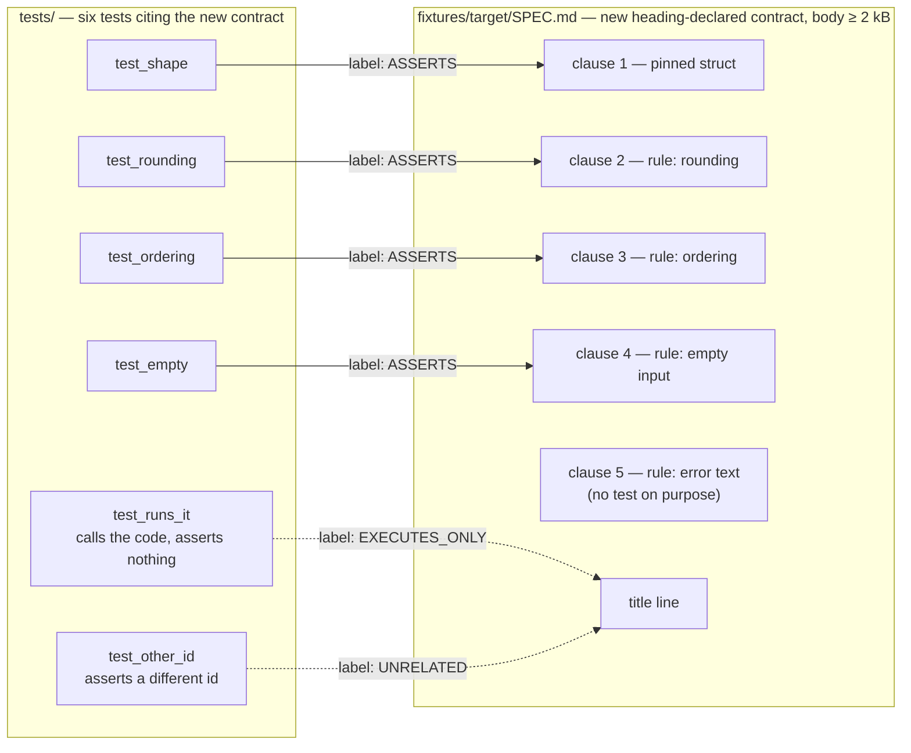
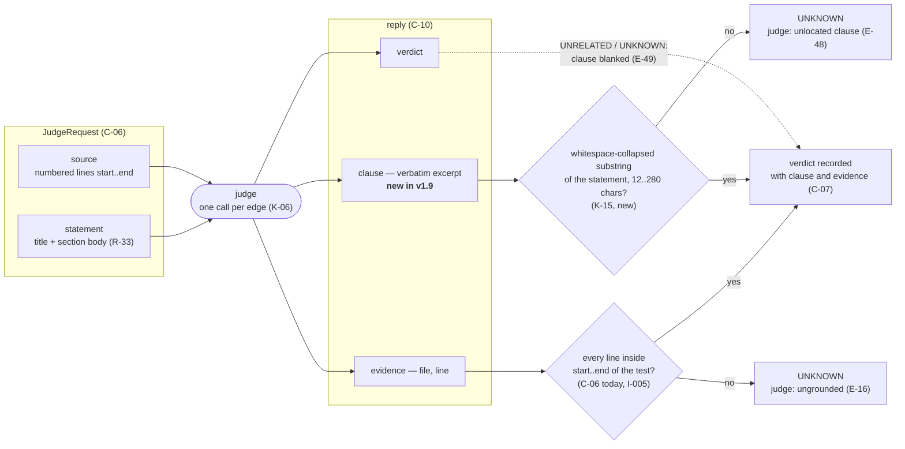

# Proposal — v1.9: ground the verdict on the statement side, and give T-49 a body to judge

> - **Status:** proposal, 2026-09-18; for `spec-writing` to turn into `SPEC.md` v1.9 rows after the requester settles D-21 below
> - **Applies to:** `SPEC.md` v1.8 — C-06 (`Verdict`, kernel validation), C-07 (verdict object), C-08 (§8 Judge details), C-10 (judge instruction text), T-46/T-49 (golden fixture and its labels), D-08
> - **Notation:** unprefixed ids (C-06, T-49, D-08) are speccheck's own. Ids of the project used as evidence are written `mdv:C-06` — a foreign id, in inline code so the PDF cross-reference pass does not link it to speccheck's C-06.
> - **Evidence:** speccheck 1.8.0 (the v1.7/v1.8 build: bodies sent to the judge) run twice with `openai/gpt-4o-mini` over the 440 edges of the mdv `SPEC.md` v0.11.2 tree, and once each with 1.6.0 (title only) and 1.8.0 over the same tree and `junit.xml`; the 1.8.0 self-application (436 edges); six T-49 runs the same day. Per-edge data in that project's `build/speccheck-1.{6,8}-llm*/speccheck.json` and its `SPEC_BUILD_REPORT.md` §3.1.

## 1. The problem

v1.7 fixed the judge's blind spot — a heading-declared contract was judged by its title — and on the mdv tree it
found five defects the title-only judge had waved through (a schema test that checked table existence but not the
pinned columns; a preferences test that never named the contract's keys; two citations of contracts the test did
not touch). It also moved the judge's failure mode. On the same 101 contract edges, same tree, same model:

| | 1.6.0 (title only) | 1.8.0 (title + body) |
| --- | --- | --- |
| `ASSERTS` | 96 | 82 |
| `EXECUTES_ONLY` | 4 | 16 |
| `UNRELATED` | 1 | 3 |

Of the 18 downgrades stable across two 1.8.0 runs, **13 are false negatives**: the test asserts a clause of the
body nearly verbatim. They cluster on the long bodies:

| Body size | Contract edges | False negatives (one reader) |
| --- | ---: | ---: |
| under 2 kB (13 contracts) | 54 | 4 (7 %) |
| 2–11 kB (`mdv:C-17`, `mdv:C-06`, `mdv:C-07`, `mdv:C-18`) | 47 | 9 (19 %) |

Three of them, verbatim from `speccheck.json`:

- **`mdv:C-18`** (11,179 bytes) ← `testBookmarkMenuOrderAndEnablement`, which asserts the seven context-menu items in
  `mdv:C-18.9`'s order, both separators, and every enable/disable rule: *"does not contain any assertions that directly verify the
  behavior described in the statement."*
- **`mdv:C-07`** (4,050 bytes) ← `testCacheKeyedByURL`, which asserts `cacheLimit == 2048` and that one URL is typeset once;
  `mdv:C-07.2` reads *"Cache: 2048 entries keyed by the URL"*: *"executes code related to the caching behavior … but does not
  assert the specific behavior described in the statement."*
- **E-42** (speccheck's own, not mdv's) on its own tree (first Phase B run of the v1.8 build) ← a test asserting E-42's Note and `cases == ()`:
  *"does not assert the specific brace depth conditions required by the statement."*

The rationales share a shape — *does not assert the specific behaviour required by the statement regarding **X*** —
where X is the body's headline topic. The model reads a multi-kilobyte statement, forms a gist, and grades a ten-line
test against the gist. The any-clause rule added in v1.7 is one bullet at the end of the system message; it competes
with the question's own wording, *"does this test case ASSERT **the** observable behavior described by the statement"*,
which reads as singular. Titles produced the mirror error (ASSERTS guessed from `Data structures`): in both regimes
the verdict tracks the *amount* of statement text rather than a located match between one clause and one assertion.

Two consequences. The gate is not at risk — an id is `WEAKLY_PASSING` only when *every* passed edge is downgraded, and
long-bodied contracts have many edges. But §8 of the report, where v1.7's value lives, had ~28 % precision on contract
flags in this run (5 real of 18), and an operator who finds §8 wrong most of the time stops reading it. And T-49 cannot
see any of this: its nine labeled edges include no heading-declared contract with more than one sentence of body, so
all six T-49 runs on 2026-09-18 scored 0.889–1.000 while the same model was mis-judging `mdv:C-18` minutes earlier.

## 2. The change

Two parts. The first makes the failure measurable; the second makes the located match a checkable output, the way
evidence lines already are on the test side (C-06: an `ASSERTS` whose evidence lies outside the span is `UNKNOWN`).

**Part A — a body in the golden fixture (T-46, T-49).** `fixtures/target/SPEC.md` gains one heading-declared
contract with a multi-clause body of at least 2 kB (a pinned struct with field comments and five or six numbered
rules — the shape of a real contract), and `tests/` gains four tests each asserting exactly one of its clauses, one
test that calls the code and asserts nothing about it, and one that asserts a *different* id's behaviour while citing
it. `judge_labels.json` labels them `ASSERTS` ×4, `EXECUTES_ONLY`, `UNRELATED`. The labeled set grows from 9 to at
least 20 edges, so the 0.90 bar tolerates two misses instead of none.

*Figure 1 — Part A's addition to the golden fixture (T-46, T-76); the edge labels are the entries `judge_labels.json`
gains (T-49). Each `ASSERTS` test touches one clause and no other, so a judge that grades against the gist of the body —
the failure §1 documents — mislabels four edges at once and fails the run, while a judge that locates the clause
passes. Clause 5 is deliberately left without a test: it is what the `EXECUTES_ONLY` case must not be credited for.*

**Part B — a grounded clause.** The reply carries the clause it matched; the kernel checks that the clause is in the
statement; a verdict that names no locatable clause is `UNKNOWN`.

*Figure 2 — one edge through the kernel after v1.9. Today the right-hand side has only the evidence check (E-16);
Part B adds its mirror on the statement side (K-15, E-48). A verdict must be grounded in both the test and the
statement before it is recorded; the mock judge satisfies K-15 with the title line, so Phase A is unchanged.*

Proposed rows, drafted for `spec-writing`:

| Family | Draft |
| --- | --- |
| R-34 | For every `ASSERTS` or `EXECUTES_ONLY` verdict the judge MUST name the clause of the statement it judged against, as a verbatim excerpt, and the kernel MUST discard as `UNKNOWN` any such verdict whose excerpt cannot be located in the statement (K-15, E-48) — the statement-side mirror of the evidence-line rule, so that a verdict is grounded on both sides. Source: §1 above. |
| C-06 | `Verdict` gains `clause: str`. Validation, applied to every provider's raw answer: for `ASSERTS` and `EXECUTES_ONLY`, `clause` MUST satisfy K-15, else → `UNKNOWN`, `coerced: true`, rationale `judge: unlocated clause`; for `UNRELATED` and `UNKNOWN` the kernel records `clause` as `""` whatever was returned. Mock provider: `clause` = the first line of the statement (the title), which always satisfies K-15 when the statement is non-empty; an empty statement satisfies K-15 with an empty clause. Wire format: the reply object is `{verdict, clause, evidence, rationale}`. |
| K-15 | `clause` is located when, after collapsing every whitespace run in both strings to one space, it is a case-sensitive substring of the statement and is at least 12 characters long (or the statement itself is shorter than 12 characters and the clause equals it); at most 280 characters, truncated like `rationale`. |
| C-07 | The verdict object gains `"clause"` after `"verdict"`; `schema_version` → `"1.2"`. |
| C-08 | §8 Judge details gains a Clause column (the clause, tail-truncated to 80 characters) between Verdict and Rationale, so a reader sees *which* clause the judge matched without opening the JSON. |
| C-10 | The question is reworded to be clause-first: *"Does any assertion in this test case check any one clause of the statement? A statement may have several clauses (a pinned interface, numbered rules, a table); pick the clause you judge against and quote it verbatim in `clause`. `ASSERTS` when an assertion's expected value or condition corresponds to that clause; `EXECUTES_ONLY` when the test runs code the clause describes and no assertion checks it; `UNRELATED` when no clause is exercised."* The reply format and the field list gain `clause`; the v1.7 any-clause bullet is subsumed and removed. |
| E-48 | `ASSERTS`/`EXECUTES_ONLY` with a missing, paraphrased, or too-short `clause` → `UNKNOWN`, `coerced: true`, `judge: unlocated clause`; counted in `unknown_rate`, so a model that cannot quote shows up in R-28 instead of in silent mis-verdicts. |
| E-49 | `UNRELATED` or `UNKNOWN` returned with a non-empty `clause` → recorded with `clause` `""`; no Note, not coerced. |
| T-75 | Validation: a stub returning `ASSERTS` with a clause that is a verbatim excerpt (with different line breaks and indentation) is accepted; with a paraphrase, an 8-character fragment, or no clause it is `UNKNOWN` with `judge: unlocated clause`; an `UNRELATED` with a clause is recorded with `""`; the mock judge's clause is the title line; JSON key order and the §8 column as pinned; `schema_version` `"1.2"`. |
| T-76 | The golden fixture's long-body contract: its four one-clause tests, the executes-only test and the unrelated test are attributed and labeled as in Part A; T-46 goldens regenerated; `judge_labels.json` has ≥ 20 entries of which ≥ 6 are on a body ≥ 2 kB. |
| T-49 | Unchanged bar (≥ 0.90 accuracy, ≤ 0.10 unknown, each of three runs) over the enlarged label set; the recorded figures name the `judge_prompt_sha256` of the v1.9 text. |
| D-08 | Re-run after v1.9 with `gpt-4o-mini` and at least one stronger model; the D-08 row records both, so the choice between prompt and model is made on T-49 numbers rather than on the anecdotes in §1. |

## 3. What it costs

- **Output tokens.** ~20–60 more per edge for the quoted clause; input unchanged. On the mdv tree (440 edges) that is
  under 30 k tokens — cents.
- **`unknown_rate` may rise** with models that paraphrase instead of quoting. That is the intended signal: a model that
  cannot point at a clause was not judging one. Under `--strict --judge llm` R-28 turns a high rate into exit 1 with the
  reason on the summary line, which is a better failure than 13 wrong §8 rows.
- **A schema bump** (`1.1` → `1.2`), both goldens regenerated (every verdict object gains `clause`), `_selfcheck/` synced,
  a new prompt hash, three fresh T-49 runs.
- **The mock judge stays deterministic** (its clause is the title line), so R-16 and the Phase A gate are unchanged.
- **Part A alone** changes no behaviour and is worth doing even if Part B is rejected: it is the only way T-49 can
  observe the failure this proposal is about.

## 4. Alternatives considered

| Alternative | Why not |
| --- | --- |
| Reword C-10 only (clause-first question, no `clause` field) | Cheaper, and probably helps; but unverifiable — the kernel cannot tell a located match from a gist. Do it *as part of* Part B, not instead. |
| Send the judge only the "relevant" part of the body | The deterministic kernel cannot know which clause a test is about; this is the slice alternative D-20 rejected. |
| Vote across two or three calls per edge | K-06 says exactly one request per edge; voting doubles or triples cost and hides the instability instead of surfacing it. |
| Lower K-14 so bodies are shorter | The 11 kB body is the contract; cutting it re-creates the title problem for the clauses that fall off the end. |
| Switch the default model | The operator's knob already; but T-49 today cannot distinguish models on this failure, so choose after Part A. |
| Fuzzy clause matching (edit distance, token overlap) | Nondeterministic in spirit and arguable at the boundary; whitespace-collapsed verbatim substring is what "quote it" means, and a model that cannot do it is the finding. |

## 5. Decision for the requester (D-21, `confirm`)

**Adopt Part B — the grounded `clause` field with K-15 validation** (recommended: it turns the failure into an
observable and reuses the grounding pattern the spec already has for evidence lines) — versus **Part A plus the
C-10 rewording only** (smaller: no schema bump, no new coercion; the fix rests on prompt wording, and its effect is
visible only through T-49). Part A stands in both branches.

## 6. What the change does not do

It does not make the judge deterministic, and it does not change the gate: an id with one `ASSERTS` edge stays
`PASSING` under either branch, exactly as C-05 step 5 says today. It does not decide which model to run; it makes
that decision measurable. And it does not address the 63 table-row edges the same runs downgraded on the mdv tree (their ids would all be `mdv:` ones) —
those were not read for this proposal, and the long-body pattern above says nothing about one-line statements, where
the v1.7 evidence pointed the other way (generous, not strict).
