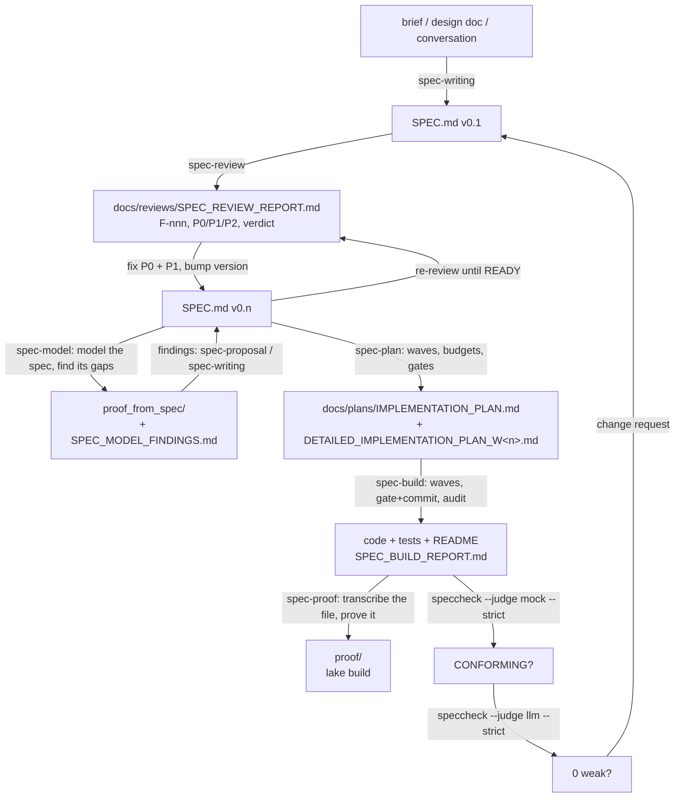

# speccheck — Specification Conformance Checker

Software built by agents is only as trustworthy as the evidence that it does what was specified.
`speccheck` produces that evidence. Given a `SPEC.md` written in a fixed, ID-tagged shape and a
code base with its tests, it reports — for every requirement, contract, invariant, constraint,
edge case, and acceptance test the spec declares — exactly one status, backed by the file and line
that cite it and the test result that proves it. Nothing in the report is a judgment call: it is
computed from `grep`-able citations and a JUnit results file, and two runs over the same inputs
produce byte-identical output. An optional model-backed *judge* can then read each passing test
and downgrade the verdict when the test merely runs the behavior without asserting it; it can
never upgrade anything.

This repository holds the checker itself — which implements its own `SPEC.md` (v1.19, code
1.19.1) in full, and so is the worked example of the method it serves — together with the seven agent skills that
propose, write, review, plan, model, prove, and build from such specs (`skills/`), `spec2pdf.sh` for rendering a spec with
clickable cross-references, and `install.sh` to set all of it up. The README goes from the method
to the tool: what specification engineering is and how a project runs through it, then
installation, usage, the reports it writes, and how to verify the build.

## Specification engineering — the workflow this tool belongs to

`speccheck` is the last, mechanical step of a way of building software in which a written
specification, not a conversation, is the source of truth. The idea:

- An agent that builds from a chat prompt fills every gap with a guess, and the guesses are
  invisible until something breaks. A specification precise enough that **two competent
  implementers would build materially equivalent systems** — and precise enough that a verifier
  can check either one — removes the guessing.
- The specification is written *for* agents: every obligation carries an ID, every ID is
  observable, and every ID is traceable to a test. That makes conformance a thing a machine can
  measure instead of a thing a reviewer asserts.
- The human's job moves up a level: decide what the system must do, ratify the decisions the
  spec-writer took by default, and read the evidence. The agent's job is to write, review, and
  build against the document — and to prove it did.

### What a `SPEC.md` looks like

A spec has a fixed shape so that both agents and tools (this one included) know where to look:

| Section | Holds |
| --- | --- |
| front matter | a blockquote with status/version, stack, sources, scope, normative-language key, and the one *principle* that settles trade-offs |
| §0 Intent | why the system exists, non-goals, the boundaries it draws (deterministic ↔ probabilistic, trusted ↔ untrusted) |
| §1 Actors | who or what initiates and observes behavior |
| §2 Requirements **R-nn** | observable obligations in MUST/SHOULD/MAY language, each citing its source |
| §3 Behavior and state | lifecycle, main flow, durable artifacts — diagrams illustrate, rows are normative |
| §4 Contracts **C-nn** | every externally significant interface or data shape, pinned in a code block |
| §5 Interfaces | the actual surfaces (CLI, API, files) with operations, errors, defaults, and cross-cutting contracts such as diagnostics |
| §6 Invariants **I-nnn** | properties every valid implementation keeps (determinism, no partial writes, no network) |
| §7 Constraints **K-nn** | measurable limits: exit codes, thresholds, sizes, budgets |
| §8 Edge cases **E-nn** | each failure or boundary with the deterministic outcome it must produce |
| §9 Tests **T-nn** | acceptance tests with unambiguous pass conditions, each citing the R/C/I/K/E ids it proves |
| §10 Dependencies | runtime, libraries, environment, how to run the suite |
| §11 Traceability | one row per R/C/I/K/E id → the component that realizes it → the T ids that verify it |
| §12 Decisions **D-nn** | every choice the author took on the human's behalf, its alternatives, and a `confirm`/`open`/`confirmed` status |

Three further families appear around a spec: **O-n** optional items (built, but gated), **F-nnn**
findings from a review, and — in this repository's own `SPEC.md` — **Q-nnn** for findings from a
second, independent reviewer. IDs are never renumbered once cited; an ID is *retired* by striking
it through (`~~R-07~~`), never deleted. Formulas are LaTeX (`$..$`), diagrams are mermaid, and
`spec2pdf.sh` renders the whole thing with clickable cross-references.

### The seven skills

The skills under `skills/` (installed for Claude Code, Pi, or Oh My Pi by `install.sh`) encode the
method. Each is a `SKILL.md` an agent loads on request; none needs this tool to run, and this tool
needs none of them — they share only the `SPEC.md` conventions above.

| Skill | Invoke when you want | Produces |
| --- | --- | --- |
| **spec-proposal** | a scoped, evidence-grounded change to an *existing, already-implemented* `SPEC.md` argued through before anyone edits it — a real defect, metric, or run's output, at least one example read in full, draft rows in the spec's own ID taxonomy, and a decision table for the requester | `PROPOSAL_v<X.Y>_<slug>.md` (or `PROPOSAL_<slug>.md` for a change with no spec version) — the problem from evidence, the change in labeled parts, what it costs, alternatives considered, a `D-nn` decision table, and what it deliberately leaves unfixed |
| **spec-writing** | a `SPEC.md` written from a brief, a design doc, or a conversation; an existing spec updated for a change; or a confirmed `spec-proposal` decision folded into real rows | `SPEC.md`, with §12 listing every defaulted decision, committed in reviewable slices |
| **spec-review** | the spec audited before anything is built: completeness, precision, consistency, implementability, verifiability | `docs/reviews/SPEC_REVIEW_REPORT.md` — findings `F-nnn` with severity, a 0–5 scorecard, a maturity level 0–4, a P0/P1/P2 remediation plan, and a `READY` / `READY WITH MINOR FIXES` / `NOT READY` verdict |
| **spec-plan** | the order the spec gets built in: the shape, the dependency waves and their gates, the slice budgets, the rules that prevent this system's known failure modes, and the one fork to settle first | `docs/plans/IMPLEMENTATION_PLAN.md` — verdict, evidence from prior builds, target shape, wave order with a gate per wave, LOC budget with anchors, failure→rule table, and one fork plus a next action; optionally one `DETAILED_IMPLEMENTATION_PLAN_W<n>.md` per wave (deliverables file-by-file, work items test-first, gate commands, traceability, handoff contract) |
| **spec-build** | the plan executed: the spec implemented test-first, **wave by wave in the plan's order**, each wave gated with its own commands and committed before the next begins, then the README made to match and conformance proven | `docs/plans/IMPLEMENTATION_PLAN.md` plus one `DETAILED_IMPLEMENTATION_PLAN_W<n>.md` per wave (Phase 0 runs `spec-plan` if they do not exist), the code and its §9 suite with one commit per wave, an updated `README.md`, `SPEC_BUILD_REPORT.md` with per-ID evidence and the wave ledger, and the two `speccheck` gate lines |
| **spec-model** | the spec's own formal model, before any code exists: `SPEC.md`'s normative tables transcribed into a pure total Lean function, its self-claims kernel-checked for all inputs, and every place it is silent, over-pinned, or unwitnessed found mechanically and reported as a witness-backed finding | `proof_from_spec/` — a self-contained lake project (`Spec`/`Model`/`Theorems`) whose `lake build` is the gate, plus `docs/reviews/SPEC_MODEL_FINDINGS.md` (`F-nnn`, class G-1/G-2/G-3a, severity, the witness theorem) |
| **spec-proof** | the formal half of a *built* system's conformance evidence: the implementation transcribed into a Lean model and proved against the spec for all inputs, with every out-of-Lean row mapped to the test that carries it | `proof/` — a self-contained lake project (`Spec`/`Model`/`Theorems`) whose `lake build` is the gate, and a README whose first screen states the trust boundary |

`spec-build` runs `speccheck` twice at its gate: first with the deterministic mock judge until every
ID is `PASSING` with no dangling or stale citations, then with an LLM judge, which can only find
tests that *execute* the cited behavior without *asserting* it. Both lines go into the build
report; that is the evidence the human reads.

### How a project goes



In practice it is a handful of prompts to the agent, with the human reading each artifact
between them:

1. **Write.** *"Use the spec-writing skill to write SPEC.md for `<the application>`: `<brief>`."*
   Read §0 (is that the system you meant?) and §12 (those are the decisions it made for you —
   overturn any you disagree with before going further).
2. **Review.** *"Use the spec-review skill to review SPEC.md."* Read the executive summary and the
   remediation plan. The findings are about the *document*, not about you: a spec that reads
   clearly to a person is routinely Level 2 for an agent, because the agent cannot ask.
3. **Apply.** *"Apply all P0 and P1 findings to SPEC.md."* (P2 may be deferred; say which.) The
   agent edits the spec, bumps its version, and records the change in the revision history.
   Re-review until the verdict is `READY` or `READY WITH MINOR FIXES` — usually one more pass.
4. **Model (optional, before any code).** *"Use the spec-model skill to model SPEC.md."* Read the
   scope map and the findings list. `proof_from_spec/` is the spec made total and kernel-checked;
   each finding is a place the spec is silent, pins more than the mechanism allows, or names no
   witness — fix those through `spec-proposal`/`spec-writing` before building on them. (If you
   skip this, `spec-proof` will find them later, against code you have already written.)
5. **Plan.** *"Use the spec-plan skill to plan the implementation of SPEC.md."* Read §1 (the
   verdict and the shape it commits to), §4 (the wave order and each wave's gate) and §7 (the one
   fork it wants you to settle). The plan is what the build agent executes, wave by wave.
6. **Build.** *"Use the spec-build skill to implement SPEC.md."* With the plan in hand it
executes **wave by wave in the plan's order** — test-first through §9, each wave ending at its
own gate and **committed before the next wave starts** — then rewrites the README from what it
built and audits every artifact against the spec.
7. **Prove.** *"Use the spec-proof skill to prove the spec."* The implementation's module-level
   contract, kernel-checked for all inputs, with every row Lean cannot reach mapped to the test
   that carries it — the formal half beside the `speccheck` gate's empirical half.
8. **Change.** New requirement? *"Use spec-writing to update SPEC.md: `<the change>`."* — then
   steps 2–7 again. The spec stays the source of truth; the code follows it.

This repository is its own worked example, and the last cycle is in the git history: the
progress indicator you see under `--judge llm` was requested as one sentence, written into
`SPEC.md` v1.3 (R-30, C-11, K-13, E-39, E-40, D-15), reviewed (ten findings, six of them at the
seams with older contracts), folded back as v1.4, and built — where the LLM judge caught five
tests that proved their IDs only by implication and the tests, not the code, were strengthened.

## Installation

`install.sh` sets up everything a user of the toolkit needs, per-user and idempotently:

```bash
./install.sh                    # skills for Claude Code + Pi + Oh My Pi, spec2pdf.sh + its deps, the speccheck CLI, the Lean toolchain
./install.sh -i                 # guided: asks each choice with defaults (detected agents, local Ollama models, your shell rc), shows the plan, confirms
./install.sh --skills --link    # only the skills, symlinked into this checkout so `git pull` updates them
./install.sh --agents claude    # pick agents: claude, pi, omp, agents (~/.agents/skills, read by Pi and OMP)
./install.sh --spec2pdf --no-deps
./install.sh --uninstall        # removes what it installed; dependencies stay
./install.sh --dry-run          # show the plan
```

| What | Where |
| --- | --- |
| skills | `~/.claude/skills/`, `~/.pi/agent/skills/`, `~/.omp/agent/skills/` (`<skill>/SKILL.md`) |
| `spec2pdf.sh` | `~/.local/bin/spec2pdf.sh` → `~/.local/share/speccheck/` (with `scripts/xref_preprocess.py`); `--prefix` to change |
| its dependencies | `pandoc`, XeLaTeX (`mactex-no-gui`, or `--basic-tex` + `tlmgr`), Node + `mermaid-filter`/`mmdc`, a Chrome/Chromium (puppeteer's if none is found) — via Homebrew on macOS, apt on Debian/Ubuntu, instructions elsewhere |
| `speccheck` | `uv tool install "speccheck[llm] @ <this checkout>"` → `~/.local/bin/speccheck` (installs `uv` first if missing) |
| LLM judge env | Ollama (installed if missing), the judge model pulled if missing (`--judge-model`, default `qwen3:8b`), and `~/.config/speccheck/judge.env` with `SPECCHECK_JUDGE_URL/_MODEL/_API_KEY/_TIMEOUT`; `--rc ~/.zshrc` appends the `source` line, otherwise it is printed; `--no-judge` skips |
| Lean toolchain | `elan` (the rustup-style manager) + the default Lean into `~/.elan`, with `lake`/`lean` on PATH — brew on macOS, the official `elan-init` script elsewhere; for the spec-proof and spec-model skills, whose builds read each project's `lean-toolchain` file, which pins the exact version `lake` auto-downloads; `--lean` |

It ends with a verification pass (`SKILL.md` present per agent, `spec2pdf.sh --help`, the tools on
PATH, `speccheck --self-check`, `lake --version`).

## Setup (development)

- Python 3.12 and [`uv`](https://docs.astral.sh/uv/). A `.python-version` pins 3.12.
- The kernel has no dependencies beyond the standard library. `httpx` is only pulled in by the
  `llm` extra and only imported when `--judge llm` is used.

```bash
uv sync --extra dev                # kernel + test tooling (pytest, hypothesis, ruff, httpx)
uv sync --extra dev --extra llm    # same, with the LLM judge extra declared explicitly
```

Everything except `--judge llm` is offline and deterministic: two runs over identical inputs
produce byte-identical reports. `--judge llm` needs a reachable chat-completions endpoint and
three environment variables (see *LLM judge via Ollama*).

## Quick start

Run the checker on a copy of the golden fixture that ships in this repository:

```bash
cp -r fixtures/target /tmp/calc && cd /tmp/calc
uv run --project "$OLDPWD" speccheck check --spec SPEC.md --src src --tests tests --results junit.xml --judge mock --out reports
# speccheck: NOT CONFORMING - 14/20 passing (70.0%), 1 failing, 1 skipped, 1 weak, 1 unverified, 1 untested, 1 uncited; 1 dangling, 1 stale; judge=mock
```

(The fixture is *meant* to fail: it plants one example of every status and defect the checker
can report. `--out` must lie inside `--root`, which defaults to the current directory.)

Then open `SPEC_CONFORMANCE_REPORT.md` and `speccheck.json` in the output directory, or run the
same check on this repository itself:

```bash
uv run python -m pytest tests -q --junitxml=junit.xml
uv run speccheck check --spec SPEC.md --src src --tests tests --results junit.xml --judge mock --out build/selfapp
# speccheck: CONFORMING - 233/233 passing (100.0%), ...; 0 dangling, 0 stale; judge=mock
```

For a Swift package, run `swift test --xunit-output junit.xml` (SwiftPM writes the Swift Testing
results to `junit-swift-testing.xml` next to it) and point `--tests` at the `Tests` directory:

```bash
cp -r fixtures/target-swift /tmp/calc-swift && cd /tmp/calc-swift
uv run --project "$OLDPWD" speccheck check --spec SPEC.md --src Sources --tests Tests --results junit.xml --judge mock --out reports
# speccheck: NOT CONFORMING - 7/14 passing (50.0%), 2 failing, 1 skipped, 1 weak, 1 unverified, 1 untested, 1 uncited; 0 dangling, 0 stale; judge=mock
```

## Usage

```text
speccheck check --spec SPEC.md [--src PATHS]... [--tests PATHS]... [--results junit.xml]
                [--proof PATHS]... [--proof-results FILE]
                [--root DIR] [--out DIR] [--judge none|mock|llm] [--strict]
                [--max-unknown FRACTION] [--judge-concurrency N] [--judge-budget SECONDS|N%]
                [--jev-pre-triage] [--progress auto|always|never] [--verbose [INFO|DEBUG]]
speccheck impact --spec SPEC.md (--changed IDS | --against OLD_SPEC.md) [--src PATHS]... [--tests PATHS]...
                 [--root DIR] [--out DIR] [--depth N] [--verbose [INFO|DEBUG]]
speccheck explain ID [--spec SPEC.md] [--src PATHS]... [--tests PATHS]... [--results junit.xml]
                 [--root DIR] [--judge none|mock|llm] [--depth N] [--judge-concurrency N]
                 [--judge-budget SECONDS|N%] [--jev-pre-triage] [--progress auto|always|never]
                 [--verbose [INFO|DEBUG]]
speccheck --self-check [--verbose [INFO|DEBUG]]
speccheck --version
speccheck --help
```

| Flag | Meaning |
| --- | --- |
| `--spec FILE` | Required. The specification (UTF-8; invalid bytes are replaced and noted). |
| `--src PATHS` | Repeatable; each value is a comma-separated list of **files and/or directories** (D-23), resolved inside `--root`. Default: `src` if it exists, and only when the flag is absent. |
| `--tests PATHS` | Repeatable; comma-separated files and/or directories, as `--src`. Test roots; Python files are split into test cases with `ast`, Swift files by the line-based adapter (Swift Testing `@Test` functions and XCTest `test*` methods, doc comment and attributes included in the span; pass the `Tests` directory so the SwiftPM target name becomes the module in classnames), anything else is attributed at file level. Default: `tests` if it exists. |
| `--results FILE` | JUnit XML. Without it no ID can be better than `UNVERIFIED`. |
| `--proof PATHS` | v1.19, `check`-only. Repeatable, comma-separated Lean source files/directories, scanned by the lean adapter: each declaration's doc comment (`/-- **R-09** ... -/`, ending ≤1 line above the head) attributes a proof citation per (declaration, id) pair. Absent: no Lean file scanned, no `proof` key written. |
| `--proof-results FILE` | v1.19, `check`-only. A JSON proof manifest (`build`, `theorems[]`, optional `deferred_to_pytest`) — read and joined to the `--proof` citations by declaration name and file, never executed. A `checked`/`failed` state comes from the manifest; a citation the manifest doesn't mention is `unknown`; a manifest entry naming a different file/line than the scan found is `stale`. Under `--strict`, a `failed` state fails the gate only when this flag was given and the file was readable. |
| `--root DIR` | Base for every path in the reports (default `.`). Every other path must resolve inside it. Command-line paths themselves are resolved against the current directory. |
| `--out DIR` | Where `SPEC_CONFORMANCE_REPORT.md` and `speccheck.json` go (default `.`; created if missing; must be inside `--root`). |
| `--judge MODE` | `none` (default), `mock` (deterministic: assertion tokens in the test span), `llm`. |
| `--strict` | Exit `1` unless every in-scope ID is `PASSING` and there are no dangling or stale citations; with `--judge llm`, also requires an available judge and `unknown_rate <= --max-unknown`. |
| `--max-unknown` | Decimal in `[0, 1]`, default `0.2`; only consulted under `--strict --judge llm`. |
| `--judge-concurrency N` | `1..32`, default `4`; LLM requests in flight at once. |
| `--judge-budget SECONDS\|N%` | Default `0`. `SECONDS` (`0..86400`): wall-clock bound on the judge stage; edges not started before the deadline become `UNKNOWN` (`judge: budget`). `N%` (`0..100`, v1.15): issue exactly `ceil(N/100 × E)` of the `E` judge-eligible edges, least-confident first (requires `--jev-pre-triage` under `--judge llm`, else exit `2`); `0%` is a pure triage run, `100%` every edge. |
| `--jev-pre-triage` | v1.15. Ask the C-17 Jev endpoint for one confidence per judge-eligible edge *before* the judge runs, and order the judge's queue by it (K-16). Ignored unless `--judge llm`; needs `SPECCHECK_JEV_API_KEY` when it runs. Jev never supplies a verdict (I-015). |
| `--progress MODE` | Progress indicator for the judge stage, LLM judge only. `auto` (default): shown when stderr is a terminal and verbosity is not `DEBUG`; `always`: shown even when stderr is redirected (still not at `DEBUG`); `never`. See below. |
| `--verbose [LEVEL]` | Diagnostics to stderr. Bare = `INFO` (stage counts, timings, judge URL/model, notes). `DEBUG` adds every judge request (`judge>`) and raw response (`judge<`) — and, with `--jev-pre-triage`, every triage request (`jev>`) and reply (`jev<`) — with the API keys redacted. Nothing else is written to stderr, except the progress indicator while it is displayed. |
| `--self-check` | Copies the packaged fixture to a temporary directory, installs a socket guard, runs the pinned `check` in-process, compares the output byte-for-byte with the packaged goldens, removes the directory, and prints `self-check: ok`. |

**Statuses** (one per declared ID): `RETIRED` (struck-through declaration; excluded from
denominators), `UNCITED`, `UNTESTED` (source citations only), `UNVERIFIED` (test citations but no
result), `FAILING`, `SKIPPED`, `PASSING`, and — judge only — `WEAKLY_PASSING`. A `T-nn` ID is
judged by test citations alone; source citations of it are recorded but never change its status.

**Progress indicator.** An LLM-judged run over a real project takes minutes, so with `--judge llm`
the judge stage shows one line on stderr, redrawn in place:

```text
judge: [########------------] 132/331 edges  2:14 elapsed  ~3:23 left
```

`done/total` counts edges whose verdict is determined (received, coerced to `UNKNOWN`, or skipped
by `--judge-budget`); the bar has 20 cells; `left` is `elapsed / done × (total − done)` and reads
`?:??` until the first verdict. It is drawn with a bare carriage return and space padding (no
terminal escape sequences), refreshed at least once a second and at most ten times a second, and
erased when the stage ends — so nothing of it remains on stderr, and the `INFO` lines for the judge
stage follow the erase. It goes to stderr only; stdout, both reports, and the exit code are
unaffected. It is never shown with `--judge none|mock`, at `--verbose DEBUG` (the `judge>`/`judge<`
lines are the progress record there), or when stderr is not a terminal unless `--progress always`.

**Exit codes:** `0` conforming, `1` not conforming, `2` usage error (bad flag or value, missing
`--spec`, a path outside `--root`, missing judge environment), `3` input-contract violation
(no in-scope IDs, an ID declared twice or both retired and kept, malformed JUnit XML, unwritable
`--out`) — and an interrupt: Ctrl-C at any stage exits `3` with the message `interrupted`, after
erasing the progress indicator and removing every temporary and any report file this run had
already renamed, so a previous run's reports are left intact; judge requests still in flight are abandoned, not awaited, so one Ctrl-C ends an LLM run within a second even when a local model is mid-answer. On exit `2`/`3` no report is written. On exit `0`/`1` exactly one summary line goes to
stdout:

```text
speccheck: <STATUS> - <passing>/<in_scope> passing (<pct>%), <failing> failing, <skipped> skipped, <weak> weak, <unverified> unverified, <untested> untested, <uncited> uncited; <dangling> dangling, <stale> stale; judge=<mode>[ (unavailable)| (unknown_rate 0.xxxx > max_unknown 0.xxxx)]
```

**Citations are literal.** Any `R-07`-shaped token in any text file under a scan root is a
citation, in code, comments, and strings alike. Two opt-outs exist: a line containing
`speccheck:ignore` yields no citations, and a file whose first three lines contain
`speccheck:ignore-file` is not scanned at all. Files over 2 MiB, files with a NUL byte in their
first 8 KiB, symlinks, and the directories `.git .hg .svn node_modules __pycache__ .venv venv`
(and any dot-directory) are skipped. The spec, the results file, and the checker's own reports
and temporaries are never scanned.

### `impact` — change-impact analysis from the edges the spec already carries (v1.13)

Most specs cross-reference themselves: a requirement names the contract it refines, an edge case
names the constraint it bounds, a §12 decision names what it affects. `speccheck` reads those
references — the id tokens already in every statement, plus the *Affects* column of a decision
table — as a graph, and `impact` walks it.

```text
speccheck impact --spec SPEC.md (--changed IDS | --against OLD_SPEC.md) [--src PATHS]... [--tests PATHS]...
                 [--root DIR] [--out DIR] [--depth N] [--verbose [INFO|DEBUG]]
```

| Flag | Meaning |
| --- | --- |
| `--changed IDS` | Comma-separated ids (any of R/C/I/K/E/T, or `D-nn` for a decision row), each declared in `--spec`. |
| `--against FILE` | A prior version of the same spec; the changed set is computed by diffing declarations (statement text, retired flag, a decision's *Affects* cell) rather than given directly. Exactly one of `--changed`/`--against` is required. |
| `--src PATHS`, `--tests PATHS` | Optional here (no directory default): when given, every citation of an impacted or re-verify id is listed; without them, §4 of the report reads "Not scanned." |
| `--depth N` | `0..999`, default `1` (`0` = unbounded). The direct set (depth 1) is usually the useful one — see below. |

Two id families feed the walk, both read straight from `SPEC.md`, no annotation required:
`depends_on` (an obligation's statement names another obligation) and `verifies` (a statement and
its proving `T-nn` name each other); a decision row's *Affects* cell adds `affects` edges from the
decision to what it touches. From a changed id the walk follows `affects` forward and `depends_on`
**in reverse** — a requirement's dependents, never what it itself depends on — breadth-first, so
each id lands at its shortest depth with the edge (`via`) that reached it first.

```text
$ speccheck impact --spec SPEC.md --changed K-15 --src src --tests tests
speccheck impact: 1 changed, 3 impacted (depth 1), 4 to re-verify, 6 citations, 5 test cases
```

writes `impact.json` (`schema_version` `"1.0"`) and `IMPACT_REPORT.md` — five sections: Changed,
Impact (id, depth, `via`, e.g. `R-34 -depends_on-> K-15`), Re-verify (the `T-nn` ids to re-run,
plus their test cases when `--tests` was given), Re-cite (file:line for every citation of the
above, when `--src` was given), and Notes. Exit is always `0` once the reports are written (`2`
usage, `3` on a broken `--against` file) — nothing here is pass/fail, and it consults no results
file and no judge.

The direct set (depth 1) is deliberately the default: following `depends_on` transitively in a
heavily cross-referenced spec tends to saturate quickly (in this repository's own `SPEC.md`, the
closure from many ids reaches dozens of others within two or three hops), at which point "what
does this change touch" stops being a useful answer. `--depth 0` still gives the full closure when
that is what's wanted; `tools/impact_backtest.py` scores the default against this repository's own
history (see below).

### `explain <ID>` — one id's evidence trail, in one command (v1.17)

Everything `speccheck` knows about one id is already computed, but it is *dispersed*: its status and
the citing lines live in `speccheck.json`, the statement and the line numbers live in the spec and
the source, and the blast radius needs a second `impact` run. `explain` renders the trail as one
readable trace on stdout — the narrative into the data, not a fourth artifact (there is no `--out`,
no report file, and no `schema_version` change).

```text
speccheck explain ID [--spec SPEC.md] [--src PATHS]... [--tests PATHS]... [--results junit.xml]
                     [--root DIR] [--judge none|mock|llm] [--depth N] [--judge-concurrency N]
                     [--judge-budget SECONDS|N%] [--jev-pre-triage] [--progress auto|always|never]
                     [--verbose [INFO|DEBUG]]
```

It runs the same pipeline `check` does over the same inputs, and prints six sections in a fixed
order (C-18): the `ID` line with its `RETIRED`/`(recorded)` markers; `status:` with the C-05 step
that set it; `statement:`; `sources:` (`file:line` per source citation); `tests:` one line per
citing case — `<file>::<name> (<passed|failed|skipped|—>) [<verdict>]`, with `clause:` and
`rationale:` under it whenever a judge recorded a verdict; and `impact (<depth>):`, the C-12 walk
from this id plus the `T-nn` ids that verify it, reusing `impact`'s own walk.

```text
$ cd fixtures/target && uv run --project ../.. speccheck explain R-01 --spec SPEC.md --src src \
      --tests tests --results junit.xml --judge mock
ID R-01
status: PASSING (step 4: every citing test case passed)
statement:
  `add(a, b)` MUST return the arithmetic sum of `a` and `b`, rounded per K-02.
sources:
  src/calc/core.py:10
tests:
  tests/test_core.py::test_add (passed) [ASSERTS]
    clause: `add(a, b)` MUST return the arithmetic sum of `a` and `b`, rounded per K-02.
    rationale: mock: assertion token on 1 line(s)
  ... (one block per citing case)
impact (1):
  I-001 (depth 1, via I-001 -depends_on-> R-01)
  T-01 verifies R-01
```

- **Under `--judge none`** every verdict line reads `[not judged]` and no `clause:`/`rationale:`
  line is printed; under `--judge llm` the recorded verdict appears with its clause and rationale,
  and a coerced one carries ` (coerced)` — exactly as `speccheck.json` records it (E-61). The
  status shown always equals the one `check` computes from the same inputs (I-016).
- **One id per invocation** (D-36): an undeclared id exits `2` with `explain: undeclared id: <ID>`;
  a retired id is rendered, not an error. Drive many ids with a shell loop.
- **Exit `0`** once the trace is written (nothing in it is pass/fail, like `impact`), `2` usage,
  `3` input contract. `--out` and `--strict` are not flags of this subcommand.
- **`--depth N`** (`0..999`, default `1`, `0` = unbounded) sets the reach of the `impact` section.

### The CLI documents itself (v1.18, R-41 / C-19)

`--help` is the surface an operator or an agent reaches first, so it is a contract here, not a
summary. Every flag of all four parsers carries an entry naming its purpose, its accepted values as
literal tokens, its default and the preconditions under which it is ignored or rejected —
`--judge-budget 30%` says it needs `--jev-pre-triage` with `--judge llm`, every judge flag says it
is ignored unless `--judge llm`, and `--spec`/`--src`/`--tests`/`--results`/`--out` say they must
resolve inside `--root`. Each screen ends with the environment the kernel reads and the exit-code
contract:

```text
$ COLUMNS=80 speccheck check --help | tail -12
exit codes:
  0 conforming   1 not conforming (check only)   2 usage error   3 input-contract violation
summary line (check, stdout, exactly one line):
  speccheck: <STATUS> - <passing>/<in_scope> passing (<pct>%), <failing> failing, ...
```

The values are not a second prose copy: the three enumerated flags build their help clause from the
same constants their validators check, and the four range flags share the phrase their usage error
prints — `T-95` compares the help's tokens against the error text and re-feeds every token to the
parser, `T-96` requires help on every definition and the metavar vocabulary, `T-97` pins the four
screens byte for byte at `COLUMNS=80` under `tests/data/help/`, and `T-98` binds the environment
block to the `SPECCHECK_*` literals in the code. `--help` itself reads no file, no environment
variable and no socket (I-017).

### LLM judge via Ollama

`--judge llm` posts one OpenAI-compatible chat-completions request per (test case, ID) edge of a
`PASSING` ID whose test passed. [Ollama](https://ollama.com) serves exactly that shape:

```bash
ollama serve                                # if it is not already running
ollama pull qwen3:8b                        # any chat model you like

export SPECCHECK_JUDGE_URL=http://localhost:11434/v1/chat/completions
export SPECCHECK_JUDGE_MODEL=qwen3:8b
export SPECCHECK_JUDGE_API_KEY=ollama       # required by the contract; Ollama ignores its value
export SPECCHECK_JUDGE_TIMEOUT=120          # optional, seconds, 1..300, default 30

uv run speccheck check --spec SPEC.md --src src --tests tests --results junit.xml --judge llm --strict --out reports
```

Any other OpenAI-compatible endpoint works the same way; the request body is pinned by the spec
(`model`, `temperature: 0`, `max_tokens: 4000`, a system message equal to
`src/speccheck/judge_prompt.md`, and a user message carrying the ID's statement and the
line-numbered test source). The SHA-256 of the instruction text is recorded in `speccheck.json` as
`judge_prompt_sha256`. A missing variable is a usage error; the key never appears in any output.

**What the judge sees as the statement (SPEC v1.7, R-33).** For an ID declared by a table row the
statement is the row's text. For an ID declared by a heading — `### C-03 <title>` — v1.6 sent only
the heading's remaining text, which for a contract is its *title* (`Data structures`,
`` `EstimationWorker` (an `actor`) ``) while the requirement itself is the code block and prose
beneath it. Two judges over the same 130 edges of a Swift build disagreed almost entirely on such
IDs: one guessed generously from the title, the other refused (`UNRELATED`, `UNKNOWN`), and
neither had the contract. From v1.7 the statement is the title followed by the whole section
body — every line down to the next heading of the same or a higher level, fenced code blocks and
indentation included, capped at 16 KiB (K-14; the largest contract in this repository's own spec
is 8.4 kB). The instruction text gains one rule to match: a test that asserts *any clause* of a
multi-clause statement `ASSERTS` it. `speccheck.json` carries both — `title` (the heading text,
which the Markdown report renders, so `SPEC_CONFORMANCE_REPORT.md` is unchanged) and the full
`statement` the judge was given — under `schema_version` `"1.1"`. A statement over the cap is
cut at a line boundary, ends with `… (statement truncated by speccheck at K-14)`, and the report's
Notes name the ID. `SPEC.md` is parsed with one line model — split on `\n`, a trailing `\r`
dropped — so a CRLF checkout yields the same bytes as an LF one (C-01, I-002). See
`docs/proposals/PROPOSAL_v1.7_heading_bodies.md` for the evidence behind the change.

**What the judge gives back, and what the kernel checks (SPEC v1.9, R-34).** The reply names the
clause of the statement it judged against — `{"verdict", "clause", "evidence", "rationale"}` — and
the kernel treats the clause the way it already treated evidence lines: an `ASSERTS` or
`EXECUTES_ONLY` whose `clause` is not a verbatim excerpt of the statement (whitespace collapsed,
trimmed, at least 12 characters, at most 280 — K-15) is discarded as `UNKNOWN` with
`judge: unlocated clause`, and counts toward `unknown_rate`. So a model that cannot quote the
statement shows up on the summary line rather than in silently wrong verdicts. The clause is
recorded in `speccheck.json` and shown in report §8, so a reader sees *which* clause was judged.
The coercion rules are applied in one fixed order (C-06), so two runs record the same rationale for
the same reply. See `docs/proposals/PROPOSAL_v1.9_clause_grounding.md` for the evidence — a model that graded long
contracts by their gist, and one that located the clause.

**Recorded tests (SPEC v1.10, R-35).** A test whose proof is a recorded run rather than an assertion
— speccheck's own T-48 self-application, T-49 judge evaluation and T-51 benchmark — is declared with
`*(recorded)*` after its id (`| **T-48** *(recorded)* | … |`). It still needs a citing test that
exists and passes (a presence check), so it is never `UNCITED`; but its edges are never sent to the
judge, because an honest judge would call a presence check `EXECUTES_ONLY` and fail the strict LLM
gate for a reason the spec intends. The JSON carries `"recorded": true` and the Markdown ID cell
reads `T-48 (recorded)`; `judge_strength` leaves recorded ids out of its population.

**Declared vs. incidental citations (SPEC v1.14, R-39 / C-14 / C-15 / C-16).** Citation matching is
literal: a test that mentions `R-03` as example data cites `R-03` exactly as a test that proves it
does (F-013), and a model can credit `ASSERTS` on a token that happens to share the citation
mechanism with the obligation. This project's tests are expected to name the ids they prove in
their own docstring or a comment, so the kernel can tell the two apart mechanically, from data it
already has. A citation of an in-scope R/C/I/K/E id inside an attributed (non-file-level) test case
is **DECLARED** when its line sits inside that case's own docstring or is a whole-line comment
(Python `#`; Swift the `///` / `/** … */` doc-comment line the adapter already tracks), and
**INCIDENTAL** otherwise — including a citation on a code line with a trailing comment, a string
literal, a `"src"`-kind citation, and one attributed to a file-level case (`declared: false`;
E-56). The fact is computed identically under every `--judge` mode, needs no results file, judge
call, or network access, and changes no status (I-014). It has two consumers, neither requiring
the other: `speccheck.json` records `"declared"` on every `tests[]` entry and a
`declared_ratio` metric over the in-scope R/C/I/K/E citations (Part C — visible from a plain
`--judge none` run), and the LLM judge's request carries `declared` as read-only context, with one
advisory rule in the instruction text: when `declared` is false, do not credit `ASSERTS` merely
because a clause is locatable and some assertion exists nearby (Part B — no coercion rule, D-26).
See `docs/proposals/PROPOSAL_v1.15_declared_vs_incidental_citations.md` and `JUDGE_CROSSCHECK_REPORT.md` §2b for
the evidence.

### The obligation-aware judge — `related` (v1.16, R-38 / D-28)

`JUDGE_CROSSCHECK_REPORT.md` §2b found the mirror-image failure: a test that cites an id while
asserting only a fact about an id that id's *statement* names. The assertion is real and the
clause is locatable, so a judge with no context grades it `ASSERTS` — it cannot tell "this test
proves this obligation" from "this test proves a neighbour this obligation refers to". Since
v1.16 the request carries that context: `related`, the titles of the C-12 `depends_on`
neighbourhood of the judged edge — the ids its statement names and the ids whose statements name
it, in-scope R/C/I/K/E ids only, the statement's own references first, at most eight in C-07's id
order, each a whitespace-collapsed title of at most 160 characters (a retired neighbour keeps its
title with `(retired)` appended, E-57), and `[]` when the id has no neighbour. The instruction
text defines one advisory rule for it (C-10): an assertion corresponding only to a related
obligation is not evidence that this statement holds — no coercion rule reads it, exactly as with
`declared` (D-26/D-28). The same list rides the C-17 triage `state` (D-28b), so Jev ranks the
request the real judge is about to receive. `related` is request-side only: it appears in no
report field, no metric, and no `schema_version`. The fixture's eight adjacent edges and their
measurement under both C-10 texts are recorded in `SPEC_BUILD_REPORT.md` §0h (T-84).

### Jev pre-triage — spend a truncated budget on the edges Jev is least sure about (v1.15)

`--judge-budget` truncates a judge run, and before v1.15 the edges that got judged first were an
accident of declaration order. `--jev-pre-triage` asks a second, much cheaper model — Jev, on
OpenRouter's typed decisions API — for one confidence per judge-eligible edge *before* any
real-judge request is issued, and orders the judge's queue by ascending top-choice probability, so
a truncated run spends itself on the edges that needed the real judge. Measured on this
repository's own tree (judge `openai/gpt-4o-mini`, Jev `typesafe/jev-1.13`, 2026-09-20): the
confidence bucket agrees with the recorded verdict 94.6 % of the time at p ≥ 0.95, 78.5 % at
0.80–0.95, 55.0 % at 0.60–0.80 and 50.5 % below 0.60 — see `SPEC_BUILD_REPORT.md` §0g.

```bash
export SPECCHECK_JEV_URL=https://openrouter.ai/api/alpha/decisions   # optional; this is the default
export SPECCHECK_JEV_MODEL=~typesafe/jev-latest                      # optional; the default (a floating alias)
export SPECCHECK_JEV_API_KEY=sk-or-...                               # required; an OpenRouter key
export SPECCHECK_JEV_TIMEOUT=30                                      # optional, seconds, 1..300

uv run speccheck check --spec SPEC.md --src src --tests tests --results junit.xml \
    --judge llm --jev-pre-triage --judge-budget 30% --out build/speccheck-triage
```

- **Two budget grammars.** `--judge-budget SECONDS` is unchanged (a wall-clock deadline);
  `--judge-budget N%` issues exactly `ceil(N/100 × E)` of the `E` judge-eligible edges, in the
  triage's order. The rest take the same disposition a deadline miss gets (`UNKNOWN`,
  `judge: budget`, `coerced: true`, one Note). `0%` is a pure triage run — zero judge calls — and
  `100%` is every edge. `N%` requires a running triage (`--jev-pre-triage` under `--judge llm`);
  without it, exit `2` before any request. `--jev-pre-triage` under `--judge none|mock` is
  ignored: no request, no credential needed.
- **Jev is advisory, always (I-015).** Its answer is read once, for the order, and discarded: no
  verdict, clause, status, or `speccheck.json` field ever comes from it, and `judge_available` /
  `unknown_rate` describe the real judge alone. With `--judge-budget 0` the pass only reorders the
  queue — the report is unchanged apart from a Note that says so.
- **A Jev failure is not a run failure.** A timeout, a non-2xx status, or a reply that is not one
  of the four verdict tokens with numeric probabilities orders that edge first, as if it were the
  least certain, and one Note counts how many edges that happened to.
- **Request shape.** One task per judge-eligible edge, at most `--judge-concurrency` in flight,
  carrying the same statement and line-numbered test source the real judge gets (the C-06 request
  object, rendered as the `state` text the offline `tools/judge_crosscheck_tasks.py` also builds).
  At `--verbose DEBUG` the traffic is logged as `jev>` / `jev<` with the key redacted; nothing
  about it is logged at `INFO` beyond the endpoint and model.

### LLM judge via OpenRouter (or any hosted endpoint)

[OpenRouter](https://openrouter.ai) fronts many vendors' models behind the same chat-completions
shape, so it is the same three variables pointed elsewhere — no local GPU, and real parallelism:

```bash
export SPECCHECK_JUDGE_URL=https://openrouter.ai/api/v1/chat/completions
export SPECCHECK_JUDGE_MODEL=openai/gpt-4o-mini   # any id from openrouter.ai/models, passed through verbatim
export SPECCHECK_JUDGE_API_KEY=sk-or-...           # your OpenRouter key; export it, don't put it on the command line
export SPECCHECK_JUDGE_TIMEOUT=60                  # optional

uv run speccheck check --spec SPEC.md --src src --tests tests --results junit.xml \
    --judge llm --strict --judge-concurrency 32 --out build/speccheck-openrouter
```

Practical notes:

- **Concurrency.** A hosted endpoint actually runs requests in parallel, so `--judge-concurrency`
  `16`–`32` makes a few-hundred-edge run take a minute or two rather than twenty. Against local
  Ollama the extra concurrency mostly queues inside the server. The reports are byte-identical
  whatever the concurrency; only timing changes.
- **Cost.** One request per judged edge: roughly 1–2 k input tokens (the instruction text plus
  one test's source) and a short JSON reply; an edge of a heading-declared contract also carries
  that contract's section body (SPEC v1.7, above), typically 1–2 k tokens more and at most ~4 k
  (K-14). `max_tokens` is pinned at 4000 by the spec, which a non-thinking model never
  approaches; a reasoning model may spend it thinking. `--judge-budget` caps wall-clock, not
  spend. Self-application on this repository at 1.11.0 is 488 judged edges, about 40 of them
  on heading-declared contracts whose bodies add roughly 160 kB (~40 k tokens) to the run; the
  quoted `clause` adds 20–60 output tokens per edge. A Phase B run took 29 s at
  `--judge-concurrency 32` on `gpt-4o-mini` and 5.5 min at `--judge-concurrency 8` on
  `gemini-3.8-flash` (OpenRouter returns HTTP 429 for gemini at 32; speccheck never retries).
- **Model choice.** Since v1.9 the judge must also *quote* the clause it judged, and models
  differ sharply on that. Measured on 2026-09-18 on this repository (488 edges) and on the T-49
  label set (21 edges), both under the v1.11 prompt: `google/gemini-3.8-flash` — self-application
  `CONFORMING 200/200`, `unknown_rate 0.0041`, T-49 3/3 at accuracy 1.000; `openai/gpt-4o-mini`
  — 12 false `WEAKLY_PASSING` ids (it answers `UNRELATED` for tests that plainly assert), 39
  unlocated clauses (`unknown_rate 0.0799`), T-49 0/3 on `unknown_rate 0.1429` with accuracy
  1.000 on the edges it did locate — a quoting problem, not a judgment one, but disqualifying for
  `--strict`. Use gemini (or a model that passes T-49) for Phase B. Any malformed or unquoted
  reply is recorded as `UNKNOWN` with `coerced: true`; only `--strict` with
  `unknown_rate > --max-unknown` turns it into exit `1`. Details in `SPEC_BUILD_REPORT.md` §0d.
- **Reading the result.** `WEAKLY_PASSING` means every passed test citing that ID was judged
  `EXECUTES_ONLY`/`UNRELATED`; report §8 gives the model's rationale per edge. The fix is to
  strengthen the test so it asserts the ID's behavior — the judge only ever downgrades, so an
  `ASSERTS` edge can only come from a test that really asserts.
- **Watching it.** Run from a terminal and the judge stage shows the progress indicator described
  above; redirect stderr and it stays silent unless you pass `--progress always`.

Every answer is validated by the kernel: an unknown verdict, an `ASSERTS` without evidence, or
evidence outside the judged span is coerced to `UNKNOWN` (`coerced: true`), and a provider
failure yields `UNKNOWN` with `judge: unavailable | timeout | http <code> | malformed response`.

To evaluate a model on the golden fixture's hand-labeled edges (T-49; three independent runs;
39 labels, of which the eight adjacent edges of T-84 are the ones a judge without `related` is
expected to over-credit):

```bash
uv run python tools/eval_judge.py --model qwen3:8b --runs 3 --verbose
uv run python tools/adjacent_eval.py --model google/gemini-3.8-flash --runs 3 --verbose   # T-84: both C-10 texts
```

#### Thinking models and `max_tokens` (D-07, resolved in v1.2)

v1.1 pinned `max_tokens: 400`. Thinking models — `qwen3:8b`, `gemma4`, and similar — spend that
budget on their reasoning (which Ollama returns separately in `message.reasoning`), so for a hard
edge the `content` came back empty or truncated and the kernel recorded the edge as `UNKNOWN`
with `judge: malformed response` and `coerced: true` (E-15). In the recorded v1.1 T-49 runs
(`SPEC_BUILD_REPORT.md` §2) this hit one edge of nine on every run of both models, and under
`--strict --judge llm` two such edges in nine pushed `unknown_rate` past the default
`--max-unknown 0.2` even though every decided verdict was correct.

SPEC v1.2 raises the pinned value to `max_tokens: 4000` (C-06, T-33, D-07). With that value
`qwen3:8b` and `gemma4:latest` pass T-49 three runs out of three at 100 % accuracy and zero
`UNKNOWN`. The number is part of the byte-exact request body T-33 pins, so it is not a
configuration knob; if a different model still returns malformed content, the options remain the
same as before:

- raise the threshold, e.g. `--max-unknown 0.3`, if a larger share of `UNKNOWN` edges is
  acceptable for your gate (each one is listed with its rationale in report §8);
- pick a model that emits the JSON object cleanly — note that the small models tried here
  (`llama3.2`, `phi4-mini`, `gemma3n`) did *not*: they produced malformed JSON on most or all
  edges;
- read the raw replies with `--verbose DEBUG` (`judge<` lines) to see which of the two it is.

## Artifacts

Both reports are rendered in memory and written atomically (temporaries with a per-run nonce,
renamed JSON-then-Markdown; either both exist afterwards or neither).

| File | Contract | Notes |
| --- | --- | --- |
| `speccheck.json` | C-07, `schema_version` `"1.5"` (`"1.1"` added `title` per ID; `"1.2"` `clause` per verdict; `"1.3"` `recorded` per ID; `"1.4"` `decisions` and `edges`; `"1.5"` `declared` per test edge and `declared_ratio` in `metrics`) | Key order fixed; every ratio is a Decimal quantized to four places (`0.9000`), `null` on a zero denominator; every `tests[]` entry has a `verdict` key (`null` when not judged) and a `declared` bool (`true` when the edge's own docstring or a whole-line comment names the ID); no timestamps, absolute paths, or durations. `exit_code` is a pure function of the rest of the document plus `strict`. `decisions`/`edges` (v1.13, C-12) are read from the spec's own cross-references — never a citation, never a status/metric input. `declared`/`declared_ratio` (v1.14, C-14/C-16) are pure functions of the source and test trees, present under every `--judge` mode including `none`. |
| `SPEC_CONFORMANCE_REPORT.md` | C-08 | Nine sections: verdict line, metrics, per-ID evidence (retired rows struck through, `(file)` for file-level cases, `—` for unjudged edges), dangling, stale, unattributed results, unrun citations, judge details (judge enabled only), notes. |
| `impact.json` / `IMPACT_REPORT.md` | C-13 (v1.13; written by `impact`, not `check`) | `schema_version` `"1.0"`. Same atomic-write discipline, its own file pair — a `check` run never touches these and vice versa. |

Diagnostics use Python `logging` (logger `speccheck`, one stderr handler, format
`LEVEL message`), level `ERROR` by default. Nothing is ever logged at `WARNING`.

## Project layout

```text
SPEC.md                         the specification (v1.18; the source of truth; written in the
                                spec_engineering_primer repo, hence its `../skills/...` source paths)
pyproject.toml                  package `speccheck`, console script, extras [llm] and [dev]
src/speccheck/
  __init__.py                   __version__ (1.18.0, mirrors the spec version)
  __main__.py                   `python -m speccheck`
  cli.py                        argument parsing, path validation, pipeline wiring, exit codes, --self-check,
                                the shared `_run_stages` pipeline, the `impact` subparser and its
                                execute_impact pipeline (v1.13), the `explain` subparser (v1.17)
  extract.py                    ID grammar, SPEC.md declarations/retirement/fences, tree walking, citations,
                                the decision-table grammar and C-12 edge extraction (v1.13)
  impact.py                     the C-13 changed set, breadth-first walk, and reverify (v1.13)
  attribute.py                  test-case delimitation (Python `ast`, Swift via swift.py, fallback), citation
                                attribution, and the C-14 DECLARED/INCIDENTAL classification (v1.14)
  swift.py                      the Swift adapter: line-based @Test / XCTest delimiting, brace spans, MODULE (R-31)
  results.py                    JUnit XML parsing and the classname/join_name join
  graph.py                      status algorithm (C-05), edge selection for the judge, metrics (C-07) incl.
                                `declared_ratio` (C-16, v1.14)
  judge.py                      JudgeRequest/Verdict types, validation, concurrency + budget runner, progress indicator
  jev.py                        the C-17 Jev triage provider and the K-16 ordering pass (v1.15): one
                                confidence per eligible edge, used only to order the judge's queue (I-015)
  explain.py                    the C-18 trace renderer for `explain` (v1.17): one id's six sections,
                                pure over the IdRecord/edge/verdict facts and the impact walk
  judge_mock.py                 deterministic assertion-token judge
  judge_llm.py                  OpenAI-compatible/Ollama provider, env config, response parsing, and
                                the R-38 `related` neighbourhood builder (v1.16)
  judge_prompt.md               the normative C-10 instruction text (package data)
  report.py                     JSON and Markdown renderers, summary line, exit rule, atomic writer;
                                the impact.json/IMPACT_REPORT.md renderers (v1.13)
  _selfcheck/                   byte-identical copy of fixtures/target/ (package data for --self-check)
fixtures/target/                golden fixture: SPEC.md (a §12 decision table since v1.2, the eight
                                adjacent pairs of T-76/T-84 since v1.3), src/, tests/, junit.xml,
                                golden/{speccheck.json, SPEC_CONFORMANCE_REPORT.md,
                                impact.json, IMPACT_REPORT.md, judge_labels.json (40 labeled edges)}
fixtures/target-swift/          Swift golden fixture (T-71): Package.swift, Sources/, Tests/CalcTests/ (Swift
                                Testing + XCTest), junit.xml as SwiftPM wrote it, golden/{…, summary.txt}
tests/
  conftest.py                   in-process CLI runner and project builder
  test_01_extraction.py         §9.1  T-01..T-07, T-55, T-70
  test_02_attribution.py        §9.2  T-08..T-14, T-56, T-57, T-65..T-67, T-85
  test_03_results.py            §9.3  T-15..T-19, T-52, T-58, T-68
  test_04_status.py             §9.4  T-20..T-25, T-53
  test_05_judge.py              §9.5  T-26..T-33, T-54, T-69, T-83, T-89 (and T-85's C-15 request check)
  test_06_reports.py            §9.6  T-34..T-38
  test_07_cli.py                §9.7  T-39..T-45, T-50, T-59, T-60, T-61, T-90
  test_08_golden.py             §9.8  T-46, T-47, T-71, T-76, T-86, T-88
  test_09_self_application.py   §9.9  T-48, T-84; §9.10 T-51 and §9.11 T-49, T-87, T-91 presence checks
  test_10_edges.py              §9.12 T-79 — decision-table grammar and C-12 edge extraction
  test_11_impact.py             §9.12 T-80, T-81 — the impact CLI, changed set, walk, reverify
  test_12_explain.py            §9.13 T-92, T-93 — the explain trace, byte-stability, E-60
  test_13_help.py               §9.14 T-95..T-98 — the help contract: tokens vs the validator,
                                every definition's help, the pinned screens, the environment block
  data/help/                    the four `--help` screens at COLUMNS=80 (T-97's goldens)
  data/markers/                 the only files that contain the literal ignore markers
tools/
  bench.py                      K-08 benchmark (T-51; recorded, not CI-gated)
  eval_judge.py                 T-49 LLM evaluation against Ollama (opt-in)
  adjacent_eval.py              T-84 (recorded): the fixture's adjacent subset under the shipped
                                and the pre-v1.16 C-10 texts; opt-in, not collected by pytest
  sync_selfcheck.py             copies fixtures/target/ into src/speccheck/_selfcheck/ (guarded by T-60)
  impact_backtest.py            T-82 (recorded): scores `impact --against` on two ranges of this
                                repository's own history; needs `git`; not collected by pytest (D-24)
SPEC_BUILD_REPORT.md            the Phase 3 conformance audit
ARCHITECTURE.md                 module-by-module design with data-flow, data-model, and sequence diagrams
docs/
  introducing-speccheck.md      the article (its self-contained HTML sits beside it; `make article`)
  plans/                        IMPLEMENTATION_PLAN.md and one DETAILED_IMPLEMENTATION_PLAN_W<n>.md per
                                wave: the order one spec version was built in, with its gates
  proposals/                    PROPOSAL_<version>_<name>.md: the argument behind a spec version —
                                problem, change as drafted rows, cost, alternatives, decisions
  reviews/                      SPEC_REVIEW_REPORT.md: the spec audited before anything was built
  research/                     the research material behind the method (not part of the build)
skills/
  spec-writing/SKILL.md         how a SPEC.md is written (the ID taxonomy speccheck consumes)
  spec-review/SKILL.md          how a spec is reviewed before it is built
  spec-plan/SKILL.md            how a spec is turned into a wave-by-wave implementation plan
  spec-build/SKILL.md           how a spec is built and audited (the process this tool automates)
  spec-proposal/SKILL.md        how a change to an already-built spec is argued before anyone edits it
install.sh                      per-user installer: skills (Claude/Pi/OMP), spec2pdf.sh + deps, speccheck CLI
spec2pdf.sh                     renders a spec/doc to PDF: TOC, mermaid, clickable IDs, 1in margins
scripts/xref_preprocess.py      --click support: rewrites ID mentions into PDF jump-links
```

## Rendering PDFs

`spec2pdf.sh` wraps `pandoc` + XeLaTeX with the spec-friendly options on by default
(`--toc --mermaid --click --margin 1in`); each can be switched off with `--no-toc`,
`--no-mermaid`, `--no-click`, and `--margin` takes another value. It needs `pandoc`, a TeX
distribution with `xelatex`, and — for mermaid diagrams — `mermaid-filter` plus a Chrome/Chromium
(auto-detected, or set `PUPPETEER_EXECUTABLE_PATH`).

```bash
./spec2pdf.sh SPEC.md            # -> SPEC.pdf
./spec2pdf.sh ARCHITECTURE.md    # -> ARCHITECTURE.pdf
```

## Verification

```bash
uv run python -m pytest tests -q --junitxml=junit.xml     # the §9 suite (135 tests); junit.xml feeds self-application
uv run ruff check src tests tools                          # lint
uv run speccheck --self-check                              # packaged golden fixture, in-process, no sockets
uv run speccheck check --spec SPEC.md --src src --tests tests --results junit.xml --judge mock --strict --out build/speccheck       # gate, phase A
uv run speccheck check --spec SPEC.md --src src --tests tests --results junit.xml --judge llm  --strict --out build/speccheck-llm   # gate, phase B (needs SPECCHECK_JUDGE_*: Ollama or a hosted endpoint)
uv run speccheck check --spec SPEC.md --src src --tests tests --results junit.xml --judge llm --jev-pre-triage --judge-budget 0% --out build/speccheck-triage   # v1.15: triage only, no judge call (needs SPECCHECK_JEV_*)
uv run speccheck impact --spec SPEC.md --changed K-15 --src src --tests tests --out build/impact              # v1.13, not gated
uv run speccheck explain R-01 --spec fixtures/target/SPEC.md --src fixtures/target/src --tests fixtures/target/tests --results fixtures/target/junit.xml --judge mock   # v1.17, not gated
COLUMNS=80 uv run speccheck check --help                      # v1.18: the documented interface (T-97's goldens are the same screens)
uv run python tools/bench.py                               # K-08 (recorded)
uv run python tools/eval_judge.py --runs 3                 # T-49 (opt-in; model/URL from SPECCHECK_JUDGE_*, default qwen3:8b on Ollama)
uv run python tools/adjacent_eval.py --runs 3              # T-84 (recorded; both C-10 texts, same env)
uv run python tools/impact_backtest.py                     # T-82 (recorded; needs git and this repository's history)
uv run python tools/sync_selfcheck.py --check              # _selfcheck/ still equals fixtures/target/
```

Run one test with `uv run python -m pytest tests/test_04_status.py::test_family_t_semantics -q`.

## Scope

The full specification is implemented; nothing was scoped out. The optional LLM judge (O-1) is
built behind the `--judge llm` flag and the `[llm]` extra, and so is the optional Jev triage
provider (C-17, v1.15) behind `--jev-pre-triage` — both fully specified, both gated, neither able
to upgrade a status. Test-case adapters exist for Python
(`ast`) and, since v1.6, Swift (Swift Testing and XCTest, delimited by lines — R-31, D-17); the
remaining language adapters (O-2) and non-CLI surfaces (O-3) are, as the spec states, not part
of v1.8: other test files get file-level attribution. Since v1.13, `speccheck check` also records
the spec's own cross-references as typed edges (`decisions`/`edges` in `speccheck.json`), and a
second subcommand, `impact`, walks them for change-impact analysis — a decision aid, gated behind
no flag because it has no gate: it never marks anything failed, stale, or non-conformant.
Since v1.16 the judge request carries the `related` neighbourhood of the edge it is judging
(R-38), so a test that asserts a neighbouring obligation's fact while citing this one can be told
apart from one that proves it — request-side only, so no status, metric or report field moves.
Since v1.17 a third subcommand, `explain <ID>` (R-40), renders one id's whole trail — statement,
status and its C-05 reason, citations, each citing case's outcome and verdict, and the C-12 blast
radius — as a stdout trace; it computes nothing new, writes no file, and carries `check`'s judge
contract unchanged (C-18, I-016). Since v1.18 the CLI documents its own parameters and the
environment it reads (R-41, C-19): every flag's `--help` entry names its values, default and
preconditions, the value tokens are the validator's own, and the environment block is bound to the
code's literals by T-98.
Interpretations the build had to make where the spec was silent or inconsistent are listed in
`SPEC_BUILD_REPORT.md` §3.

## License

Dual-licensed by kind of content, © 2026 Robert Ioffe:

- **Documents** — `SPEC.md`, the skills under `skills/`, this README, `ARCHITECTURE.md`, and the
  review and build reports — are released under the Creative Commons Attribution 4.0
  International License (CC BY 4.0), the same terms as the book they come from,
  [*From Vibe Coding to Spec Engineering*](https://github.com/rioffe/spec_engineering_primer).
  See [`LICENSE`](LICENSE).
- **Code** — the `speccheck` package (`src/`), `tests/`, `fixtures/`, `scripts/`, `tools/`,
  `spec2pdf.sh`, and `install.sh` — is released under the MIT License, so it can be installed,
  vendored, and combined with other software without friction. See [`LICENSE-CODE`](LICENSE-CODE).
