# speccheck — Specification Conformance Checker

For every ID a `SPEC.md` declares (R-nn, C-nn, I-nnn, K-nn, E-nn, T-nn), `speccheck` finds where
the source and test trees cite it, joins those citations to a JUnit XML results file, and writes a
conformance report in which every ID has exactly one status and every status points at a file and
line. An optional model-backed *judge* — off by default — can only ever downgrade a `PASSING` ID
to `WEAKLY_PASSING`, with cited evidence; it can never upgrade anything.

This repository implements `SPEC.md` (v1.4) in full. The specification was written and reviewed
in the `spec_engineering_primer` repository with the three skills under `skills/`, which is why
its header still cites them as `../skills/...`; here they sit next to it.
The LLM judge speaks the OpenAI-compatible chat-completions wire format that Ollama serves
locally, so no cloud account is needed for `--judge llm`.

## Specification engineering — the workflow this tool belongs to

`speccheck` is the last, mechanical step of a way of building software in which a written
specification, not a conversation, is the source of truth. The idea:

- An agent that builds from a chat prompt fills every gap with a guess, and the guesses are
  invisible until something breaks. A specification precise enough that **two competent
  implementers would build materially equivalent systems** — and precise enough that a verifier
  can check either one — removes the guessing.
- The specification is written *for* agents: every obligation carries an ID, every ID is
  observable, and every ID is traceable to a test. That makes conformance a thing a machine can
  measure instead of a thing a reviewer asserts.
- The human's job moves up a level: decide what the system must do, ratify the decisions the
  spec-writer took by default, and read the evidence. The agent's job is to write, review, and
  build against the document — and to prove it did.

### What a `SPEC.md` looks like

A spec has a fixed shape so that both agents and tools (this one included) know where to look:

| Section | Holds |
| --- | --- |
| front matter | a blockquote with status/version, stack, sources, scope, normative-language key, and the one *principle* that settles trade-offs |
| §0 Intent | why the system exists, non-goals, the boundaries it draws (deterministic ↔ probabilistic, trusted ↔ untrusted) |
| §1 Actors | who or what initiates and observes behavior |
| §2 Requirements **R-nn** | observable obligations in MUST/SHOULD/MAY language, each citing its source |
| §3 Behavior and state | lifecycle, main flow, durable artifacts — diagrams illustrate, rows are normative |
| §4 Contracts **C-nn** | every externally significant interface or data shape, pinned in a code block |
| §5 Interfaces | the actual surfaces (CLI, API, files) with operations, errors, defaults, and cross-cutting contracts such as diagnostics |
| §6 Invariants **I-nnn** | properties every valid implementation keeps (determinism, no partial writes, no network) |
| §7 Constraints **K-nn** | measurable limits: exit codes, thresholds, sizes, budgets |
| §8 Edge cases **E-nn** | each failure or boundary with the deterministic outcome it must produce |
| §9 Tests **T-nn** | acceptance tests with unambiguous pass conditions, each citing the R/C/I/K/E ids it proves |
| §10 Dependencies | runtime, libraries, environment, how to run the suite |
| §11 Traceability | one row per R/C/I/K/E id → the component that realizes it → the T ids that verify it |
| §12 Decisions **D-nn** | every choice the author took on the human's behalf, its alternatives, and a `confirm`/`open`/`confirmed` status |

Three further families appear around a spec: **O-n** optional items (built, but gated), **F-nnn**
findings from a review, and — in this repository's own `SPEC.md` — **Q-nnn** for findings from a
second, independent reviewer. IDs are never renumbered once cited; an ID is *retired* by striking
it through (`~~R-07~~`), never deleted. Formulas are LaTeX (`$..$`), diagrams are mermaid, and
`spec2pdf.sh` renders the whole thing with clickable cross-references.

### The three skills

The skills under `skills/` (installed for Claude Code, Pi, or Oh My Pi by `install.sh`) encode the
method. Each is a `SKILL.md` an agent loads on request; none needs this tool to run, and this tool
needs none of them — they share only the `SPEC.md` conventions above.

| Skill | Invoke when you want | Produces |
| --- | --- | --- |
| **spec-writing** | a `SPEC.md` written from a brief, a design doc, or a conversation; or an existing spec updated for a change | `SPEC.md`, with §12 listing every defaulted decision, committed in reviewable slices |
| **spec-review** | the spec audited before anything is built: completeness, precision, consistency, implementability, verifiability | `SPEC_REVIEW_REPORT.md` — findings `F-nnn` with severity, a 0–5 scorecard, a maturity level 0–4, a P0/P1/P2 remediation plan, and a `READY` / `READY WITH MINOR FIXES` / `NOT READY` verdict |
| **spec-build** | the spec implemented, test-first, with the README made to match and conformance proven | the code and its §9 suite (every test citing its IDs), an updated `README.md`, `SPEC_BUILD_REPORT.md` with per-ID evidence, and the two `speccheck` gate lines |

`spec-build` runs `speccheck` twice at its gate: first with the deterministic mock judge until every
ID is `PASSING` with no dangling or stale citations, then with an LLM judge, which can only find
tests that *execute* the cited behavior without *asserting* it. Both lines go into the build
report; that is the evidence the human reads.

### How a project goes

```mermaid
flowchart LR
    B["brief / design doc / conversation"] -->|"spec-writing"| S["SPEC.md v0.1"]
    S -->|"spec-review"| R["SPEC_REVIEW_REPORT.md<br/>F-nnn, P0/P1/P2, verdict"]
    R -->|"fix P0 + P1, bump version"| S2["SPEC.md v0.n"]
    S2 -->|"re-review until READY"| R
    S2 -->|"spec-build: TDD, README, audit"| C["code + tests + README<br/>SPEC_BUILD_REPORT.md"]
    C -->|"speccheck --judge mock --strict"| G1["CONFORMING?"]
    G1 -->|"speccheck --judge llm --strict"| G2["0 weak?"]
    G2 -->|"change request"| S
```



In practice it is a handful of prompts to the agent, with the human reading each artifact
between them:

1. **Write.** *"Use the spec-writing skill to write SPEC.md for `<the application>`: `<brief>`."*
   Read §0 (is that the system you meant?) and §12 (those are the decisions it made for you —
   overturn any you disagree with before going further).
2. **Review.** *"Use the spec-review skill to review SPEC.md."* Read the executive summary and the
   remediation plan. The findings are about the *document*, not about you: a spec that reads
   clearly to a person is routinely Level 2 for an agent, because the agent cannot ask.
3. **Apply.** *"Apply all P0 and P1 findings to SPEC.md."* (P2 may be deferred; say which.) The
   agent edits the spec, bumps its version, and records the change in the revision history.
   Re-review until the verdict is `READY` or `READY WITH MINOR FIXES` — usually one more pass.
4. **Build.** *"Use the spec-build skill to implement SPEC.md."* The agent works through §9
   test-first, rewrites the README from what it built, then audits every artifact against the
   spec and runs the gate. The verdict block at the end tells you what to trust:
   `Spec coverage`, both `speccheck` summary lines, `Readiness`, `Conformance`.
5. **Change.** New requirement? *"Use spec-writing to update SPEC.md: `<the change>`."* — then
   steps 2–4 again. The spec stays the source of truth; the code follows it.

This repository is its own worked example, and the last cycle is in the git history: the
progress indicator you see under `--judge llm` was requested as one sentence, written into
`SPEC.md` v1.3 (R-30, C-11, K-13, E-39, E-40, D-15), reviewed (ten findings, six of them at the
seams with older contracts), folded back as v1.4, and built — where the LLM judge caught five
tests that proved their IDs only by implication and the tests, not the code, were strengthened.

## Installation

`install.sh` sets up everything a user of the toolkit needs, per-user and idempotently:

```bash
./install.sh                    # skills for Claude Code + Pi + Oh My Pi, spec2pdf.sh + its deps, the speccheck CLI
./install.sh -i                 # guided: asks each choice with defaults (detected agents, local Ollama models, your shell rc), shows the plan, confirms
./install.sh --skills --link    # only the skills, symlinked into this checkout so `git pull` updates them
./install.sh --agents claude    # pick agents: claude, pi, omp, agents (~/.agents/skills, read by Pi and OMP)
./install.sh --spec2pdf --no-deps
./install.sh --uninstall        # removes what it installed; dependencies stay
./install.sh --dry-run          # show the plan
```

| What | Where |
| --- | --- |
| skills | `~/.claude/skills/`, `~/.pi/agent/skills/`, `~/.omp/agent/skills/` (`<skill>/SKILL.md`) |
| `spec2pdf.sh` | `~/.local/bin/spec2pdf.sh` → `~/.local/share/speccheck/` (with `scripts/xref_preprocess.py`); `--prefix` to change |
| its dependencies | `pandoc`, XeLaTeX (`mactex-no-gui`, or `--basic-tex` + `tlmgr`), Node + `mermaid-filter`/`mmdc`, a Chrome/Chromium (puppeteer's if none is found) — via Homebrew on macOS, apt on Debian/Ubuntu, instructions elsewhere |
| `speccheck` | `uv tool install "speccheck[llm] @ <this checkout>"` → `~/.local/bin/speccheck` (installs `uv` first if missing) |
| LLM judge env | Ollama (installed if missing), the judge model pulled if missing (`--judge-model`, default `qwen3:8b`), and `~/.config/speccheck/judge.env` with `SPECCHECK_JUDGE_URL/_MODEL/_API_KEY/_TIMEOUT`; `--rc ~/.zshrc` appends the `source` line, otherwise it is printed; `--no-judge` skips |

It ends with a verification pass (`SKILL.md` present per agent, `spec2pdf.sh --help`, the tools on
PATH, `speccheck --self-check`).

## Setup (development)

- Python 3.12 and [`uv`](https://docs.astral.sh/uv/). A `.python-version` pins 3.12.
- The kernel has no dependencies beyond the standard library. `httpx` is only pulled in by the
  `llm` extra and only imported when `--judge llm` is used.

```bash
uv sync --extra dev                # kernel + test tooling (pytest, hypothesis, ruff, httpx)
uv sync --extra dev --extra llm    # same, with the LLM judge extra declared explicitly
```

Everything except `--judge llm` is offline and deterministic: two runs over identical inputs
produce byte-identical reports. `--judge llm` needs a reachable chat-completions endpoint and
three environment variables (see *LLM judge via Ollama*).

## Quick start

Run the checker on a copy of the golden fixture that ships in this repository:

```bash
cp -r fixtures/target /tmp/calc && cd /tmp/calc
uv run --project "$OLDPWD" speccheck check --spec SPEC.md --src src --tests tests --results junit.xml --judge mock --out reports
# speccheck: NOT CONFORMING - 8/14 passing (57.1%), 1 failing, 1 skipped, 1 weak, 1 unverified, 1 untested, 1 uncited; 1 dangling, 1 stale; judge=mock
```

(The fixture is *meant* to fail: it plants one example of every status and defect the checker
can report. `--out` must lie inside `--root`, which defaults to the current directory.)

Then open `SPEC_CONFORMANCE_REPORT.md` and `speccheck.json` in the output directory, or run the
same check on this repository itself:

```bash
uv run python -m pytest tests -q --junitxml=junit.xml
uv run speccheck check --spec SPEC.md --src src --tests tests --results junit.xml --judge mock --out build/selfapp
# speccheck: CONFORMING - 170/170 passing (100.0%), ...; 0 dangling, 0 stale; judge=mock
```

## Usage

```text
speccheck check --spec SPEC.md [--src DIR]... [--tests DIR]... [--results junit.xml]
                [--root DIR] [--out DIR] [--judge none|mock|llm] [--strict]
                [--max-unknown FRACTION] [--judge-concurrency N] [--judge-budget SECONDS]
                [--progress auto|always|never] [--verbose [INFO|DEBUG]]
speccheck --self-check [--verbose [INFO|DEBUG]]
speccheck --version
speccheck --help
```

| Flag | Meaning |
| --- | --- |
| `--spec FILE` | Required. The specification (UTF-8; invalid bytes are replaced and noted). |
| `--src DIR` | Repeatable. Source roots to scan for citations. Default: `src` if it exists. |
| `--tests DIR` | Repeatable. Test roots; Python files are split into test cases with `ast`, anything else is attributed at file level. Default: `tests` if it exists. |
| `--results FILE` | JUnit XML. Without it no ID can be better than `UNVERIFIED`. |
| `--root DIR` | Base for every path in the reports (default `.`). Every other path must resolve inside it. Command-line paths themselves are resolved against the current directory. |
| `--out DIR` | Where `SPEC_CONFORMANCE_REPORT.md` and `speccheck.json` go (default `.`; created if missing; must be inside `--root`). |
| `--judge MODE` | `none` (default), `mock` (deterministic: assertion tokens in the test span), `llm`. |
| `--strict` | Exit `1` unless every in-scope ID is `PASSING` and there are no dangling or stale citations; with `--judge llm`, also requires an available judge and `unknown_rate <= --max-unknown`. |
| `--max-unknown` | Decimal in `[0, 1]`, default `0.2`; only consulted under `--strict --judge llm`. |
| `--judge-concurrency N` | `1..32`, default `4`; LLM requests in flight at once. |
| `--judge-budget SECONDS` | `0..86400`, default `0` (unlimited); wall-clock bound on the judge stage. Edges not started before the deadline become `UNKNOWN` (`judge: budget`). |
| `--progress MODE` | Progress indicator for the judge stage, LLM judge only. `auto` (default): shown when stderr is a terminal and verbosity is not `DEBUG`; `always`: shown even when stderr is redirected (still not at `DEBUG`); `never`. See below. |
| `--verbose [LEVEL]` | Diagnostics to stderr. Bare = `INFO` (stage counts, timings, judge URL/model, notes). `DEBUG` adds every judge request (`judge>`) and raw response (`judge<`) with the API key redacted. Nothing else is written to stderr, except the progress indicator while it is displayed. |
| `--self-check` | Copies the packaged fixture to a temporary directory, installs a socket guard, runs the pinned `check` in-process, compares the output byte-for-byte with the packaged goldens, removes the directory, and prints `self-check: ok`. |

**Statuses** (one per declared ID): `RETIRED` (struck-through declaration; excluded from
denominators), `UNCITED`, `UNTESTED` (source citations only), `UNVERIFIED` (test citations but no
result), `FAILING`, `SKIPPED`, `PASSING`, and — judge only — `WEAKLY_PASSING`. A `T-nn` ID is
judged by test citations alone; source citations of it are recorded but never change its status.

**Progress indicator.** An LLM-judged run over a real project takes minutes, so with `--judge llm`
the judge stage shows one line on stderr, redrawn in place:

```text
judge: [########------------] 132/331 edges  2:14 elapsed  ~3:23 left
```

`done/total` counts edges whose verdict is determined (received, coerced to `UNKNOWN`, or skipped
by `--judge-budget`); the bar has 20 cells; `left` is `elapsed / done × (total − done)` and reads
`?:??` until the first verdict. It is drawn with a bare carriage return and space padding (no
terminal escape sequences), refreshed at least once a second and at most ten times a second, and
erased when the stage ends — so nothing of it remains on stderr, and the `INFO` lines for the judge
stage follow the erase. It goes to stderr only; stdout, both reports, and the exit code are
unaffected. It is never shown with `--judge none|mock`, at `--verbose DEBUG` (the `judge>`/`judge<`
lines are the progress record there), or when stderr is not a terminal unless `--progress always`.

**Exit codes:** `0` conforming, `1` not conforming, `2` usage error (bad flag or value, missing
`--spec`, a path outside `--root`, missing judge environment), `3` input-contract violation
(no in-scope IDs, an ID declared twice or both retired and kept, malformed JUnit XML, unwritable
`--out`) — and an interrupt: Ctrl-C at any stage exits `3` with the message `interrupted`, after
erasing the progress indicator and removing every temporary and any report file this run had
already renamed, so a previous run's reports are left intact. On exit `2`/`3` no report is written. On exit `0`/`1` exactly one summary line goes to
stdout:

```text
speccheck: <STATUS> - <passing>/<in_scope> passing (<pct>%), <failing> failing, <skipped> skipped, <weak> weak, <unverified> unverified, <untested> untested, <uncited> uncited; <dangling> dangling, <stale> stale; judge=<mode>[ (unavailable)| (unknown_rate 0.xxxx > max_unknown 0.xxxx)]
```

**Citations are literal.** Any `R-07`-shaped token in any text file under a scan root is a
citation, in code, comments, and strings alike. Two opt-outs exist: a line containing
`speccheck:ignore` yields no citations, and a file whose first three lines contain
`speccheck:ignore-file` is not scanned at all. Files over 2 MiB, files with a NUL byte in their
first 8 KiB, symlinks, and the directories `.git .hg .svn node_modules __pycache__ .venv venv`
(and any dot-directory) are skipped. The spec, the results file, and the checker's own reports
and temporaries are never scanned.

### LLM judge via Ollama

`--judge llm` posts one OpenAI-compatible chat-completions request per (test case, ID) edge of a
`PASSING` ID whose test passed. [Ollama](https://ollama.com) serves exactly that shape:

```bash
ollama serve                                # if it is not already running
ollama pull qwen3:8b                        # any chat model you like

export SPECCHECK_JUDGE_URL=http://localhost:11434/v1/chat/completions
export SPECCHECK_JUDGE_MODEL=qwen3:8b
export SPECCHECK_JUDGE_API_KEY=ollama       # required by the contract; Ollama ignores its value
export SPECCHECK_JUDGE_TIMEOUT=120          # optional, seconds, 1..300, default 30

uv run speccheck check --spec SPEC.md --src src --tests tests --results junit.xml --judge llm --strict --out reports
```

Any other OpenAI-compatible endpoint works the same way; the request body is pinned by the spec
(`model`, `temperature: 0`, `max_tokens: 4000`, a system message equal to
`src/speccheck/judge_prompt.md`, and a user message carrying the line-numbered test source). The
SHA-256 of the instruction text is recorded in `speccheck.json` as `judge_prompt_sha256`. A
missing variable is a usage error; the key never appears in any output.

### LLM judge via OpenRouter (or any hosted endpoint)

[OpenRouter](https://openrouter.ai) fronts many vendors' models behind the same chat-completions
shape, so it is the same three variables pointed elsewhere — no local GPU, and real parallelism:

```bash
export SPECCHECK_JUDGE_URL=https://openrouter.ai/api/v1/chat/completions
export SPECCHECK_JUDGE_MODEL=openai/gpt-4o-mini   # any id from openrouter.ai/models, passed through verbatim
export SPECCHECK_JUDGE_API_KEY=sk-or-...           # your OpenRouter key; export it, don't put it on the command line
export SPECCHECK_JUDGE_TIMEOUT=60                  # optional

uv run speccheck check --spec SPEC.md --src src --tests tests --results junit.xml \
    --judge llm --strict --judge-concurrency 32 --out build/speccheck-openrouter
```

Practical notes:

- **Concurrency.** A hosted endpoint actually runs requests in parallel, so `--judge-concurrency`
  `16`–`32` makes a few-hundred-edge run take a minute or two rather than twenty. Against local
  Ollama the extra concurrency mostly queues inside the server. The reports are byte-identical
  whatever the concurrency; only timing changes.
- **Cost.** One request per judged edge: roughly 1–2 k input tokens (the instruction text plus
  one test's source) and a short JSON reply. `max_tokens` is pinned at 4000 by the spec, which a
  non-thinking model never approaches; a reasoning model may spend it thinking. `--judge-budget`
  caps wall-clock, not spend. Self-application on this repository is ~330 edges and cost cents on
  `gpt-4o-mini`.
- **Model choice.** The judge needs a model that reliably answers with one bare JSON object.
  `openai/gpt-4o-mini` did so on every edge of this repository's self-application (332 judged,
  0 `UNKNOWN`, recorded in `SPEC_BUILD_REPORT.md` §0). Any malformed reply is not a failure of
  the run: it is recorded as `UNKNOWN` with `coerced: true`, and only `--strict` with
  `unknown_rate > --max-unknown` turns it into exit `1`.
- **Reading the result.** `WEAKLY_PASSING` means every passed test citing that ID was judged
  `EXECUTES_ONLY`/`UNRELATED`; report §8 gives the model's rationale per edge. The fix is to
  strengthen the test so it asserts the ID's behavior — the judge only ever downgrades, so an
  `ASSERTS` edge can only come from a test that really asserts.
- **Watching it.** Run from a terminal and the judge stage shows the progress indicator described
  above; redirect stderr and it stays silent unless you pass `--progress always`.

Every answer is validated by the kernel: an unknown verdict, an `ASSERTS` without evidence, or
evidence outside the judged span is coerced to `UNKNOWN` (`coerced: true`), and a provider
failure yields `UNKNOWN` with `judge: unavailable | timeout | http <code> | malformed response`.

To evaluate a model on the golden fixture's hand-labeled edges (T-49; three independent runs):

```bash
uv run python tools/eval_judge.py --model qwen3:8b --runs 3 --verbose
```

#### Thinking models and `max_tokens` (D-07, resolved in v1.2)

v1.1 pinned `max_tokens: 400`. Thinking models — `qwen3:8b`, `gemma4`, and similar — spend that
budget on their reasoning (which Ollama returns separately in `message.reasoning`), so for a hard
edge the `content` came back empty or truncated and the kernel recorded the edge as `UNKNOWN`
with `judge: malformed response` and `coerced: true` (E-15). In the recorded v1.1 T-49 runs
(`SPEC_BUILD_REPORT.md` §2) this hit one edge of nine on every run of both models, and under
`--strict --judge llm` two such edges in nine pushed `unknown_rate` past the default
`--max-unknown 0.2` even though every decided verdict was correct.

SPEC v1.2 raises the pinned value to `max_tokens: 4000` (C-06, T-33, D-07). With that value
`qwen3:8b` and `gemma4:latest` pass T-49 three runs out of three at 100 % accuracy and zero
`UNKNOWN`. The number is part of the byte-exact request body T-33 pins, so it is not a
configuration knob; if a different model still returns malformed content, the options remain the
same as before:

- raise the threshold, e.g. `--max-unknown 0.3`, if a larger share of `UNKNOWN` edges is
  acceptable for your gate (each one is listed with its rationale in report §8);
- pick a model that emits the JSON object cleanly — note that the small models tried here
  (`llama3.2`, `phi4-mini`, `gemma3n`) did *not*: they produced malformed JSON on most or all
  edges;
- read the raw replies with `--verbose DEBUG` (`judge<` lines) to see which of the two it is.

## Artifacts

Both reports are rendered in memory and written atomically (temporaries with a per-run nonce,
renamed JSON-then-Markdown; either both exist afterwards or neither).

| File | Contract | Notes |
| --- | --- | --- |
| `speccheck.json` | C-07, `schema_version` `"1.0"` | Key order fixed; every ratio is a Decimal quantized to four places (`0.9000`), `null` on a zero denominator; every `tests[]` entry has a `verdict` key (`null` when not judged); no timestamps, absolute paths, or durations. `exit_code` is a pure function of the rest of the document plus `strict`. |
| `SPEC_CONFORMANCE_REPORT.md` | C-08 | Nine sections: verdict line, metrics, per-ID evidence (retired rows struck through, `(file)` for file-level cases, `—` for unjudged edges), dangling, stale, unattributed results, unrun citations, judge details (judge enabled only), notes. |

Diagnostics use Python `logging` (logger `speccheck`, one stderr handler, format
`LEVEL message`), level `ERROR` by default. Nothing is ever logged at `WARNING`.

## Project layout

```text
SPEC.md                         the specification (v1.4; the source of truth)
pyproject.toml                  package `speccheck`, console script, extras [llm] and [dev]
src/speccheck/
  __init__.py                   __version__ (1.4.0, mirrors the spec version)
  __main__.py                   `python -m speccheck`
  cli.py                        argument parsing, path validation, pipeline wiring, exit codes, --self-check
  extract.py                    ID grammar, SPEC.md declarations/retirement/fences, tree walking, citations
  attribute.py                  test-case delimitation (Python `ast`, fallback) and citation attribution
  results.py                    JUnit XML parsing and the classname/join_name join
  graph.py                      status algorithm (C-05), edge selection for the judge, metrics (C-07)
  judge.py                      JudgeRequest/Verdict types, validation, concurrency + budget runner, progress indicator
  judge_mock.py                 deterministic assertion-token judge
  judge_llm.py                  OpenAI-compatible/Ollama provider, env config, response parsing
  judge_prompt.md               the normative C-10 instruction text (package data)
  report.py                     JSON and Markdown renderers, summary line, exit rule, atomic writer
  _selfcheck/                   byte-identical copy of fixtures/target/ (package data for --self-check)
fixtures/target/                golden fixture: SPEC.md, src/, tests/, junit.xml, golden/{speccheck.json,
                                SPEC_CONFORMANCE_REPORT.md, judge_labels.json}
tests/
  conftest.py                   in-process CLI runner and project builder
  test_01_extraction.py         §9.1  T-01..T-07, T-55
  test_02_attribution.py        §9.2  T-08..T-14, T-56, T-57
  test_03_results.py            §9.3  T-15..T-19, T-52, T-58
  test_04_status.py             §9.4  T-20..T-25, T-53
  test_05_judge.py              §9.5  T-26..T-33, T-54
  test_06_reports.py            §9.6  T-34..T-38
  test_07_cli.py                §9.7  T-39..T-45, T-50, T-59, T-60, T-61
  test_08_golden.py             §9.8  T-46, T-47
  test_09_self_application.py   §9.9  T-48; §9.10 T-51 and §9.11 T-49 presence checks
  data/markers/                 the only files that contain the literal ignore markers
tools/
  bench.py                      K-08 benchmark (T-51; recorded, not CI-gated)
  eval_judge.py                 T-49 LLM evaluation against Ollama (opt-in)
  sync_selfcheck.py             copies fixtures/target/ into src/speccheck/_selfcheck/ (guarded by T-60)
SPEC_BUILD_REPORT.md            the Phase 3 conformance audit
ARCHITECTURE.md                 module-by-module design with data-flow, data-model, and sequence diagrams
skills/
  spec-writing/SKILL.md         how a SPEC.md is written (the ID taxonomy speccheck consumes)
  spec-review/SKILL.md          how a spec is reviewed before it is built
  spec-build/SKILL.md           how a spec is built and audited (the process this tool automates)
install.sh                      per-user installer: skills (Claude/Pi/OMP), spec2pdf.sh + deps, speccheck CLI
spec2pdf.sh                     renders a spec/doc to PDF: TOC, mermaid, clickable IDs, 1in margins
scripts/xref_preprocess.py      --click support: rewrites ID mentions into PDF jump-links
```

## Rendering PDFs

`spec2pdf.sh` wraps `pandoc` + XeLaTeX with the spec-friendly options on by default
(`--toc --mermaid --click --margin 1in`); each can be switched off with `--no-toc`,
`--no-mermaid`, `--no-click`, and `--margin` takes another value. It needs `pandoc`, a TeX
distribution with `xelatex`, and — for mermaid diagrams — `mermaid-filter` plus a Chrome/Chromium
(auto-detected, or set `PUPPETEER_EXECUTABLE_PATH`).

```bash
./spec2pdf.sh SPEC.md            # -> SPEC.pdf
./spec2pdf.sh ARCHITECTURE.md    # -> ARCHITECTURE.pdf
```

## Verification

```bash
uv run python -m pytest tests -q --junitxml=junit.xml     # the §9 suite (73 tests); junit.xml feeds self-application
uv run ruff check src tests tools                          # lint
uv run speccheck --self-check                              # packaged golden fixture, in-process, no sockets
uv run speccheck check --spec SPEC.md --src src --tests tests --results junit.xml --judge mock --strict --out build/speccheck       # gate, phase A
uv run speccheck check --spec SPEC.md --src src --tests tests --results junit.xml --judge llm  --strict --out build/speccheck-llm   # gate, phase B (needs Ollama + SPECCHECK_JUDGE_*)
uv run python tools/bench.py                               # K-08 (recorded)
uv run python tools/eval_judge.py --model qwen3:8b         # T-49 (opt-in, needs Ollama)
uv run python tools/sync_selfcheck.py --check              # _selfcheck/ still equals fixtures/target/
```

Run one test with `uv run python -m pytest tests/test_04_status.py::test_family_t_semantics -q`.

## Scope

The full specification is implemented; nothing was scoped out. The optional LLM judge (O-1) is
built behind the `--judge llm` flag and the `[llm]` extra. Additional language adapters (O-2) and
non-CLI surfaces (O-3) are, as the spec states, not part of v1.4: non-Python test files get
file-level attribution. Interpretations the build had to make where the spec was silent or
inconsistent are listed in `SPEC_BUILD_REPORT.md` §3.
