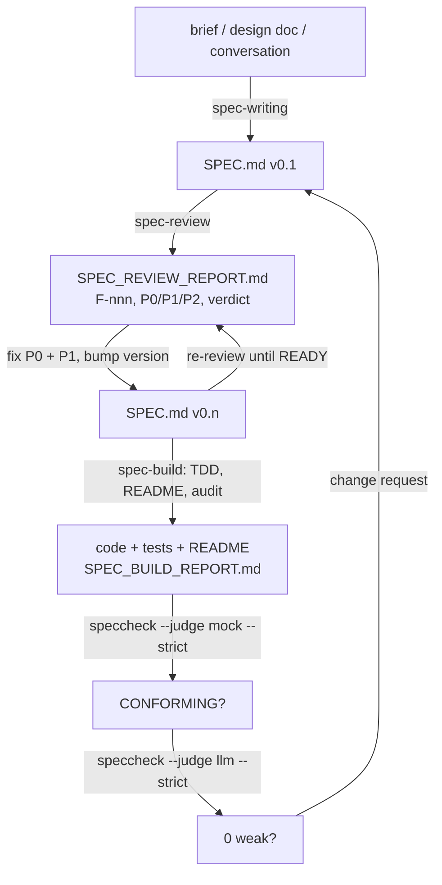

# Introducing speccheck: From Vibe Coding to Specification Engineering

*A real tool you can run today, and the method it belongs to. The long version is the book,
[From Vibe Coding to Spec Engineering](https://github.com/rioffe/spec_engineering_primer); this
is the short one.*

---

## The problem with vibe coding

Coding agents are good enough now that the bottleneck has moved. It is no longer "can the agent
write this?" — it is "did the agent write what I meant, and how would I know?"

When you build from a chat prompt, every gap in the prompt gets filled with a guess. The agent
picks an exit code, a rounding rule, a default, an error message, a thing to do when the input
is empty. Most guesses are fine. Some are wrong. All of them are invisible: they live in the
code, not in anything you can read, and you meet them one at a time, later, as bugs. When you
ask the agent whether the code does what you asked, it reads its own code and tells you yes. That
answer costs nothing to produce and proves nothing.

The pattern gets a name here because it is a pattern, not a personal failing: **vibe coding** is
building against intent that was never written down, and then trusting an account of the result
that was written by the thing being evaluated.

## Specification engineering

The alternative is old and unglamorous: write the specification first, and make it the source of
truth. What is new is *who* the specification is for. It is written for an agent to build from
and for a verifier — human or machine — to check against. That changes what "precise enough"
means. The bar we use:

> A specification is precise enough when two competent implementers would build materially
> equivalent systems from it, and a verifier could tell whether either one conforms.

Everything in the method follows from that bar:

- **Every obligation carries an ID.** Requirements are `R-nn`, contracts `C-nn`, invariants
  `I-nnn`, constraints `K-nn`, edge cases `E-nn`, acceptance tests `T-nn`. An ID is the handle
  that lets code, tests, reviews, and reports point at the same sentence.
- **Every obligation is observable.** Not "the parser is robust" but "given input E-03 the parser
  exits `2` and prints `<message>` to stderr". If you cannot write the test, you have not written
  the requirement.
- **Every ID traces to a test.** A traceability matrix (§11 of the spec) has one row per ID: the
  component that realizes it, the tests that prove it. Empty cells are the work remaining.
- **Decisions the author made for you are listed, not buried.** A spec-writing agent will resolve
  dozens of small questions to keep moving. §12 of the spec is where each one sits with its
  default, its alternatives, and a `confirm` status, waiting for the human.

The human's job moves up a level. You decide what the system must do, you ratify or overturn the
defaulted decisions, and you read evidence. The agent writes, reviews, and builds against the
document — and proves it did.

## How to do it with agents

The method is encoded as three skills — small instruction files an agent loads on request —
and the whole loop is a handful of prompts:



1. **Write.** *"Use the spec-writing skill to write SPEC.md for `<the application>`: `<brief>`."*
   Read §0 — is that the system you meant? — and §12, the decisions it made on your behalf.
2. **Review.** *"Use the spec-review skill to review SPEC.md."* The review is of the document, not
   of you. It grades twenty dimensions, assigns each finding a severity, sorts them into
   P0/P1/P2, and ends with a maturity level and a `READY` / `NOT READY` verdict. A spec that
   reads clearly to a person is routinely Level 2 for an agent, because the agent cannot ask.
3. **Apply.** *"Apply all P0 and P1 findings to SPEC.md."* Re-review until it is `READY`. Usually
   one more pass.
4. **Build.** *"Use the spec-build skill to implement SPEC.md."* Test-first through the spec's
   §9, then a README rewritten from what was built, then an audit of every artifact against the
   spec — and the gate, which is where the tool comes in.
5. **Change.** *"Use spec-writing to update SPEC.md: `<the change>`."* Then 2–4 again. The spec
   stays the source of truth; the code follows it.

## What a SPEC.md looks like

Thirteen fixed sections, so that agents and tools know where to look: intent and non-goals,
actors, requirements, behavior and state, contracts, interfaces, invariants, constraints, edge
cases, tests, dependencies, the traceability matrix, and the decisions to confirm. Formulas are
LaTeX, diagrams are mermaid, and the rows are normative while the pictures illustrate. A row
from speccheck's own specification:

```markdown
| **R-11** | A judge verdict MUST only ever lower an ID's status (`PASSING` → `WEAKLY_PASSING`);
the judge MUST NOT change any status other than `PASSING` and MUST NOT create, remove, or
re-attribute citations. | §0 principle |
```

and the edge case that pins what happens when a model misbehaves:

```markdown
| **E-16** | Judge returns `ASSERTS` with no evidence, or evidence outside the span / in
another file | `UNKNOWN`, `coerced: true`, rationale `judge: ungrounded`. The raw answer is
available only at DEBUG. |
```

Both are checkable. Both are cited — by the code that realizes them and the tests that prove
them — and that is the whole trick.

## Introducing speccheck

Phase three of building from a spec is the audit: re-read the specification and, for every ID,
point at the evidence that the implementation realizes it. Humans doing that are slow and get
tired. Agents doing it are fast and confabulate. **speccheck** makes it mechanical.

Given a `SPEC.md`, a source tree, a test tree, and a JUnit XML results file, it:

- extracts every declared ID from the spec (and knows a struck-through `~~R-07~~` is retired);
- finds every literal citation of an ID in source and test files, attributing test citations to
  the enclosing test function;
- joins those test cases to their results;
- assigns each ID **exactly one status** by a fixed algorithm — `UNCITED`, `UNTESTED`,
  `UNVERIFIED`, `FAILING`, `SKIPPED`, or `PASSING` — every one backed by a `file:line` you can
  `grep`;
- lists dangling citations (an ID nobody declared) and stale ones (an ID that was retired);
- writes a Markdown report and a JSON report, byte-identical across runs, and prints one line:

```text
speccheck: CONFORMING - 170/170 passing (100.0%), 0 failing, 0 skipped, 0 weak, 0 unverified, \
           0 untested, 0 uncited; 0 dangling, 0 stale; judge=mock
```

With `--strict`, that line is a CI gate: exit `0` only when every ID is `PASSING` and nothing is
dangling or stale.

Then there is the judge. A test can cite `R-11`, run the code, and never assert anything about
it — and the deterministic kernel cannot tell. So `--judge llm` sends each passing (test, ID)
pair to a model with one question: *does this test assert the behavior this ID describes, or does
it merely execute code near it?* The design rule is the one the whole tool is built on:

> **The model may only ever make the news worse.** Every status is computed deterministically
> from evidence you can grep; the judge is permitted to downgrade a `PASSING` to
> `WEAKLY_PASSING` with cited line numbers, never to upgrade anything.

A verdict without valid evidence is discarded as `UNKNOWN`. A green report is therefore exactly as
trustworthy as `grep` plus your test runner, and a yellow one carries a reason you can click on.
The judge speaks the OpenAI-compatible `chat/completions` shape, so it runs against a local Ollama
model for free, or against OpenRouter, Anthropic's compatibility endpoint, or anything similar
for cents.

speccheck is written to its own `SPEC.md`, and it is the worked example of the method. The
numbers in the summary line above are its self-application: 170 IDs, 74 tests, every one
`PASSING`, and — this is the part I find most convincing — when the LLM judge was first pointed
at the tool's own suite, it found five tests that proved their IDs only by implication. The tests
were strengthened; the code was not touched. That is the judge doing precisely its job.

## Using it to build a product

The gate slots into the loop at step 4 and runs twice, in order:

```bash
uv run python -m pytest tests -q --junitxml=junit.xml

# Phase A — deterministic, offline
speccheck check --spec SPEC.md --src src --tests tests --results junit.xml \
    --judge mock --strict --out build/speccheck

# Phase B — LLM judge, only once A is clean
# Ollama, or any compatible endpoint
export SPECCHECK_JUDGE_URL=http://localhost:11434/v1/chat/completions
export SPECCHECK_JUDGE_MODEL=qwen3:8b
export SPECCHECK_JUDGE_API_KEY=ollama
speccheck check --spec SPEC.md --src src --tests tests --results junit.xml \
    --judge llm --strict --out build/speccheck-llm
```

Each non-passing status names the fix. `UNCITED` means the agent silently dropped a requirement —
go build it, test-first. `UNTESTED` means the code is there and no test proves it. `UNVERIFIED`
means the test never ran. `WEAKLY_PASSING` means the test runs the behavior without asserting it,
and the report's §8 has the model's rationale, line by line. The spec-build skill knows all of
this and will not call the work done until both phases exit `0` — and it records both summary
lines in the build report, so the evidence travels with the code.

On a real project the rhythm is: spec, review, fix, build, gate; then for every change, spec
first, gate last. The agent does the typing. You read `SPEC.md` §12, the review's remediation
plan, and the gate line. That is a job a person can actually do at the speed agents now work.

## Try it

Everything is in one repository, MIT for the code and CC BY 4.0 for the documents:

**https://github.com/rioffe/speccheck**

```bash
git clone https://github.com/rioffe/speccheck && cd speccheck
# skills for Claude Code / Pi / Oh My Pi, spec2pdf.sh, the speccheck CLI, a local judge
./install.sh --interactive         
speccheck --self-check
```

Then pick something you were about to vibe-code anyway and say: *"Use the spec-writing skill to
write SPEC.md for …"* Read §12. Review it. Build it. Run the gate. If the tool tells you
something your agent didn't — and it will — open an issue and tell me what.

The book goes into the why and the how in depth: the review dimensions, the status algorithm, the
judge contract, the failure modes we hit building this and what they taught us. For now the point
is simpler: the tool exists, it checks itself, and you can run it this afternoon.
