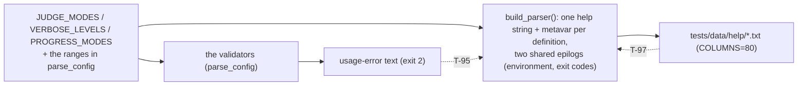

# Implementation plan — speccheck v1.18 delta (the CLI documents its own parameters)

> - **Target:** the `speccheck` kernel at `SPEC.md` v1.18 (the fold of
>   `docs/proposals/PROPOSAL_v1.18_cli_help_contract.md`): every flag of the four parsers documents purpose, values,
>   default and preconditions, every `--help` screen carries the `environment:` block and the
>   exit-code epilog, and four tests bind the help to the validator, the parser, the rendered bytes
>   and the code's own `SPECCHECK_*` literals (R-41, C-19, I-017; T-95..T-98).
> - **Size expectation:** a **delta plan** on the working v1.17 implementation (3,880 production
>   code lines across 15 modules, 130 tests, 252 declared ids, mock gate 248/252 with the seven new
>   ids `UNCITED`). This plan budgets **~90–140 production lines** (help strings, metavars, two
>   epilogs — all in `cli.py`), **~200–280 test lines** plus four golden files, and **~8 lines** of
>   README (Part D's stale `DIR` statements).
> - **Method:** red-green-refactor over the §9.14 test group; the goldens are generated by running
>   the product at a pinned width and then read; `SPEC.md` is not edited except by a recorded
>   `fix(spec):` if Phase 3 finds it stale.

---

## 1. Verdict

One code wave and one proof wave. **W1 is the whole change**: `cli.py` gains a metavar and a help
string on every argument definition (37 definitions across the four parsers), plus two shared
epilog strings — the `environment:` block and the exit-code/summary-line epilog — and
`tests/test_13_help.py` adds T-95..T-98 with four goldens under `tests/data/help/`. **W2 proves
it**: README (Part D's six stale `DIR` statements and the help section), `SPEC_BUILD_REPORT.md`
§0j, the §11 walk, `DECLARED_IDS` 252, and both gates.

Three decisions carry the plan: (1) the three enumerated flags' help clauses are **built from the
module constants the validators themselves check** (`JUDGE_MODES`, `VERBOSE_LEVELS`,
`PROGRESS_MODES`), so Part B's equality is structural rather than a second prose copy, and T-95
holds the four prose ones (`--max-unknown`, `--judge-concurrency`, `--judge-budget`, `--depth`) to
it; (2) the two epilogs are **one string each**, shared by all four screens, so the environment and
the exit codes cannot drift between `check`, `impact`, `explain` and the top level; (3) the goldens
are **pinned at `COLUMNS=80`** in the test's environment, because argparse wraps to the terminal
width and an unpinned golden flakes between a CI runner and a developer's terminal (the proposal
measured `COLUMNS=40` and `COLUMNS=200` breaking the same build differently).

It refuses to change any accepted value, default or exit code, to make the help normative for
behaviour (the validator stays the authority; T-95 is one-way), to add a machine-readable
`--help-json` (D-40's third branch), or to print any environment *value* (R-23, I-007).

## 2. What the evidence says (this is not a greenfield guess)

Measured on the starting tree (`git status` clean at `56e1465`, 2026-09-21):

| Fact | Value | How measured |
| --- | --- | --- |
| Production code lines / modules | 3,880 / 15 | non-blank, non-comment lines under `src/speccheck/*.py` |
| Declared ids / retired / decisions | 252 / 0 / 42 | `parse_spec` on the folded `SPEC.md` |
| Mock gate on the folded spec | `CONFORMING 248/252`, 0 dangling, 0 stale | `check --judge mock` over this tree |
| The v1.18 ids not yet realised | R-41, C-19, I-017, T-95..T-98 (`UNCITED`) | same run |
| `check --help` today | 755 bytes: flag names with argparse dest metavars, **0 help strings** | `COLUMNS=80 speccheck check --help` |
| `choices=` in `cli.py` | 0 | `grep -c` |
| The validator's tokens (T-95's oracle) | `--judge` → `none, mock, or llm`; `--progress` → `auto, always, or never`; `--verbose` → `INFO or DEBUG`; `--max-unknown` → `a decimal in [0, 1]`; `--judge-concurrency` → `an integer 1..32`; `--judge-budget` → E-58's companion message; `--depth` → `an integer 0..999` | live usage errors, captured |
| The `SPECCHECK_*` literals in `src/speccheck/*.py` | 8 (`JUDGE_URL/_MODEL/_API_KEY/_TIMEOUT`, `JEV_URL/_MODEL/_API_KEY/_TIMEOUT`) | `grep -o 'SPECCHECK_[A-Z_]*'` |
| Argument definitions | 37 (`speccheck` 4, `check` 14, `impact` 9, `explain` 14, minus `-h` each) | `build_parser()` introspection |

**Systemic failure modes this delta must not repeat** (both are the proposal's own evidence):

| Failure | Structural rule that makes it impossible here |
| --- | --- |
| A prose copy of the accepted values with no tie to the validator (README said `--src DIR` for two versions after D-23 made it `PATHS`; C-06 said `SPECCHECK_LLMMODEL`, which no code ever read) | the three enumerated clauses are *built from* the constants the validators check; T-95 compares every finite set's tokens against the flag's own usage-error text and re-feeds each token to the parser; T-98 compares the environment block against the code's own literals |
| A screen that silently loses a fact (a dropped value token, a dropped default, a new flag with no help) | T-96 requires help on every definition and a C-19 metavar where a value is taken; T-97 pins the rendered bytes at `COLUMNS=80`, so any reduction is a diff |

## 3. Shape

- **Literal filenames** (§11's *where realized* column): R-41 and C-19 → `cli.py`; I-017 →
  `cli.py` (no help path reads anything); T-95..T-98 → `tests/test_13_help.py`; the goldens →
  `tests/data/help/{speccheck,check,impact,explain}_help.txt` (§10).
- **Layer direction:** `cli.py` only. No new module: the help is the parser's own text, and the
  environment block is a string constant beside the parser that names the variables the kernel
  reads — T-98 keeps it honest against the code.
- **Purity rule:** the help path reads no file, no environment variable and no socket (I-017);
  argparse's only ambient input is the terminal width, which changes wrapping alone (D-41, T-97).
- **No visual oracle:** the deliverable is text; the observed pass is the four screens printed and
  read at a fixed width.

## 4. Order (waves; each ends at a gate, not at a file count)

1. **W1 the help contract** — `cli.py`: metavars and help strings on every definition, the
   `environment:` block and the exit-code epilog, the three enumerated clauses built from their
   constants; `tests/test_13_help.py` (T-95..T-98); the four goldens; README Part D's six `DIR` →
   `PATHS` statements. Gate: `pytest tests/test_13_help.py -q`, the whole suite, `ruff`,
   `--self-check`.
2. **W2 prove it** — `DECLARED_IDS` 252, README's help section, `SPEC_BUILD_REPORT.md` §0j/§5/§6,
   the root reports, Phase A (`--judge mock --strict`) and Phase B (`--judge llm --strict`,
   `google/gemini-3.8-flash`). Gate: the full Phase 1 exit gate, both phases, exit 0.

## 5. LOC budget (production source)

| Slice | Files | LOC |
| --- | --- | --- |
| Metavars, help strings, the two epilogs (W1) | `cli.py` | 90–140 |
| **Total production** | **1** | **90–140** |
| Tests + goldens (separate) | `tests/test_13_help.py`, `tests/data/help/*.txt` | 200–280 |

Anchors: the proposal measures ~50 lines of help strings plus 14 metavar assignments plus a ~12-line
epilog; `build_parser()` is 52 lines today. **The smallest complete build of this delta is the
~90-line branch** (strings and metavars, no epilogs); the epilogs are D-40/D-41's confirmed
content, and the report names them as such.

## 6. Rules that make the observed failures impossible

| Prior failure | Structural rule |
| --- | --- |
| A prose copy of values with no tie to the validator (README `DIR`; C-06's `SPECCHECK_LLMMODEL`) | the enumerated clauses are built from the validators' own constants; T-95 compares tokens against the usage-error text and re-feeds them to the parser; T-98 compares the block against the code's literals |
| A help screen losing a fact unnoticed | T-96 (every definition carries help, every value metavar from C-19's vocabulary) and T-97 (bytes pinned at `COLUMNS=80`) |
| A golden that flakes because the environment differs | T-97 sets `COLUMNS=80` in the test's environment and the renderer is otherwise pure (I-017) |

**Live verification (W2).** The surface is the CLI's own help, printed and read: the four screens
at `COLUMNS=80` and at a default width, plus the usage errors they claim to mirror. Prerequisites:
none beyond the installed package. Stand-in: none needed — this increment has no model-facing part;
Phase B still runs (the gate) but nothing in this increment depends on it.

## 7. One fork, then action

**One shared epilog pair for all four screens, or per-subcommand epilogs?** Recommendation, taken:
**one shared pair** — the environment block and the exit-code epilog are the same facts on every
screen, and two copies of them is exactly the drift this increment exists to prevent (the four
`--help` screens then differ only in their flags). The alternative — a per-subcommand epilog that
names only that subcommand's codes — reads a little tighter (`impact` has no exit `1`), but it makes
four renderings of one §5.4 table, and T-97's goldens would encode the difference in four files
rather than one fact. Cost of the alternative: a fourth copy of a normative table, with no
mechanical tie.

Both branches leave the wave order, the budgets and the rules unchanged.

**Next concrete action:** W1-01 — write `tests/test_13_help.py::test_t96_every_flag_documents_itself`
first, run it, and watch it fail on the first flag with an empty help string.
