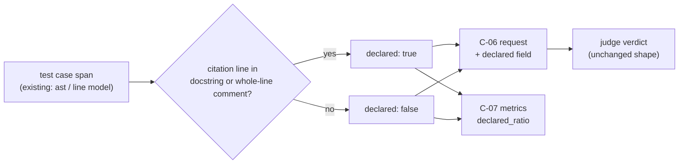

# Proposal — v1.15: declared vs. incidental citations — tell the judge when an ID is only fixture data, not this test's own intent

> - **Status:** proposal, 2026-09-20; for `spec-writing` to turn into `SPEC.md` v1.15 rows after the requester settles D-26 and D-27 below (D-26 is numbered past `docs/proposals/PROPOSAL_v1.14_obligation_aware_judge.md`'s own D-26, since that proposal is still pending too; renumber whichever lands second).
> - **Applies to:** `SPEC.md` v1.13 — C-01 (citation rule), C-03 (`Citation`/`TestCase`), C-06 (judge request), C-07 (JSON), C-10 (judge instruction text), §9's own preamble sentence, T-46/T-76 (golden fixture). Independent of `docs/proposals/PROPOSAL_v1.14_obligation_aware_judge.md`: that proposal tells the judge about *neighboring* obligations a statement names (C-12 edges); this one tells it about a citation that names *no* neighbor at all, just a token reused as example data. Neither needs the other; both could land.
> - **Notation:** unprefixed ids are speccheck's own.
> - **Evidence:** `JUDGE_CROSSCHECK_REPORT.md` §2b — a real `check --judge llm` run of this repository's own `SPEC.md` with `gpt-4o-mini` (one of this project's two trusted judge models per `SPEC_BUILD_REPORT.md` §0d), cross-checked edge-by-edge against an independent second model (Jev, `typesafe/jev-1.13`). 613 judged edges; 153 (25%) genuine conflicts where both models committed to a verdict and disagreed; 60 of those concentrate in five ids (R-01 36/57 = 0.63, C-01 7/34, R-07 6/7, C-06 6/7, C-03 5/12); **93 of the remaining 496 (18.8%) still conflict** — not an artifact of a handful of ids. Three non-R-01 conflicts read in full (R-03/`test_fenced_code_blocks_are_ignored`, R-03/`test_row_and_heading_grammar_edge_cases`, R-02/`test_judge_called_once_per_eligible_edge_only`) all show the same shape.

## 1. The problem

`gpt-4o-mini` recorded `ASSERTS` on all three edges read in full; Jev, given the same statement
and source independently, said `UNRELATED` (0.62–0.72) on each. In every case the test uses
`"R-01"`/`"R-02"`/`"R-03"` … as a **generic placeholder id string** while testing something else
— `test_fenced_code_blocks_are_ignored` proves E-04/C-01's fence-ignoring rule using a fenced
block that happens to contain `| **R-02** | fenced |`; `test_judge_called_once_per_eligible_edge_only`
proves R-10/I-010's eligibility rule using a `spec_table` with rows labeled `R-01` through `R-07`
as generic per-status examples. Neither test's own docstring names the id the judge credited;
each names the ids it actually proves (`(E-04, C-01)`, `(R-10, I-010)`).

`K-15`'s clause-grounding check — the fix `docs/proposals/PROPOSAL_v1.9_clause_grounding.md` built for exactly
this class of problem — doesn't catch it, because it isn't the same problem. v1.9 was about long,
multi-clause bodies graded on their gist; a short, single-clause statement like R-02's or R-03's
has exactly one clause to quote, so quoting it verbatim is trivial and tells the judge nothing
about whether the assertion it found nearby is *about* that clause or about something else
entirely. Both grounding checks (`clause` real, `evidence` inside the span) can be satisfied by
an honest, careful model and the verdict can still be wrong, because neither checks the one thing
that actually failed here: **topical relevance** — is the located assertion about *this*
obligation, or about a token that happens to share the citation mechanism with it?

This is not a new hole in the spec; it is a known, named, accepted one — F-013: *"citation is
literal. A test that mentions `R-03` as data … cites R-03 exactly as a test that proves it does.
The `speccheck:ignore` markers … are the author's responsibility."* What v1.15 adds is not a
retraction of that design (literal citation stays literal; `speccheck:ignore` stays the opt-out) —
it is the observation that the spec **already states the mitigation and the kernel never uses
it**: §9's own preamble says *"every test cites, in its docstring or a comment, its own T id and
the R/C/I/K/E ids it proves"* — a docstring-cited id is the test declaring intent; an id that
shows up only elsewhere in the body is, by the spec's own convention, not that declaration. The
kernel can tell these apart today, mechanically, for exactly the same reason `attribute.py`
already delimits test spans with `ast` (Python) and a line-based doc-comment tracker (Swift,
R-31) — and currently throws that distinction away before the judge ever sees the edge.

## 2. The change

**Part A — a deterministic fact: `declared`.** For a citation of id `X` inside test case `T`'s
span, `X` is **DECLARED** in `T` when at least one citation line of `X` within `[T.start, T.end]`
is:

- inside `T`'s own docstring (Python: the span of `ast.get_docstring`'s underlying `Expr` node —
  a line range, computed once per case, no token-level parsing needed), or
- a **whole-line comment** (the first non-whitespace character on that line is `#` for Python;
  Swift already tracks this per line as `_Line.doc` — `///` or inside `/** … */` — R-31's
  existing line model, reused rather than duplicated).

Otherwise `X` is **INCIDENTAL** in `T`. A citation on a line that is code with a *trailing*
comment (`x = 1  # R-02`) is INCIDENTAL under this rule — a deliberate simplification (§4): it
needs no column tracking, only line ranges the kernel already has, and every real DECLARED
citation found while drafting this proposal was a whole-line comment or a docstring line. A
file-level citation (no enclosing named case) is always INCIDENTAL (E-56) — there is no per-test
declaration of intent at file granularity to check against.

`declared` is computed the same way regardless of `--judge` mode — under `none`/`mock` it costs
nothing extra to compute and changes no status; it becomes visible in the report either way.

**Part B — the judge is told, not overruled.** `C-06`'s `JudgeRequest` gains one field,
`declared: bool`, computed for the specific (id, testcase) edge being judged. `C-10`'s
instruction text gains the definition and one rule:

> `declared` is `true` when this test's own docstring or a comment names this ID — the
> convention this project's tests are expected to follow; `false` when the ID appears only
> elsewhere in the test body. When `declared` is `false`, do not credit `ASSERTS` merely because
> a clause is locatable and some assertion exists nearby: check that the assertion's own subject
> is unambiguously this obligation, not a token reused as example or fixture data for a different
> one (a known limitation of literal citation matching).

Nothing else about the reply changes — `verdict`/`clause`/`evidence`/`rationale` are the same
four fields, `K-15`/`I-005` grounding is unchanged, and `I-004` (downgrade-only) is untouched.
This is advisory, not a new coercion rule (D-26 defends why): a model can still find a genuine,
undocumented `ASSERTS` on an INCIDENTAL citation (the docstring convention is not literally
enforced everywhere), and the fix should not manufacture false downgrades on those.

**Part C — the report gains a visibility signal that needs no model at all.** `speccheck.json`'s
`tests[]` entries gain `"declared": bool` next to `"verdict"` (present under every judge mode,
including `none`); `metrics` gains `declared_ratio` — `|DECLARED citations of in-scope R/C/I/K/E
ids| / |all such citations|`, computed the same way `judge_strength` is (Decimal, Q-009), `null`
when the denominator is zero. This is the part that would have surfaced the `R-01` pattern from
`--judge none` alone, no LLM run required: an id whose `declared_ratio` (restricted to its own
edges) is low is exactly the shape found in §1, visible to `spec-review` or a human reading the
report without spending a single judge call.

*Figure 1 — `declared` is computed once, deterministically, from data the kernel already has
(the test span and, for Python, the same `ast` tree that delimited it), and feeds two independent
consumers: the judge's own instruction (Part B) and the report's metrics (Part C), neither
requiring the other.*

Proposed rows, drafted for `spec-writing`:

| Family | Draft |
| --- | --- |
| R-39 | The checker MUST compute, for every citation of an in-scope R/C/I/K/E id inside an attributed (non-file-level) test case, whether it is DECLARED (a citation line inside the case's own docstring, or a whole-line comment) or INCIDENTAL (Part A); the fact MUST be available under every `--judge` mode, including `none`. Source: §1. |
| C-14 | `Citation` gains `declared: bool`. Python: DECLARED iff a citation line falls within the span of the enclosing function's docstring `Expr` node (`ast.get_docstring`'s node, not its text), or is a whole-line comment (first non-whitespace character `#`) within the case's span. Swift: DECLARED iff the citation's line has `_Line.doc == true` (R-31's existing per-line tracker) within the case's span. Any other adapter (file-level fallback, O-2 languages): always `declared: false` (E-56). |
| C-15 | `JudgeRequest` (C-06) gains `declared: bool` after `testcase`, computed per Part A for the edge being judged; the field is read-only context, not validated by any C-06 coercion rule. `C-10`'s instruction text gains the `declared` definition and the skepticism rule (Part B); new `judge_prompt_sha256`. |
| C-16 | `speccheck.json` (C-07): every `tests[]` entry gains `"declared"` (bool) after `"lines"`, present under every judge mode. `metrics` gains `"declared_ratio"`: DECLARED citations of in-scope R/C/I/K/E ids over all such citations (a T id's own citations are excluded, matching R-39's scope), Decimal/Q-009, `null` at zero denominator. `schema_version` bumped. |
| I-014 | `declared` is a pure function of the spec-independent test tree (the source files and their citations) and does not depend on `--judge` mode, `--results`, or any network access; two runs with identical source trees produce identical `declared` values and `declared_ratio` (extends I-002's determinism guarantee to the new fact). |
| E-56 | A file-level citation (no enclosing named test case delimited it) is always `declared: false`; no Note (this is definitional, not an anomaly). |
| T-85 | Unit tests for Part A: a citation on the function's docstring line -> declared; a citation on a whole-line `#`/`///` comment inside the span -> declared; a citation inside a string literal or on a code line with a trailing comment -> incidental; a citation attributed to the file-level fallback case -> incidental (E-56); a multi-line docstring where the citation is on its second line -> declared; the Swift adapter's `_Line.doc` reuse produces the same classification as the Python path on an equivalent doc-comment example. |
| T-86 | Golden fixture (`fixtures/target`): one new test added that cites an existing id only as fixture/example data inside its body (mirroring the real `R-01`/`R-02`/`R-03` pattern from §1), with its own docstring naming a *different* id; `speccheck.json` (`--judge none`) records `declared: false` for that edge and the fixture's `declared_ratio` reflects it; the Markdown report is unchanged (Part C is JSON-only, matching how v1.13's `decisions`/`edges` were added without touching C-08). |
| T-87 *(recorded)* | Re-run the three real edges named in this proposal's evidence line (`R-03`/`test_fenced_code_blocks_are_ignored`, `R-03`/`test_row_and_heading_grammar_edge_cases`, `R-02`/`test_judge_called_once_per_eligible_edge_only`) under the v1.15 `C-10` text with the same model (`gpt-4o-mini`) and record the verdicts; the claim this proposal makes is falsifiable and this is the test of it — recorded in `SPEC_BUILD_REPORT.md`, not gating, since it depends on a live model's compliance with an advisory instruction (the same caveat T-49 already carries for every judge-prompt change). |
| T-88 | `speccheck.json` under `--judge none`/`mock` on the updated golden fixture carries `declared_ratio` and every `tests[].declared`; the Markdown report byte-identical apart from cases T-86 changes; `schema_version` bumped and only that key changed relative to the pre-v1.15 golden. |

## 3. What it costs

- **No new dependency, no new I/O.** Python's `ast` tree is already built to delimit the case;
  reading its first-statement docstring node is one more attribute read. Swift's `_Line.doc`
  array already exists (R-31); this reuses it rather than adding a second comment-detector.
- **A schema bump** (`speccheck.json`), both golden fixtures regenerated (`declared` on every
  `tests[]` entry; `declared_ratio` in `metrics`), `_selfcheck/` resynced. The Markdown report is
  untouched (Part C is JSON-only).
- **Input tokens, marginal.** One boolean field and one short instruction paragraph per request;
  negligible next to the statement/source already sent.
- **The judge's behavior is not guaranteed to change.** Part B is advisory; T-87 measures whether
  it actually moves the three named edges, and the honest possible outcomes are "yes, this model
  now says `UNRELATED`/`EXECUTES_ONLY` on all three," "on some," or "on none" — the last would say
  the instruction alone isn't enough for this model and either D-26 should be revisited (a
  stricter, coercion-backed version) or the fix should live entirely in Part C (visibility, no
  judge change) instead.
- **Part C alone is worth doing even if Part B is rejected or doesn't move the model**: it costs
  nothing under `--judge none`, needs no model, and is the one thing that would have surfaced the
  `R-01` pattern (63% of its own edges) from a plain `--strict` mock-judge run, before ever
  spending a judge call.

## 4. Alternatives considered

| Alternative | Why not |
| --- | --- |
| Hard coercion: `declared: false` + `ASSERTS` -> automatically forced to `EXECUTES_ONLY` | Removes the model's judgment entirely on the majority of real edges in most test suites (a citation not literally in the docstring is common and often still correct); K-15/E-48's own coercions are narrow, mechanical, unambiguous checks (a clause either locates or it doesn't) — "not in the docstring" is not that kind of fact, it is a prior, not a verdict. Rejected as D-26's `no` branch; kept as a fallback if T-87 shows the advisory text does nothing. |
| Full token-level comment detection (via `tokenize`, distinguishing a trailing comment from code) | More precise (would credit `x = 1  # R-02` as declared) but needs column-accurate token classification the citation scanner does not carry today, for a case that did not appear once in the real evidence read for this proposal. Whole-line-comment detection is a one-line check on data already in hand; token-level detection is a structural addition to `citations_in_file` itself. Left for a later proposal if it proves necessary (D-27's `no` branch). |
| Extend `docs/proposals/PROPOSAL_v1.14_obligation_aware_judge.md`'s `related` field instead of a new one | `related` lists ids a statement's own text names (C-12 `depends_on`/`verifies` edges) — a *structural* neighbor. `R-01`/`R-02`/`R-03` in the read examples are not C-12 neighbors of R-10/I-010 or E-04/C-01; they share nothing but an incidental token match. `related` would be empty on exactly the edges this proposal targets, so it cannot carry this signal without becoming a different field under the same name. |
| Compute `declared` from the whole test *file*'s docstring/comments, not the specific case's span | Loses precision for exactly the multi-case files where this matters most (`test_01_extraction.py` alone has a dozen cases, each citing different ids); the existing per-case span (already computed for attribution) is the right granularity and adds no new computation to get. |
| Drop Part C, keep only the judge hint | Then the fix depends entirely on the model honoring an advisory instruction (T-87's very question) and offers nothing under `--judge none`/`mock`, which is most runs of this tool (R-16, R-22 keep the mock judge deterministic and model-free by design). Part C's cost is close to zero for exactly this reason it should not be optional. |

## 5. Decisions for the requester (D-26, D-27, both `confirm`)

| ID | Statement |
| -- | --------- |
| **D-26** | advisory only (Part B as written) (recommended: preserves the model's judgment for the real, undocumented-but-correct cases; T-87 measures whether it's enough) **versus hard coercion** (`declared: false` forces `ASSERTS` to `EXECUTES_ONLY`, no model discretion — stronger and fully deterministic, but risks false downgrades on tests that simply predate or don't follow the docstring convention perfectly). | 
| **D-27** |  whole-line-comment detection (recommended: no new parsing machinery, matches every real example found) **versus token-level comment detection** (more precise for a trailing-comment case not observed in this proposal's evidence). |

## 6. What the change does not do

It does not change what a `PASSING` id needs (citation + a passed result, C-05 steps 1–4); it
changes only what the judge is told and what the report shows, both strictly on the downgrade
side (`ASSERTS` -> `WEAKLY_PASSING` remains the only status the judge can produce, I-004
untouched). It does not retract F-013 or add a new opt-out beyond `speccheck:ignore` — an
INCIDENTAL citation is still a citation, still counted, still eligible for judging; `declared`
only says which of a genuinely `PASSING` id's several citations looks, from the test's own words,
like the one it actually intended. It does not fix the three specific edges named in §1 by
itself — T-87 is the measurement of whether telling the model is enough, and D-26's `no` branch
is what to reach for if it isn't. And it does not touch `docs/research/SPEC.md` or any spec other
than this project's own; the pattern it targets (a low-numbered, frequently-reused id cited as
generic example content across many unrelated tests) is a property of *this* test suite's style,
and another spec's test suite may or may not share it.
