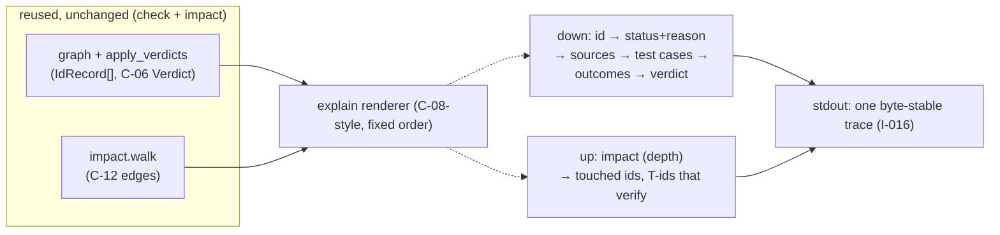

# Proposal — v1.17: `speccheck explain <ID>` — the evidence trail, as one readable command

> - **Status:** proposal, 2026-09-20; for `spec-writing` to turn into `SPEC.md` v1.17 rows after the
>   requester settles D-33, D-34, D-35 and D-36 below. v1.17 numbers past `__version__` 1.14.0 and
>   past the in-flight `docs/proposals/PROPOSAL_v1.16_jev_pre_triage.md` (which reserved D-29..D-32; the live
>   `§12` table already reaches D-32, so D-33 is the next clean slot). Renumber whichever lands
>   second.
> - **Applies to:** `SPEC.md` v1.14 — a new third subcommand beside `check` (R-36/37, C-13, §3.1,
>   §5) and a new stdout contract for it (C-18). It **composes over existing facts only**: the
>   `IdRecord`/edg e/verdict the `check` pipeline already builds and the `C-12` `walk` `impact`
>   already runs; it adds no status, no verdict, no citation, and no schema field. Independent of
>   `docs/proposals/PROPOSAL_v1.16_jev_pre_triage.md` (that one changes *which edges reach the judge, in what
>   order* — a judge-economics change) and of `docs/proposals/PROPOSAL_v1.15_declared_vs_incidental_citations.md`
>   (that one changes *what the judge is told about a citation* — a judge-input change). Neither
>   needs this one; all three could land in any order.
> - **Notation:** unprefixed ids are speccheck's own.
> - **Evidence:** this is a **capability addition, not a defect fix** — stated plainly, per the
>   house evidence rule. The evidence is a *reproducible cost-of-assembly*, not an aggregate rate:
>   to answer "why is R-07 PASSING?" today an operator follows the tool's own central promise (§0:
>   *"never has to trust a number without a path to its evidence"*) through **three structured
>   artifacts plus two greps** — (1) locate the id's `tests[]` edges and each verdict's `rationale`
>   in `speccheck.json`; (2) open the line-numbered source/test the citations point to; (3) run
>   `impact --changed <ID>` for the blast-radius. The richness the tool is known for is real but
>   *dispersed*: `JUDGE_CROSSCHECK_REPORT.md` §2b found 153/613 (≈25.1%) genuine cross-model
>   verdict conflicts, 93 of the remaining 496 (18.8%) of them, on a run where every decided verdict
>   was correct — i.e. the verdicts exist and matter, yet a human must hand-correlate three files to
>   read *why* one id is weak. One `explain` command is *the path to the evidence itself, rendered*.

## 1. The problem

A `speccheck` run already computes, per id, exactly the chain a reader wants: its statement (full
body, v1.7 `C-10`), its deterministic status and the `C-05` step that set it, every source and
test-case citation with line numbers, each citing case's JUnit outcome (`C-04`), and — when a judge
ran — each edge's `Verdict` (`C-06`: `clause`, `evidence`, `rationale`). `impact` adds the other
half — the `C-12` `walk` of what a change to the id *might* touch, and the `T` ids that verify it.
What the tool does not have is a **single narrative that walks one id through both halves.** The
operator assembles it by hand across `speccheck.json`, the source files, and an `impact` run.

This is the one gap in a tool whose whole thesis is "give me the path to your evidence": the path
exists and is fully machine-readable, but it is not *rendered as one thing an operator reads.* The
evidence is a reproducible cost of assembly (the three-artifact + two-grep walk above), not a
percentage of a defect — so §3 and §6 say the same thing: a *narrative over existing facts* is
cheap and safe, and the parts that would make it do anything the kernel does not are the things this
proposal deliberately does **not** add.

## 2. The change

One new subcommand, `speccheck explain <ID>`, that runs the same Extractor → Attributor →
Results-Mapper → Grapher → Judge stages as `check` (the triage stage included, unchanged, per
`§3.1`), then **renders the one id** that `--id` names. Two directions feed the one trace:

*Figure 2.1 — `explain` is a renderer over the two halves `check` and `impact` already compute; it
composes them, it does not add either.*

**Part A (down the trace).** For the named id, print, in a fixed section order: the id with its
`RETIRED`/`recorded` markers; its status and the `C-05` *reason* that set it; its statement
(`title` + full body per `C-10`); its source citations (`file:line` …); and each citing test case
with its JUnit outcome and, when a judge ran, its `Verdict` (`clause`, `rationale`). When
`--judge none`/`mock`, the verdict line reads the *not-judged* / token form. No new fact, no new
verdict — these are the fields `speccheck.json` already carries, walked one id at a time.

**Part B (up the trace).** Append one compact line per `--depth` (default `1`): the ids a change to
this id *might* touch (`C-12` `walk`), and the `T` ids that verify it — the upstream blast-radius,
the mirror of `impact`'s downward list. Reuses `impact.walk` wholesale; no new walk mechanism.

**Part C (output surface).** Per D-33's recommended branch, `explain` prints to **stdout only**: no
`--out`, no durable file, no `schema_version` bump, and no entry in the `§3.3` durable-artifact
table. The structured version of the same information already exists as `speccheck.json`; `explain`
is the *narrative* into it, not a fourth artifact.

Proposed rows, drafted for `spec-writing`:

| Family | Draft |
| --- | --- |
| R-40 | The checker MUST accept a third subcommand, `speccheck explain <ID>`, that runs the same extract / attribute / map-results / graph / (triage /) judge stages as `check`, then renders the one id named by `<ID>` as a single human-readable trace; `explain` produces no status a `check` run over the same inputs does not already compute, and its stdout is a pure function of those inputs and the render contract in C-18. Source: §1. |
| C-18 | `explain` stdout contract: one trace per id in this fixed section order — (1) `ID <id>` with `RETIRED`/`recorded` markers; (2) `status: <STATUS>` with the C-05 step that set it; (3) `statement:` (C-10 `title` + body, line-capped per K-14); (4) `sources:` the id's source citations; (5) `tests:` each citing case as `<case> (<passed|failed|skipped|—>) [verdict]`, appending `clause:` and `rationale:` only when a judge produced a `Verdict`; (6) `impact (<depth>):` the touched ids and the verifying T-ids. Under `--judge none`/`mock` the verdict reads `not judged`; under `llm` it reads the C-06 verdict with its `clause` and `rationale`. Whitespace and the exact section headings are pinned so two runs over identical inputs are byte-identical. Source: §1. |
| I-16 | `explain` is additive and read-only: it changes no status, verdict, citation, metric, or report file; it reads only the same `IdRecord`/edge/verdict facts a `check` run over identical inputs produces, and the `walk` facts `impact` produces; a `check` and the matching `explain` over the same inputs agree on every status shown. Source: §1. |
| E-60 | `explain <ID>` for an id not declared in the spec — a dangling token — is a usage error, exit `2`, with a message naming the id as undeclared (R-07's dangling wording); an id that is declared but has no citations or edges renders its status reason and an empty `sources:`/`tests:` block, never an error (E-13, E-19 style). Source: §1. |
| E-61 | `--judge` on `explain` carries over `check`'s contract exactly: a judge failure or coercion on an edge shows `UNKNOWN`/`coerced` verbatim as it would in `speccheck.json`; `explain` neither issues nor omits any judge call `check` would not. Source: §1. |
| T-92 | A golden run: `speccheck explain R-01 --spec fixtures/target/SPEC.md --src fixtures/target/src --tests fixtures/target/tests --judge mock` (R-01 is a `PASSING` id declared in `fixtures/target`, with source and test citations) prints a fixed, byte-stable multi-section trace (`ID R-01`, its status and the C-05 step that set it, `statement:`, `sources:`, one `tests:` case with its outcome and a `mock: ASSERTS` verdict, and an `impact (1):` line); a second identical run is byte-identical (I-16, I-002 extended to the new surface); and the status shown equals R-01's status in `speccheck.json` from the same inputs. Source: §1. |
| T-93 | `speccheck explain R-09 --spec fixtures/target/SPEC.md …` (an id `fixtures/target` does not declare) exits `2` with the E-60 dangling message; `speccheck explain R-04` (a retired id in `fixtures/target`, struck through) renders the `RETIRED` marker and the id's trace and exits `0` (retirement is informative, not an error). Source: §1. |
| T-94 | Under `--judge llm`, `explain <a-judge-eligible-id>` shows the C-06 verdict with `clause` and `rationale`; under `--judge none` the same id's verdict line reads `not judged`; in both the id's status in the trace equals its status in `speccheck.json` from the same inputs (I-16). *(recorded under `llm` in `SPEC_BUILD_REPORT.md`, not gating, per the live-model caveat T-49 carries.)* Source: §1. |

## 3. What it costs

- **One subcommand + one renderer.** No new kernel mechanism: `explain` reuses the `check` pipeline
  end-to-end and `impact`'s `walk`. The only new code is a thin renderer (`C-18`) and an
   `ExplainConfig`/`Action("explain", …)` beside `ImpactConfig` in `cli.py`.
- **Zero cost to `check`, `impact`, `--self-check`.** `explain` adds no status the kernel does not
  already hold, so the two-file-mutation invariant and the `--self-check` goldens do not move
   (D-33 keeps `explain` stdout-only). No schema bump, no golden-regression churn.
- **No model-facing change.** `explain` issues the *same* judge calls `check` would over the same
   inputs (D-35, I-16) — no new tokens, no new endpoint, no new `judge_prompt_sha256`. T-94's
   `llm` case is `*(recorded)*` only because it exercises a live model; the gated tests (T-92, T-93)
   are deterministic.
- **Part B (`impact` reuse) is worth doing even if Part A's upward section is ever trimmed** — it is
  a composition of an existing function and adds nothing new; and **Part C is worth doing even if
  D-33 (stdout-only) is later reopened to a durable file**, because the *narrative* renderer is what
  delivers §1's "one readable command" regardless of where its text goes.
- **What is NOT guaranteed:** that `explain`'s trace *matches human intuition* of "why is this
  weak" — it renders the facts the kernel already holds and the verdict the *existing* judge gave;
  it cannot surface a gap the judge itself missed, and it cannot strengthen a test (that is the
  domain of `--judge llm`'s `rationale` and of `spec-build`, not `explain`).

## 4. Alternatives considered

| Alternative | Why not |
| --- | --- |
| **A durable `EXPLAIN_<ID>.md` + `explain.json` pair** (matching the `§3.3` "two files per subcommand" pattern) | A stronger shape for CI — but it adds a new durable-artifact contract, a golden pair to regress, and a third entry that must obey the temp-and-rename / two-subcommands-never-touch-each-other rule. The structured view already exists as `speccheck.json`, so the durable pair would *duplicate* it rather than add. Revisit only if a real consumer wants the trace in `--out` (D-33's `no` branch). |
| **Read an existing `speccheck.json` (+ `impact.json`) fast-path, `--from FILE`** | Instant and skips a re-scan, but it adds a second input contract and a "report-as-input" surface that §0's own "the checker never reads its own outputs as inputs" principle cautions against; and it cannot show a verdict a `none`/`mock` run never recorded. The D-35 recommended branch (recompute from the same inputs `check` uses) stays deterministic and byte-reproducible, which is the invariant the project exists to hold. |
| **Fold `explain` into `impact`** as a `--explain <ID>` flag | `impact` is "what a change *might* touch"; `explain` is "why is this id its status *right now*". Different questions, different default depth, different section order; merging them would make `impact`'s contract carry two audiences. Keeping `explain` a sibling of `check` and `impact` keeps each subcommand's surface one concern. |
| **Add a new status / verdict the trace can show** | Directly out of scope by I-16 and §0: `explain` renders existing facts. A new status would need a new `C-05`/`C-06` rule and a new verdict, and would move the `--strict` gate — the kernel's load-bearing boundary (`never make the news better`). |

## 5. Decisions for the requester (D-33, D-34, D-35, D-36, all `confirm`)

| ID | Statement |
| -- | --------- |
| **D-33** | stdout-only, no `--out` / no durable file (recommended: smallest cost, no new durable-artifact contract, no golden churn, and the structured view already lives in `speccheck.json`; the *narrative* is the new value, not a fourth artifact) versus a durable `EXPLAIN_<ID>.md`+`explain.json` pair (CI-friendlier, but a new contract, a golden pair, and duplication of `speccheck.json`). |
| **D-34** | include the compact upward `impact` line at default `--depth 1` (recommended: it is the forensic complement to the downward trace — *why this id is weak* vs *what this id touches* — and costs nothing, `walk` already exists) versus downward-only (the pure "why" trace, omitting the upstream reach). |
| **D-35** | recompute from the same pipeline inputs `check` uses (`--spec`/`--src`/`--tests`/`--results`, judge contract carried over; recommended: deterministic, byte-reproducible, shows a live verdict under `--judge llm`, and adds no second input contract) versus a `--from <speccheck.json>` fast-path (instant, but a new input surface §0 cautions against, and cannot show a verdict a `none`/`mock` run never recorded). |
| **D-36** | one id per invocation, undeclared → exit `2` per E-60, retired → shown not errored (recommended: a shell `for id in …: speccheck explain $id` drives many ids; the single-id scope keeps the trace focused and the `--strict`/exit semantics unambiguous) versus accept a list of ids printing one block each (convenient, but a second output format and exit-code question to pin). |

## 6. What the change does not do

It does not change any status, verdict, citation, or metric (I-16): a `check` and an `explain` over
identical inputs agree on every status the trace shows, and no `--strict` gate moves. It does not
read `speccheck.json`, `IMPACT_REPORT.md`, or any other report file as input (the §0 "never reads
its own outputs as inputs" boundary holds; D-35's recommended branch recomputes rather than
re-reads). It does not add a new kernel mechanism: the trace is a renderer over `IdRecord`/edges/
verdicts and the existing `C-12` `walk` — no new `C-05`/`C-06` rule, no new verdict, no schema
bump. It does not *strengthen* a test or fix a `WEAKLY_PASSING` id: it reveals *why* an id is weak
using the `rationale` the existing judge already produced; making the test *assert* the behavior
remains the work of a `--judge llm` run and `spec-build`. And it does not guarantee the trace *feels
right* to a reader — it surfaces the facts the kernel holds; a gap the judge itself missed is
invisible here for the same reason it would be in `speccheck.json` today.
