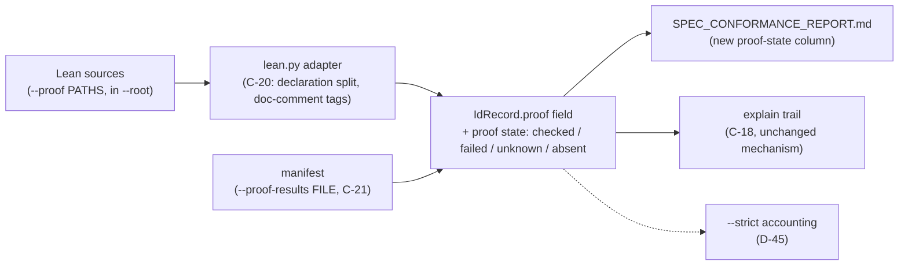

# Proposal — v1.19: a `--proof` / `--proof-results` parameter pair — the formal-verification half of the conformance graph

> - **Status:** proposal, 2026-09-23; for `spec-writing` to turn into `SPEC.md` v1.19 rows after
>   the requester settles D-43, D-44 and D-45 below. Base is the working-tree v1.18.
>   Independent of `docs/proposals/PROPOSAL_obligation_census.md` (pending, no version): it cites
>   only existing ids (C-10, E-15, E-52, I-002, I-004, I-008, R-01, R-05, R-26, R-33, T-49) and
>   reserves no draft ids above this proposal's numbers, so neither needs the other and both can
>   land in either order.
> - **Applies to:** `SPEC.md` v1.18 — §5.1 (the `check` flag table), the IdRecord shape (the
>   `src`/`tests`/`unrun` fields and the C-05 status contract, which this proposal does **not**
>   modify), the top-level JSON object (a new `proof` section beside `judge`/`judge_available`),
>   the §9.8 golden fixture and its byte-identical goldens, `explain`'s trail (C-18), and
>   `src/speccheck/cli.py` + a new `src/speccheck/lean.py` adapter beside `swift.py`. New rows:
>   R-100, C-20, C-21, I-018, K-17, E-62, E-63, T-99, T-100.
> - **Notation:** unprefixed ids are speccheck's own; foreign ids from the `hello_world_deepseek`
>   spec are `hello:R-03`-style in inline code; Lean theorem names appear in code font as
>   `LeanPlay.Hello.Theorems.<name>`.
> - **Evidence:** one run of `speccheck/tools/proof_evidence.py` — generalized out of a
>   hello-specific script and moved into this repo, so it now takes `--root` rather than
>   assuming its own location — against `../playground/hello_world_deepseek`
>   (2026-09-24, this session, `python3 tools/proof_evidence.py --root
>   ../playground/hello_world_deepseek`): `lake build` over the Lean repo exits `0` with
>   **66/66 declarations kernel-checked** across 4 files; the fresh pytest run is **23/24
>   passed** (the one failure, `test_process_level_sigint`, is a real-SIGINT timing race that
>   fails on this machine regardless of this tool — reproduced with the unmodified `.venv`
>   pytest invocation too, unrelated to the proof join); the join produced **36 spec-ID rows —
>   19 discharged by theorems, 8 dual (theorem + deferred test), 9 test-only** (each row read
>   in full, `build/proof/PROOF_EVIDENCE.md`). Against that: `build/speccheck/speccheck.json` (174.7 kB,
>   the same spec's conformance run, 56/56 PASSING) has **16 top-level keys — `schema_version`,
>   `spec`, `judge`, `judge_available`, `strict`, `max_unknown`, `strict_judge_failure`, `ids`,
>   `decisions`, `edges`, `dangling`, `stale`, `unattributed_results`, `notes`, `metrics`,
>   `exit_code` — and `grep -c proof` over the whole file is `0`**. The IdRecord keys are
>   `id, family, recorded, title, statement, line, status, src, tests, unrun`; the 135 edges are
>   `depends_on` (65) and `verifies` (70) only. The system is five-way; the machine graph is
>   four-way.

## 1. The problem

The conformance graph relates four artifacts: the spec, its source (citations in the IdRecord's
`src` field), its tests (the `tests` field, joined to results via `--results`), and the judge's
per-edge strength verdict. A fifth artifact now exists for the system this tool was built to
check: a **formal proof**.

In `hello_world_deepseek`, the module-level half of the spec is proved deductively in a sibling
Lean 4 repository: 67 kernel-checked declarations whose doc comments tag the spec ids they
discharge, and whose process-level halves the proof *explicitly defers* to the pytest suite (the
sidecar's table shows the deferrals: `hello:R-02 (process side)` → T-10, `hello:R-09 (process
side)` → T-20, etc.). `lake build` is the proof result — per-declaration, all-or-nothing,
deterministic, re-runnable in seconds.

None of that is visible to speccheck. Read in full, one concrete row: **`hello:R-09`** — the
graph says PASSING, and the only evidence the JSON carries for it is one empirical test
(`test_process_level_sigint`, one real run); the four kernel-checked theorems that discharge
R-09's module-level half for *all* inputs (`rowInterrupt`, `rowUsageInterrupt`, `runSigint`,
`guardKi`) appear nowhere in `speccheck.json`, `SPEC_CONFORMANCE_REPORT.md`, `explain`'s trail,
or `--strict`'s accounting. The five-way relation currently exists only in a sidecar document
(`build/proof/PROOF_EVIDENCE.md` + a manifest the tool never reads) — exactly the shape v1.18's
§1 named as the failure mode of its own subject: *a further copy of the evidence with no
mechanical tie to the tool.*

Three consequences, each checkable in the JSON above:

1. **`explain` cannot show the proof.** C-18's trail renders "its source and test citations with
   each citing case's outcome and verdict" — the deductive half of the evidence is structurally
   absent from the IdRecord.
2. **`--strict` cannot see the proof break.** If the Lean repo drifts (a model edit that stops
   compiling), nothing in the conformance gate knows: the manifest the sidecar wrote is outside
   the pipeline's inputs.
3. **The report overclaims its own provenance.** "56/56 CONFORMING" is true; but a reader
   comparing the conformance report with the build report's new §1a finds the formal half
   described in prose with a pointer to a directory the tool does not read.

*Checked and rejected as the mechanism:* "the graph already carries the proof in `edges`" —
no: the only edge kinds are `depends_on` and `verifies` (135 edges, 0 proof references), and a
theorem is neither a spec obligation that another spec obligation depends on nor a test that
verifies one. And "proof is just another `--tests` value" — a Lean source file as a *test
root* is rejected on the shape: `--tests` splits into *test cases* whose results are sampled
runs with pass/fail per case (the JUnit model); a theorem's result is a *check status on a
declaration*, all-or-nothing, and forcing the fit would fake one `pass` per declaration and
drag proof citations into the judge stage, where they do not belong (a kernel check is the
whole result; there is no assertion to judge).

## 2. The change

**Part A — `--proof PATHS`.** A repeatable, comma-separated, `--root`-contained flag (the
`--src`/`--tests` grammar, v1.12) naming Lean source files or directories. A new `lean.py`
adapter — the line-based pattern `swift.py` already establishes for a second language — splits
on declaration heads (`theorem`/`lemma`/`def`/`abbrev`/`instance`), reads the spec ids from the
doc comment directly above (bold spans: `**C-02**`, `**R-11, I-003**`, mixed lists; `(a)`-style
sub-case markers stripped; the hello repo's 66 declarations tag at 100% under this rule,
verified by `speccheck/tools/proof_evidence.py`), and attributes a *proof citation* per
(declaration, id) pair. The citations land as a new IdRecord field, `proof`, shaped like
`tests` (name, file, line) — the judge is **never** consulted on a proof citation (it is a
kernel-checked fact, not an assertion to be judged).

**Part B — `--proof-results FILE`.** A manifest JSON — the shape
`speccheck/tools/proof_evidence.py` already writes. speccheck reads exactly three keys and
ignores every other top-level key the manifest carries (the tool also writes `spec`,
`spec_version`, `source` and `proof_repo` — provenance for a human reading the manifest
directly, no speccheck consumer): `build: {exit, theorems_total, theorems_checked, errors[]}`,
`theorems: [{file, name, line, ids, status}]`, and optional `deferred_to_pytest: [{id, scope,
content, tests}]` (the tool's own rows also carry a `file` key, likewise ignored). **speccheck
reads it; it never runs a prover** — the same reads-does-not-execute invariant that makes
`--results` work (the tool has no pytest runner; it would have no lake runner either, and would
not grow one here: a gate that shells out to a sibling toolchain breaks the contained,
re-runnable character of the run).

**Part C — the join, and the status boundary.** The manifest joins to the proof citations on
theorem name (+ file/line, K-17). Per id the record gains a proof state: `checked` (cited and
manifest-checked), `failed` (cited and manifest-failed, with the build's error line),
`unknown` (cited, absent from the manifest — an absence of results is *not* a failure, E-63),
or `absent` (no proof citation; the id's proof half, if any, is the deferred test). The state
is **a parallel field, not a status input**: C-05's algorithm is untouched — status is still
computed from citations, tests, results and the judge, and by nothing else (R-06 stays true
verbatim). The Markdown report renders the state as a column; `explain`'s trail gains the
proof lines (free — it renders IdRecord fields, C-18/I-016); `impact` **ignores** proof edges
(a theorem file is not a source file; no blast radius, E-63); `--strict` consumes the state
only as D-45 decides.

**Part D — goldens and help.** The §9.8 fixture gains a minimal Lean proof (three declarations,
two tagged, one untagged) plus a two-entry manifest; the JSON/Markdown goldens regenerate to
carry the new `proof` field. T-100 pins the other direction: a run **without** `--proof`
reproduces the v1.18 goldens **byte for byte** (I-018). The two new flags enter §5.1's table
and inherit v1.18's C-19/T-95–T-98 help contracts unchanged (purpose, values, default,
preconditions; the `check --help` golden gains two rows — the one golden churn an existing
user sees).

**Part E — the hello integration (outside this spec).** The manifest's producer is
`speccheck/tools/proof_evidence.py` — no longer a hello-specific script, but a generic sidecar
now living in this repo's own `tools/`, that any `spec-proof`-shaped project (a `SPEC.md`, a
`proof/` lake project, a pytest suite) can point at itself: it discovers Lean files by scanning
`--proof` for `*.lean` rather than a fixed per-project file list, and it reads that project's
own `deferred_to_pytest` table wherever it lives (a `--` line comment or a `/- -/` block
comment, whatever column shape it uses — only the `T-nn` tokens in it are load-bearing). Run
against hello, `python3 speccheck/tools/proof_evidence.py --root
../playground/hello_world_deepseek` writes `build/proof/proof-results.json` and
`build/proof/PROOF_EVIDENCE.md` under the hello root. In `hello_world_deepseek`, the gate
command becomes `speccheck check … --proof proof --proof-results
build/proof/proof-results.json` with `--root .`: the Lean proof project already lives at
`proof/` inside the project root (the `spec-proof` skill's own scaffold), so Part A's
containment (E-09) holds with no staging step at all — an earlier draft of the sidecar copied
the Lean sources into `build/proof/src` because the proof then lived in a sibling repo outside
`--root`; once `spec-proof` moved it in-tree, the copy became dead weight, and the generalized
tool drops it. `speccheck check` itself never runs `proof_evidence.py` — it only reads the two
paths the sidecar already wrote (Part B's reads-does-not-execute invariant), so the sidecar run
and the gate run stay two separate, ordered steps.

*Parts A and B are the two inputs; C is the join and the boundary; D is the churn; E is the
consumer-side wiring that costs this repo nothing.*

Proposed rows, drafted for `spec-writing`:

| Family | Draft |
| --- | --- |
| **R-100** | With `--proof PATHS`, the checker MUST scan the named Lean files or directories (repeatable, comma-separated, each element resolved inside `--root`, E-09) with the lean adapter (C-20) and attribute a proof citation per (declaration, spec id) pair to the id's `proof` field; without the flag it MUST scan no Lean file, run no prover, and write no `proof` key (I-018). Source: §1. |
| **C-20** | The lean adapter. It splits a Lean source on declaration heads — lines matching `theorem`, `lemma`, `def`, `abbrev` or `instance` (each optionally `public`/`protected`-prefixed), one declaration per head — and, for each declaration, reads the spec ids from the doc-comment block ending within one line above the head: every `[RCIKE]-nn` id inside a bold span, with `(a)`-style parentheticals stripped; a mixed list (`**E-08, D-17, R-03**`) contributes its R/C/I/K/E members only. A directory is scanned recursively for `*.lean`. A file whose declarations carry no tag contributes no citation; a file that yields no parseable declaration head contributes a `notes` entry, not an error (E-62). The adapter never reads a declaration body. Source: §1. |
| **C-21** | The proof manifest (`--proof-results FILE`, JSON). The checker reads exactly three top-level keys and ignores every other one the file carries (a producer, such as `speccheck/tools/proof_evidence.py`, may write provenance keys like `spec`/`source`/`proof_repo` for a human reader; they are not part of this contract): `build` — `{exit: 0|nonzero, theorems_total: int, theorems_checked: int, errors: [string]}` — and `theorems` — an array of `{file, name, line, ids: [id], status: checked|failed}` — plus optional `deferred_to_pytest` — an array of `{id, scope, content, tests: [id]}` recording which ids the proof hands to the empirical suite (any extra key on a `theorems`/`deferred_to_pytest` entry, such as a producer's own `file` tag on a deferral row, is likewise ignored). A manifest theorem joins a proof citation on name and file (line, where present); a citation without a matching manifest entry is `unknown`, a manifest entry without a citation is a `notes` entry (K-17). Source: §1, Part B. |
| **I-018** | Inertness of the new inputs. A `check` run without `--proof`/`--proof-results` MUST write `speccheck.json` and `SPEC_CONFORMANCE_REPORT.md` byte-identical to a v1.18 run on the same inputs: no `proof` key in the JSON, no proof column in the Markdown, no lean file read, no exit-code difference (T-100). Source: §1, Part D. |
| **K-17** | Proof staleness. A manifest theorem whose name matches a scanned declaration in a *different* file or line is stale (surfaced as `stale`, like a stale citation); a scanned declaration absent from the manifest is `unknown` (never `failed`); a `failed` state carries the build error line from `build.errors`. Stale/unknown/failed proof states appear in `notes` and the `proof_failed`/`proof_unknown` metrics and, per D-45, affect `--strict`. Source: §2, Part C. |
| **E-62** | An unreadable or non-Lean file in a `--proof` path (binary, or no declaration head parseable) MUST be recorded as a `notes` entry naming the file and continue; it MUST NOT be a usage error and MUST NOT change the exit code of a run whose ids are all otherwise decided. Source: §2, Part A. |
| **E-63** | Proof states never change an id's status: C-05's algorithm reads citations, tests, results and the judge only — a `checked` proof never promotes an `UNVERIFIED` id, and a `failed`/`unknown`/stale proof never demotes a `PASSING` one (R-06). `impact` MUST ignore proof citations: a theorem's file is not a scanned source file, so proof carries no blast radius. Source: §2, Part C. |
| **T-99** | Over the §9.8 golden fixture extended with the Part D Lean proof and two-entry manifest: `check --spec … --src … --tests … --results … --proof <fixture lean> --proof-results <fixture manifest>` exits as the golden pins; the JSON carries, for the tagged declarations, `proof` citations with state `checked`, for the one untagged declaration no citation, for the manifest-failed entry state `failed` with the error line, for the cited-but-unmanifested entry `unknown`; the Markdown shows the proof-state column; `grep -c "proof"` on both goldens is the pinned count; and a run over the *hello* sidecar inputs (`proof` + `build/proof/proof-results.json`, both produced by `speccheck/tools/proof_evidence.py`, under `--root .`) exits `0` with every dual id showing state `checked` — a cross-repository integration recorded, not pooled (R-24). Source: §1, §2. |
| **T-100** | Byte-identity under flag absence: `check` over the unextended §9.8 fixture, with no `--proof`/`--proof-results`, reproduces both v1.18 goldens byte for byte (I-018), and the rendered `check --help` (T-97's golden) shows exactly two new flag rows, each with C-19-compliant help. Source: §2, Part D. |

## 3. What it costs

- **New dependencies: none.** `lean.py` is stdlib (a line-based split and a tag regex — the
  `swift.py` precedent); the manifest is JSON. No model, no socket, no toolchain: the judge
  stage and its budget are untouched, and the checker still never executes anything (Part B).
- **Golden churn, bounded.** §9.8 gains a Lean file and a manifest; the JSON/Markdown goldens
  regenerate (they must — the IdRecord shape changed); T-100 pins that *absent-flag* output is
  byte-identical to v1.18, so no existing consumer of an unextended run sees a byte change.
  The `check --help` T-97 golden gains two rows (C-19 help) — one visible regeneration.
- **Token/latency: zero** — no judge request touches a proof citation (Part C).
- **What is NOT guaranteed, plainly:** the tag rule (C-20) is a heuristic over *prose* — a
  declaration whose doc comment tags an id in a shape the rule doesn't cover (no bold, a
  non-standard marker) silently contributes no citation, and speccheck cannot tell a *missing
  tag* from a *missing proof*. The hello repository's 67 declarations read at 100% under the
  rule (T-99's hello run is the standing measurement); a tag miss in a future proof repo would
  surface only as an id showing `absent` while its author believed it proved. That is the one
  soft edge in an otherwise mechanical pipeline, and T-99's per-declaration pinned counts are
  the tripwire for it.
- **Worth doing even if the rest is rejected:** Part A alone (citations, no manifest, all
  states `unknown`) already puts the proof *into* the graph for `explain`; Parts B and C make
  the state real. Part D is worth doing because a shape change without a byte-identity pin is
  how v1.18's README rows went stale.

## 4. Alternatives considered

| Alternative | Why not |
| --- | --- |
| speccheck runs `lake build` itself (one `--proof` flag, no manifest) | Breaks the reads-does-not-execute invariant `--results` embodies: the tool would shell out to a sibling toolchain of unknown presence/latency (a cold `lake build` is minutes, not the seconds a gate run wants), and a missing `lake` becomes a *conformance* failure rather than an absent-result state. The manifest is what keeps the gate contained and the prover external. |
| Lean sources as `--tests` values (reuse the swift-style adapter under the test machinery) | Wrong shape on the result: test cases carry sampled pass/fail per run and feed the judge; a theorem carries a per-declaration check status and must not (Part C). Forcing the fit would fabricate one `pass` per declaration and put proof citations in the judge queue — the judge is "never consulted" about kernel facts by design. |
| Sidecar only — the status quo this proposal supersedes | The five-way relation then lives in a document the tool never reads: `explain`, `impact` and `--strict` all remain four-way, a broken Lean build stays invisible to the gate, and the conformance report's provenance claim points at a directory. It is a good *fallback* (hello already ships it) and the honest floor if this proposal is declined — but it is the v1.18 "fourth prose copy" failure mode, one that happens to be written in Python. |
| A proof column in the Markdown only (no JSON field) | The machine graph is the point: `explain`/`--strict`/`impact` consume JSON, and a column only in the prose report would be exactly the un-joined copy §1 names. Also: a column the JSON doesn't carry can be rendered wrong and no test would notice; T-99's pinned `grep -c proof` on the JSON is the check a column-only design has no equivalent of. |
| Extending `PROPOSAL_obligation_census` (pending) instead | The census is about *which obligations a judge edge asserts* — it reads the judge's answers; proof evidence arrives from a file, never from the judge. There is no field on a census edge to carry a theorem, and bolting one on would give the census a consumer it has no reason to serve. |

## 5. Decision(s) for the requester (D-43, D-44, D-45, all `confirm`)

| ID | Statement |
| -- | --------- |
| **D-43** | Per-declaration manifest (C-21 as drafted: name + line + `checked`/`failed`, one entry per declaration; the hello sidecar writes exactly this today) (recommended: it is the granularity the build tool emits and the per-id table needs — a single failed declaration still names itself) versus per-file check status (cheaper manifest, but a one-declaration failure fails every id the file tags, and T-99's pinned per-declaration states lose their referent). |
| **D-44** | Conditional JSON key — the `proof` object and the per-id `proof` field exist in `speccheck.json` only when `--proof`/`--proof-results` were given; `schema_version` unchanged; absent-flag output byte-identical to v1.18 (I-018, T-100) (recommended: zero golden churn and zero consumer impact for the large existing user base; a missing key unambiguously means "no proof input", the pattern the CLI already uses for exit-code variants) versus always-present `proof: null` (readers get a stable key set, but every existing golden and every downstream consumer of the current shape must change, and `schema_version` must bump). |
| **D-45** | `--strict` treats a proof state of `failed` as a strict failure only when `--proof-results` was *given and is readable* — i.e. the gate fails on a broken proof it was explicitly handed, while a *missing* manifest keeps the gate exactly as robust as v1.18 (recommended: hello's gate command will pass the manifest, so a drifted Lean repo *does* red the gate where it matters; a repo that never had a proof is never punished for the absence of one — and a proof failure is a defect of the proof repo, not of the checked system, so non-strict runs never see it) versus proof states strictly advisory in all modes (the gate is maximally decoupled, but the exact case the feature exists for — "the formal half broke, does the gate know?" — answers no). |

## 6. What the change does not do

- **It does not modify C-05 or any status.** Proof states are a parallel field (E-63): no id's
  conformance status changes under either branch of §5, and `--strict`'s existing criteria
  (unknown rate, judge availability, PASSING-all) apply to tests exactly as in v1.18.
  Promotion of an id by proof (a `checked` proof standing in for a missing test) is a *later*
  proposal with a later measurement — v1.19 deliberately keeps the two evidence kinds
  side-by-side, not interchangeable.
- **It does not read proof *bodies*.** C-20 stops at the declaration head and its doc comment;
  a theorem that compiles but states a weaker claim than the spec row discharges is outside
  the adapter's view. That is the same trust boundary the sidecar states for the transcription
  (`hello.py` → model), one level down: speccheck checks that the proof *exists, compiles, and
  tags the right ids* — whether the tagged theorem *means* the row is the human reader's (or a
  future, separate) judgment.
- **It does not touch `impact`.** Proof citations carry no blast radius (E-63); `impact`'s
  `--src`/`--tests` and its walk/reverify semantics are verbatim unchanged.
- **It does not run, or even require, a Lean toolchain.** No `lake` on `PATH` is needed by
  speccheck; a missing or stale manifest degrades to `unknown`/`notes`, never a crash or a
  changed exit code (E-62, K-17, D-45's given-and-readable condition).
- **What would still be unmeasured even if all of this ships:** a silently mistagged
  declaration (C-20's soft edge, §3) — an id whose proof exists but whose tag the rule missed
  reads as `absent`; and the process-level halves stay empirical by construction (the deferral
  table *is* the boundary: `hello:K-03`'s 250 ms budget, `hello:R-10`'s inert import, the real
  EPIPE flush — those ids show `absent` proof and their pytest results, which is the truth, not
  a gap).
