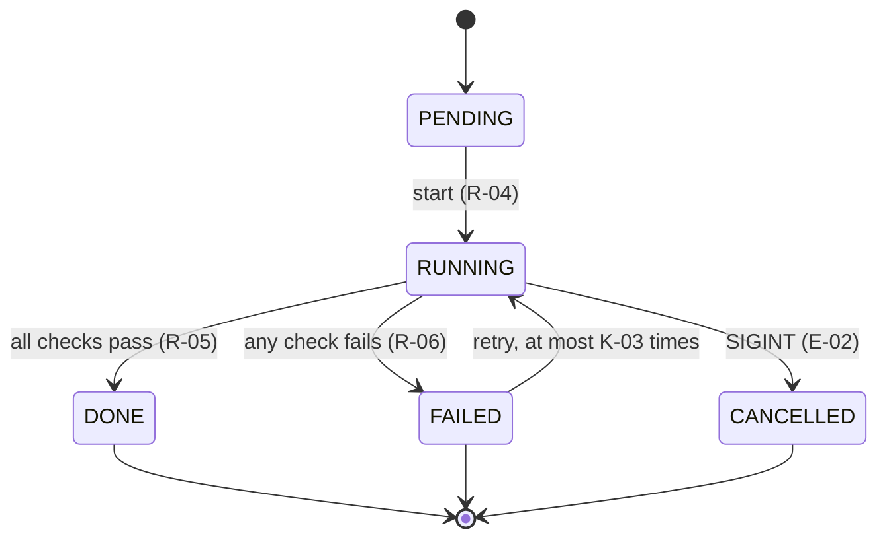

# spec-writing

Write a `SPEC.md` that is the **source of truth** for a system: precise enough that an
implementer can build it, a verifier can test it, and two competent implementers would build
materially equivalent systems. Every requirement is observable, every contract is pinned, every
ID is traceable to a test.

This skill is stack-, language-, and domain-agnostic. It does not assume a directory layout, a
package manager, a test framework, a UI toolkit, or an AI/LLM architecture. Where the examples
below mention one (a CLI, a dataclass, exit codes), substitute the equivalent for your system.

## When to use

- "write the spec for <system / feature / interface / pipeline>"
- "create SPEC.md" for a new project, module, or service
- "turn these requirements / this design doc / this conversation into a spec"
- a project exists without a spec and someone needs one before an agent builds or rewrites it

Pair with `spec-review` for an audit pass (it produces `SPEC_REVIEW_REPORT.md` with `F-nnn`
findings and a P0/P1/P2 remediation plan) and with `spec-build` to implement the result.

## Before writing: gather the inputs

Collect, and cite in the front matter, every source of intent the spec is derived from:

- requirements documents, tickets, PRDs, design docs, RFCs, ADRs;
- an existing implementation being re-specified (read it; the spec must not silently contradict it — and
  if it has a visual surface, **run it and screenshot every pane and state**, check the images in under
  `reference/`, cite them here, and treat them as normative for structure per *Reference images* below.
  A spec written from code alone captures what the product *does* and loses what it *looks like*; two
  independent rebuilds from such a spec have reproduced every behaviour row and none of the chrome);
- prior specs in the same repository (match their conventions — house style beats this template);
- conversations with the requester (record decisions as normative statements, not as quotes).

Resolve the material decisions **before** writing normative rows. If a decision is genuinely
open, write it as an explicit `MAY` with the allowed choices, or list it in §12 (Open questions
and decisions to confirm) — never bury it in prose.

**Decisions you make on the human's behalf are not resolved; they are defaulted.** When the
source of intent does not settle something and you pick a default so the spec can proceed — a
stack, a threshold, a limit, a format, which of two readings to adopt — the default goes in the
normative row *and* the choice is listed in §12 with `(confirm)`, the alternatives you rejected,
and why you chose as you did. A reviewer checks precision; only the human can ratify a choice.
A spec whose §12 says "none" for a system of any size was written by someone who decided
everything alone.

## The 13-section template

Section order is fixed. Section *contents* scale with the system: a small library may have a
three-row state model; a service may need several pages. Omit a subsection only when it
genuinely does not apply, and say so in one line rather than leaving it out silently.

```markdown
# SPECIFICATION — <System Name> (<domain keywords>, <primary surface>, <stack>)

> - **Status:** v0.1 — draft for implementation review
> - **Language / stack:** <language + version> | <key frameworks/libraries> | <surfaces: CLI/GUI/API/library>
> - **Sources:** <requirements doc, design doc, ticket ids, prior spec, existing code — with section refs where they exist; for a visual surface, the `reference/*.png` images and what each shows>
> - **Scope of this document:** what this spec owns and what it explicitly does not
> - **Normative language:** MUST/MUST NOT/SHALL/SHALL NOT = normative; SHOULD = strong recommendation; MAY = optional.
> - **Principle:** <the one named invariant or design thesis that governs trade-offs>

---

## 0. Intent and purpose

Why the system exists; the problem it solves; the context an implementer should not have to
re-derive. State **non-goals** explicitly. If the system has a deterministic <-> probabilistic
(or trusted <-> untrusted, or online <-> offline) boundary, say where it sits and who owns each side.
If the spec extends or replaces a prior system, add a **Relationship to <prior>** paragraph.

## 1. Actors and goals

| Actor | Goals |
| ----- | ----- |
| **Name** (`component`) | One-sentence behavior contract; note trust level / principal where relevant |

Actors include humans, roles, external services, models/agents, background workers, and
scheduled processes — anything that initiates or observes behavior.

## 2. Requirements (intent, high level)

| ID | Statement |
| -- | --------- |
| **R-01** | Observable behavior, in normative language |

Each requirement answers: what must happen, under what conditions, to what input, with what
result, and what happens when the condition cannot be met. Cite the source (§ of a design doc,
ticket id) each requirement derives from. Cross-cutting concerns the system has — diagnostics /
logging, configuration, error reporting, security, compatibility — each get at least one
requirement here so they are traced like everything else.

## 3. Behavior and state model

3.1 lifecycle / state machine (initial, valid, terminal, failure states; transitions and their
triggers; cancellation, retry, resume where they apply) — a `mermaid` `stateDiagram-v2` when
there are more than a handful of states; 3.2 the executable flow (a `mermaid` `flowchart` or
`sequenceDiagram` of the main path, or an ASCII `+ - |` box diagram when the flow is trivial);
3.3 durable artifacts and their pipeline, if any. See *Notation: math and diagrams* below.

## 4. Interfaces / contracts

### C-01 … ### C-NN

One contract per externally significant interface, data shape, or module boundary. Each carries
a fenced code block pinning the **behavioral** shape — a type/dataclass/struct, a JSON/schema
shape, a function signature, a wire format, a file layout — with required/optional fields,
types, valid ranges, defaults, ordering, idempotency, and versioning where relevant. Pin only
what conformance depends on; leave internal structure free.

## 5. Interface specification

One subsection per user-facing surface the system actually has (CLI, GUI, HTTP/RPC API, library
API, message/queue interface, file formats). For each: the operations, their inputs, outputs,
error responses / exit codes, and defaults, in a table. Then any **cross-cutting interface
contract** shared by all surfaces — e.g. a diagnostics/verbosity contract (what is quiet by
default, what each level shows, which stream/sink it goes to, what is never logged such as
secrets and raw payloads), a consistent error-code scheme, or a configuration-precedence rule.
Give every such contract its own R/C/I/E/T ids so it is traced.

**A GUI surface gets more than an operations table.** For every window, pane, panel, bar or
region the product shows, add a subsection (or one `C-nn` per region) that pins:

- the **regions** and how they are arranged (title bar, toolbar, sidebar, content, inspector …)
  and what each is titled;
- the **element inventory** per region — headers, rows, buttons, badges, fields, indicators —
  with each row's anatomy (glyph · primary line · secondary line · trailing badge) and what
  each line shows (a file *name* over a *head-truncated `~`-abbreviated path* is a different
  product from a name over a relative time);
- the **states** of each element: empty, hovered, selected, current, disabled, missing,
  collapsed — and which of them are visible at once;
- **which values are structural** (present under every theme) and **which come from the
  theme / typography document** (colour, face, size, spacing) — and, when a second document
  owns the visual values, exactly what that document does *not* cover, so nothing falls between
  the two;
- **visibility of every feature that has a state**: if a keystroke sets something (a
  bookmark, a placeholder, a filter), a row says *where the reader sees it*; a spec that pins
  the keystroke and not the affordance licenses a build where the feature exists and cannot be
  seen;
- a **reference image** per region or window (see *Reference images*), cited by the rows.

## 6. Invariants (must hold in every valid implementation)

| ID | Invariant |
| -- | --------- |
| **I-001** | A global property: determinism given identical inputs, no-partial-writes, monotonic ids, bounds that always hold, boundaries never crossed (e.g. "module X has no network access") |

## 7. Constraints (precise and measurable)

| ID | Constraint |
| -- | ---------- |
| **K-01** | A numeric or categorical limit: latency budget, size limit, exit-code mapping, supported versions, resource ceilings |

## 8. Edge cases and failure semantics

| ID | Case | Semantics |
| -- | ---- | --------- |
| **E-01** | <empty / missing / malformed / duplicate / oversized input; timeout; unavailable dependency; cancellation; partial failure> | <deterministic outcome the implementer must produce> |

## 9. Acceptance criteria, tests, and evals

### 9.N <group: unit / integration / property / statistical / manual smoke>
| ID | Test |
| -- | ---- |
| **T-01** | A concrete, reproducible check with an unambiguous pass condition; cite the R/C/I/K/E ids it proves |

Group tests by how they run (fast deterministic, integration, probabilistic evals with
tolerances, manual/recorded, **observed**). Every I, K, and E id has at least one T id.

A product with a rendered surface has an **observed** group: tests whose pass condition is a
person looking at the running product (or at a screenshot that person has opened) and comparing
it, region by region, with the reference images and the typography/design document. Write them
as concretely as any other T-nn — which document to open, which theme, which panes, what to
look for. State the rule that goes with them: a conformance report MUST carry the observed
outcome of every test in this group; a build whose automated groups are green but whose observed
group was not run is *verification pending*, not conforming. Where a rendered property can be
measured (a gap in points, a centred bounding box), add the measured form as a scripted T-nn
too, so the observation has a numeric companion — but the measurement does not replace the look.

## 10. Dependencies and environment

Language/runtime version, libraries (with version pins where behavior depends on them),
optional dependency groups, host prerequisites, environment variables, and how to install and
run the test suite. Anything the implementer must provision belongs here.

## 11. Traceability matrix (id → where realized)

| Spec id | Where realized (component / module) | Verified by (tests / evidence) |
| ------- | ----------------------------------- | ------------------------------ |
One row per R/C/I/K/E id. Until the build exists, "where realized" names the component the §4
contract assigns; `spec-build` fills in the real modules and tests.

## 12. Open questions and decisions to confirm

| ID | Decision | Default taken | Alternatives | Affects | Owner / status |
| ----- | -------------- | ---------------- | ------------------ | ---------- | ------------ |
| D-01 | <the choice the sources did not settle> | <what the spec assumes now> | <what else was reasonable> | <ids> | <who confirms> / open, confirm, confirmed v0.n |
Mandatory. Every decision the author made by default on the human's behalf is a row, marked
`confirm`; every genuinely open question is a row marked `open` with the interim default the
normative rows assume. When a row is ratified, its status becomes `confirmed v0.n` and it stays.
"None" is a legitimate value only for a spec whose every decision came from a cited source.
```

## The ID taxonomy (fixed alphabet)

| Prefix | Meaning | Example |
| ------ | ------- | ------- |
| **R-nn** | Requirement | R-14 |
| **C-nn** | Contract (interface / data shape / module boundary) | C-08 |
| **I-nnn** | Invariant | I-005 |
| **K-nn** | Constraint | K-03 |
| **E-nn** | Edge case / failure semantics | E-12 |
| **T-nn** | Test / acceptance criterion | T-09 |
| **O-n** | Optional item (a `MAY` feature, gated path, or alternate surface) | O-1 |
| **D-nn** | Decision to confirm / open question (§12) — a default the author took, or a question still open | D-03 |
| **F-nnn** | Spec-review finding (only after `spec-review` has run) | F-012 |

IDs are unique within their family and are **never renumbered** once a review or an
implementation cites them — append new ids, retire old ones with a strike-through note. Do not
create `T-08a`/`T-08b` suffix collisions; allocate fresh numbers. When a spec, proposal, or report
cites **another project's** ids, prefix them with that project's short name and a colon, in inline
code — `` `mdv:C-06` ``, `` `mdv:C-18.9` `` — so they are never mistaken for this spec's own ids,
never counted as its citations by `speccheck`, and never linked to the wrong spec by the PDF pass.

## Normative language discipline

- `MUST` / `MUST NOT` / `SHALL` / `SHALL NOT` — the normative verbs. A violation is a defect.
- `SHOULD` / `SHOULD NOT` — strong recommendation; a deviation needs a documented reason.
- `MAY` — optional behavior; if gated, name the gate (flag, config key, feature toggle).
- Do not use `WILL`, `CAN`, `SHOULD BE ABLE TO`, or bare present tense ("the system validates…")
  in normative rows — they read as description, not obligation.
- Requirements are **observable**: not "the parser is robust" but "given input E-03 the parser
  exits `2` and prints `<message>` to stderr".

## Precision rules that separate Level 2 from Level 3

- **Pin the boundary, free the interior.** Specify observable behavior, contracts, and
  invariants exactly; leave class names, private helpers, and algorithms free unless a
  requirement depends on them (ordering, tie-breaking, rounding, and numeric fallbacks are
  requirements — write them down). **For a product whose output is a rendered surface, the
  surface is the boundary**: what the panes contain, what a row shows, what is highlighted when,
  are observable behaviour and are pinned; only the drawing code beneath them is interior.
- **Every feature that has a state has a visible affordance row.** "⌘⇧0 sets a placeholder,
  ⌘0 returns to it" is complete as behaviour and silent on whether the placeholder is ever shown;
  two conforming builds differed on exactly that. Pin where the reader sees it.
- **Every metric has a formula, units, population, denominator, and a zero-denominator rule.**
  The formula is written in LaTeX math (`$..$` / `$$..$$`), not in prose or ASCII arithmetic.
- **Every failure has an outcome.** For each operation: what can fail, how it is detected, what
  state results, whether it retries/resumes, and what the caller observes.
- **Nondeterministic components get a contract around them:** what is guaranteed despite
  nondeterminism, how outputs are validated, and how they are evaluated (tolerances, seeds,
  golden fixtures).
- **Examples agree with definitions.** Any worked example must satisfy the formal shape in §4.
- **Optional ≠ unspecified.** An `O-n` item is specified to the same depth as required items;
  only its activation is optional.

## Notation: math and diagrams

Specs are rendered to PDF with `spec2pdf.sh` (pandoc + XeLaTeX, mermaid via `mermaid-filter`),
so LaTeX math and mermaid diagrams are first-class — use them instead of ad-hoc ASCII.

### Math: LaTeX `$..$` and `$$..$$`

- **Every mathematical symbol, comparison, set expression, or inline formula uses inline LaTeX
  `$..$`** — including the ones that look harmless in plain text: `$\pi$`, `$\leq$`, `$\geq$`,
  `$\neq$`, `$\equiv$`, `$\in$`, `$\cup$`, `$\infty$`, `$\Delta t$`, `$O(n \log n)$`,
  `$0 \leq p \leq 1$`, `$x_{i+1}$`, `$2^{32}-1$`. Never write `<=`, `>=`, `!=`, `pi`, `inf`,
  `x_i`, `n^2`, or a Unicode `≤`/`≥`/`∈` in a normative row when it is doing mathematical work.
  (`<=` inside a fenced code block or in backticked code such as `` `a <= b` `` is code, not
  math, and stays as code.)
- **Multiple related formulas, a derivation, a definition with cases, or anything with a
  fraction, sum, or alignment goes in a display block** delimited by `$$` on their own lines:

  ```markdown
  Precision and recall over the judged edge set $J$, with $\mathrm{TP}$, $\mathrm{FP}$,
  $\mathrm{FN}$ counted per K-05:

  $$
  \begin{aligned}
  \mathrm{precision} &= \frac{\mathrm{TP}}{\mathrm{TP} + \mathrm{FP}} \\
  \mathrm{recall}    &= \frac{\mathrm{TP}}{\mathrm{TP} + \mathrm{FN}} \\
  \mathrm{unknown\_rate} &= \frac{|\{\,e \in J : v(e) = \mathrm{UNKNOWN}\,\}|}{|J|}
  \end{aligned}
  $$

  Each ratio is $0$ when its denominator is $0$ (K-06).
  ```

  Every display block is preceded by the definition of every symbol it uses and followed (or
  preceded) by the degenerate-case rule — a formula is not a metric until both exist.
- **Inside a table cell use inline `$..$` only.** Display `$$` blocks do not render inside a
  Markdown table; if a row needs a display formula, put the formula in prose directly above or
  below the table and have the row cite it ("per the formula in §7.2").
- Use `\mathrm{}` for multi-letter names (`$\mathrm{TP}$`, not `$TP$`, which typesets as
  $T \cdot P$), `\text{}` for words inside math, `\_` for underscores in identifiers inside
  math, and `\ldots` / `\cdots` for ellipses. Prefer `\leq`/`\geq` over `\le`/`\ge` for
  consistency with existing specs.
- Requirement ids stay **outside** math: write `$\leq$ 2 s (K-08)`, not `$\leq 2\,s\ (K\text{-}08)$`.
  `spec2pdf.sh --click` leaves `$$` blocks verbatim (no link) and rewrites an id inside inline
  `$..$` into a Markdown link, which breaks the math when it is typeset.
- Do not write raw LaTeX outside math (`\begin{table}`, `\newpage`, `\textbf{}`) — the source
  must stay valid Markdown that reads correctly without rendering.

### Reference images: screenshots and mockups, normative for structure

When the system has a visual surface, the spec ships reference images — screenshots of the
implementation being re-specified, or mockups when there is none — under `reference/`, embedded
with `` next to the rows they illustrate and listed in the
front-matter Sources.

- **Normative for structure, never for pixels.** An image fixes which elements exist, where they
  sit, what a row contains and what is highlighted in that state. Colours, faces, sizes and
  spacing come from the typography/design document and the theme contract; a build is not
  measured against the image's pixels (theme and font rendering make that brittle), it is
  measured against the image's *inventory*.
- **The caption names the ids the image depicts and the state it shows** (`Sevilla theme, a
  placeholder and four bookmarks set; C-18.3, C-18.8, C-18.9`), the way a diagram caption does.
- **Rows stay normative.** As with diagrams, an image is never the only place an element is
  specified; every element visible in it has a row, and every row about appearance points at an
  image.
- **Failure examples may be checked in too**, clearly labelled (`RECREATION-<build>.png`): a
  screenshot of a build that got it wrong, with a caption saying what is wrong, is the cheapest
  way to make the next implementer see the gap.
- Keep images at a size the rendered spec can carry; one per window or pane state, not one per
  pixel-level variant.

### Diagrams: mermaid where it clarifies

A diagram earns its place when the reader would otherwise have to reconstruct structure from
several rows of prose or a table — state machines, control flow with branches, sequences across
actors, component boundaries, artifact pipelines, dependency graphs. Use a fenced
` ```mermaid ` block:

| Structure | Diagram type | Typical home |
| --------- | ------------ | ------------ |
| Lifecycle / state machine (4 or more states, or any retry/cancel path) | `stateDiagram-v2` | §3.1 |
| Main executable flow, branching pipeline | `flowchart LR` / `flowchart TD` | §3.2, §3.3 |
| Interaction across actors / services / model calls | `sequenceDiagram` | §3.2, §5 |
| Module or trust boundary (deterministic ↔ probabilistic, trusted ↔ untrusted) | `flowchart` with `subgraph` | §0, §3, §4 |
| Data shapes and their relationships (when > 3 related shapes) | `classDiagram` / `erDiagram` | §4 |
| Dependency graph between components | `flowchart` / `graph` | §10 |

Rules:

- **Diagrams illustrate; tables and rows are normative.** Every transition, branch, and edge in a
  diagram must correspond to an R/C/I/K/E row or a §3.1 transition entry, and the diagram caption
  names the ids it depicts (`Figure 3.1 — lifecycle per R-04..R-07, E-02`). A diagram is never
  the only place a behavior is specified.
- **Label nodes and edges with the spec's own vocabulary** — state names, component names, and
  ids exactly as they appear in the tables — so a reader can grep from picture to row.
  Requirement ids inside a mermaid block are left verbatim by `spec2pdf.sh --click` (no links),
  so cite them in the caption as well.
- **Keep each diagram to one concern** and roughly 15 nodes at most; split rather than crowd. A
  diagram that needs a legend to be read has too much in it.
- **Quote labels that contain punctuation** (`A["extract (C-01)"]`, `"--strict"`) — bare
  parentheses, brackets, and pipes are mermaid syntax. Avoid `$..$` math inside mermaid labels;
  it is not rendered there.
- An ASCII `+ - |` box diagram remains acceptable for a trivial linear flow of at most 4 boxes or
  where the spec's house style already uses them; do not mix the two styles for the same kind of
  structure within one spec.
- Do not use mermaid for lists, tables, or anything a table row already expresses.

Minimal example, §3.1:

````markdown


*Figure 3.1 — job lifecycle per R-04..R-06, K-03, E-02. Transitions are normative in the table
below; the diagram is illustrative.*
````

## Progressive-commit convention

Commit the spec in reviewable slices rather than one drop. Use the repository's existing commit
style; absent one, prefix with `docs(<scope>):` where `<scope>` is the project/module name:

```bash
git add SPEC.md && git commit -m "docs(<scope>): SPEC.md front matter + §0 intent + §1 actors"
git add SPEC.md && git commit -m "docs(<scope>): SPEC.md §2 requirements R-01..R-NN"
git add SPEC.md && git commit -m "docs(<scope>): SPEC.md §3 state model + §4 contracts"
git add SPEC.md && git commit -m "docs(<scope>): SPEC.md §5 interfaces + §6 invariants + §7 constraints + §8 edges"
git add SPEC.md && git commit -m "docs(<scope>): SPEC.md §9 tests + §10 deps + §11 traceability"
```

Review-cycle commits: `review(<scope>):` for a `SPEC_REVIEW_REPORT.md`, `fix(<scope>):` for
findings folded back into the spec, with the version header bumped (`v0.1 → v0.2`) and a
one-line changelog entry in the front matter or a `## Revision history` at the end.

## Review-and-uplift workflow

After the first complete draft, run `spec-review`. Then:

1. Resolve every **P0** (blocking) finding in the spec.
2. Resolve **P1** (important) findings, or record an explicit deferral with the reason.
3. **P2** (improvement) findings MAY be deferred; list the deferred ids.
4. Bump the version and commit:
   `docs(<scope>): bump SPEC.md v0.1->v0.2 (P0/P1 resolved: F-001, F-004…; P2 deferred: F-007…)`.
5. Re-run `spec-review` if any P0 was structural. Hand off to `spec-build` once the verdict is
   `READY` or `READY WITH MINOR FIXES`.

## Pre-publish checklist

- [ ] Front-matter blockquote present, exactly once, all six fields filled
- [ ] Section order 0–12 preserved; skipped subsections say why in one line
- [ ] §12 lists every defaulted decision with `(confirm)`, or says "none" and can defend it
- [ ] Every ID unique within its family; no suffix collisions; no gaps that look like deletions
- [ ] Every normative row uses `MUST/MUST NOT/SHALL/SHOULD/MAY`; no `WILL`/`CAN`
- [ ] Every requirement is observable and cites its source
- [ ] Every §4 contract has a pinned shape in a code block
- [ ] Every surface in §5 has its operations, errors, and defaults tabulated
- [ ] Every GUI surface in §5 has a region layout, an element inventory with row anatomy, a state table, and a reference image; where a second document owns visual values, the spec says what that document does not cover
- [ ] Every feature with a state (set / toggled / selected) has a row saying where it is visible, not only a row saying the input works
- [ ] Every reference image has a caption naming its ids and state; every appearance row cites an image; no image is the only place an element is specified
- [ ] Cross-cutting contracts (diagnostics, errors, config) have R/C/I/E/T ids
- [ ] Every metric has formula, units, denominator, and degenerate-case rule
- [ ] All math symbols and inline formulas use LaTeX `$..$`; multi-formula material uses `$$..$$` blocks; no `<=`/`>=`/`pi`/Unicode math in normative prose; no `$$` inside table cells
- [ ] Every mermaid diagram has a caption citing the ids it depicts, and every edge in it is backed by a normative row; ASCII and mermaid are not mixed for the same kind of structure
- [ ] Every I/K/E id has at least one T id; every T id has an unambiguous pass condition
- [ ] A product with a rendered surface has an *observed* test group, and §9 states that a report without its outcome is *verification pending*
- [ ] §11 has one row per R/C/I/K/E id naming a component and a test id
- [ ] Every referenced source section, file, or ticket actually exists
- [ ] No implementation detail pinned that a requirement does not depend on

> **A spec is done when an implementer knows what to build, a verifier knows how to prove it was
> built, and neither has to rely on undocumented intent.**
